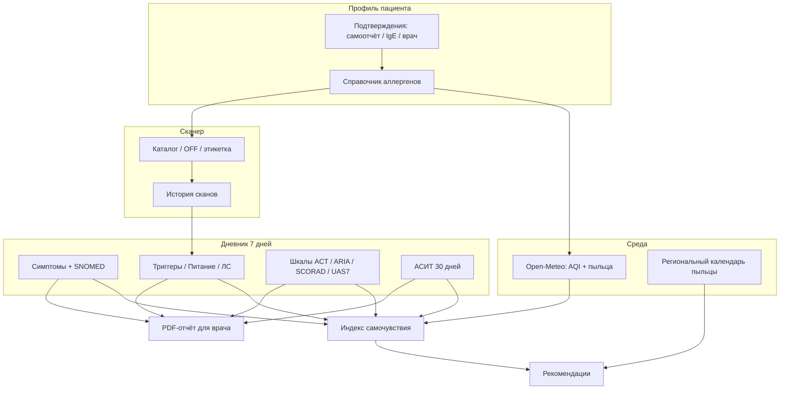

# AllerGuide: индекс самочувствия, дневник и источники данных

**Документ для врача-аллерголога / иммунолога**

Версия описания: соответствует коду приложения AllerGuide (ветка `main`, веса индекса `beta-1.0`).

---

## 1. Назначение и ограничения

AllerGuide — **инструмент поддержки решений** (decision support) для самонаблюдения при аллергических заболеваниях. Приложение **не является медицинским изделием** по EU MDR 2017/745 и **не ставит диагноз**, не назначает и не корректирует лечение.

| Компонент | Что делает | Чего не делает |
|-----------|------------|----------------|
| **Индекс самочувствия** | Агрегирует данные среды и дневника в числовую оценку 5–100 | Не заменяет клиническую оценку тяжести |
| **Дневник** | Фиксирует наблюдения пациента в структурированном виде | Не является медицинской документацией |
| **Сканер состава** | Эвристическая проверка этикетки по профилю аллергенов | Не гарантирует отсутствие скрытых или следовых аллергенов |
| **PDF-отчёт для врача** | Сводка записей дневника за выбранный период | Отражает только то, что ввёл пользователь |

**Важно для интерпретации:** веса индекса находятся в **бета-калибровке** и могут изменяться после клинической валидации (целевая корреляция с шкалами ACT и ARIA-lite: коэффициент Пирсона ρ ≥ 0,5).

При анафилаксии или затруднённом дыхании пациенту рекомендуется немедленно вызвать экстренную помощь (103 / 112).

---

## 2. Индекс самочувствия

### 2.1. Общий принцип

Индекс — **субтрактивная модель**: от максимума (100 баллов) вычитаются штрафы за факторы риска. Итоговое значение ограничено диапазоном **5–100**.

```
Индекс = min(100, max(5, 100 − Σ штрафов))
```

Чем **выше** индекс, тем **благоприятнее** совокупная картина по учтённым факторам. Индекс отражает **контекст самонаблюдения**, а не объективную тяжесть заболевания.

### 2.2. Компоненты расчёта

| Компонент | Источник данных | Окно анализа | Штрафы (версия `beta-1.0`) |
|-----------|-----------------|--------------|----------------------------|
| **Пыльца** | Open-Meteo Air Quality API | Текущие почасовые концентрации | Низкий: 0; средний: 12; высокий: 28 **за каждый** релевантный таксон |
| **Качество воздуха (EAQI)** | Open-Meteo (`european_aqi`, `pm2_5`) | Текущее значение | ≤20: 0; 21–50: 6; 51–75: 12; >75: 20; нет данных: 5 |
| **Дневник** | Записи пользователя | Последние 7 календарных дней | См. раздел 5 |
| **Клинические шкалы** | Записи раздела «Шкала» | Последняя оценка по каждой шкале | Умеренный контроль: 8; тяжёлый: 16; неконтролируемый: 22 |
| **АСИТ** | Записи раздела «АСИТ» | Последние 30 дней | Пропуск приёма: 4; сильная системная реакция: 12 |
| **Перекрёстные реакции** | Справочник + профиль + пыльца | При повышенной пыльце по профилю | Высокий риск: 12; средний: 8; низкий: 4 (+ доп. 50% при совпадении с профилем) |

#### Классификация концентрации пыльцы

Пороги вдохновлены подходами EAACI / GA²LEN и заданы **отдельно для каждого таксона** (гран/м³). Примеры:

| Таксон | Низкий | Средний | Высокий |
|--------|--------|---------|---------|
| Берёза (`birch_pollen`) | < 15 | 15–79 | ≥ 80 |
| Злаки (`grass_pollen`) | < 5 | 5–19 | ≥ 20 |
| Амброзия (`ragweed_pollen`) | < 10 | 10–29 | ≥ 30 |
| Прочие (по умолчанию) | < 10 | 10–49 | ≥ 50 |

В расчёт попадают только таксоны, **релевантные профилю** пациента (сопоставление через таксономию аллергенов приложения).

#### Перекрёстные реакции в индексе

При **среднем или высоком** уровне пыльцы по аллергену из профиля система проверяет справочник перекрёстных реакций (синдромы оральной аллергии, pollen-food). Штраф начисляется за потенциально значимые перекрёстные пары; при совпадении перекрёстного аллергена с профилем пациента штраф увеличивается на 50%.

### 2.3. Интерпретация значения индекса

| Диапазон | Статус | Клинический смысл (для пациента) |
|----------|--------|----------------------------------|
| ≥ 80 | Хорошо | Среда и дневник не указывают на повышенные риски |
| 60–79 | Умеренно | Есть отдельные факторы внимания |
| 40–59 | Повышенное внимание | Несколько факторов могут влиять на самочувствие |
| < 40 | Высокий риск | Рекомендуется минимизировать триггеры и обратиться к врачу |

### 2.4. Уверенность в данных (confidence)

Помимо числового индекса отображается уровень **уверенности в полноте данных**:

| Уровень | Условие |
|---------|---------|
| **Высокая** | Доступны данные среды (Open-Meteo) **и** (≥ 3 записей дневника за неделю **или** есть клинические шкалы) |
| **Средняя** | Доступны данные среды **или** ≥ 1 запись дневника за неделю |
| **Низкая** | Нет данных среды и мало записей дневника |

### 2.5. Поведение при недоступности данных среды

Если Open-Meteo недоступен, приложение **не подставляет синтетические** значения пыльцы и AQI. В этом случае:

- штрафы за пыльцу и AQI **не начисляются** (кроме фиксированного штрафа 5 за отсутствие AQI, если `envDataAvailable = false`);
- индекс рассчитывается **только по дневнику**, шкалам и АСИТ;
- пользователю показывается соответствующее предупреждение.

### 2.6. Сезонные оповещения

Помимо текущих концентраций учитывается **региональный календарь пыльцы** (Москва, Санкт-Петербург, Краснодар, Новосибирск, Екатеринбург и др.). Если текущий месяц совпадает с пиком сезона для аллергена из профиля, в рекомендации добавляется сезонное предупреждение (не влияет на числовой индекс напрямую).

---

## 3. Дневник самонаблюдения

### 3.1. Назначение

Дневник предназначен для **структурированной фиксации** симптомов, триггеров, терапии и объективных измерений. Данные хранятся локально на устройстве пациента (SQLite) и могут синхронизироваться с сервером в зашифрованном виде.

Каждая запись содержит:

- **тип раздела** (например, «Симптомы», «Питание»);
- **структурированные ответы** (JSON, версия схемы `v: 1`);
- **метку времени** (`createdAt`).

### 3.2. Разделы дневника

| Раздел | Клиническое содержание | Ключевые поля |
|--------|------------------------|---------------|
| **Симптомы** | Аллергические и сопутствующие проявления | Симптом из справочника, свободное описание, выраженность 0–3, зоны поражения, время начала |
| **Лекарство** | Приём препаратов | Название, дозировка, время, побочные реакции; предупреждение о непереносимости из паспорта SOS |
| **Питание** | Пищевые экспозиции | Продукты, возможные аллергены, тип реакции (в т.ч. ОАС, ЖКТ, анафилаксия), источник записи |
| **Триггер** | Предполагаемые причины обострения | Триггер, контекст, автоподстановка пыльцы / скана / ЛС за день |
| **Кожа** | Кожные проявления | Зона, внешний вид, интенсивность зуда |
| **Пикфлоуметрия** | Объективный показатель при астме | ПСВ (л/мин), время (утро/вечер), лучшее значение |
| **Укус насекомого** | Hymenoptera-аллергия | Тип насекомого, тяжесть, местные/системные симптомы, адреналин |
| **АСИТ** | Соблюдение аллерген-специфической иммунотерапии | Препарат, путь (SLIT/SCIT), фаза, соблюдение графика, реакции |
| **Шкала** | Валидированные клинические шкалы | ARIA-lite, ACT, SCORAD-lite, UAS7 |
| **Визит к врачу** | Планирование консультации | Тип врача, дата, комментарий |
| **Заметка** | Произвольные наблюдения | Заголовок, текст |

### 3.3. Кодирование симптомов

При выборе симптома из справочника или при анализе свободного текста система сопоставляет проявления с **каталогом симптомов**, содержащим:

- идентификатор симптома;
- русское наименование;
- код **SNOMED CT**;
- код **МКБ-11** (где применимо).

Примеры:

| Симптом | SNOMED CT | МКБ-11 |
|---------|-----------|--------|
| Заложенность носа | 68235000 | MD11.0 (аллергический ринит) |
| Одышка / свистящее дыхание | 56018004 | CA23.0 (аллергическая астма) |
| Крапивница | 126485001 | EB00 |
| Отёк (ангионевротический) | 41291007 | — |

В PDF-отчёте для врача коды отображаются в хронологии.

### 3.4. Шкала выраженности симптомов

Основная шкала: **0–3** (нет / лёгкая / умеренная / сильная). Устаревшая шкала 0–10 поддерживается для обратной совместимости и нормализуется при отображении.

### 3.5. Клинические шкалы в дневнике

| Шкала | Назначение | Диапазон | Интерпретация уровня контроля |
|-------|------------|----------|-------------------------------|
| **ARIA-lite** | Аллергический ринит (4 симптома × 0–3) | 0–12 | good / moderate / severe / uncontrolled |
| **ACT** | Контроль астмы (5 вопросов × 1–5) | 5–25 | good / moderate / severe / uncontrolled |
| **SCORAD-lite** | Атопический дерматит (упрощённо) | — | good / moderate / severe / uncontrolled |
| **UAS7** | Крапивница (сыпь + зуд) | — | good / moderate / severe / uncontrolled |

Для профилей с астмой приложение может напоминать о прохождении **ACT** каждые 28 дней.

**Последняя** оценка по каждой шкале участвует в расчёте индекса самочувствия.

### 3.6. Аналитика дневника (7-дневное окно)

При расчёте индекса из дневника извлекаются:

| Показатель | Определение |
|------------|-------------|
| **Дни с симптомами** | Календарные дни с ≥ 1 записью «Симптомы» |
| **Дни с триггерами** | Календарные дни с ≥ 1 записью «Триггер» |
| **Серия записей (streak)** | Подряд идущие дни с любой записью, считая от сегодня назад |
| **Корреляция на уровне дней** | Если ≥ 50% дней с симптомами совпадают с днём питания / триггера / ЛС |
| **Временная корреляция (±4 ч)** | Связь записи «Симптомы» с «Питание», «Триггер» или «Лекарство» в окне ±4 часа |
| **Аномалия «симптомы без триггера»** | ≥ 3 подряд календарных дня с симптомами, но без записи «Триггер» |

Временная корреляция имеет **приоритет** над дневной при начислении штрафа.

---

## 4. Источники данных об аллергии и профиле пациента

### 4.1. Профиль пациента

Профиль хранит:

| Поле | Содержание | Источник |
|------|------------|----------|
| `name`, `birthYear`, `type` | Имя, год рождения, тип (`self` / `child`) | Ввод пользователя при онбординге |
| `allergies` | JSON-массив **канонических идентификаторов** аллергенов | Выбор из справочника или миграция старых русских названий |
| `allergyConfirmations` | JSON: `allergenId → источник подтверждения` | Ввод / редактирование пользователем |

### 4.2. Справочник аллергенов

Внутренняя таксономия (`allergen-database`) содержит для каждого аллергена:

- уникальный `id` (например, `milk`, `birch-pollen`);
- русское наименование;
- категорию: **пищевой**, **экологический**, **лекарственный**, **инсектный**;
- ключевые слова для поиска и сопоставления.

Справочник используется для:

- отображения профиля;
- сопоставления пыльцы Open-Meteo с аллергенами профиля;
- сканера состава;
- перекрёстных реакций;
- рекомендаций по пищевым аллергенам.

### 4.3. Подтверждение аллергии (источник верификации)

Для каждого аллергена в профиле может быть указан **источник подтверждения**:

| Код | Отображение | Клинический смысл |
|-----|-------------|-------------------|
| `self_reported` | Самоотчёт | Пациент указал аллергию без документального подтверждения в приложении |
| `specific_ige` | Специфический IgE | Пациент отметил лабораторное подтверждение |
| `clinician` | Подтверждено врачом | Пациент отметил подтверждение специалистом |

По умолчанию новые аллергены получают статус **самоотчёт**. Эти метки **не влияют напрямую** на числовой индекс, но важны для интерпретации достоверности профиля.

### 4.4. Регуляторные списки аллергенов (для сканера)

При разборе состава продуктов используются сопоставления с:

- **EU14** — 14 обязательных аллергенов по регламенту ЕС 1169/2011 (глютен, ракообразные, яйца, рыба, арахис, соя, молоко, орехи, сельдерей, горчица, кунжут, сульфиты, люпин, моллюски);
- **FDA Big 9** — основные аллергены по FALCPA (США);
- **Open Food Facts (OFF)** — открытая база продуктов с тегами аллергенов;
- **локальный каталог** — проверенные продукты в PostgreSQL (приоритет над OFF при совпадении штрихкода).

Сопоставление регуляторных кодов с каноническими id выполняется через модуль `regulatory-allergens` и алиасы (`allergen-aliases`).

### 4.5. Данные среды

| Параметр | API | Использование |
|----------|-----|---------------|
| `european_aqi` | Open-Meteo Air Quality | Штраф за качество воздуха |
| `pm2_5` | Open-Meteo Air Quality | Отображение в факторах (не отдельный штраф) |
| Пыльца (birch, grass, alder, ragweed, mugwort, olive, oak, rye) | Open-Meteo Air Quality | Штрафы по релевантным таксонам |

Геолокация пациента (или регион по умолчанию) определяет **регион пыльцы** и часовой пояс запроса.

### 4.6. Экспертный контент

Справочные материалы разработаны при научном руководстве **проф. Смолкина Ю.С.** (президент АДАИР). Контент носит **информационный** характер и не является клиническим назначением.

---

## 5. Влияние заполнения дневника на индекс самочувствия

Заполнение дневника — **основной источник субъективных и клинических данных** для индекса. Все расчёты по дневнику выполняются в **скользящем 7-дневном окне** (календарные дни, включая сегодня).

### 5.1. Прямые штрафы

| Событие | Условие | Штраф (баллы) |
|---------|---------|---------------|
| День с симптомами | ≥ 1 запись «Симптомы» в календарный день | **6** за каждый такой день (макс. 7 дней → до 42) |
| День с триггером | ≥ 1 запись «Триггер» в календарный день | **3** за каждый такой день (макс. до 21) |
| Серия ведения дневника | ≥ 3 подряд дня с любой записью | **+4** (единоразово) |
| Корреляция симптом–триггер или симптом–питание (дневная) | ≥ 50% дней с симптомами совпадают с триггером/питанием | **+6** |
| Временная корреляция (±4 ч) | То же, но по времени записей | **+8** (вместо +6) |
| Аномалия: симптомы без триггера | ≥ 3 подряд дня с симптомами без «Триггер» | **+10** |

### 5.2. Клинические шкалы из дневника

| Уровень контроля (последняя шкала) | Штраф |
|-----------------------------------|-------|
| Хороший (`good`) | 0 |
| Умеренный (`moderate`) | 8 |
| Тяжёлый (`severe`) | 16 |
| Неконтролируемый (`uncontrolled`) | 22 |

Если заполнены несколько шкал, штрафы **суммируются**.

### 5.3. АСИТ из дневника (30-дневное окно)

| Событие | Штраф |
|---------|-------|
| Пропущенный приём (`Пропущена`) | 4 за каждый |
| Сильная системная реакция | 12 за каждый |

Опоздание (`С опозданием`) учитывается в аналитике соблюдения, но **отдельного штрафа** не имеет.

### 5.4. Практические следствия для врача

1. **Регулярное ведение дневника повышает информативность**, но при симптомах **снижает** индекс — это ожидаемое поведение модели.
2. **Серия записей (streak ≥ 3)** добавляет небольшой штраф (+4): модель интерпретирует активное ведение при наличии записей как период повышенного внимания к состоянию, а не как «штраф за дисциплину».
3. **Фиксация триггеров** снижает риск аномалии «симптомы без триггера» (−10 баллов штрафа).
4. **Временная близость** записей «Симптомы» и «Питание»/«Триггер» усиливает штраф — это эвристика для выявления возможной связи, не доказательство причинности.
5. Записи **«Пикфлоуметрия»**, **«Кожа»**, **«Укус насекомого»**, **«Заметка»** сами по себе **не входят** в формулу индекса, но отображаются в PDF-отчёте и поддерживают клиническую картину.

---

## 6. Влияние сканирования на индекс самочувствия

### 6.1. Прямое влияние: отсутствует

**Результат сканирования штрихкода или состава не входит в формулу `computeWellnessScore`.** Вердикт сканера («безопасно», «осторожно», «опасно»), уровень риска и список совпадений **не изменяют** числовой индекс.

### 6.2. Косвенное влияние

Сканер влияет на самочувствие пациента **опосредованно**:

| Механизм | Описание |
|----------|----------|
| **Автоподстановка в «Триггер»** | При открытии раздела «Триггер» в поле `recentScan` подставляется последнее сканирование за **24 часа** (название продукта, вердикт, уровень). Пациент может сохранить это как контекст триггера. |
| **Автоподстановка в «Питание»** | Поля `foodSource` («Сканер»), `scanRef`, `allergens` могут заполняться из результата сканирования. |
| **Рекомендации индекса** | Если в профиле есть **пищевые** аллергены, в рекомендации добавляется напоминание проверять состав через сканер (не зависит от факта сканирования). |
| **История сканов** | Сохраняется в `scan_history` (локально): режим, входные данные, вердикт, совпадения, уровень, источник (каталог / OFF / ручной ввод). |

### 6.3. Цепочка влияния через дневник

```
Сканирование → запись «Питание» или контекст «Триггер»
             → (при симптомах в ±4 ч) временная корреляция
             → дополнительный штраф дневника (+8)
             → снижение индекса
```

Таким образом, сканер может **косвенно** повлиять на индекс только если пациент **зафиксировал** экспозицию в дневнике и впоследствии отметил симптомы.

### 6.4. Логика сканера (для контекста)

Сканер использует:

- профиль аллергенов пациента;
- регуляторные теги (EU14 / FDA9);
- ключевые слова и алиасы;
- каталог продуктов и Open Food Facts;
- разделение **прямых**, **перекрёстных**, **следовых** (`may contain`) и **неизвестных** совпадений.

Результат носит **эвристический** характер: возможны ложноположительные и ложноотрицательные срабатывания, особенно при неполной маркировке или следовых аллергенах.

---

## 7. PDF-отчёт для врача

Пациент может сформировать PDF-отчёт за **7, 14, 30 дней** или произвольный период.

### 7.1. Блоки отчёта

| Блок | Содержание |
|------|------------|
| Симптомы | Записи с выраженностью и SNOMED-кодами |
| Лекарства | Препараты, дозировки, эффект |
| Питание | Продукты, реакции |
| Триггеры | Предполагаемые причины |
| Контекст триггеров | Автоподстановки: пыльца, скан, ЛС за день |
| Пикфлоуметрия | Тренд ПСВ (мин / макс / последнее) |
| АСИТ | Приёмы, соблюдение, реакции |
| Пищевая и лекарственная аллергия | Сводка из профиля |
| Инсектная аллергия | Записи об укусах |
| Кожные проявления | Записи раздела «Кожа» |
| Клинические шкалы | ACT, ARIA-lite и др. |
| Хронология | Все записи в обратном хронологическом порядке |

### 7.2. Ограничения отчёта

> Отчёт сформирован пользователем/родителем на основе самостоятельно введённых данных. Документ **не является медицинской документацией**.

Отчёт предназначен для **обсуждения на приёме**, а не для юридического или страхового оформления.

---

## 8. Сводная схема потоков данных



---

## 9. Рекомендации по интерпретации на приёме

1. **Сопоставляйте индекс с confidence.** Низкая уверенность означает недостаток данных — не делайте выводов только по числу.
2. **Уточняйте источник аллергенов в профиле.** Самоотчёт ≠ подтверждение врачом или IgE.
3. **Используйте PDF-отчёт** для анализа динамики симптомов, соблюдения АСИТ и объективных показателей (ПСВ, шкалы).
4. **Корреляции в дневнике — гипотезы**, а не установленная причинно-следственная связь.
5. **Сканер — вспомогательный фильтр** этикетки; решение об употреблении продукта остаётся за пациентом и врачом.
6. **Индекс не заменяет** ACT, ARIA, SCORAD, провокационные пробы или специфический IgE — он агрегирует доступные данные для мотивации самонаблюдения.

---

## 10. Технические ссылки (для специалистов, участвующих в валидации)

| Модуль | Назначение |
|--------|------------|
| `packages/core/src/wellness.ts` | Расчёт индекса и рекомендаций |
| `packages/core/src/wellness-weights.ts` | Версионированные веса (`beta-1.0`) |
| `packages/core/src/diary-stats.ts` | Аналитика дневника, корреляции, аномалии |
| `packages/core/src/diary.ts` | Структура разделов дневника |
| `packages/core/src/pollen-thresholds.ts` | Пороги пыльцы (EAACI / GA²LEN) |
| `packages/core/src/allergy-confirmations.ts` | Источники подтверждения аллергии |
| `packages/core/src/doctor-report.ts` | Блоки PDF-отчёта |
| `packages/core/src/beta-metrics.ts` | Метрики калибровки (ρ с ACT / ARIA) |
| `packages/core/src/medical-disclaimer.ts` | Правовые ограничения и дисклеймеры |

---

*Документ подготовлен на основании исходного кода AllerGuide. При обновлении алгоритмов версия весов (`WELLNESS_WEIGHTS_VERSION`) и содержание разделов могут измениться.*
