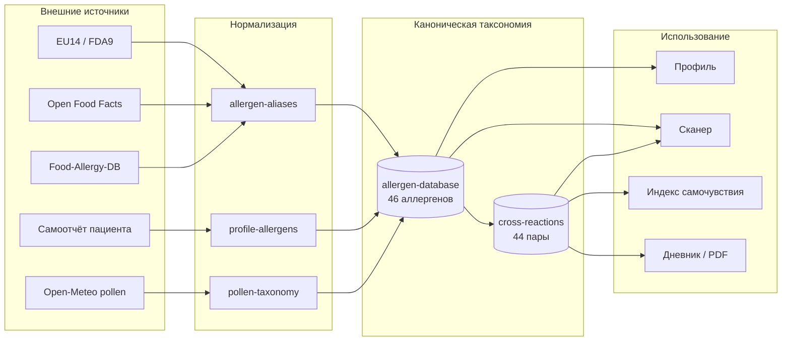
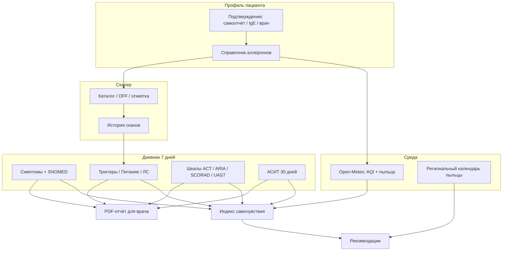

# AllerGuide: индекс самочувствия, дневник и источники данных

**Документ для врача-аллерголога / иммунолога**

Версия описания: соответствует коду приложения AllerGuide (ветка `main`, веса индекса `beta-1.0`).

---

## 1. Назначение и ограничения

AllerGuide — **инструмент поддержки решений** (decision support) для самонаблюдения при аллергических заболеваниях. Приложение **не является медицинским изделием** по EU MDR 2017/745 и **не ставит диагноз**, не назначает и не корректирует лечение.

| Компонент | Что делает | Чего не делает |
|-----------|------------|----------------|
| **Индекс самочувствия** | Агрегирует данные среды и дневника в числовую оценку 5–100 | Не заменяет клиническую оценку тяжести |
| **Дневник** | Фиксирует наблюдения пациента в структурированном виде | Не является медицинской документацией |
| **Сканер состава** | Эвристическая проверка этикетки по профилю аллергенов | Не гарантирует отсутствие скрытых или следовых аллергенов |
| **PDF-отчёт для врача** | Сводка записей дневника за выбранный период | Отражает только то, что ввёл пользователь |

**Важно для интерпретации:** веса индекса находятся в **бета-калибровке** и могут изменяться после клинической валидации (целевая корреляция с шкалами ACT и ARIA-lite: коэффициент Пирсона ρ ≥ 0,5).

При анафилаксии или затруднённом дыхании пациенту рекомендуется немедленно вызвать экстренную помощь (103 / 112).

---

## 2. Индекс самочувствия

### 2.1. Общий принцип

Индекс — **субтрактивная модель**: от максимума (100 баллов) вычитаются штрафы за факторы риска. Итоговое значение ограничено диапазоном **5–100**.

```
Индекс = min(100, max(5, 100 − Σ штрафов))
```

Чем **выше** индекс, тем **благоприятнее** совокупная картина по учтённым факторам. Индекс отражает **контекст самонаблюдения**, а не объективную тяжесть заболевания.

### 2.2. Компоненты расчёта

| Компонент | Источник данных | Окно анализа | Штрафы (версия `beta-1.0`) |
|-----------|-----------------|--------------|----------------------------|
| **Пыльца** | Open-Meteo Air Quality API | Текущие почасовые концентрации | Низкий: 0; средний: 12; высокий: 28 **за каждый** релевантный таксон |
| **Качество воздуха (EAQI)** | Open-Meteo (`european_aqi`, `pm2_5`) | Текущее значение | ≤20: 0; 21–50: 6; 51–75: 12; >75: 20; нет данных: 5 |
| **Дневник** | Записи пользователя | Последние 7 календарных дней | См. раздел 5 |
| **Клинические шкалы** | Записи раздела «Шкала» | Последняя оценка по каждой шкале | Умеренный контроль: 8; тяжёлый: 16; неконтролируемый: 22 |
| **АСИТ** | Записи раздела «АСИТ» | Последние 30 дней | Пропуск приёма: 4; сильная системная реакция: 12 |
| **Перекрёстные реакции** | Справочник + профиль + пыльца | При повышенной пыльце по профилю | Высокий риск: 12; средний: 8; низкий: 4 (+ доп. 50% при совпадении с профилем) |

#### Классификация концентрации пыльцы

Пороги вдохновлены подходами EAACI / GA²LEN и заданы **отдельно для каждого таксона** (гран/м³). Примеры:

| Таксон | Низкий | Средний | Высокий |
|--------|--------|---------|---------|
| Берёза (`birch_pollen`) | < 15 | 15–79 | ≥ 80 |
| Злаки (`grass_pollen`) | < 5 | 5–19 | ≥ 20 |
| Амброзия (`ragweed_pollen`) | < 10 | 10–29 | ≥ 30 |
| Прочие (по умолчанию) | < 10 | 10–49 | ≥ 50 |

В расчёт попадают только таксоны, **релевантные профилю** пациента (сопоставление через таксономию аллергенов приложения).

#### Перекрёстные реакции в индексе

При **среднем или высоком** уровне пыльцы по аллергену из профиля система проверяет справочник перекрёстных реакций (синдромы оральной аллергии, pollen-food). Штраф начисляется за потенциально значимые перекрёстные пары; при совпадении перекрёстного аллергена с профилем пациента штраф увеличивается на 50%.

### 2.3. Интерпретация значения индекса

| Диапазон | Статус | Клинический смысл (для пациента) |
|----------|--------|----------------------------------|
| ≥ 80 | Хорошо | Среда и дневник не указывают на повышенные риски |
| 60–79 | Умеренно | Есть отдельные факторы внимания |
| 40–59 | Повышенное внимание | Несколько факторов могут влиять на самочувствие |
| < 40 | Высокий риск | Рекомендуется минимизировать триггеры и обратиться к врачу |

### 2.4. Уверенность в данных (confidence)

Помимо числового индекса отображается уровень **уверенности в полноте данных**:

| Уровень | Условие |
|---------|---------|
| **Высокая** | Доступны данные среды (Open-Meteo) **и** (≥ 3 записей дневника за неделю **или** есть клинические шкалы) |
| **Средняя** | Доступны данные среды **или** ≥ 1 запись дневника за неделю |
| **Низкая** | Нет данных среды и мало записей дневника |

### 2.5. Поведение при недоступности данных среды

Если Open-Meteo недоступен, приложение **не подставляет синтетические** значения пыльцы и AQI. В этом случае:

- штрафы за пыльцу и AQI **не начисляются** (кроме фиксированного штрафа 5 за отсутствие AQI, если `envDataAvailable = false`);
- индекс рассчитывается **только по дневнику**, шкалам и АСИТ;
- пользователю показывается соответствующее предупреждение.

### 2.6. Сезонные оповещения

Помимо текущих концентраций учитывается **региональный календарь пыльцы** (Москва, Санкт-Петербург, Краснодар, Новосибирск, Екатеринбург и др.). Если текущий месяц совпадает с пиком сезона для аллергена из профиля, в рекомендации добавляется сезонное предупреждение (не влияет на числовой индекс напрямую).

---

## 3. Дневник самонаблюдения

### 3.1. Назначение

Дневник предназначен для **структурированной фиксации** симптомов, триггеров, терапии и объективных измерений. Данные хранятся локально на устройстве пациента (SQLite) и могут синхронизироваться с сервером в зашифрованном виде.

Каждая запись содержит:

- **тип раздела** (например, «Симптомы», «Питание»);
- **структурированные ответы** (JSON, версия схемы `v: 1`);
- **метку времени** (`createdAt`).

### 3.2. Разделы дневника

| Раздел | Клиническое содержание | Ключевые поля |
|--------|------------------------|---------------|
| **Симптомы** | Аллергические и сопутствующие проявления | Симптом из справочника, свободное описание, выраженность 0–3, зоны поражения, время начала |
| **Лекарство** | Приём препаратов | Название, дозировка, время, побочные реакции; предупреждение о непереносимости из паспорта SOS |
| **Питание** | Пищевые экспозиции | Продукты, возможные аллергены, тип реакции (в т.ч. ОАС, ЖКТ, анафилаксия), источник записи |
| **Триггер** | Предполагаемые причины обострения | Триггер, контекст, автоподстановка пыльцы / скана / ЛС за день |
| **Кожа** | Кожные проявления | Зона, внешний вид, интенсивность зуда |
| **Пикфлоуметрия** | Объективный показатель при астме | ПСВ (л/мин), время (утро/вечер), лучшее значение |
| **Укус насекомого** | Hymenoptera-аллергия | Тип насекомого, тяжесть, местные/системные симптомы, адреналин |
| **АСИТ** | Соблюдение аллерген-специфической иммунотерапии | Препарат, путь (SLIT/SCIT), фаза, соблюдение графика, реакции |
| **Шкала** | Валидированные клинические шкалы | ARIA-lite, ACT, SCORAD-lite, UAS7 |
| **Визит к врачу** | Планирование консультации | Тип врача, дата, комментарий |
| **Заметка** | Произвольные наблюдения | Заголовок, текст |

### 3.3. Кодирование симптомов

При выборе симптома из справочника или при анализе свободного текста система сопоставляет проявления с **каталогом симптомов**, содержащим:

- идентификатор симптома;
- русское наименование;
- код **SNOMED CT**;
- код **МКБ-11** (где применимо).

Примеры:

| Симптом | SNOMED CT | МКБ-11 |
|---------|-----------|--------|
| Заложенность носа | 68235000 | MD11.0 (аллергический ринит) |
| Одышка / свистящее дыхание | 56018004 | CA23.0 (аллергическая астма) |
| Крапивница | 126485001 | EB00 |
| Отёк (ангионевротический) | 41291007 | — |

В PDF-отчёте для врача коды отображаются в хронологии.

### 3.4. Шкала выраженности симптомов

Основная шкала: **0–3** (нет / лёгкая / умеренная / сильная). Устаревшая шкала 0–10 поддерживается для обратной совместимости и нормализуется при отображении.

### 3.5. Клинические шкалы в дневнике

| Шкала | Назначение | Диапазон | Интерпретация уровня контроля |
|-------|------------|----------|-------------------------------|
| **ARIA-lite** | Аллергический ринит (4 симптома × 0–3) | 0–12 | good / moderate / severe / uncontrolled |
| **ACT** | Контроль астмы (5 вопросов × 1–5) | 5–25 | good / moderate / severe / uncontrolled |
| **SCORAD-lite** | Атопический дерматит (упрощённо) | — | good / moderate / severe / uncontrolled |
| **UAS7** | Крапивница (сыпь + зуд) | — | good / moderate / severe / uncontrolled |

Для профилей с астмой приложение может напоминать о прохождении **ACT** каждые 28 дней.

**Последняя** оценка по каждой шкале участвует в расчёте индекса самочувствия.

### 3.6. Аналитика дневника (7-дневное окно)

При расчёте индекса из дневника извлекаются:

| Показатель | Определение |
|------------|-------------|
| **Дни с симптомами** | Календарные дни с ≥ 1 записью «Симптомы» |
| **Дни с триггерами** | Календарные дни с ≥ 1 записью «Триггер» |
| **Серия записей (streak)** | Подряд идущие дни с любой записью, считая от сегодня назад |
| **Корреляция на уровне дней** | Если ≥ 50% дней с симптомами совпадают с днём питания / триггера / ЛС |
| **Временная корреляция (±4 ч)** | Связь записи «Симптомы» с «Питание», «Триггер» или «Лекарство» в окне ±4 часа |
| **Аномалия «симптомы без триггера»** | ≥ 3 подряд календарных дня с симптомами, но без записи «Триггер» |

Временная корреляция имеет **приоритет** над дневной при начислении штрафа.

---

## 4. Источники данных об аллергии и профиле пациента

В AllerGuide данные об аллергенах проходят **многоуровневую нормализацию**: внешние источники (этикетки, базы продуктов, API пыльцы) приводятся к **единой канонической таксономии**, на которой строятся профиль, сканер, индекс самочувствия и справочник перекрёстных реакций.



### 4.1. Профиль пациента

Профиль — **первичный клинический контекст** для всех алгоритмов. Хранится локально (SQLite) и при синхронизации — на сервере в зашифрованном виде.

| Поле | Формат | Источник | Роль в системе |
|------|--------|----------|----------------|
| `name`, `birthYear`, `type` | текст / число / `self` \| `child` | Онбординг | Идентификация; для детских профилей — проверка согласия |
| `allergies` | JSON-массив **канонических id** (`milk`, `birch-pollen`, …) | Выбор из справочника | База для сканера, индекса, перекрёстных реакций |
| `allergyConfirmations` | JSON: `{ "allergenId": "источник" }` | Редактирование профиля | Метаданные достоверности (не влияют на расчёт индекса) |

**Нормализация при сохранении.** Любое значение (старые русские названия вроде «Молоко» или id `milk`) проходит через `resolveAllergenId` и сохраняется как канонический id. Это обеспечивает совместимость со старыми данными и единообразие для сканера.

**Дополнительные реестры (не в таблице `profiles`, но связаны с аллергией):**

| Реестр | Содержание | Использование |
|--------|------------|---------------|
| `foodDrugRegistry` | Дополнительные исключаемые продукты, клинические заметки | Расширяет список пищевых ограничений сверх профиля |
| `asitCourse` | Активный курс АСИТ (аллерген, препарат, маршрут SLIT/SCIT) | Префилл раздела «АСИТ» в дневнике |
| `scan_history` | История сканирований (вердикт, совпадения, уровень риска) | Контекст для раздела «Триггер» и «Питание» |

### 4.2. Канонический справочник аллергенов

**Источник истины:** статический модуль `allergen-database.ts` в пакете `@allerguide/core`. Содержит **46 аллергенов**, дублируется в PostgreSQL (`catalog.allergens`) при сидировании для API и каталога продуктов.

#### Структура записи

| Поле | Описание | Клинический смысл |
|------|----------|-------------------|
| `id` | Стабильный идентификатор (`peanut`, `birch-pollen`) | Ключ для профиля, БД, перекрёстных реакций |
| `name` | Русское отображаемое имя | UI, PDF-отчёт |
| `category` | `food` / `environmental` / `medication` / `insect` | Фильтрация (напр. только пищевые — в рекомендациях сканера) |
| `popular` | Флаг «частый выбор» | Быстрый выбор при онбординге |
| `keywords` | Массив строк для текстового поиска | Сканер состава, OCR, ручной ввод |

#### Состав справочника по категориям

**Пищевые аллергены** (основа для сканера и пищевого дневника):

| Группа | Примеры id / названия |
|--------|----------------------|
| Молочные / мясные | `milk`, `goat-milk`, `beef`, `pork`, `chicken`, `eggs` |
| Орехи и бобовые | `peanut`, `tree-nuts`, `hazelnut`, `soy`, `lupin` |
| Рыба и морепродукты | `fish`, `other-fish`, `seafood` |
| Злаки | `wheat-gluten`, `rye`, `barley` |
| Фрукты и овощи (в т.ч. для OAS) | `apple`, `carrot`, `banana`, `kiwi`, `avocado`, `tomato`, `citrus`, `melon`, `celery`, `strawberry`, `chestnut` |
| Прочие | `sesame`, `mustard`, `honey`, `sulphites` |

**Экологические аллергены** (пыльца, быт, животные):

| id | Название | Связь с мониторингом среды |
|----|----------|----------------------------|
| `birch-pollen` | Пыльца берёзы | Open-Meteo `birch_pollen` |
| `grass-pollen` | Пыльца злаков | Open-Meteo `grass_pollen` |
| `ragweed-pollen` | Пыльца амброзии | Open-Meteo `ragweed_pollen` |
| `mugwort-pollen` | Пыльца полыни | Open-Meteo `mugwort_pollen` |
| `dust-mites` | Пыль клещей | — |
| `house-dust` | Бытовая пыль | — |
| `cat-dander`, `dog-dander` | Шерсть кошек / собак | — |
| `mold` | Плесень | — |
| `latex` | Латекс | — |

**Лекарственные:** `penicillin`, `aspirin` (с расширенными алиасами классов НПВП, цефалоспоринов и т.д. в модуле пищевой/лекарственной аллергии).

**Инсектные:** `insect-stings` (пчёлы, осы, шершни — детализируются в разделе дневника «Укус насекомого»).

#### Популярные аллергены при онбординге

Отмечены флагом `popular: true`: молоко, яйца, арахис, орехи, рыба, пшеница/глютен, соя, пыльца берёзы, пыль клещей, пенициллин и др. — для ускорения первичного заполнения профиля без потери полноты справочника.

### 4.3. Подтверждение аллергии (источник верификации)

Для каждого аллергена в профиле может быть указан **источник подтверждения** — это **метаданные качества данных**, а не клинический фильтр алгоритмов:

| Код | Отображение | Клинический смысл |
|-----|-------------|-------------------|
| `self_reported` | Самоотчёт | Пациент указал аллергию без документального подтверждения в приложении (**значение по умолчанию**) |
| `specific_ige` | Специфический IgE | Пациент отметил лабораторное подтверждение |
| `clinician` | Подтверждено врачом | Пациент отметил подтверждение специалистом |

**Важно для врача:** статус подтверждения **не изменяет** чувствительность сканера, веса индекса или набор перекрёстных реакций. При интерпретации отчёта рекомендуется уточнять у пациента, какие аллергии подтверждены объективно.

### 4.4. Внешние словари и нормализация (allergen-aliases)

Внешние названия аллергенов **не хранятся в профиле напрямую** — они преобразуются в канонические id через цепочку алиасов (`regulatory-allergens.ts` + `allergen-aliases.ts`).

#### EU14 — Регламент ЕС 1169/2011, Приложение II

14 групп обязательных аллергенов на этикетке. Примеры маппинга:

| Регуляторный термин | Канонический id |
|---------------------|-----------------|
| `cereals-containing-gluten`, `gluten` | `wheat-gluten` |
| `crustaceans`, `molluscs` | `seafood` |
| `eggs`, `egg` | `eggs` |
| `peanuts`, `peanut` | `peanut` |
| `tree-nuts`, `nuts` | `tree-nuts` |
| `milk`, `dairy` | `milk` |
| `soybeans`, `soy`, `soya` | `soy` |
| `celery`, `mustard`, `sesame`, `lupin` | одноимённые id |
| `sulphites`, `sulfites` | `sulphites` |

#### FDA FALCPA — Big 9 (США)

Покрывает молоко, яйца, рыбу, моллюски/ракообразные, орехи, арахис, пшеницу, сою, кунжут. Частично пересекается с EU14; при конфликте приоритет у объединённого словаря `REGULATORY_ALLERGEN_ALIASES`.

#### Open Food Facts (OFF)

Теги `allergens_tags` и `traces_tags` с языковыми префиксами (`en:milk`, `fr:gluten`). Нормализуются функцией `normalizeExternalAllergenTerm` (снятие префикса, приведение к slug). OFF даёт **дополнительную детализацию** (напр. `almonds`, `hazelnuts` → `tree-nuts` или `hazelnut`).

#### Food-Allergy-DB (импорт в каталог)

Открытый датасет [alexf388/Food-Allergy-SQL-Database](https://github.com/alexf388/Food-Allergy-SQL-Database):

- `allergy.csv` — идентификаторы и английские названия аллергий;
- `foodallergy.csv` — связь штрихкод ↔ аллергия;
- `foodproduct.csv` — названия продуктов по штрихкодам.

При импорте английские названия проходят `mapExternalAllergenIds` и записываются в `catalog.products.allergenTags` как канонические id. Источник помечается `source: 'food-allergy-db'`.

#### Дополнительные алиасы

| Внешний термин | Канонический id |
|----------------|-----------------|
| `lactose` | `milk` |
| `nut`, `shellfish` | `tree-nuts`, `seafood` |

### 4.5. Каталог продуктов и приоритет источников при сканировании

При сканировании штрихкода или состава продукт аллергены определяются из нескольких слоёв (в порядке убывания надёжности для данного штрихкода):

| Приоритет | Источник | Поле / механизм | Примечание |
|-----------|----------|-----------------|------------|
| 1 | **Локальный каталог** (PostgreSQL `catalog.products`) | `allergenTags`, `traceTags` | Проверенные записи; приоритет при совпадении штрихкода |
| 2 | **Open Food Facts** | `allergens_tags`, `traces_tags` | Write-through кэш; обновляется при запросе |
| 3 | **Food-Allergy-DB** | Импортированные связи штрихкод ↔ аллерген | Базовое покрытие продуктов |
| 4 | **Текст состава** (OCR / ручной ввод) | Поиск по `keywords` справочника | Прямые совпадения в ингредиентах |
| 5 | **Перекрёстные реакции** | Справочник `CROSS_REACTIONS` | Если в составе есть продукт, перекрёстный к аллергену профиля |

**Типы совпадений в сканере (scan-risk v2):**

| Тип (`kind`) | Определение | Пример |
|--------------|-------------|--------|
| `direct` | Аллерген профиля явно указан в составе или тегах | Молоко в составе при аллергии на `milk` |
| `cross` | Продукт из справочника перекрёстных реакций найден в тексте | Яблоко при аллергии на `birch-pollen` |
| `trace` | Следы / «may contain» (RU/EN парсер) | «Может содержать следы орехов» |
| `unknown` | Нераспознанные фразы из блока следов | Требует ручной проверки этикетки |

Уровень риска (`low` / `medium` / `high`) вычисляется клиническими правилами: прямое пищевое совпадение с профилем → `high`; OAS / pollen-food перекрёст → не выше `medium`; следы → `medium` при релевантности профилю.

### 4.6. Таксономия пыльцы и связь с профилем

Пыльцевые аллергены профиля сопоставляются с **таксонами** Open-Meteo и региональным календарём через `pollen-taxonomy.ts`:

| Таксон Open-Meteo / календаря | Канонический allergen id | Примечание |
|-------------------------------|--------------------------|------------|
| `birch_pollen` | `birch-pollen` | Прямое соответствие |
| `grass_pollen` | `grass-pollen` | Тимофеевка и злаковые |
| `ragweed_pollen` | `ragweed-pollen` | Амброзия |
| `mugwort_pollen` | `mugwort-pollen` | Полынь |
| `alder_pollen` | — | Мониторинг без привязки к id профиля |
| `olive_pollen` | — | Южные регионы |
| `oak_pollen` (только календарь) | `birch-pollen` | Перекрёстная чувствительность берёзовых |
| `rye_pollen` (только календарь) | `rye` | Пищевой и пыльцевой контекст |

**Релевантность для индекса:** штраф за пыльцу начисляется только если `profileRelevant = true`, т.е. соответствующий id есть в `profiles.allergies`.

### 4.7. Справочник перекрёстных реакций

#### Происхождение и характер данных

Перекрёстные реакции — **курируемый статический справочник** в `@allerguide/core` (`cross-reactions/phase-1.ts`, `phase-2.ts`). Объединяется в массив `CROSS_REACTIONS` (**44 направленные пары**). Дублируется в PostgreSQL (`catalog.cross_reactions`) при сидировании.

**Источники при формировании (клинико-биологический контекст):**

- литература по **оральному аллергическому синдрому (OAS)** и pollen-food syndrome;
- известные **молекулярные семейства** (PR-10 / Bet v 1, профилины, LTP, тропомиозин, парвальбумин, латекс-фруктовый синдром);
- данные о **частоте клинических перекрёстных реакций** (где указано — поле `clinicalFrequency`);
- экспертная ревизия консультативного совета AllerGuide / АДАИР (домен `cross-reactions` в medical advisory board).

**Справочник не является динамической базой IgE-кроссреактивности** и не заменяет кожные пробы, BAT или молекулярную диагностику (компонентную IgE).

#### Структура записи перекрёстной реакции

| Поле | Описание |
|------|----------|
| `fromId`, `toId` | Пара канонических id (напр. `birch-pollen` → `apple`) |
| `risk` | `high` / `medium` / `low` — ориентир клинической значимости |
| `syndrome` | Тип синдрома (см. таблицу ниже) |
| `protein` | Имя молекулы-носителя (напр. `Mal d 1`, `Der p 10`) |
| `clinicalFrequency` | Оценка частоты в литературе (напр. `40-60%`, `>90%`) |
| `note` | Краткое пояснение на русском |

#### Типы синдромов (`syndrome`)

| Код | Клиническое название | Типичный механизм |
|-----|---------------------|-------------------|
| `oas` | Оральный аллергический синдром | PR-10, часто сырьё; термолабильные |
| `pollen-food` | Пыльца–пища (профилины, LTP) | Связь сенсибилизации к пыльце и пище |
| `latex-fruit` | Латекс-фруктовый синдром | Хитиназы, Hev b |
| `tropomyosin` | Тропомиозин | Домашняя пыль / клещи ↔ ракообразные; термостабилен |
| `legume` | Бобовые | Вицилины, легумины (арахис ↔ соя) |
| `cereal` | Злаки | Глютены, глиадины (пшеница ↔ рожь ↔ ячмень) |
| `animal-protein` | Белки животного происхождения | Казеин, альбумин, овомукоид, парвальбумин |

#### Полный перечень пар по группам

**Фаза 1 — базовые клинические связи**

| От (fromId) | К (toId) | Риск | Белок / синдром | Примечание |
|-------------|----------|------|-----------------|------------|
| `birch-pollen` | `apple` | high | Mal d 1 / OAS | Оральный аллергический синдром |
| `birch-pollen` | `hazelnut` | high | Cor a 1 / OAS | Оральный аллергический синдром |
| `birch-pollen` | `carrot` | high | Dau c 1 / OAS | Оральный аллергический синдром |
| `birch-pollen` | `tomato` | low | OAS | Реже, чем при злаках |
| `birch-pollen` | `soy` | medium | Gly m 4 / OAS | PR-10 гомолог Bet v 1 |
| `birch-pollen` | `peanut` | medium | Ara h 8 / OAS | Перекрёст с берёзой, не истинная PA |
| `birch-pollen` | `kiwi` | low | Act d 8 / OAS | PR-10 гомолог |
| `latex` | `banana` | high | Mus a 1 / latex-fruit | Латекс-фруктовый синдром |
| `latex` | `kiwi` | high | latex-fruit | Латекс-фруктовый синдром |
| `latex` | `avocado` | high | latex-fruit | Латекс-фруктовый синдром |
| `latex` | `tomato` | medium | latex-fruit | Перекрёст через хитиназы |
| `dust-mites` | `seafood` | high | Der p 10 / tropomyosin | 40–60%; термостабилен |
| `dust-mites` | `house-dust` | low | — | Связанные бытовые аллергены |
| `cat-dander` | `pork` | medium | Fel d 2 / animal-protein | ~3%; альбумин |
| `cat-dander` | `dog-dander` | low | — | Частичное перекрытие белков шерсти |
| `ragweed-pollen` | `banana` | medium | pollen-food | Профилины |
| `ragweed-pollen` | `honey` | low | — | Продукты пчеловодства |
| `milk` | `goat-milk` | high | — | >90%; сходные молочные белки |
| `milk` | `beef` | medium | animal-protein | Казеины и альбумин |
| `eggs` | `chicken` | medium | animal-protein | Овомукоид / овальбумин |
| `peanut` | `soy` | medium | legume | 5–10%; вицилины |
| `peanut` | `tree-nuts` | medium | — | Частичное перекрытие белков |
| `peanut` | `hazelnut` | medium | — | Возможна перекрёстная реакция |
| `tree-nuts` | `hazelnut` | high | — | Семейство древесных орехов |
| `fish` | `seafood` | low | — | Основной перекрёст — между видами рыб |

**Фаза 2 — расширение (пыльца, злаки, рыба, каштан)**

| От (fromId) | К (toId) | Риск | Белок / синдром | Примечание |
|-------------|----------|------|-----------------|------------|
| `birch-pollen` | `celery` | high | Api g 1 / OAS | Синдром «берёза — полынь — сельдерей» |
| `mugwort-pollen` | `celery` | high | Api g 1 / OAS | Синдром «полынь — сельдерей — специи» |
| `mugwort-pollen` | `carrot` | high | Dau c 4 | LTP — термостабилен |
| `mugwort-pollen` | `birch-pollen` | medium | pollen-food | Родственные пыльцевые аллергены |
| `mugwort-pollen` | `ragweed-pollen` | low | pollen-food | Сорные травы |
| `grass-pollen` | `wheat-gluten` | medium | Tri a 12 / pollen-food | Профилин, перекрёст с Phl p 12 |
| `grass-pollen` | `rye` | medium | Sec c / pollen-food | Профилины |
| `grass-pollen` | `barley` | low | pollen-food | Через профилины |
| `grass-pollen` | `tomato` | medium | Sola l 1 / pollen-food | Профилин |
| `grass-pollen` | `peanut` | low | Ara h 5 / pollen-food | Профилин |
| `grass-pollen` | `melon` | low | Cuc m 2 / pollen-food | Профилин бахчевых |
| `grass-pollen` | `citrus` | low | Cit s 2 / pollen-food | Профилин цитрусовых |
| `ragweed-pollen` | `melon` | high | Cuc m 1 / pollen-food | Профилин, перекрёст с Amb a 8 |
| `latex` | `chestnut` | high | Cas s 5 / latex-fruit | Хитиназа класса I |
| `wheat-gluten` | `rye` | high | Sec c / cereal | 70–80%; глютены |
| `wheat-gluten` | `barley` | high | Hor v / cereal | Гомология >80% |
| `wheat-gluten` | `grass-pollen` | medium | pollen-food | Пыльца злаковых трав |
| `fish` | `other-fish` | high | Gad c 1 / animal-protein | 50–70%; парвальбумин |

При нескольких аллергенах профиля, указывающих на один и тот же перекрёстный продукт (напр. берёза + злаки → томаты), сохраняется **наивысший риск** (`pickHigherRiskReaction`).

### 4.8. Где используются перекрёстные реакции

| Компонент | Функция | Клинический эффект |
|-----------|---------|-------------------|
| **Сканер** | `getCrossReactionsForSelection` + поиск keywords в составе | Совпадение типа `cross`; OAS/pollen-food ограничены уровнем `medium` |
| **Индекс самочувствия** | `computeCrossReactionWellnessPenalty` при повышенной пыльце | Штраф только для синдромов `oas` и `pollen-food`, если аллерген пыльцы в профиле |
| **Дневник «Питание»** | Поле `crossReactions` (автопрефилл) | До 5 подсказок вида «Яблоко (high)» по списку исключений |
| **PDF-отчёт** | Блок «Пищевая и лекарственная аллергия» | Сводка ограничений и перекрёстов |
| **Экспертный раздел** | Статья «Перекрёстные реакции» | Справочная информация для пациента |
| **Golden-сценарии (E.3)** | Автотесты клинической логики | Валидация берёза+яблоко, клещи+креветки, рыба+лосось |

**Логика штрафа в индексе (B.6):** при среднем/высоком уровне пыльцы по аллергену из профиля система перебирает перекрёстные пары с синдромом OAS или pollen-food. Штраф: high → 12, medium → 8, low → 4 балла; если перекрёстный аллерген **тоже в профиле** — дополнительно +50% к штрафу.

### 4.9. Данные среды (экологические аллергены)

| Параметр | API | Использование |
|----------|-----|---------------|
| `european_aqi` | Open-Meteo Air Quality | Штраф за качество воздуха |
| `pm2_5` | Open-Meteo Air Quality | Отображение в факторах (не отдельный штраф) |
| Пыльца (birch, grass, alder, ragweed, mugwort, olive) | Open-Meteo hourly | Штрафы по релевантным таксонам |
| Дуб, рожь (календарь) | Региональные таблицы `POLLEN_CALENDARS` | Сезонные рекомендации |

Геолокация пациента (или регион по умолчанию — Москва) определяет **регион пыльцы** и часовой пояс запроса. Пороги концентрации привязаны к реестру доказательств (`evidence-registry`, версия `2026-1`, ревизия EAACI/GA²LEN).

### 4.10. Экспертный контент и реестр доказательств

- **АДАИР / проф. Смолкин Ю.С.** — научное руководство экспертными материалами и калибровкой порогов.
- **`evidence-registry.ts`** — машиночитаемая привязка порогов (пыльца, AQI, веса индекса) к источникам и датам ревизии.
- Статьи для пациентов (перекрёстные реакции, календарь пыления, АСИТ) — **информационные**, не назначение.

### 4.11. Ограничения и клинические оговорки по данным об аллергенах

1. **Профиль — самоотчёт по умолчанию.** Алгоритмы не различают подтверждённые и неподтверждённые аллергии.
2. **Сканер эвристический.** Возможны пропуски незаявленных аллергенов, ложные срабатывания на общие слова, неполная маркировка следов.
3. **Перекрёстные реакции — не исчерпывающий атлас.** 44 пары покрывают наиболее частые клинические сценарии; индивидуальная кросс-реактивность может отличаться.
4. **Частота в справочнике — ориентир из литературы**, не персональная вероятность для конкретного пациента.
5. **Каталог продуктов зависит от полноты баз.** OFF и Food-Allergy-DB могут не содержать региональных SKU или актуальной маркировки.
6. **Пыльца Open-Meteo — модель/прогноз**, не замена официального поллинного мониторинга региона.

---

## 5. Влияние заполнения дневника на индекс самочувствия

Заполнение дневника — **основной источник субъективных и клинических данных** для индекса. Все расчёты по дневнику выполняются в **скользящем 7-дневном окне** (календарные дни, включая сегодня).

### 5.1. Прямые штрафы

| Событие | Условие | Штраф (баллы) |
|---------|---------|---------------|
| День с симптомами | ≥ 1 запись «Симптомы» в календарный день | **6** за каждый такой день (макс. 7 дней → до 42) |
| День с триггером | ≥ 1 запись «Триггер» в календарный день | **3** за каждый такой день (макс. до 21) |
| Серия ведения дневника | ≥ 3 подряд дня с любой записью | **+4** (единоразово) |
| Корреляция симптом–триггер или симптом–питание (дневная) | ≥ 50% дней с симптомами совпадают с триггером/питанием | **+6** |
| Временная корреляция (±4 ч) | То же, но по времени записей | **+8** (вместо +6) |
| Аномалия: симптомы без триггера | ≥ 3 подряд дня с симптомами без «Триггер» | **+10** |

### 5.2. Клинические шкалы из дневника

| Уровень контроля (последняя шкала) | Штраф |
|-----------------------------------|-------|
| Хороший (`good`) | 0 |
| Умеренный (`moderate`) | 8 |
| Тяжёлый (`severe`) | 16 |
| Неконтролируемый (`uncontrolled`) | 22 |

Если заполнены несколько шкал, штрафы **суммируются**.

### 5.3. АСИТ из дневника (30-дневное окно)

| Событие | Штраф |
|---------|-------|
| Пропущенный приём (`Пропущена`) | 4 за каждый |
| Сильная системная реакция | 12 за каждый |

Опоздание (`С опозданием`) учитывается в аналитике соблюдения, но **отдельного штрафа** не имеет.

### 5.4. Практические следствия для врача

1. **Регулярное ведение дневника повышает информативность**, но при симптомах **снижает** индекс — это ожидаемое поведение модели.
2. **Серия записей (streak ≥ 3)** добавляет небольшой штраф (+4): модель интерпретирует активное ведение при наличии записей как период повышенного внимания к состоянию, а не как «штраф за дисциплину».
3. **Фиксация триггеров** снижает риск аномалии «симптомы без триггера» (−10 баллов штрафа).
4. **Временная близость** записей «Симптомы» и «Питание»/«Триггер» усиливает штраф — это эвристика для выявления возможной связи, не доказательство причинности.
5. Записи **«Пикфлоуметрия»**, **«Кожа»**, **«Укус насекомого»**, **«Заметка»** сами по себе **не входят** в формулу индекса, но отображаются в PDF-отчёте и поддерживают клиническую картину.

---

## 6. Влияние сканирования на индекс самочувствия

### 6.1. Прямое влияние: отсутствует

**Результат сканирования штрихкода или состава не входит в формулу `computeWellnessScore`.** Вердикт сканера («безопасно», «осторожно», «опасно»), уровень риска и список совпадений **не изменяют** числовой индекс.

### 6.2. Косвенное влияние

Сканер влияет на самочувствие пациента **опосредованно**:

| Механизм | Описание |
|----------|----------|
| **Автоподстановка в «Триггер»** | При открытии раздела «Триггер» в поле `recentScan` подставляется последнее сканирование за **24 часа** (название продукта, вердикт, уровень). Пациент может сохранить это как контекст триггера. |
| **Автоподстановка в «Питание»** | Поля `foodSource` («Сканер»), `scanRef`, `allergens` могут заполняться из результата сканирования. |
| **Рекомендации индекса** | Если в профиле есть **пищевые** аллергены, в рекомендации добавляется напоминание проверять состав через сканер (не зависит от факта сканирования). |
| **История сканов** | Сохраняется в `scan_history` (локально): режим, входные данные, вердикт, совпадения, уровень, источник (каталог / OFF / ручной ввод). |

### 6.3. Цепочка влияния через дневник

```
Сканирование → запись «Питание» или контекст «Триггер»
             → (при симптомах в ±4 ч) временная корреляция
             → дополнительный штраф дневника (+8)
             → снижение индекса
```

Таким образом, сканер может **косвенно** повлиять на индекс только если пациент **зафиксировал** экспозицию в дневнике и впоследствии отметил симптомы.

### 6.4. Логика сканера (для контекста)

Сканер использует:

- профиль аллергенов пациента;
- регуляторные теги (EU14 / FDA9);
- ключевые слова и алиасы;
- каталог продуктов и Open Food Facts;
- разделение **прямых**, **перекрёстных**, **следовых** (`may contain`) и **неизвестных** совпадений.

Результат носит **эвристический** характер: возможны ложноположительные и ложноотрицательные срабатывания, особенно при неполной маркировке или следовых аллергенах.

---

## 7. PDF-отчёт для врача

Пациент может сформировать PDF-отчёт за **7, 14, 30 дней** или произвольный период.

### 7.1. Блоки отчёта

| Блок | Содержание |
|------|------------|
| Симптомы | Записи с выраженностью и SNOMED-кодами |
| Лекарства | Препараты, дозировки, эффект |
| Питание | Продукты, реакции |
| Триггеры | Предполагаемые причины |
| Контекст триггеров | Автоподстановки: пыльца, скан, ЛС за день |
| Пикфлоуметрия | Тренд ПСВ (мин / макс / последнее) |
| АСИТ | Приёмы, соблюдение, реакции |
| Пищевая и лекарственная аллергия | Сводка из профиля |
| Инсектная аллергия | Записи об укусах |
| Кожные проявления | Записи раздела «Кожа» |
| Клинические шкалы | ACT, ARIA-lite и др. |
| Хронология | Все записи в обратном хронологическом порядке |

### 7.2. Ограничения отчёта

> Отчёт сформирован пользователем/родителем на основе самостоятельно введённых данных. Документ **не является медицинской документацией**.

Отчёт предназначен для **обсуждения на приёме**, а не для юридического или страхового оформления.

---

## 8. Сводная схема потоков данных



---

## 9. Рекомендации по интерпретации на приёме

1. **Сопоставляйте индекс с confidence.** Низкая уверенность означает недостаток данных — не делайте выводов только по числу.
2. **Уточняйте источник аллергенов в профиле.** Самоотчёт ≠ подтверждение врачом или IgE.
3. **Используйте PDF-отчёт** для анализа динамики симптомов, соблюдения АСИТ и объективных показателей (ПСВ, шкалы).
4. **Корреляции в дневнике — гипотезы**, а не установленная причинно-следственная связь.
5. **Сканер — вспомогательный фильтр** этикетки; решение об употреблении продукта остаётся за пациентом и врачом.
6. **Индекс не заменяет** ACT, ARIA, SCORAD, провокационные пробы или специфический IgE — он агрегирует доступные данные для мотивации самонаблюдения.

---

## 10. Технические ссылки (для специалистов, участвующих в валидации)

| Модуль | Назначение |
|--------|------------|
| `packages/core/src/wellness.ts` | Расчёт индекса и рекомендаций |
| `packages/core/src/wellness-weights.ts` | Версионированные веса (`beta-1.0`) |
| `packages/core/src/diary-stats.ts` | Аналитика дневника, корреляции, аномалии |
| `packages/core/src/diary.ts` | Структура разделов дневника |
| `packages/core/src/allergen-database.ts` | Каноническая таксономия (46 аллергенов) |
| `packages/core/src/allergen-aliases.ts` | Маппинг EU14 / FDA9 / OFF / датасетов |
| `packages/core/src/regulatory-allergens.ts` | Регуляторные коды аллергенов |
| `packages/core/src/cross-reactions/` | Справочник перекрёстных реакций (44 пары) |
| `packages/core/src/pollen-taxonomy.ts` | Связь таксонов пыльцы с id профиля |
| `packages/core/src/pollen-thresholds.ts` | Пороги пыльцы (EAACI / GA²LEN) |
| `packages/core/src/allergy-confirmations.ts` | Источники подтверждения аллергии |
| `packages/core/src/scan-risk.ts` | Классификация совпадений сканера |
| `packages/ai/src/scan.ts` | Логика сканирования состава |
| `packages/core/src/food-drug-allergy.ts` | Префилл дневника, перекрёстные подсказки |
| `packages/core/src/evidence-registry.ts` | Реестр доказательств для порогов |
| `packages/core/src/doctor-report.ts` | Блоки PDF-отчёта |
| `packages/core/src/beta-metrics.ts` | Метрики калибровки (ρ с ACT / ARIA) |
| `packages/core/src/medical-disclaimer.ts` | Правовые ограничения и дисклеймеры |

---

*Документ подготовлен на основании исходного кода AllerGuide. При обновлении алгоритмов версия весов (`WELLNESS_WEIGHTS_VERSION`) и содержание разделов могут измениться.*
