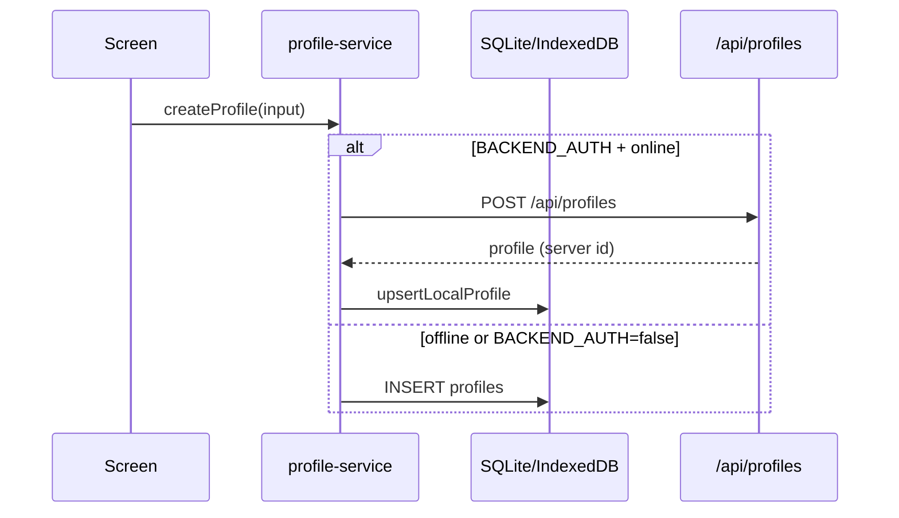

# ADR 001: Offline-first dual-write (local + server)

**Статус:** Accepted  
**Дата:** 2026-06-25  
**Фаза:** Phase 1 (P1.2a)  
**Участники:** Backend + Mobile

## Контекст

AllerGuide — **offline-first** приложение: профили, дневник, SOS и сканер должны работать без сети. Опциональный backend (`EXPO_PUBLIC_BACKEND_AUTH=true`) добавляет JWT-аутентификацию и хранение профилей в PostgreSQL.

В roadmap Phase 1 был открытый вопрос: после login данные **dual-write** (локально + сервер) или **server-authoritative** (сервер — единственный источник правды)?

Текущий код уже реализует dual-write для профилей в `profile-service.ts` и синхронизацию списка профилей при login через `syncProfilesFromBackend`. Нужно зафиксировать политику, чтобы Phase 1–2 не расходились с архитектурой.

## Решение

### Source of truth

| Режим | Source of truth | Примечание |
|-------|-----------------|------------|
| `BACKEND_AUTH=false` (default) | Локальная БД (SQLite / IndexedDB) | Полностью автономно |
| `BACKEND_AUTH=true`, **offline** | Локальная БД | Сеть не требуется для чтения/записи дневника, SOS, сканера |
| `BACKEND_AUTH=true`, **online** | Dual-write: API → upsert local | Профили: сервер при create/update/delete |

**Локальная БД остаётся source of truth для offline-операций.** Сервер — зеркало для auth-bound данных (аккаунт, профили) и opaque cloud backup (sync).

### Профили (dual-write)

| Операция | Online + backend auth | Offline + backend auth |
|----------|----------------------|------------------------|
| Create profile | `POST /api/profiles` → `upsertLocalProfile` | **Не поддерживается в P1** — показать ошибку «Нет сети» |
| Update profile | `PATCH /api/profiles/:id` → upsert local | Локальный UPDATE; сервер догонит при следующем online (out of scope P1) |
| Delete profile | `DELETE /api/profiles/:id` → local cascade | Local delete (как сейчас) |
| Login | `syncProfilesFromBackend` → **replace** local profiles для userId | — |

**Login replace:** при успешном login список профилей на устройстве **заменяется** серверным списком (`replaceLocalProfilesForUser`). Записи дневника привязаны к `profileId`; ID профилей должны совпадать с сервером после dual-write create.

### Дневник, SOS, сканер, напоминания

Не синхронизируются в реальном времени с API в Phase 1. Остаются **только локально**. Облачный перенос — через **encrypted backup** (`sync-service` → `POST /api/sync/backup`), не через отдельные REST-эндпоинты.

### Cloud backup (conflict policy)

- Один backup на `userId` на сервере (`sync_backups`, upsert).
- **Last-write-wins** по полю `exportedAt` в payload.
- Конфликты двух устройств без merge — побеждает последний upload (детали: ADR после P1.4c или секция в architecture.md).

### Logout и delete account

| Действие | Локальные данные |
|----------|------------------|
| Logout | **Сохраняются** (профили, дневник); очищаются session + JWT |
| Delete account | Локальный cascade + `DELETE /api/auth/account` при backend auth |

### Что отложено (Phase 3+)

- Server-authoritative sync профилей и дневника
- Offline mutation queue (create profile offline → replay to API)
- CRDT / merge по полям

## Последствия

### Положительные

- Offline-first не нарушается: core flows без сети после login.
- Минимальный diff для Phase 1: доработка gaps в `profile-service`, не переписывание data layer.
- Backend остаётся за feature flags.

### Отрицательные / ограничения

- Create profile при backend auth **требует сеть** в P1.
- Offline edit профиля не попадает на сервер до cloud backup или будущей очереди.
- Login replace может «перетереть» локально созданные offline-профили, если они не были на сервере (edge case; в P1 create offline не поддерживается).

## Реализация (где код)

| Слой | Файлы |
|------|-------|
| Auth | `apps/mobile/src/services/auth-service.ts`, `backend-api.ts` |
| Profiles dual-write | `apps/mobile/src/services/profile-service.ts` |
| Cloud backup | `apps/mobile/src/services/sync-service.ts`, `apps/api/src/routes/sync.ts` |
| Feature flags | `apps/mobile/src/constants/features.ts` |

**Правило:** экраны `app/**/*.tsx` не вызывают API/DB напрямую — только через services ([`development-rules.md`](../development-rules.md)).

## Критерии приёмки (P1.2a)

- [x] ADR зафиксирован
- [x] Описаны login, logout, offline, conflict policy (backup)
- [x] Server-authoritative отложен до Phase 3+
