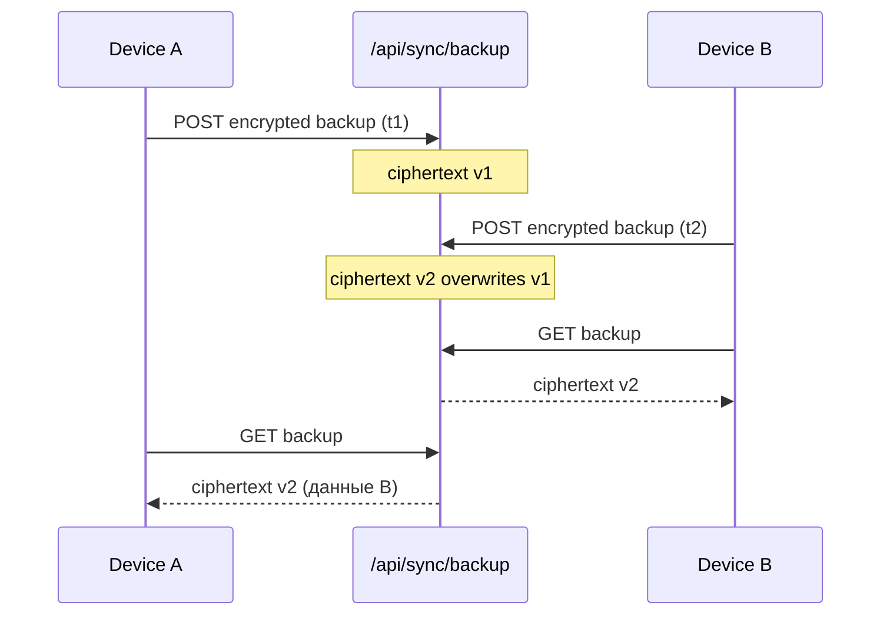

# ADR 002: Cloud backup conflict policy (LWW)

**Статус:** Accepted  
**Дата:** 2026-06-30  
**Фаза:** Phase 1 (P1.4d)  
**Связан:** [ADR 001 — dual-write](./001-dual-write.md)

## Контекст

Облачный backup (`POST /api/sync/backup`) хранит **один opaque ciphertext** на `userId`. Клиент шифрует полный snapshot (профили, дневник, SOS, scan history, settings) recovery key (AES-GCM). Сервер не видит plaintext.

Несколько устройств одного аккаунта могут загружать backup независимо. Нужна явная политика конфликтов до closed beta (P1.7).

## Решение

### Last-write-wins (LWW)

| Правило | Деталь |
|---------|--------|
| Хранилище | Одна строка `sync_backups` на `userId` (upsert) |
| Победитель | **Последний успешный upload** перезаписывает предыдущий ciphertext |
| Метаданные | `updatedAt` на сервере; клиентский `exportedAt` внутри payload (после расшифровки) |
| Merge | **Нет** field-level merge в Phase 1 |

### Поведение клиента

| Сценарий | Ожидаемое поведение |
|----------|---------------------|
| Upload после локальных изменений | Полный snapshot → encrypt → POST |
| Download на новом устройстве | GET → decrypt recovery key → `applySyncPayload` **заменяет** локальные данные аккаунта |
| Download на том же устройстве | То же: restore перезаписывает локальную БД валидным payload |
| Два устройства offline → оба upload | Побеждает тот, кто загрузил **позже**; другое устройство теряет незагруженные изменения, если не сделало upload |

### Идентификация и безопасность

- JWT обязателен на staging/production (`JWT_SECRET` без legacy `SYNC_API_KEY`).
- Upload/read только для `sub` из токена (IDOR запрещён).
- Неверный recovery key → `wrong_recovery_key`, данные не применяются.

### Что не входит в P1.4

- Автоматический merge дневника по `id` записей
- Версионирование нескольких backup на сервере
- «Свежесть» по `exportedAt` на сервере (сервер не расшифровывает — только LWW по времени upload)

## Последствия

**Плюсы:** простая модель, zero-knowledge на сервере, предсказуемый QA (P1.4c).

**Минусы:** пользователь может потерять изменения с устройства, которое не успело upload перед restore с другого.

## Критерии приёмки (P1.4d)

- [x] LWW задокументирован
- [x] Описаны upload/download и cross-device restore
- [x] Связь с ADR 001 и `sync-service`

## Реализация

| Компонент | Файл |
|-----------|------|
| API upsert | `apps/api/src/routes/sync.ts` |
| Mobile upload/download | `apps/mobile/src/services/sync-service.ts` |
| Restore apply | `apps/mobile/src/services/sync-restore.ts` |
| Smoke | `scripts/staging-sync-smoke.ts` |
