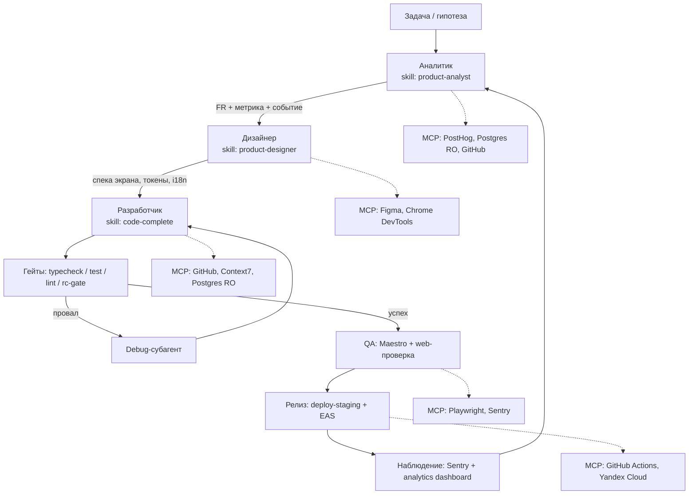

# План: роли-агенты (продуктовый аналитик, продуктовый дизайнер) + MCP для мультиагентной разработки и деплоя

**Статус:** Implemented · **Дата:** 2026-08-31 · **Выборы:** D1=A3 · D2=да · D3=P1 · D4=`rc-gate` · D5=в этом PR (иначе P1 ломает гейт) · D6=B2 · D7=конфиг+док

Документ описывает два независимых блока работ:

- **Часть A** — добавление ролей «старший продуктовый аналитик» и «старший продуктовый дизайнер» в виде Cursor **skills** + **rules**.
- **Часть B** — предложение набора **MCP-серверов** для мультиагентной разработки и деплоя.

Каждый блок разбит на уровни (**Tier 1 / 2 / 3**) и содержит **точки выбора** (`D1`…`D7`), которые фиксируются на этапе реализации. Сводка выборов — в [§7](#7-точки-выбора-сводка). Ничего из перечисленного не является обязательным целиком: Tier 1 самодостаточен.

---

## Содержание

1. [Аудит текущего состояния](#1-аудит-текущего-состояния)
2. [Часть A — роли аналитика и дизайнера](#2-часть-a--роли-аналитика-и-дизайнера)
3. [Часть B — MCP-серверы](#3-часть-b--mcp-серверы)
4. [Порядок выполнения и критерии приёмки](#4-порядок-выполнения-и-критерии-приёмки)
5. [Список файлов](#5-список-файлов)
6. [Риски](#6-риски)
7. [Точки выбора (сводка)](#7-точки-выбора-сводка)

---

## 1. Аудит текущего состояния

### 1.1. Что уже есть

| Область | Состояние |
|---------|-----------|
| Cursor skills | 2 шт.: [`.cursor/skills/code-complete/SKILL.md`](../.cursor/skills/code-complete/SKILL.md), [`.cursor/skills/rework-commits/SKILL.md`](../.cursor/skills/rework-commits/SKILL.md) |
| Cursor rules | **Отсутствуют** — каталога `.cursor/rules/` нет |
| MCP-конфигурация | **Отсутствует** — файла `.cursor/mcp.json` нет |
| Правила для людей и агентов | [`AGENTS.md`](../AGENTS.md) + [`docs/development-rules.md`](./development-rules.md) (§1–§10) + [`docs/codebase-index.md`](./codebase-index.md) |
| Память агентов | [`.agents/memory/MEMORY.md`](../.agents/memory/MEMORY.md) — индекс разборов инцидентов |
| Гейты качества | `pnpm typecheck` · `pnpm test` · `pnpm --filter mobile lint` · `pnpm rc-gate` ([`scripts/rc-gate-check.mjs`](../scripts/rc-gate-check.mjs)) · `pnpm yc-stage-phase0…5` |

### 1.2. Инфраструктура продуктовой аналитики (основа роли аналитика)

| Слой | Файл | Роль |
|------|------|------|
| Схема событий | [`packages/core/src/analytics-events.ts`](../packages/core/src/analytics-events.ts) | `ANALYTICS_EVENT_NAMES` (25 событий), `ANALYTICS_FORBIDDEN_KEYS` (11 PII-ключей), `sanitizeAnalyticsProps`, `buildAnalyticsPayload` |
| Эмиссия на клиенте | [`apps/mobile/src/services/analytics-service.ts`](../apps/mobile/src/services/analytics-service.ts) | `trackEvent` / `trackScreen`, console + HTTP sink, анонимный `client_id` |
| Приём и агрегация | [`apps/api/src/routes/analytics.ts`](../apps/api/src/routes/analytics.ts), [`apps/api/src/lib/analytics-store.ts`](../apps/api/src/lib/analytics-store.ts) | `POST /api/analytics/events`, `GET /api/analytics/dashboard`, ring buffer на 10k событий |
| Внешняя выгрузка | [`apps/api/src/lib/posthog-forward.ts`](../apps/api/src/lib/posthog-forward.ts) | опциональный forward в PostHog |
| KPI продукта | [`docs/roadmap-to-prod.md`](./roadmap-to-prod.md) §7 | crash-free ≥99.5%, cold start p95 <3s, onboarding ≥70%, D7 retention ≥25% |
| CJM | [`docs/cjm-profile-diary.md`](./cjm-profile-diary.md) | путь профиля и дневника, правила гейтинга |
| Требования | [`docs/functional-requirements.md`](./functional-requirements.md) | каталог `FR-*` |

**Чего нет:** воронок как артефакта, клиентских A/B-экспериментов, шаблона PRD/user story, проверки дрейфа таксономии событий.

### 1.3. Дизайн-система (основа роли дизайнера)

| Слой | Файл | Роль |
|------|------|------|
| Палитра и темы | [`apps/mobile/src/constants/theme.ts`](../apps/mobile/src/constants/theme.ts) | `lightColors` / `darkColors`, `ThemeColors`, `getThemeColors()` |
| Геометрия | [`apps/mobile/src/constants/layout.ts`](../apps/mobile/src/constants/layout.ts) | `radii`, `space`, `density` (тап-цели 44 / 36) |
| Типографика | [`apps/mobile/src/constants/typography.ts`](../apps/mobile/src/constants/typography.ts) | `fonts`, `fontSizes`, `MAX_FONT_SIZE_MULTIPLIER = 1.4` |
| Контраст | [`apps/mobile/src/constants/theme-contrast.ts`](../apps/mobile/src/constants/theme-contrast.ts) | WCAG-хелперы + тест-гейт |
| Политика бренда | [`docs/brand-claro-green.md`](./brand-claro-green.md) | канонические токены Claro, запрещённые legacy-цвета |
| UX-долг | [`docs/ux-audit-2026-08.md`](./ux-audit-2026-08.md), [`docs/ux-improvement-plan.md`](./ux-improvement-plan.md) | аудит по экранам, бэклог этапов A–E |
| i18n | [`apps/mobile/src/store/locale-store.ts`](../apps/mobile/src/store/locale-store.ts), [`apps/mobile/src/i18n/types.ts`](../apps/mobile/src/i18n/types.ts) | `useTranslation()`, 6 локалей |
| E2E-снимки | `apps/mobile/.maestro/flows/*.yaml`, [`docs/maestro.md`](./maestro.md) | смоук-потоки по `testID` |

**Чего нет:** пайплайна токенов из Figma, визуальных регрессий (Storybook/Chromatic), центрального хелпера `accessibilityLabel`.

### 1.4. Стек деплоя (основа для MCP)

GitHub Actions (включая [`deploy-staging.yml`](../.github/workflows/deploy-staging.yml)) → Yandex Container Registry → Serverless Container; миграции — на self-hosted runner внутри VPC; мобильные сборки — EAS; инфраструктура — Terraform в [`infra/yandex/staging/`](../infra/yandex/staging/); Postgres — Yandex Cloud Managed Postgres.

### 1.5. Дефект, найденный при аудите (входит в объём как тест-кейс)

`trackEvent` молча отбрасывает события, которых нет в таксономии:

```ts
// apps/mobile/src/services/analytics-service.ts
export function trackEvent(name: string, props?: AnalyticsEventProps) {
  if (!analyticsEnabled) return;
  if (!isAnalyticsEventName(name)) return;   // ← тихий drop
```

Два события эмитятся, но отсутствуют в `ANALYTICS_EVENT_NAMES` и потому **никогда не доходят до backend**:

| Событие | Место вызова | Дополнительно |
|---------|--------------|---------------|
| `scan_dish_vision` | `apps/mobile/src/services/scanner-dish-vision-service.ts:83` | — |
| `pollen_alert_sent` | `apps/mobile/src/services/pollen-reminder-service.ts:99` | передаёт `profileId` — идентификатор профиля в аналитике |

Это ровно тот класс ошибок, который должно ловить правило и автопроверка из [§2.6](#26-tier-2--автопроверки) / [§2.7](#27-tier-2--исправление-найденного-дрейфа).

---

## 2. Часть A — роли аналитика и дизайнера

### 2.1. Механика Cursor: skill против rule против AGENTS.md

| Механизм | Как подключается | Для чего подходит | Ограничение |
|----------|------------------|-------------------|-------------|
| **Skill** (`.cursor/skills/<name>/SKILL.md`) | агент читает по `description`, когда задача совпадает | объёмная **процедура роли**: как думать, какие артефакты выдать, шаблоны | грузится только по релевантности; не гарантирован |
| **Rule** (`.cursor/rules/<name>.mdc`) | `globs` — автоприкрепление по путям; `alwaysApply: true` — всегда; `description` — по релевантности | короткие **инварианты**: «нельзя хардкодить hex», «событие только из таксономии» | должен быть коротким, иначе съедает контекст |
| **AGENTS.md / docs** | всегда в контексте (AGENTS.md) либо по ссылке | навигация, команды, иерархия документов | не место для длинных ролевых инструкций |

Правильное распределение: **процедура — в skill, инвариант — в rule, ссылка — в AGENTS.md**. Формат frontmatter правил: `description`, `globs` (список через запятую, **без** скобок и кавычек), `alwaysApply`.

### 2.2. `D1` — где размещать роли

| Вариант | Состав | Плюсы | Минусы |
|---------|--------|-------|--------|
| **A1** | только 2 файла skill | минимальный diff | инварианты не применяются автоматически при правке кода |
| **A2** (рекомендуется) | 2 skill + 3 rule (`.mdc`) | процедура по запросу + инварианты по `globs` | появляется новый каталог `.cursor/rules/` |
| **A3** | A2 + правки `AGENTS.md`, `development-rules.md`, `codebase-index.md` | роли встроены в иерархию документов проекта | самый широкий diff, задевает общие документы |

**По умолчанию: A3** — иначе новые артефакты не будут находиться теми, кто читает `development-rules.md` как источник правды.

### 2.3. Skill: старший продуктовый аналитик

Файл: `.cursor/skills/product-analyst/SKILL.md`

```md
---
name: product-analyst
description: Senior product analyst for AllerGuide — определяет метрики, воронки и события аналитики,
  проверяет таксономию на PII и дрейф, формулирует продуктовые требования и гипотезы.
  Use when the user asks про метрики, KPI, воронку, retention, A/B, событие аналитики,
  продуктовые требования, приоритизацию или анализ поведения пользователей.
---
```

Разделы тела (каждый привязан к реальным файлам проекта, без абстрактных советов):

| № | Раздел | Содержание |
|---|--------|------------|
| 1 | Роль и границы | что делает аналитик и что **не** делает: не пишет UI, не меняет клиническую логику (пороги — только GINA, [§2.5 правил](./development-rules.md)) |
| 2 | Источники правды | таблица: KPI → `roadmap-to-prod.md` §7; требования → `functional-requirements.md` (`FR-*`); CJM → `cjm-profile-diary.md`; события → `packages/core/src/analytics-events.ts` |
| 3 | Протокол «новое событие» | 6 шагов: имя в `snake_case` → добавить в `ANALYTICS_EVENT_NAMES` → тест в `analytics-events.test.ts` → проверить `ANALYTICS_FORBIDDEN_KEYS` → эмиссия **в сервисе**, не в экране → обновить `docs/analytics-staging.md` |
| 4 | Правила приватности | запрет `profileId`, аллергенов, диагнозов, текстов дневника в props; ключ props — `^[a-z][a-z0-9_]{0,31}$`; медицинские данные — особая категория, агрегаты вместо сырых значений |
| 5 | Шаблон определения метрики | имя · формула из существующих событий · срез · целевое значение · где считается (dashboard / PostHog) · срок жизни |
| 6 | Шаблон воронки | шаги как последовательность событий (пример: `screen_view(onboarding)` → `profile_setup_step_view` → `profile_setup_step_complete` → `profile_created`) |
| 7 | Шаблон продуктового требования | `FR-<домен>-<NN>`: проблема · пользователь · сценарий · критерии приёмки · метрика успеха · флаг · offline-поведение |
| 8 | Шаблон гипотезы / эксперимента | формулировка, метрика, минимально измеримый признак; **явно**: клиентского A/B в проекте нет — до его появления сравнение по релизам и флагам |
| 9 | Чеклист выдачи | измеримость, наличие события, отсутствие PII, привязка к фазе roadmap, обновлённая документация |

### 2.4. Skill: старший продуктовый дизайнер

Файл: `.cursor/skills/product-designer/SKILL.md`

```md
---
name: product-designer
description: Senior product designer for AllerGuide — проектирует экраны и флоу на существующих
  токенах Claro, следит за иерархией заголовков, доступностью, состояниями и i18n.
  Use when the user asks про дизайн экрана, UI, UX, макет, токены, палитру, типографику,
  доступность, пустые состояния или онбординг.
---
```

| № | Раздел | Содержание |
|---|--------|------------|
| 1 | Роль и границы | проектирует в терминах существующих компонентов; **не** вводит новые цвета/радиусы/шрифты без правки `theme.ts` + `brand-claro-green.md` |
| 2 | Токены — единственный источник | `theme.ts` (цвета), `layout.ts` (`radii`, `space`, `density`), `typography.ts` (`fonts`, `fontSizes`); запрет литеральных hex и «магических» отступов в компонентах |
| 3 | Правило геометрии ACTION / STATE | `radii.full` — только у элементов, запускающих действие; чипы, табы, поля — `radii.sm` / `radii.md` (из [`development-rules.md` §3.2](./development-rules.md)) |
| 4 | Иерархия заголовков | экран `ScreenHeader` 26/700 · карточка `CardTitle` 18/600 serif · группа `ui.sectionLabel` 11 uppercase — не смешивать |
| 5 | Палитра компонентов | что переиспользовать вместо нового: `Screen`, `GlassCard` (+`zone: calm/attention/alarm`), `Button`, `EmptyState`, `ErrorState`, `Skeleton`, `UndoBanner`, `ListPickerSheet` |
| 6 | Обязательные состояния экрана | loading (`Skeleton`) · empty (`EmptyState`) · error (`ErrorState`) · offline · нет профиля — офлайн-first означает, что «нет сети» не является ошибкой |
| 7 | Доступность | тап-цель ≥44 (≥36 + `hitSlop`), масштаб шрифта до 1.4, `accessibilityRole` / `accessibilityLabel`, контраст по `theme-contrast.ts`, `accessibilityLiveRegion` для алертов |
| 8 | i18n | любой текст — через `useTranslation()`; ключ добавляется в **6** локалей + `i18n/types.ts`; учитывать длину строк RU/DE (~+30% к EN) |
| 9 | Тёмная тема | проверять оба набора токенов; не задавать цвет вне `useTheme()` |
| 10 | Формат выдачи | спецификация экрана: назначение · иерархия · компоненты и токены · состояния · a11y · ключи i18n · `testID` для Maestro · что попадает в `ux-improvement-plan.md` |
| 11 | Клинические ограничения | ACT/ARIA/GINA не выносить в пользовательские тексты главной, plain-language copy ([правила §2.5](./development-rules.md)) |

### 2.5. Tier 1 — правила `.mdc`

| Файл | `globs` | `alwaysApply` | Что фиксирует (5–15 строк) |
|------|---------|---------------|----------------------------|
| `.cursor/rules/analytics-events.mdc` | `packages/core/src/analytics-events.ts, apps/mobile/src/services/*.ts, apps/api/src/routes/analytics.ts, apps/api/src/lib/analytics-*.ts` | `false` | событие только из `ANALYTICS_EVENT_NAMES`; новое имя — сразу в таксономию + тест; props без PII; эмиссия в сервисе, не в экране |
| `.cursor/rules/design-tokens.mdc` | `apps/mobile/src/components/**/*.tsx, apps/mobile/app/**/*.tsx, apps/mobile/src/constants/theme.ts, apps/mobile/src/constants/layout.ts` | `false` | цвет только из `useTheme()`; отступ из `space`; радиус из `radii` + правило ACTION/STATE; тап ≥44; текст через `useTranslation()` |
| `.cursor/rules/product-roles.mdc` | — (только `description`) | `false` | какую роль применять к какому типу задачи; указывает на два skill-файла и на `development-rules.md` |

`D2`: третье правило можно опустить, если полагаться только на `description` скиллов (вариант A1/A2 без «маршрутизатора» ролей).

### 2.6. Tier 2 — автопроверки

Правило подсказывает, скрипт гарантирует. Три независимых кандидата:

| Проверка | Скрипт | Что делает | Стоимость / риск |
|----------|--------|------------|------------------|
| **P1. Дрейф таксономии событий** | `scripts/check-analytics-taxonomy.mjs` | grep `trackEvent('<name>'` по `apps/mobile` → сверка с `ANALYTICS_EVENT_NAMES` → падение при расхождении; плюс проверка props на `ANALYTICS_FORBIDDEN_KEYS` | низкая; ловит уже существующий дефект из [§1.5](#15-дефект-найденный-при-аудите-входит-в-объём-как-тест-кейс) |
| **P2. Хардкод дизайн-токенов** | `scripts/check-design-tokens.mjs` | поиск литеральных `#rrggbb` и `borderRadius: <число>` в `components/**` и `app/**` вне `constants/`; allowlist для существующих исключений | средняя: нужен стартовый allowlist, иначе шум на легаси |
| **P3. Полнота i18n-ключей** | `scripts/check-i18n-completeness.mjs` | сверка ключей 6 локалей с `i18n/types.ts` | низкая, но частично покрыто типами TS |

`D3` — объём автопроверок: **только P1** (по умолчанию) · **P1 + P3** · **все три** · **ни одной**.  
`D4` — точка включения: `pnpm rc-gate` ([`scripts/rc-gate-check.mjs`](../scripts/rc-gate-check.mjs)) · отдельный job в [`ci.yml`](../.github/workflows/ci.yml) · только локальный npm-скрипт без гейта.

### 2.7. Tier 2 — исправление найденного дрейфа

Отдельный коммит, включается по выбору `D5`:

1. Добавить `scan_dish_vision` и `pollen_alert_sent` в `ANALYTICS_EVENT_NAMES`.
2. Заменить `profileId` в `pollen_alert_sent` на непривязывающий признак (например `has_profile: boolean` или хеш-независимый счётчик) — идентификатор профиля в аналитике недопустим по [§2.3](#23-skill-старший-продуктовый-аналитик) и по политике медицинских данных.
3. Тест в `packages/core/src/analytics-events.test.ts` на наличие обоих имён.
4. Обновить перечень событий в [`docs/analytics-staging.md`](./analytics-staging.md).

`D5`: включить в этот PR · вынести в отдельный PR (по умолчанию — отдельный, чтобы не смешивать инструментарий и продуктовый код).

### 2.8. Tier 3 — расширения ролей

Опционально, не требуется для Tier 1:

- `docs/product-metrics.md` — реестр метрик и воронок как артефакт (сейчас метрики размазаны по roadmap / closed-beta / qa-checklist).
- `docs/design-system.md` — свод токенов и компонентов для дизайнера (сейчас разбито между `brand-claro-green.md` и кодом).
- Шаблоны GitHub Issue: `product-requirement.md`, `design-spec.md` рядом с существующим [`beta-feedback.md`](../.github/ISSUE_TEMPLATE/beta-feedback.md).
- Роль «QA-аналитик» и «релиз-инженер» как отдельные skill (если мультиагентный конвейер из [§3.4](#34-мультиагентный-конвейер) будет внедряться).

---

## 3. Часть B — MCP-серверы

### 3.1. Механика и границы

- Проектная конфигурация — `.cursor/mcp.json` в корне; персональная — `~/.cursor/mcp.json`; при конфликте **проектная приоритетнее**.
- Секреты в файл **не коммитятся**: только подстановка `${env:NAME}` (Cursor раскрывает переменные в полях `command`, `args`, `env`, `url`, `headers`) либо OAuth для remote-серверов.
- Для Cloud Agent переменные задаются в Cursor Dashboard → Cloud Agents → Secrets; для локальной работы — в профиле оболочки.
- Синтаксис `${input:...}` из VS Code в `mcp.json` **не поддерживается** — молча игнорируется.
- Remote-серверы не поддерживают `envFile`; он работает только для stdio.
- Уже доступные агенту серверы (`cursor-cloud`, `cursor-subscriptions`) настраивать не нужно.

### 3.2. `D6` — объём предложения по MCP

| Вариант | Состав |
|---------|--------|
| **B1** | только Tier 1 (разработка и отладка) |
| **B2** (рекомендуется) | Tier 1 + Tier 2 (деплой) |
| **B3** | B2 + Tier 3 (роли: Figma, PostHog) |
| **B4** | B3 + Tier 4 (процесс: трекер, Slack) |

`D7` — форма поставки: `.cursor/mcp.json` с плейсхолдерами + `docs/mcp-servers.md` (по умолчанию) · только документ · только конфиг.

### 3.3. Каталог серверов

**Tier 1 — разработка и отладка**

| Сервер | Транспорт / идентификатор | Кому нужен | Зачем в AllerGuide | Права |
|--------|---------------------------|------------|--------------------|-------|
| GitHub | remote `https://api.githubcopilot.com/mcp/` (OAuth или `Bearer ${env:GITHUB_TOKEN}`); альтернатива — stdio `github/github-mcp-server` | все роли | PR, ревью, Issues, логи Actions без ручного `gh` | read + PR write; **без** admin и без `workflow` |
| Sentry | remote `https://mcp.sentry.dev/mcp` (OAuth) | разработчик, QA | crash-free для гейта G5, стектрейсы staging/prod | read-only на проект |
| Chrome DevTools / Playwright | stdio | дизайнер, QA | проверка web-сборки Expo на `localhost:5000`, снимки состояний | локально |
| Context7 (или аналог docs-MCP) | remote | все роли | актуальные документации Expo SDK 55 / RN 0.83 / Drizzle вместо догадок | публичный read |
| Postgres (staging, YC Managed) | stdio, `STAGING_DATABASE_URL` | разработчик API, аналитик | проверка схем `profile` / `catalog` | **read-only роль, только YC staging** |

**Tier 2 — деплой**

| Сервер | Транспорт / идентификатор | Зачем | Права |
|--------|---------------------------|-------|-------|
| Yandex Cloud toolkit | stdio `npx -y @yandex-cloud/mcp -s toolkit` (OAuth или `-p <profile>`); remote `https://toolkit.mcp.cloud.yandex.net/mcp` с `Bearer <IAM>` | ресурсы VPC / Compute вокруг stage-контура | `viewer` на stage-каталог |
| Yandex Cloud containers / apigateway | stdio `-s containers`, `-s apigateway` | ревизии Serverless Container и API Gateway, на которые опирается [`deploy-staging.yml`](../.github/workflows/deploy-staging.yml) | `viewer`, публикация ревизии — только через CI |
| Yandex Cloud docs | stdio `-s docs --no-auth` | поиск по документации YC при правках Terraform | без авторизации |

Замечания: IAM-токен YC живёт максимум 12 часов, поэтому для остающейся конфигурации предпочтителен OAuth/CLI-профиль, а не вставленный `Bearer`. Отдельного MCP для **EAS/Expo** в предложении нет: сборки остаются за `eas-cli` и workflow, а состояние читается через GitHub MCP — это сознательный отказ, а не пропуск.

**Tier 3 — роли**

| Сервер | Транспорт | Для роли | Зачем |
|--------|-----------|----------|-------|
| Figma | remote `https://mcp.figma.com/mcp` (OAuth) | продуктовый дизайнер | чтение макетов и токенов; сверка с `theme.ts`. Требуется, только если макеты ведутся в Figma — сейчас в репозитории лежат HTML-макеты (`docs/design-mockup.html`) |
| PostHog | remote `https://mcp.posthog.com/mcp` | продуктовый аналитик | воронки и retention по событиям, которые уже умеет пересылать `posthog-forward.ts`. Требуется, только если PostHog реально подключён |

**Tier 4 — процесс**

Трекер (Linear / Notion / Atlassian) и Slack — remote с OAuth. Ценность появляется, только если планирование ведётся вне GitHub Issues; иначе это лишняя поверхность доступа.

### 3.4. Мультиагентный конвейер

Как роли и MCP складываются в цепочку (каждый шаг — отдельный субагент с минимально необходимым набором инструментов):



Матрица «роль → минимальный набор» (принцип наименьших привилегий):

| Роль | Обязательно | Опционально | Запрещено |
|------|-------------|-------------|-----------|
| Аналитик | GitHub (read) | PostHog, Postgres RO staging | запись в БД, prod-данные |
| Дизайнер | Chrome DevTools | Figma | БД, облако |
| Разработчик | GitHub, Context7 | Postgres RO staging (YC) | prod-БД, `workflow`-скоуп |
| QA | Playwright, Sentry (read) | GitHub | облако |
| Релиз | GitHub Actions | YC containers / apigateway (`viewer`) | публикация ревизии в обход CI |

### 3.5. Безопасность и данные

Проект обрабатывает медицинские данные, поэтому ограничения жёстче обычного:

1. **Никогда** не подключать MCP к продовой БД с пользовательскими данными — только staging и только read-only роль.
2. Токены минимально скоупированы, ротация — по [`docs/staging-secrets-rotation-checklist.md`](./staging-secrets-rotation-checklist.md), инвентарь — [`docs/staging-secrets-inventory.md`](./staging-secrets-inventory.md).
3. `.cursor/mcp.json` содержит только `${env:...}`; проверка секретов уже стоит на гейте `pnpm yc-stage-phase4`.
4. Prompt injection: MCP возвращает недоверенный ввод (тела Issues, комментарии, содержимое БД). Данные из MCP не считать инструкциями.
5. Egress: для Cloud Agent новые хосты MCP должны попасть в allowlist окружения, иначе вызовы будут отваляться по сети.
6. Соответствие ([`docs/privacy-compliance-audit.md`](./privacy-compliance-audit.md)): выгрузка пользовательских данных в сторонние MCP (в т.ч. аналитические) не допускается; агрегаты — да, сырые записи дневника — нет.

---

## 4. Порядок выполнения и критерии приёмки

| Этап | Действия | Критерий приёмки |
|------|----------|------------------|
| **1. Роли, Tier 1** | 2 skill + 2–3 rule | файлы валидны (frontmatter, `globs` без кавычек); агент подхватывает skill по тестовому запросу «добавь событие аналитики» / «спроектируй экран» |
| **2. Интеграция в документы** | `AGENTS.md` (раздел про skills/rules), `development-rules.md` §1 (иерархия) + §8 (чеклист) + §9 (антипаттерны), `codebase-index.md` §9 | ссылки не битые; чеклист merge содержит пункты про таксономию событий и токены |
| **3. Автопроверки** (`D3`, `D4`) | скрипты P1/P2/P3 + подключение к гейту | скрипт красный на текущем дрейфе до исправления, зелёный после |
| **4. Исправление дрейфа** (`D5`) | таксономия + PII-фикс + тест | `pnpm test` зелёный; `scan_dish_vision` и `pollen_alert_sent` доходят до dashboard |
| **5. MCP** (`D6`, `D7`) | `.cursor/mcp.json` + `docs/mcp-servers.md` | JSON валиден; в файле нет ни одного literal-секрета; каждый сервер описан в документе с правами и владельцем токена |
| **Регрессия** | `pnpm install && pnpm typecheck && pnpm test && pnpm --filter mobile lint` | всё зелёное; на этапах 1–2 и 5 продуктовый код не меняется, поэтому risk-профиль минимальный |

Проверка этапов 1–2 и 5 не требует запуска приложения: артефакты — конфигурация и документация. Этапы 3–4 проверяются юнит-тестами и запуском скрипта.

---

## 5. Список файлов

**Создаются**

| Файл | Этап | Tier |
|------|------|------|
| `.cursor/skills/product-analyst/SKILL.md` | 1 | 1 |
| `.cursor/skills/product-designer/SKILL.md` | 1 | 1 |
| `.cursor/rules/analytics-events.mdc` | 1 | 1 |
| `.cursor/rules/design-tokens.mdc` | 1 | 1 |
| `.cursor/rules/product-roles.mdc` | 1 | 1 (`D2`) |
| `scripts/check-analytics-taxonomy.mjs` | 3 | 2 (`D3`) |
| `scripts/check-design-tokens.mjs` | 3 | 2 (`D3`) |
| `scripts/check-i18n-completeness.mjs` | 3 | 2 (`D3`) |
| `.cursor/mcp.json` | 5 | — (`D7`) |
| `docs/mcp-servers.md` | 5 | — (`D7`) |
| `docs/product-metrics.md`, `docs/design-system.md` | — | 3 |

**Изменяются**

| Файл | Что |
|------|-----|
| [`AGENTS.md`](../AGENTS.md) | раздел про доступные skills / rules / MCP |
| [`docs/development-rules.md`](./development-rules.md) | §1 иерархия, §8 чеклист, §9 антипаттерны |
| [`docs/codebase-index.md`](./codebase-index.md) | §9 таблица документов |
| [`package.json`](../package.json) | скрипты проверок (`D3`/`D4`) |
| [`scripts/rc-gate-check.mjs`](../scripts/rc-gate-check.mjs) | подключение проверок к гейту (`D4`) |
| `packages/core/src/analytics-events.ts` + тест, `apps/mobile/src/services/pollen-reminder-service.ts`, [`docs/analytics-staging.md`](./analytics-staging.md) | только при `D5` = «в этом PR» |

---

## 6. Риски

| Риск | Вероятность | Снижение |
|------|-------------|----------|
| Правила раздувают контекст и мешают | средняя | узкие `globs`, `alwaysApply: false`, ≤15 строк на правило |
| Проверка токенов (P2) шумит на легаси-коде | высокая | стартовый allowlist + предупреждение вместо ошибки на первом этапе |
| Секрет попадает в `.cursor/mcp.json` | средняя | только `${env:...}`; уже существующий гейт `yc-stage-phase4`; ревью |
| MCP к БД раскрывает медицинские данные | высокая по последствиям | read-only, только staging, запрет prod на уровне документа и токенов |
| IAM-токен YC истекает через 12 ч и ломает конфиг | высокая | OAuth или CLI-профиль вместо literal `Bearer` |
| Дублирование правил между skill, rule и `development-rules.md` | средняя | инвариант живёт в одном месте, остальные — ссылаются |
| Роли-скиллы противоречат правилам проекта | низкая | в каждом skill — явный приоритет `architecture.md` → `development-rules.md` |

---

## 7. Точки выбора (сводка)

| ID | Вопрос | Варианты | По умолчанию |
|----|--------|----------|--------------|
| `D1` | Размещение ролей | A1 skills · A2 skills+rules · A3 + документы | **A3** |
| `D2` | Правило-маршрутизатор ролей | да · нет | **да** |
| `D3` | Автопроверки | нет · P1 · P1+P3 · P1+P2+P3 | **P1** |
| `D4` | Куда подключать проверки | `rc-gate` · отдельный CI job · только скрипт | **`rc-gate`** |
| `D5` | Исправление дрейфа событий | в этом PR · отдельный PR · не сейчас | **отдельный PR** |
| `D6` | Объём MCP | B1 · B2 · B3 · B4 | **B2** |
| `D7` | Форма поставки MCP | конфиг+док · только док · только конфиг | **конфиг+док** |

---

## Связанные документы

- [`docs/architecture.md`](./architecture.md) — архитектура и слои
- [`docs/development-rules.md`](./development-rules.md) — правила разработки, §10 Code Complete
- [`docs/codebase-index.md`](./codebase-index.md) — карта файлов
- [`docs/roadmap-to-prod.md`](./roadmap-to-prod.md) — фазы и метрики успеха (§7)
- [`docs/analytics-staging.md`](./analytics-staging.md) — контур аналитики на stage
- [`docs/brand-claro-green.md`](./brand-claro-green.md) — политика цвета
- [`docs/staging-secrets-inventory.md`](./staging-secrets-inventory.md) — инвентарь секретов
- [`AGENTS.md`](../AGENTS.md) — команды и операционные особенности
