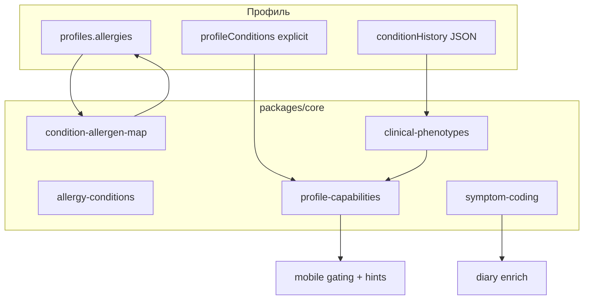
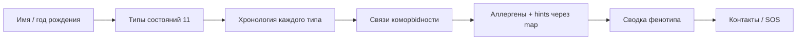
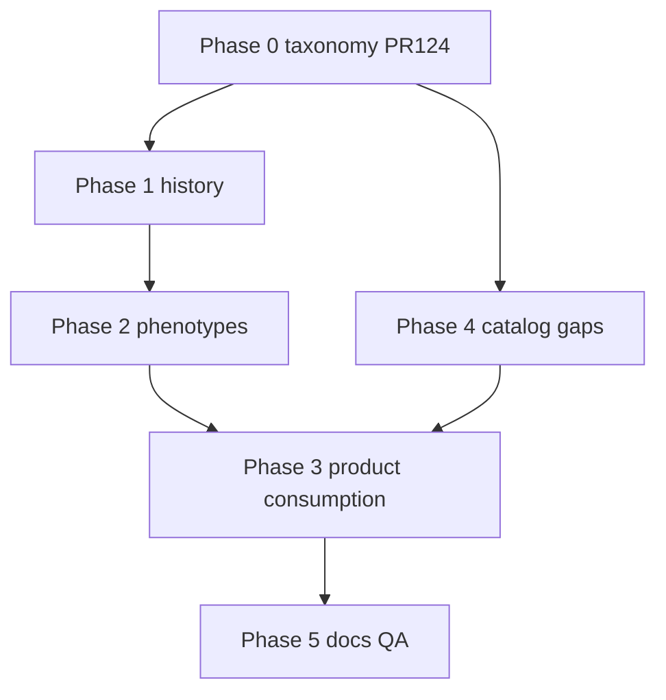

# AllerGuide — единый план: таксономия аллергии, хронология, коморbidность

Объединяет три запроса из design-сессии:

1. **Аудит полноты** типов аллергии, реакций и симптомов  
2. **Расширение профиля** — срок появления аллергии + сложные сценарии с сопутствующими заболеваниями (EAACI / РААКИ)  
3. **Первый инкремент реализации** — маппинг id, SYMPTOM_CATALOG, тип «крапивница» ([PR #124](https://github.com/zuevfoton-art/AllerGuide/pull/124))

**Связано:** [`allergy-taxonomy-issues.md`](./allergy-taxonomy-issues.md) · [`clinical-features-raaci.md`](./clinical-features-raaci.md) · [`clinical-accuracy-roadmap.md`](./clinical-accuracy-roadmap.md) · [`architecture.md`](./architecture.md)

---

## 1. Цель продукта

Перейти от **статического списка типов и аллергенов** к **клинически осмысленному профилю**:

| Слой | Сейчас | Целевое состояние |
|------|--------|-------------------|
| Типы состояний | 11 галочек (`profileConditions`) | + дебют, статус, подтверждение |
| Аллергены | 45 id в каталоге | + расширение пробелов, единый id |
| Симптомы | 18 SNOMED-кодов | + связь с reactionType, SOS |
| Коморbidность | Набор независимых типов | Фенотипы (AR+астма, атопический марш, …) |
| Поведение UI | Gating по explicit conditions | Рекомендации по фенотипу без скрытия карты/сканера |

**Инварианты (не меняются):** offline-first, домен в `packages/core`, карта / маркетплейс / все режимы сканера всегда доступны, explicit-first gating модулей дневника (FR-PROF-10..13).

**Клинические опоры:**

- **EAACI ARIA 2024–2025** — мультimorbid phenotypes (AR alone / AR+asthma / AR+conjunctivitis), person-centred care  
- **EAACI Food Allergy 2023–2024** — allergy-focused history: age at onset, timing, reassessment  
- **РААКИ** — атопический марш (АтД → ринит/поллиноз → астма), КР по АтД 2024, АСИТ при доказанной сенсибилизации  

---

## 2. Текущее состояние (baseline)

### 2.1. Сделано (Phase 0 — PR #124)

| Компонент | Результат |
|-----------|-----------|
| `condition-allergen-map.ts` | Маппинг option id → allergen id + legacy aliases |
| `allergy-conditions.ts` | 11-й тип `urticaria`, выровненные option ids |
| `symptom-coding.ts` | 18 симптомов (+ анафилаксия, гортань, ЖКТ split) |
| `diary.ts` | Picker из `getSymptomCatalogChoices()` |
| `diary-profile.ts` | `urticaria → UAS7` |

### 2.2. Остающие пробелы (из аудита)

| Область | Пробел | Приоритет |
|---------|--------|-----------|
| Аллергены | Лекарства: 2 id; насекомые: 1 агрегат; животные: только кошка/собака | P1 |
| Поллиноз | 16 option vs 4 pollen allergen rows | P2 |
| Реакции | Нет модели delayed/T-cell, FPIES, контактный дерматит | P3 |
| Симптомы | reactionType в еде/укусах не в SNOMED pipeline | P1 |
| ICD/SNOMED | 24 аллергена без crosswalk | P2 |
| Профиль | Нет дебюта, хронологии, фенотипов | P0 (следующий этап) |
| FR | FR-PROF-02 всё ещё «10 типов» | P1 (док) |

---

## 3. Целевая архитектура данных



### 3.1. Слои (не смешивать)

1. **`AllergyConditionId`** — тип состояния для gating (астма → пикфлоу, urticaria → UAS7)  
2. **`ConditionEpisode`** — анамнез: дебют, статус, подтверждение, заметки  
3. **`ClinicalPhenotype`** — производный фенотип для рекомендаций (не для gating)  
4. **`AllergenRecord`** — каталог для сканера / cross-reactions  
5. **`SymptomConcept`** — SNOMED/ICD для дневника и PDF  

### 3.2. Новые доменные типы (Phase 1)

```typescript
interface ConditionEpisode {
  conditionId: AllergyConditionId;
  onsetKind: 'infancy' | 'early-childhood' | 'school-age' | 'adolescence' | 'adulthood' | 'unknown';
  onsetYear?: number;
  status: 'active' | 'resolved' | 'in-remission' | 'unknown';
  diagnosedBy?: 'self_reported' | 'clinician' | 'specific_ige';
  linkedAllergenIds?: string[];
  linkedOptionIds?: string[];
  notes?: string;
}

interface ComorbidityLink {
  fromConditionId: AllergyConditionId;
  toConditionId: AllergyConditionId;
  relation: 'preceded' | 'concurrent';
}

type ClinicalPhenotypeId =
  | 'atopic-march-child'
  | 'aria-asthma'
  | 'aria-conjunctivitis'
  | 'food-anaphylaxis-risk'
  | 'pollen-food-oas'
  | 'dustmite-seafood'
  | 'insect-venom-severe'
  | 'drug-respiratory'
  | 'adult-onset-food'
  | 'polysensitized';
```

**Хранение:** `app_settings` → `conditionHistory:{profileId}` (`v: 1`). Sync в encrypted backup (follow-up).

---

## 4. Каталог клинических фенотипов (EAACI / РААКИ)

| ID | Условия (+ SOS) | Источник | Действия в приложении |
|----|------------------|----------|------------------------|
| `atopic-march-child` | dermatitis → rhinitis/pollinosis → asthma | РААКИ атопический марш | Подсказка траектории; SCORAD+ARIA+ACT |
| `aria-asthma` | rhinitis/pollinosis + asthma | ARIA-EAACI 2024 | Pollen alerts + ACT prompt |
| `aria-conjunctivitis` | rhinitis + conjunctivitis flag | ARIA-EAACI 2024 | Ocular symptoms priority |
| `food-anaphylaxis-risk` | food + SOS.anaphylaxisHistory | EAACI anaphylaxis | Epinephrine reminder |
| `pollen-food-oas` | pollinosis + food + OAS cross | EAACI PFAS | Food diary reactionType OAS |
| `dustmite-seafood` | household + seafood | iFAAM tropomyosin | Scanner traces hint |
| `insect-venom-severe` | insect + anaphylaxisHistory | EAACI venom | Insect action plan |
| `drug-respiratory` | drug + asthma/rhinitis | РААКИ NSAID | Medicine scanner default |
| `adult-onset-food` | food + onset adulthood | EAACI food history | Reassessment hint |
| `polysensitized` | ≥3 respiratory + ≥2 allergen groups | MeDALL/MASK-air | Wellness confidence ↓ |

Фенотипы **выводятся** `resolveClinicalPhenotypes()` — не добавляют новых gate для сканера/карты.

---

## 5. Фазы реализации

### Phase 0 — Foundation taxonomy ✅

**PR #124** · Issues 1–4 · [`allergy-taxonomy-issues.md`](./allergy-taxonomy-issues.md)

- [x] Маппинг condition option → allergen id  
- [x] SYMPTOM_CATALOG 18 симптомов  
- [x] Тип `urticaria` + UAS7  
- [x] Выровненные option ids  

**Остаток Phase 0:**

- [ ] Issue 6: i18n `urticaria` (6 локалей)  
- [ ] Подключить `resolveConditionOptionAllergenId` в onboarding hints (`getMissingConditionsForAllergens`)  

---

### Phase 1 — Condition history (хронология)

**Цель:** пользователь указывает **когда** появился каждый тип аллергии.

| ID | Задача | Файлы |
|----|--------|-------|
| 1.1 | Домен `condition-history.ts`: типы, parse/serialize | ✅ Done |
| 1.2 | `buildConditionHistoryFromOnboarding()` | ✅ Done |
| 1.3 | Mobile service + `app_settings` key | ✅ Done |
| 1.4 | Wizard step «Хронология» после conditions | ✅ Done |
| 1.5 | Секция «История аллергии» в profile-edit | ✅ Done |
| 1.6 | Unit-тесты | ✅ Done |
| 1.7 | FR-PROF-14 | ✅ Done |

**Поля UI (на тип):** период дебюта · год (opt) · статус · кто подтвердил · «не помню»

**Дополнительно для food (EAACI):** время симптомов после еды (`<30 min` / `30min–2h` / `>2h`).

**Критерий готовности:** история сохраняется offline, отображается в profile-edit, не ломает существующий `profileConditions`.

---

### Phase 2 — Comorbidity links + phenotypes

**Цель:** сложные сценарии с сопутствующими заболеваниями.

| ID | Задача | Файлы |
|----|--------|-------|
| 2.1 | `clinical-phenotypes.ts` + `resolveClinicalPhenotypes()` | ✅ Done |
| 2.2 | `ComorbidityLink` в condition history | ✅ Done |
| 2.3 | Wizard step «Что появилось раньше?» (≥2 types) | ✅ Done |
| 2.4 | Карточка «Ваш фенотип» (информационная) | ✅ Done |
| 2.5 | `clinical-phenotype-service.ts` + hints на главной | ✅ Done |
| 2.6 | Тесты P1–P10 | ✅ Done |
| 2.7 | FR-PROF-15..16 | ✅ Done |

**Критерий готовности:** при профиле «АтД + поллиноз + астма» определяется `atopic-march-child` + `aria-asthma`; подсказки на главной / дневнике без нового gating.

---

### Phase 3 — Потребление в продукте

| ID | Задача | Модуль |
|----|--------|--------|
| 3.1 | PDF: блок «Хронология и фенотипы» | ✅ Done |
| 3.2 | `reassessmentHints` (food у детей — EAACI) | ✅ Done |
| 3.3 | Wellness v3: multimorbid penalty (AR+астма) | ✅ Done |
| 3.4 | Связать `reactionType` еды ↔ SNOMED (`anaphylaxis`) | ✅ Done |
| 3.5 | SOS ↔ phenotypes (epinephrine eligibility) | ✅ Done |
| 3.6 | Cloud sync `conditionHistory` | ✅ Done |

---

### Phase 4 — Расширение справочников (из аудита)

| ID | Задача | Приоритет |
|----|--------|-----------|
| 4.1 | Разбить `insect-stings` → bee/wasp/hornet/mosquito | P1 |
| 4.2 | Лекарственные аллергены: NSAID, cephalosporins, paracetamol | P1 |
| 4.3 | Животные: rodent, bird, horse, rabbit | P2 |
| 4.4 | Pollen allergen rows для alder, oak, … или явный «calendar-only» | P2 |
| 4.5 | ICD/SNOMED для 24 аллергенов | P2 |
| 4.6 | Тип `conjunctivitis` или flag в rhinitis (ARIA ocular) | P2 |
| 4.7 | Drug reaction types: immediate / delayed / cutaneous | P3 |
| 4.8 | Cross-reaction syndromes: FPIES, contact dermatitis (info-only) | P3 |

---

### Phase 5 — Документация и QA

| ID | Задача |
|----|--------|
| 5.1 | Обновить FR-PROF-02: 11 типов + urticaria |
| 5.2 | Матрица S1–S10 в `clinical-features-raaci.md` (+ urticaria, phenotypes) |
| 5.3 | QA checklist: onboarding history, phenotype card, PDF |
| 5.4 | `pnpm rc-gate` |

---

## 6. UX-поток (итоговый онбординг)



**Принципы:** progressive disclosure · «пропустить» на каждом шаге · inferred ≠ gating · дисклеймер «не диагноз».

---

## 7. Зависимости между фазами



**Параллельно возможно:** Phase 0 remainder (i18n) + Phase 4.1–4.2 без Phase 2.

**Merge note:** если `profile-capabilities` (PR #121) ещё не в main — Phase 2.5 мержить поверх него.

---

## 8. Метрики успеха

| Метрика | Target |
|---------|--------|
| Пользователь заполняет дебют | ≥1 episode на explicit condition |
| Фенотип определяется | ≥1 phenotype при ≥2 conditions |
| PDF содержит хронологию | блок в отчёте врачу |
| Id consistency | 0 unresolved option ids для catalog rows |
| Symptom coding | anaphylaxis из дневника → SNOMED в PDF |
| Regression | typecheck + test + rc-gate green |

---

## 9. GitHub issues (рекомендуемая нумерация)

| Issue | Phase | Title |
|-------|-------|-------|
| #124 | 0 | ✅ taxonomy foundation (merged/pending) |
| TBD | 0 | mobile i18n urticaria |
| TBD | 0 | wire condition-allergen-map to onboarding hints |
| TBD | 1 | condition history domain + storage |
| TBD | 1 | onboarding history wizard step |
| TBD | 2 | clinical phenotypes catalog |
| TBD | 2 | comorbidity wizard + phenotype card |
| TBD | 3 | PDF timeline + wellness multimorbid |
| TBD | 4 | insect + drug allergen catalog expansion |
| TBD | 4 | clinical-coding remaining allergens |
| TBD | 5 | FR + QA matrix update |

Детали Issues 1–7: [`allergy-taxonomy-issues.md`](./allergy-taxonomy-issues.md).

---

## 10. Риски

| Риск | Mitigation |
|------|------------|
| Перегрузка онбординга | Skip + дозаполнение в profile-edit |
| Неточный самоотчёт | `diagnosedBy`, disclaimers |
| Legacy option ids в UI state | `LEGACY_CONDITION_OPTION_ALIASES` (уже есть) |
| Расхождение PR #121 / main | Rebase Phase 2.5 на актуальный main |
| Юридическая ответственность | «Информационный характер», не «диагноз» |

---

## 11. Рекомендуемый порядок работ (next steps)

1. **Merge PR #124** → закрыть Phase 0  
2. **Phase 1.1–1.4** — `condition-history.ts` + wizard step (минимальный MVP)  
3. **Phase 0 remainder** — i18n urticaria + hints через map (быстрая ценность)  
4. **Phase 2.1–2.4** — phenotypes + comorbidity UI  
5. **Phase 3.1** — PDF block (ценность для врача)  
6. **Phase 4.1–4.2** — insect/drug catalog (аудит P1)  
