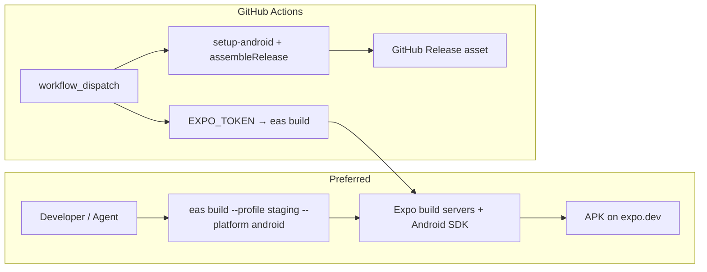

# Stage Android APK: EAS (preferred) и GitHub Actions

Как собрать **staging APK** для проверки Google pollen heatmap (`EXPO_PUBLIC_POLLEN_HEATMAP=google`), когда в Cursor Cloud VM **нет Android SDK**.

Связанные документы: [`eas-staging-build.md`](./eas-staging-build.md) · [`android-local-build.md`](./android-local-build.md) · [`yandex-pollen-map-integration.md`](./yandex-pollen-map-integration.md) §4.5–4.6 · GCP keys ops в том же §4.6.5.

---

## Рекомендация

| Путь | Когда | Нужен SDK на машине агента? |
|------|--------|-----------------------------|
| **A. EAS Build (preferred)** | Stage / pollen heatmap / closed beta | **Нет** — SDK на серверах Expo |
| **B. GitHub → EAS** | CI/CD, кнопка «Run workflow» | **Нет** — runner только вызывает `eas build` |
| **C. GitHub → Gradle** | Нужен APK как GitHub Release asset без Expo cloud | **Да** — `android-actions/setup-android` на runner |
| D. Локально / Cursor VM | Dev с Android Studio | Да (`ANDROID_HOME`) — см. [`android-local-build.md`](./android-local-build.md) |

**Для настоящего stage heatmap выбирайте A или B.**  
Не ставьте полный Android SDK в Cursor Cloud ради одной проверки — это хрупко и медленно.



---

## A. EAS Build (самый простой путь)

### Предпосылки

1. Staging API жив: `curl -sf https://api.staging.aclearo.com/api/health`
2. На API: `POLLEN_HEATMAP_ENABLED=true` + `GOOGLE_POLLEN_API_KEY` (server-only)
3. Expo: `eas login`, реальный `extra.eas.projectId` в `app.json`
4. EAS project secret (не в git):

```bash
cd apps/mobile
pnpm exec eas secret:create --scope project --name EXPO_PUBLIC_GOOGLE_MAPS_API_KEY --value "YOUR_MAPS_KEY" --type string
```

Профиль `staging` уже задаёт `EXPO_PUBLIC_POLLEN_HEATMAP=google` и `EXPO_PUBLIC_API_URL` в [`eas.json`](../apps/mobile/eas.json).

### Команда

```bash
pnpm install
cd apps/mobile
pnpm build:staging:android
# = eas build --profile staging --platform android
```

Или скрипт: `./scripts/first-staging-build.sh`.

### Результат

- APK на [expo.dev](https://expo.dev) → Project → Builds
- Internal distribution / QR
- Google Maps key попадает в native config через `app.config.js` на этапе EAS build

### Smoke heatmap после установки

1. Карта → **Пыление**
2. Google basemap + UPI слой (не Яндекс)
3. Один OM-бейдж (Точка / Город / Регион)
4. Tile proxy: `GET /api/pollen/heatmap/TREE_UPI/6/38/20` → PNG

---

## B. GitHub Actions → EAS (рекомендуемый CI-вариант)

Workflow: [`.github/workflows/eas-staging-android.yml`](../.github/workflows/eas-staging-android.yml)

### Secrets в GitHub repo

| Secret | Назначение |
|--------|------------|
| `EXPO_TOKEN` | [expo.dev → Access tokens](https://expo.dev/settings/access-tokens) — bot/CI token |
| *(опционально)* sync Maps key в EAS Secrets заранее | Ключ лучше держать в **EAS project secrets**, не дублировать в GH |

Уже используется тот же `EXPO_TOKEN` в [`deploy-staging-yandex.yml`](../.github/workflows/deploy-staging-yandex.yml) (`mobile-android` job).

### Запуск

1. Actions → **EAS staging Android** → **Run workflow**
2. Дождаться job → ссылка на build в логе / expo.dev
3. Скачать APK с Expo

Runner **не** ставит Android SDK; только `pnpm install` + `eas build --non-interactive`.

### Когда выбирать B вместо ручного A

- Нужна воспроизводимая кнопка для QA
- Нет локального `eas login` у тестировщика
- Хотите привязать к merge в `staging` / label (можно расширить `on:` в workflow)

---

## C. GitHub Actions → Gradle (альтернатива без Expo cloud)

Подходит, если нужен **файл APK в GitHub Releases** и вы готовы к более долгому job (скачивание SDK на runner).

Базовый шаблон уже есть: [`.github/workflows/release-apk.yml`](../.github/workflows/release-apk.yml) (preview/tag).  
Для **staging + Google Maps** используйте [`.github/workflows/staging-apk-gradle.yml`](../.github/workflows/staging-apk-gradle.yml).

### Отличия от EAS

| | EAS (A/B) | Gradle on GitHub (C) |
|--|-----------|----------------------|
| Android SDK | у Expo | ставит `android-actions/setup-android` |
| Google Maps key | EAS secret / `app.config.js` | GH secret → env → `app.config.js` / manifest |
| Signing | EAS credentials | debug/release keystore в CI (сейчас debug-подобный preview) |
| Время | обычно стабильнее | 10–25+ мин на cold SDK |
| iOS | тот же EAS профиль | **не** покрывает iOS |

### Secrets для C

| Secret | Назначение |
|--------|------------|
| `EXPO_PUBLIC_GOOGLE_MAPS_API_KEY` | Maps Android key (package + SHA-1 debug/CI) |
| *(опционально)* `GOOGLE_POLLEN` уже на API | клиент бьёт в `api.staging.aclearo.com` |

### Ограничения C

1. SHA-1 debug keystore CI ≠ Play App Signing — Maps key restriction должен включать CI SHA-1 **или** используйте отдельный unrestricted-for-API-only stage key с package restriction.
2. Не заменяет EAS для TestFlight / единообразного staging канала.
3. JDK: **17** (как в [`android-local-build.md`](./android-local-build.md)), не 21.

---

## Что не делать

- Не собирать APK в Cursor Cloud без `ANDROID_HOME` — будет `SDK location not found`.
- Не класть `GOOGLE_POLLEN_API_KEY` в EAS/`EXPO_PUBLIC_*`.
- Не включать heatmap на production EAS profile, пока нет GCP budget + device QA.

---

## Чеклист ops перед первой stage-сборкой

- [ ] GCP billing + enabled APIs (Maps Android/iOS/JS + Pollen)
- [ ] Restricted Maps key(s) + server Pollen key
- [ ] API staging: `POLLEN_HEATMAP_ENABLED=true`, health `features.pollenHeatmap: true`
- [ ] EAS secret `EXPO_PUBLIC_GOOGLE_MAPS_API_KEY`
- [ ] GitHub secret `EXPO_TOKEN` (для пути B)
- [ ] `eas build` или Actions → **EAS staging Android**
- [ ] Device smoke: Google map + UPI + OM badge

---

## Связанные файлы

| Файл | Роль |
|------|------|
| [`apps/mobile/eas.json`](../apps/mobile/eas.json) | profile `staging` |
| [`apps/mobile/app.config.js`](../apps/mobile/app.config.js) | inject Maps key в android/ios config |
| [`.github/workflows/eas-staging-android.yml`](../.github/workflows/eas-staging-android.yml) | GH → EAS |
| [`.github/workflows/staging-apk-gradle.yml`](../.github/workflows/staging-apk-gradle.yml) | GH → Gradle |
| [`.github/workflows/release-apk.yml`](../.github/workflows/release-apk.yml) | tag/preview Gradle release |
| [`.github/workflows/deploy-staging-yandex.yml`](../.github/workflows/deploy-staging-yandex.yml) | полный stage deploy + optional EAS mobile |
