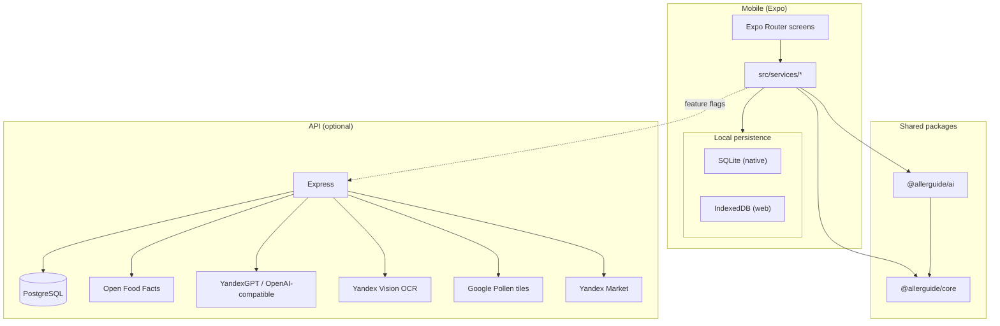
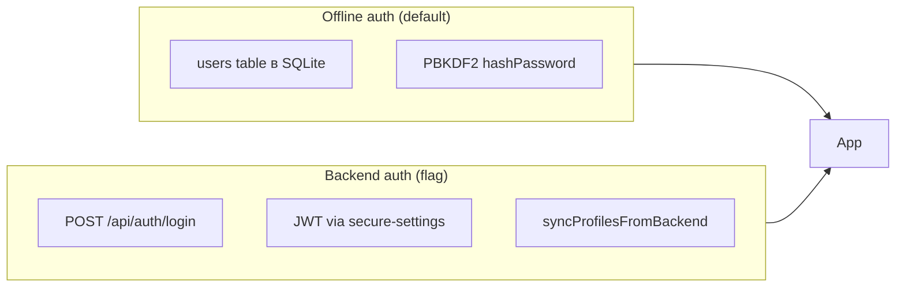

# AllerGuide — архитектура

AllerGuide — offline-first приложение для управления аллергией (Expo / React Native, Web + native). Пользовательский интерфейс на русском и ещё пяти языках. Ядро продукта работает **без сети**: профили, дневник, SOS, сканер (mock/keyword + опционально LLM), PDF-отчёты. Backend (`apps/api`) — **опциональный**: JWT-аутентификация, каталог продуктов, LLM-скан, OCR, поиск состава, карта пыления, маркетплейс, облачный бэкап.

Репозиторий — **pnpm workspaces + Turborepo** monorepo.

> **Правила разработки:** при написании кода обязательно следовать [`docs/development-rules.md`](./development-rules.md). Этот документ описывает *что* и *как устроено*; правила — *куда класть код* и *что запрещено*.  
> **Навигация по файлам:** [`docs/codebase-index.md`](./codebase-index.md) — карта экранов, сервисов, пакетов и таблица «куда менять X».

---

## Содержание

1. [Структура monorepo](#структура-monorepo)
2. [Высокоуровневая схема](#высокоуровневая-схема)
3. [Mobile-приложение](#mobile-приложение)
4. [Локальное хранилище данных](#локальное-хранилище-данных)
5. [Сканер: сквозной поток](#сканер-сквозной-поток)
6. [Аутентификация и сессии](#аутентификация-и-сессии)
7. [Backend API](#backend-api)
8. [Shared-пакеты](#shared-пакеты)
9. [Интернационализация (i18n)](#интернационализация-i18n)
10. [CI и деплой](#ci-и-деплой)
11. [Наблюдаемость](#наблюдаемость)
12. [Масштабирование](#масштабирование)
13. [Переменные окружения](#переменные-окружения)

**План MVP → prod (Phase 1–2):** детальные GitHub issues с зависимостями — [`docs/phase1-phase2-issues.md`](./phase1-phase2-issues.md) · сводка фаз — [`docs/roadmap-to-prod.md`](./roadmap-to-prod.md).

**Карта (Google + пыление + POI):** единый экран [`apps/mobile/app/(tabs)/map.tsx`](../apps/mobile/app/(tabs)/map.tsx) — слои **Пыльца / Качество воздуха / Места**; выбор аллергена в модалке под слоем «Пыльца», Google basemap + pollen/UAQI heatmap (флаги), multi-day прогноз, UPI, пины ресторанов/клиник. Реестр клиник АДАИР (`packages/core/src/data/adair-registry.json`, координаты Nominatim/OSM + телефоны) всегда подмешивается на слой «Места» отдельными метками; чип «АДАИР» не уходит в Google Places. По умолчанию включены только «АДАИР» и «Клиники». Выбор basemap — [`resolveMapBasemap`](../apps/mobile/src/services/map-basemap.ts): Google primary при валидном `AIza…` `EXPO_PUBLIC_GOOGLE_MAPS_API_KEY` + (`EXPO_PUBLIC_GOOGLE_MAP_PRIMARY` / `EXPO_PUBLIC_POLLEN_HEATMAP=google`); иначе `EXPO_PUBLIC_YANDEX_MAP_INTERACTIVE` (JS embed через API); иначе статичный Yandex overview. Если native Google MapView не загрузил тайлы (пустой бежевый canvas — нет ключа в Manifest / SHA-1), экран переключается на Yandex interactive. Gradle читает ключ из process env и Expo `.env` (EAS Environments), иначе `geo.API_KEY` пустой при живом JS-ключе. EAS `preview`/`staging` Android подписывается тем же debug.keystore, что Gradle CI (SHA-1 в [`gcp-pollen-maps-keys.md`](./gcp-pollen-maps-keys.md) §5.2) — иначе Google MapView серый. При `EXPO_PUBLIC_MAP_POLLEN_GOOGLE_PRIMARY` числа/прогноз карты — Google Pollen (wellness остаётся на Open-Meteo; nearby — OM secondary); при `EXPO_PUBLIC_MAP_POLLEN_PLUME` — geo-шлейф (Circle/Polyline) + hourly wind/pollen series + refresh 15 мин. Атрибуция ToS под картой; analytics `map_pollen_*`; ops `GET /api/ops/map-pollen-health` / `pnpm map-pollen-ops-check`. План — [`docs/interactive-pollen-map-plan.md`](./interactive-pollen-map-plan.md) · Phase 4 — [`docs/yandex-interactive-basemap-spike.md`](./yandex-interactive-basemap-spike.md). Ключи GCP — [`docs/gcp-pollen-maps-keys.md`](./gcp-pollen-maps-keys.md). Stage APK: [`docs/android-stage-build.md`](./android-stage-build.md).

---

## Структура monorepo

```
/
├── apps/
│   ├── mobile/          # Expo Router — основной продукт (Web + iOS + Android)
│   └── api/             # Express + Drizzle + PostgreSQL (опционально)
├── packages/
│   ├── core/            # Доменная логика, типы, справочники (без React)
│   ├── ai/              # Сканер, OCR, scan-intent, search-ingredients, LLM
│   └── ui/              # Общие RN-компоненты (минимальный набор)
├── docs/                # Архитектура, QA, деплой, клинические фичи
├── scripts/             # Staging smokes, YC Lockbox/deploy, APK helpers, RC-gate
├── .github/workflows/   # CI, YC staging deploy, EAS/APK, Maestro
├── turbo.json           # Граф задач Turborepo (build, lint, typecheck, test)
└── package.json         # Корневые скрипты: pnpm typecheck | test | lint | rc-gate
```

### Граф зависимостей

| Пакет | Зависит от |
|-------|------------|
| `apps/mobile` | `@allerguide/core`, `@allerguide/ai`, `@allerguide/ui` |
| `apps/api` | `@allerguide/core`, `@allerguide/ai` |
| `@allerguide/ai` | `@allerguide/core` |
| `@allerguide/ui` | React Native (peer) |

**Правило:** вся бизнес-логика, не привязанная к UI или HTTP, живёт в `packages/core`. Сканирование, OCR, intent/search — в `packages/ai`. Mobile и API — тонкие адаптеры (экраны, сервисы, маршруты).

---

## Высокоуровневая схема



**Режимы работы:**

| Режим | Описание |
|-------|----------|
| **Offline (по умолчанию)** | Local DB + keyword-сканер из `@allerguide/ai` |
| **+ Backend auth** | JWT, профили на сервере, dual-write с локальной копией — [ADR 001](adr/001-dual-write.md) |
| **+ Product DB** | Штрихкод: Postgres-каталог → локальный cache → OFF |
| **+ AI scan** | LLM через `POST /api/scan` с кэшем и дневным бюджетом |
| **+ YC OCR** | Vision OCR через `POST /api/ocr` (offline demo fallback) |
| **+ Scan intent** | Классификация OCR: label/menu vs visual product (`POST /api/scan/intent`) |
| **+ Search ingredients** | Yandex Search API при промахе OFF/каталога (`POST /api/search/ingredients`) |
| **+ Cloud sync** | AES-GCM бэкап на сервер (zero-knowledge) |
| **+ Pollen heatmap** | Google Maps + pollen tiles (fallback: Yandex / Open-Meteo) |

Все опции включаются **флагами** (см. [Переменные окружения](#переменные-окружения)); в `.env.example` всё выключено.

---

## Mobile-приложение

Каталог: `apps/mobile/`. Стек: Expo 55, React Native 0.83, Expo Router 55, Zustand, expo-sqlite / IndexedDB. New Architecture обязательна (SDK 55+).

### Слои

```
index.js / entry.js   # Два JS-входа (см. ниже) → src/install-runtime
app/                  # Экраны (Expo Router, file-based routing)
src/components/       # Переиспользуемые UI-компоненты
src/services/         # Оркестрация, локальная БД, API-клиенты
src/db/               # Инициализация БД, миграции, web-store
src/store/            # Глобальный UI-state (Zustand)
src/i18n/             # Локализация (6 языков)
src/constants/        # Feature flags, тема, типографика, бренд
src/hooks/            # Тема, шрифты, адаптив, wizard
src/utils/            # confirm-диалоги, fetch-with-timeout, yield-to-render
src/stubs/            # Metro-заглушки для web/native
src/modules/marketplace/  # UI вкладки Market
metro.config.js       # Monorepo resolution, web-stubs (i18next, crypto)
```

Экраны **не** обращаются к БД напрямую — только через `src/services/*`.

### Точка входа и runtime-патчи

Входов **два**, и оба обязаны применить одни и те же патчи:

| Вход | Кто использует | Содержимое |
|------|----------------|------------|
| `index.js` | Gradle (`entryFile` в `android/app/build.gradle`) — native release | `install-runtime` → `@expo/metro-runtime` → `ExpoRoot` |
| `entry.js` | Expo CLI (dev, web, EAS) через `package.json` `main` | `install-runtime` → `expo-router/entry` |

`src/install-runtime.ts` подключает `install-crypto-get-random-values` (CSPRNG из `expo-crypto`; `@noble/hashes` кэширует `globalThis.crypto` на импорте, а в Hermes его нет) и `install-password-hash-cost` (стоимость PBKDF2 для интерпретатора без JIT). Патч, добавленный только в один вход, на другом движке молча не сработает — инвариант закреплён в `scripts/maestro-ci-check.test.mjs`.

### Роутинг (Expo Router)

**Bootstrap** (`app/index.tsx`):

1. `initDb()` — создание таблиц / загрузка IndexedDB
2. `restoreAuthSession()` — гидратация токена из SecureStore / settings и **await** `syncProfilesFromBackend` (при backend auth)
3. Проверка `isAuthenticated()` → иначе `/login`
4. `refreshProfilesFromBackend()` + `ensureActiveProfileLoaded({ preferSelf: true })` — активный профиль сразу в store; при нескольких профилях выбирается родитель (`self`)
5. `resolveAuthedBootstrapRoute()` из `@allerguide/core` (intro + onboarding + home)

**Стек аутентификации и onboarding:**

| Маршрут | Назначение |
|---------|------------|
| `login.tsx`, `register.tsx` | Локальная или backend-аутентификация |
| `forgot-password.tsx`, `reset-password.tsx` | Сброс пароля (backend) |
| `onboarding-intro.tsx` | Вводная карусель |
| `onboarding.tsx` | Выбор сценария: `self` / `child` / `both` |
| `profile-setup.tsx` | Мастер создания профиля |
| `profile-edit.tsx` | Редактирование профиля |
| `profile.tsx` | Хаб аккаунта: профили, тема, язык, бэкап, lock, регион пыления |
| `profiles.tsx`, `settings.tsx` | Legacy — `<Redirect href="/profile" />` |

**Вкладки** (`app/(tabs)/_layout.tsx`) — все видимы:

| Вкладка | Файл | Функция |
|---------|------|---------|
| Главная | `home.tsx` | `ScreenBrandHeader`, двухслойный wellness, plain-language insights, reminder терапии |
| Дневник | `diary.tsx` | «Новая запись» (picker → секция), «Настроить курс» (терапия/АСИТ), история; карточки астмы/насекомых/лекарств при gating |
| Сканер | `scanner.tsx` | Штрихкод, OCR, ручной ввод |
| Маркет | `market.tsx` | Safe-product marketplace (Yandex Market) |
| Карта | `map.tsx` | Пыление / места (Yandex; опц. Google heatmap) |
| SOS | `sos.tsx` | Emergency-only: паспорт и контакты только для чтения |

**Дополнительные экраны (stack):** `about.tsx`, `notifications.tsx`, `expert.tsx`, `doctor-report.tsx`, `clinical-scales.tsx`, `asit-course.tsx`, `prescribed-therapy.tsx`, `asthma-action-plan.tsx`, `insect-action-plan.tsx`, `food-drug-registry.tsx`, `sos-edit.tsx` (вход из `/profile`), `legal/terms.tsx`, `legal/privacy.tsx`.

### Onboarding

Сценарий `both` запускает **двухшаговый wizard**: профиль «Я» → профиль «Ребёнок». Логика в `@allerguide/core`:

- `getWizardStep()` — какой шаг мастера сейчас
- `resolveBootstrapRoute()` / `resolveAuthedBootstrapRoute()` — куда направить после splash
- `shouldCompleteOnboarding()` — когда считать onboarding завершённым

Флаги хранятся в `app_settings`: `onboardingComplete`, `introComplete`, `scenario`.

### Профили

CRUD в `profile-service.ts`: создание, список, редактирование (`/profile-edit`), удаление с каскадом дневника. Хаб — `/profile`. Профили привязаны к `userId` (миграция схемы v2 на native). При `BACKEND_AUTH_ENABLED` — dual-write с `/api/profiles`.

### Глобальное состояние (Zustand)

| Store | Файл | Содержимое |
|-------|------|------------|
| App | `store/app-store.ts` | `scenario`, `activeProfileId`, `activeProfile` |
| Locale | `store/locale-store.ts` | `locale`, хук `useTranslation()` → `t()`, `content()` |
| Theme | `store/theme-store.ts` | `light` / `dark` / `system` |

Основные данные (профили, дневник, история сканов) — в SQLite/IndexedDB, не в Zustand.

### Ключевые сервисы (`src/services/`)

| Сервис | Роль |
|--------|------|
| `scanner-service.ts` | Баррель: реэкспорт barcode / OCR / VL оркестраторов (публичный API экрана) |
| `scan-analysis.ts` | Общий анализ: `analyzeText` → `runSmartScan` + analytics, `ScanResultExtended`, `ScanCloudAuthError` |
| `scanner-barcode-service.ts` | `scanBarcode` / `scanText` → lookup → анализ состава → история |
| `scanner-ocr-service.ts` | `extractOcrFromImage`, `scanFromOcr` (intent → dish/search → анализ), menu/label |
| `scanner-dish-vision-service.ts` | VL: `scanFromDishVision`, `tryDishVisionFirst`, `DishVisionScanError` |
| `barcode-lookup-service.ts` | Каталог → local cache → OFF (`resolveProductByBarcode`) |
| `barcode-cache-service.ts` | Локальный кэш штрихкодов |
| `catalog-api.ts` / `catalog-cache-service.ts` | Backend catalog + offline snapshot |
| `open-food-facts-service.ts` | Прямой OFF v2 с клиента |
| `scan-intent-api-service.ts` | `POST /api/scan/intent` (+ heuristic fallback в `@allerguide/ai`) |
| `search-ingredients-api-service.ts` | `POST /api/search/ingredients` |
| `scanner-dish-lookup-service.ts` | Обогащение состава блюда (OFF + search) |
| `ocr-api-service.ts` | Cloud Vision OCR через `/api/ocr` |
| `scan-history-service.ts` | Локальная история сканов |
| `profile-service.ts` | CRUD профилей, миграция legacy → userId |
| `auth-service.ts` | Локальные users **или** backend JWT |
| `token-session.ts` | Access JWT (web: память; native: SecureStore) + refresh rotation |
| `backend-api.ts` / `api-client.ts` | Обёртки `/api/auth/*`, `/api/profiles/*` |
| `secure-settings-service.ts` | SecureStore (native) / settings (web) для token, recovery key |
| `sync-service.ts` / `sync-restore.ts` | Шифрованный облачный бэкап |
| `backup-crypto.ts` / `backup-file-service.ts` | AES-GCM + локальные файлы бэкапа |
| `diary-service.ts` (+ section/context/attachment) | Дневник |
| `home-insights-service.ts` | Инсайты на главной (`@allerguide/core` `home-insights`; без пользовательских ACT/ARIA/GINA) |
| `wellness-service.ts` | Wellness score + `wellness-display` (словесные категории) |
| `diary-auto-metadata-service.ts` | Скрытые pollen/scan/meds metadata при save. Грузятся в фоне: визард дневника открывается сразу, без ожидания сети |
| `pollen-map-service.ts` / `pollen-heatmap-service.ts` | Open-Meteo + Google pollen tiles |
| `location-service.ts` / `place-service.ts` | Гео / POI (`EXPO_PUBLIC_MAP_PLACES` / catalog + bundled ADAIR overlay on live and fallback) |
| `market-api.ts` | Market catalog + Yandex offer resolve |
| `market-catalog-cache-service.ts` | Last-good Market snapshot (SQLite / IndexedDB) |
| `product-service.ts` | online → cache → seed + локальный аллергенный фильтр |
| `asit-*-service.ts`, `prescribed-therapy*-service.ts` | АСИТ / терапия + напоминания |
| `asthma-action-plan-service.ts`, `insect-action-plan-service.ts`, `food-drug-registry-service.ts` | Клинические планы |
| `doctor-report-service.ts` | PDF-отчёт для врача |
| `sos-passport-service.ts`, `emergency-contact-service.ts` | SOS и контакты |
| `notification-*-service.ts` | Permissions, copy, deep-links, reconcile |
| `analytics-service.ts` | Opt-in аналитика (`ANALYTICS_EVENT_NAMES`) |
| `error-reporting.ts` | `@sentry/react-native` при `EXPO_PUBLIC_SENTRY_DSN` |

Полный список — [`codebase-index.md`](./codebase-index.md).

### Feature flags (mobile)

Файл: `src/constants/features.ts` (основные). Часть флагов читается напрямую в сервисах.

| Константа / место | Env | Эффект |
|-------------------|-----|--------|
| `BACKEND_AUTH_ENABLED` | `EXPO_PUBLIC_BACKEND_AUTH` | JWT + серверные профили |
| `PRODUCT_DB_ENABLED` | `EXPO_PUBLIC_PRODUCT_DB` | Каталог на backend до OFF |
| `AI_SCAN_ENABLED` | `EXPO_PUBLIC_AI_SCAN_ENABLED` | LLM через `/api/scan` |
| `AI_DISH_VISION_ENABLED` | `EXPO_PUBLIC_AI_DISH_VISION` | Multimodal фото блюда → `/api/scan/dish-vision` |
| `MEDICINE_DB_ENABLED` | `EXPO_PUBLIC_MEDICINE_DB` | Фото упаковки / голос → `/api/medicines/recognize` |
| `YC_OCR_ENABLED` | `EXPO_PUBLIC_YC_OCR` | Vision OCR через `/api/ocr` |
| `YC_SCAN_INTENT_LLM_ENABLED` | `EXPO_PUBLIC_YC_SCAN_INTENT_LLM` | LLM intent через `/api/scan/intent` |
| `YC_SEARCH_ENABLED` | `EXPO_PUBLIC_YC_SEARCH` | Search ingredients через `/api/search/ingredients` |
| `DISH_LLM_ENABLED` | `EXPO_PUBLIC_DISH_LLM` | LLM resolve блюда через `/api/dishes/resolve` (local/dev **off**; staging **on**) |
| `YC_STT_ENABLED` | `EXPO_PUBLIC_YC_STT` | SpeechKit STT через `/api/stt` (default off) |
| `YC_STT_MIC_ENABLED` | `EXPO_PUBLIC_YC_STT` + `EXPO_PUBLIC_YC_STT_MIC` | Cloud mic (`expo-audio` → `/api/stt`); staging on after SDK 54 |
| `CLOUD_SYNC_ENABLED` | `EXPO_PUBLIC_CLOUD_SYNC` | Облачный бэкап |
| `GOOGLE_POLLEN_HEATMAP_ENABLED` | `EXPO_PUBLIC_POLLEN_HEATMAP=google` | Google Maps + pollen tiles + forecast proxy |
| `GOOGLE_MAP_PRIMARY_ENABLED` | `EXPO_PUBLIC_GOOGLE_MAP_PRIMARY` | Google как primary basemap единого map UX |
| `MAP_PLACES_ENABLED` | `EXPO_PUBLIC_MAP_PLACES` / `EXPO_PUBLIC_LIVE_MAP` (default **on**; `false`/`off` disables) | Live Places API (New): Nearby, Autocomplete, Text Search, Details через API |
| `AIR_QUALITY_GOOGLE_ENABLED` | `EXPO_PUBLIC_AIR_QUALITY` (default **on**; `false`/`off` disables) | Google Air Quality (UAQI + советы) через API proxy |
| `MARKET_LIVE_CATALOG_ENABLED` | `EXPO_PUBLIC_MARKET_LIVE_CATALOG` (default **on**; `false`/`off` disables) | `GET /api/market/catalog` only when payload is curated `MarketplaceProduct`; legacy `CatalogProduct` / empty → last-good / seed |
| `MARKET_MEDICINES_ENABLED` | `EXPO_PUBLIC_MARKET_MEDICINES` (default **on**; `false`/`off` disables) | OTC-аптечные карточки на Маркете |
| `analytics-service.ts` | `EXPO_PUBLIC_ANALYTICS_ENABLED` | Product analytics |
| `error-reporting.ts` | `EXPO_PUBLIC_SENTRY_DSN` | Crash reporting |

По умолчанию флаги **false** / `off` (см. `.env.example`), кроме **Places** и **Air Quality** — они включены, пока явно не выключены (`false` / `off`). На API те же два флага default-on; без ключей health остаётся `false`.

---

## Локальное хранилище данных

Приложение **offline-first**: сеть нужна только для опциональных фич.

### Платформенное разрешение

Импорт всегда `@/src/db/init`. Metro/Expo выбирает реализацию:

| Платформа | Файл | Движок |
|-----------|------|--------|
| iOS / Android | `init.native.ts` | `expo-sqlite` → `allerguide.db` |
| Web | `init.ts` | `WebDb` — SQL-подобный API поверх JSON в IndexedDB |

### Таблицы (native SQLite)

Базовые CREATE в `init.native.ts`, инкременты — в `migrations.ts`:

| Таблица | Назначение |
|---------|------------|
| `profiles` | Профили (`userId`, `allergies`, `allergyConfirmations`, `crossReactionAllergies`, …) |
| `diary_entries` | Записи дневника |
| `diary_attachments` | Фото к записям (v8) |
| `scan_history` | История сканирований |
| `app_settings` | KV: onboarding, locale, theme (не секреты на native) |
| `users` | Локальные учётные записи (offline auth) |
| `emergency_contacts` | Экстренные контакты по profileId |
| `profile_sos` | SOS-заметки |
| `barcode_cache` | Кэш штрихкодов (v3+) |
| `catalog_allergen_snapshot` / `catalog_products` | Offline snapshot каталога (v5+) |
| `alias_feedback` | Локальная очередь alias feedback (v6) |
| `safe_products` | Отмеченные «безопасные» продукты (v7) |
| `market_catalog_snapshot` | Last-good снапшот каталога Маркета (v10) |

### Web (IndexedDB)

`src/db/web-store.ts`:

- Store `allerguide` / `kv` с in-memory кэшем
- Синхронный API (`loadJson` / `saveJson`) + асинхронная фоновая запись (debounce)
- Одноразовая миграция из устаревшего `localStorage`
- `KNOWN_KEYS`: `ag_profiles`, `ag_diary`, `ag_scan_history`, `ag_barcode_cache`, `ag_profile_sos`, `ag_settings`, `ag_users`, `ag_emergency_contacts`
- Дополнительно через `init.ts`: `ag_safe_products`, `ag_diary_attachments`

`WebDb` (`init.ts`) парсит SQL-строки и маршрутизирует к JSON-коллекциям — тот же интерфейс `DbLike`, что и у SQLite.

### Миграции (`migrations.ts`)

- `CURRENT_SCHEMA_VERSION = 10`
- v1: `schema_version`
- v2: `profiles.userId` (multi-user)
- v3: `barcode_cache`
- v4: нормализация JSON `allergies`
- v5: `allergyConfirmations` + catalog snapshot/products
- v6: allergen ids / `trace_tags` + `alias_feedback`
- v7: `safe_products`
- v8: `diary_attachments`
- v9: `profiles.crossReactionAllergies`
- v10: `market_catalog_snapshot`
- **Только native** — на web схема неявная в ключах JSON

### Облачный бэкап

Клиент собирает `SyncPayload` (`@allerguide/core`), шифрует AES-GCM (`backup-crypto.ts`), загружает на `POST /api/sync/backup`. Сервер хранит opaque blob — **zero-knowledge**. Cross-device restore — через recovery key (12 слов); см. [Backend → Облачная синхронизация](#облачная-синхронизация-routessyncts).

---

## Сканер: сквозной поток

### Режимы

| Режим | UI | Ввод |
|-------|-----|------|
| `product` | Камера штрихкода / ручной текст | EAN/UPC или состав |
| `menu` | Фото меню | OCR (Vision/demo) или ручной ввод |
| `medicine`, `cosmetics` | Фото упаковки | OCR (Vision/demo) или ручной ввод |

### Диаграмма потока (штрихкод)

```mermaid
sequenceDiagram
  participant UI as scanner.tsx
  participant SS as scanner-service
  participant BL as barcode-lookup
  participant CAT as catalog-api
  participant CACHE as barcode-cache
  participant OFF as Open Food Facts
  participant AI as runSmartScan
  participant LLM as POST /api/scan

  UI->>SS: scanBarcode(barcode, profile)
  SS->>BL: resolveProductByBarcode
  alt PRODUCT_DB_ENABLED
    BL->>CAT: GET /api/products/:barcode
  end
  alt catalog miss
    BL->>CACHE: lookup local cache
  end
  alt cache miss / stale
    BL->>OFF: fetchProductByBarcode
    OFF-->>BL: name, ingredients, tags
  end
  alt продукт не найден
    SS->>AI: analyzeText(barcode as text)
    SS-->>UI: lookupFailed: true
  else продукт найден
    SS->>AI: analyzeText(ingredients)
    alt AI_SCAN_ENABLED
      AI->>LLM: POST /api/scan
      LLM-->>AI: structured verdict
    else LLM off / fail
      AI->>AI: runMockScan (keywords + cross-reactions)
    end
    SS->>SS: saveScanHistory
    SS-->>UI: ScanResult + source
  end
```

### OCR / dish-vision поток (фото)

**Штрихкод** (`scanBarcode`) — отдельный путь: кэш → каталог → OFF → Open Beauty Facts → Open Products Facts.

**Умный сканер** (кнопка «Сканер», любое фото, `EXPO_PUBLIC_AI_DISH_VISION` on по умолчанию):

1. Сначала `POST /api/scan/dish-vision` (VL: название + вероятные ингредиенты) — только сеть, без записи истории
2. Затем `extractOcrFromImage` / `POST /api/ocr` — текст этикетки
3. Если OCR-текст ≥ порога (~40 символов) → **один** `analyzeText` по объединённому тексту (`buildCombinedScanText`: OCR первым, ингредиенты VL с дедупликацией); `source: 'ocr'`, `evidence: 'vl_ocr'`; UI: карточка блюда **и** состав
4. Если OCR вернул короткий сниппет этикетки → тот же объединённый путь (сниппет + VL)
5. Если текста нет → результат VL + disclaimer (`source: 'dish_vision'`, `evidence: 'vl'`); при сбое VL — явная ошибка (не пустой clear)
6. Если VL недоступен (нет сети / API) — прежний OCR-путь, `evidence: 'ocr'`. История и `scan_completed` / `scan_dish_vision` пишутся один раз на финальном результате

**Ручной ввод:** цифры 8–14 → `scanBarcode`; иначе `scanFromOcr` (нормализация состава, intent, справочник блюд).

### Анализ текста (`@allerguide/ai`)

1. **`runSmartScan`** — если задан `llmEndpoint` и сервер доступен → LLM; иначе fallback
2. **`runMockScan`** — keyword-match по аллергенам профиля + перекрёстные реакции из `@allerguide/core`
3. Уровни риска: `low` | `medium` | `high`
4. Дополнительно: `scan-intent.ts`, `search-ingredients.ts`, `prescription-ocr.ts`, `ocr.ts`

### Источники результата (`source`)

| Значение | Значение для пользователя |
|----------|---------------------------|
| `catalog_api` | Каталог backend (Postgres) |
| `barcodes_db` | Локальный / seed barcode DB |
| `openfoodfacts` | Open Food Facts |
| `openbeautyfacts` | Open Beauty Facts |
| `openproductsfacts` | Open Products Facts |
| `barcode` | Общий barcode-путь (UI) |
| `ocr` | Распознанный текст упаковки/меню |
| `llm` | Вердикт LLM-скана |
| `dish_vision` | Оценка блюда по фото (multimodal, без этикетки) |
| `manual` | Ручной ввод |

Тип в `@allerguide/ai` `scan.ts`: `'manual' | 'barcode' | 'openfoodfacts' | 'openbeautyfacts' | 'openproductsfacts' | 'barcodes_db' | 'catalog_api' | 'ocr' | 'llm' | 'dish_vision'`.

### Маппинг аллергенов

Внешние теги (OFF `en:milk`, датасет Food-Allergy) приводятся к канонической RU-таксономии через `mapExternalAllergenNames` в `@allerguide/core` — и при импорте в Postgres, и при write-through с OFF.

---

## Аутентификация и сессии

### Два пути на mobile



Хэш пароля — PBKDF2-SHA256 (`@allerguide/core` `password.ts`). Стоимость зависит от рантайма: 600k (`PASSWORD_HASH_ITERATIONS_JIT`) в Node/web, 50k (`PASSWORD_HASH_ITERATIONS_INTERPRETED`) на Hermes, где нет JIT и 600k блокируют JS-поток ~40 c. Значение записано в самом хэше, поэтому старые хэши проверяются, а при расхождении `verifyPassword` возвращает `upgradedHash`. Соль — `getSecureRandomBytes`; mobile инжектит expo-crypto из `src/install-runtime`, который импортируют оба JS-entry (`index.js` для Gradle и `entry.js` для Expo CLI/EAS/web).

| Режим | Хранение | Когда |
|-------|----------|-------|
| **Локальный** | `users` в SQLite/IndexedDB, `authUserId` в settings | `BACKEND_AUTH=false` |
| **Backend JWT** | Access: память + httpOnly cookie (web) / SecureStore (native). Refresh: httpOnly cookie (web) / SecureStore (native) | `BACKEND_AUTH=true` + `JWT_SECRET` на API |

Чувствительные ключи (`authToken`, `refreshToken`, `recoveryKey`, `backupSecret`, `recoveryKeyConfirmed`) **не** хранятся в SQLite на native — только SecureStore.

JWT: HS256 (`jose`), issuer `allerguide-api`, audience `allerguide-mobile`, access TTL 30 мин + opaque refresh 30 дней (`apps/api/src/lib/jwt.ts`). Ротация refresh — атомарный `UPDATE … WHERE revoked_at IS NULL`; повторно использованный токен отзывает всю семью. Браузерный `Origin` включает cookie-сессию: `ag_access` / `ag_refresh` (httpOnly, SameSite Lax на localhost и None+Secure на cross-site). JSON больше не отдаёт refresh web-клиенту. Native по-прежнему получает Bearer + refresh в теле.

### Dual-write policy (Phase 1)

При `BACKEND_AUTH_ENABLED` профили пишутся в API и локальную БД; дневник/SOS/сканер остаются локальными; облачный перенос — через encrypted backup. Подробно: [ADR 001: Offline-first dual-write](adr/001-dual-write.md).

---

## Backend API

Каталог: `apps/api/`. Express + Drizzle ORM + PostgreSQL. **Не обязателен** для core flows.

### Точка входа

- `src/index.ts` — HTTP-сервер: `PORT || API_PORT || 5000` (в `.env.example` задано `API_PORT=3001` для локальной разработки)
- `src/app.ts` — фабрика `createApp()`: middleware, маршруты, static/proxy

### Режимы отдачи

| Условие | Поведение |
|---------|-----------|
| `METRO_URL` задан | Proxy на Expo dev server |
| Иначе | Static `apps/mobile/dist` + SPA fallback |

### HTTP-маршруты

| Файл | Эндпоинты |
|------|-----------|
| `routes/mobile-auth.ts` | `POST /api/auth/register`, `login`, `refresh`, `logout`, `forgot-password`, `reset-password`; `GET verify-reset-token`, `me`, `export`; `DELETE account` |
| `routes/profiles.ts` | `GET/POST /api/profiles`, `GET/PATCH/DELETE /api/profiles/:id` (JWT) |
| `routes/catalog.ts` | `GET /api/allergens`, `GET /api/products/search?q=`, `GET /api/products/:barcode` |
| `routes/dishes.ts` | `GET /api/dishes/search`, `POST /api/dishes/resolve` |
| `routes/medicines.ts` | `POST /api/medicines/recognize`, `GET /api/medicines/search?q=`, `POST /api/medicines`, `DELETE /api/medicines/:name` |
| `routes/scan.ts` | `POST /api/scan` |
| `routes/scan-intent.ts` | `POST /api/scan/intent` |
| `routes/scan-dish-vision.ts` | `POST /api/scan/dish-vision` |
| `routes/ocr.ts` | `POST /api/ocr` (Yandex Vision) |
| `routes/search-ingredients.ts` | `POST /api/search/ingredients` |
| `routes/stt.ts` | `POST /api/stt` (SpeechKit) |
| `routes/sync.ts` | `POST /api/sync/backup`, `GET /api/sync/backup/:userId` |
| `routes/market.ts` | `GET /api/market/health`, `/api/market/catalog`, offers resolve / draft-search |
| `routes/pollen.ts` | `GET /api/pollen/heatmap/:mapType/:zoom/:x/:y`, `GET /api/pollen/forecast`, `GET /api/pollen/species-samples` |
| `routes/air-quality.ts` | `GET /api/air-quality/current`, `GET /api/air-quality/heatmap/:mapType/:zoom/:x/:y` |
| `routes/places.ts` | `GET /api/places/nearby`, `autocomplete`, `search`, `:placeId` |
| `routes/maps.ts` | `GET /api/maps/yandex-interactive`, `GET /api/maps/yandex-status` |
| `routes/alias-feedback.ts` | POST/GET/PATCH alias feedback |
| `routes/analytics.ts` | `POST /api/analytics/events`, `GET /api/ops/map-pollen-health`, dashboard |
| `routes/governance.ts` | `GET /api/governance` |
| — | `GET /api/health` |

Все маршруты регистрируются как `register*Routes(app)` прямо на корневом app — под-роутеров с префиксами нет.

### Middleware

| Файл | Функция |
|------|---------|
| `middleware/security.ts` | `helmet`, CORS allowlist (`CORS_ORIGINS`), rate-limit (global, `/api/auth`, `/api/scan` + `/api/ocr` + `/api/medicines`, `/api/pollen`, `/api/air-quality`, `/api/places` + autocomplete, `/api/maps`; Redis-стор при `REDIS_URL`); `RATE_LIMIT_DISABLED` для тестов |
| `middleware/require-jwt.ts` | Bearer JWT → `req.authUser` |

### Разделение БД на схемы (`profile` и `catalog`)

| Схема | Таблицы | Файл определения |
|-------|---------|------------------|
| **`profile`** | `app_users`, `profiles`, `diary_entries`, `scan_history`, `emergency_contacts`, `profile_sos`, `sync_backups`, `password_reset_tokens`, `refresh_tokens`, `medicine_overlays` | `src/db/app-schema.ts` |
| **`catalog`** | `allergens`, `cross_reactions`, `products`, `dishes`, `medicines`, `alias_feedback`, `market_products`, `market_offers` | `src/db/catalog-schema.ts` |
| **`public`** | unused leftover `users` / `sessions` (app does not use them) | `src/db/auth-schema.ts` |

Drizzle-объекты схемо-квалифицированы — код запросов не меняется. Справочные SQL-артефакты: `sql/profile.sql`, `sql/catalog.sql`. Живая БД — миграции в `drizzle/` (`0000`…`0013_*`).

### Каталог лекарств

- **Таблица:** `catalog.medicines`, дедуп по `normalized_name` (ё→е, без пунктуации). Нет user id и нет байтов фото. `aliases jsonb` — латинские/альтернативные названия (миграция `0011_medicines_aliases`).
- **Распознавание:** `POST /api/medicines/recognize` — lookup по имени/OCR/голосу (каталог + overlay вызывающего) → VL fallback (`AI_MEDICINE_VISION_ENABLED`). Общий каталог не пишет; JWT может сохранить карточку в overlay. Каталожный hit увеличивает `recognitions`.
- **Поиск:** `GET /api/medicines/search?q=` — общий каталог; с JWT дополнительно overlay вызывающего. Без LLM.
- **allergenTags:** канонические id, как у `catalog.products` (`mapExternalAllergenIds` в сиде).
- **Remember:** `POST /api/medicines` — JWT пишет только в `profile.medicine_overlays` (карточка видна лишь этому пользователю в search). `x-medicine-write-key` = `MEDICINE_WRITE_KEY` пишет в общий `catalog.medicines` (сид/куратор). Пустые поля не затирают уже известные. Без auth — 401.
- **Recognize:** lookup каталог + overlay вызывающего; VL/OCR не пишут в общий каталог (overlay — только при JWT).
- **Сид каталога:** `pnpm --filter api db:seed-medicines` — датасет `apps/api/data/medicines/` заливается через `POST /api/medicines` (`API_BASE_URL` + `MEDICINE_WRITE_KEY`), идемпотентно.
- **Curator cleanup:** `DELETE /api/medicines/:name` (та же авторизация) удаляет ошибочную/тестовую карточку по нормализованному имени.
- **Клиент:** `EXPO_PUBLIC_MEDICINE_DB` включает VL/фото; поиск и remember идут при заданном `EXPO_PUBLIC_API_URL`. При флаге off / ошибке — локальный `parseMedicineLabelText` / `parseMedicineVoiceUtterance` + ранее сохранённые записи дневника. Demo-карточка только для фото без OCR, не для голоса.

### Каталог продуктов

- **Сид аллергенов:** `db:seed-allergens` из `@allerguide/core`
- **Импорт штрихкодов:** `db:import-food-allergy` ← `data/food-allergy/`
- **Индексация** (`drizzle/0002_*`): `pg_trgm` + GIN по `name`, полнотекст по `ingredients`, GIN по `allergen_tags`
- **Write-through OFF:** при промахе `GET /api/products/:barcode` тянет товар из OFF и кэширует в `catalog.products` (`PRODUCT_OFF_FALLBACK`, default `true`)
- **Поиск:** `GET /api/products/search?q=` — локальный trigram/FTS, при пустом результате — OFF search

Чтения каталога идут в `readDb` (если задан `READ_DATABASE_URL`), записи — в primary `db`.

### AI-сканер (`routes/scan.ts`, `lib/scan-cache.ts`)

- Кэш результатов (ключ — хэш режима/текста/аллергенов)
- Дневной бюджет на user/IP; биллится только промах кэша
- `SCAN_REQUIRE_AUTH` — JWT для billable AI; в `NODE_ENV=production` при включённых AI-флагах API не стартует без `true`
- Провайдер: `AI_PROVIDER=yandex|openai` (default `openai`)
  - **yandex:** `YC_AI_API_KEY`, `YC_FOLDER_ID`, опционально `YC_GPT_MODEL` (default `yandexgpt-lite`)
  - **openai:** `OPENAI_API_KEY`, `OPENAI_BASE_URL`, `OPENAI_MODEL`
- Реализация: `services/llm-scan-provider.ts`

### Scan intent + search ingredients

| Route | Flag | Сервис |
|-------|------|--------|
| `POST /api/scan/intent` | `YC_SCAN_INTENT_LLM` | классификация OCR-сниппета (label/menu vs visual product) |
| `POST /api/search/ingredients` | `YC_SEARCH_ENABLED` | Yandex Search API → состав при промахе OFF/каталога (+ cache/budget) |
| `POST /api/dishes/resolve` | `DISH_LLM_ENABLED` + `AI_SCAN_ENABLED` | LLM-нормализация названия блюда + структурированный состав (local/dev **off**; staging **on**) |
| `POST /api/stt` | `YC_STT_ENABLED` | SpeechKit STT (Phase 3; default off) |

Доменная логика / нормализация — `@allerguide/ai` (`scan-intent.ts`, `search-ingredients.ts`); HTTP — `routes/scan-intent.ts`, `routes/search-ingredients.ts` + `services/yandex-search-ingredients.ts`.

### Vision OCR (`routes/ocr.ts`, `services/yandex-vision-ocr.ts`)

- `YC_OCR_ENABLED=true` + `YC_AI_API_KEY` / `YC_FOLDER_ID`
- Mobile: `EXPO_PUBLIC_YC_OCR` → `ocr-api-service`
- Offline fallback: demo OCR / ручной ввод

### Pollen heatmap (`routes/pollen.ts`)

- Proxy Google Pollen UPI tiles при `POLLEN_HEATMAP_ENABLED` + `GOOGLE_POLLEN_API_KEY`. Species heatmap spike: [`pollen-species-heatmap-spike.md`](./pollen-species-heatmap-spike.md) (**no-go**).
- Proxy Google Pollen Forecast (`GET /api/pollen/forecast`) и Places Nearby (`GET /api/places/nearby`)
- Mobile: `EXPO_PUBLIC_POLLEN_HEATMAP=google` + `EXPO_PUBLIC_GOOGLE_MAPS_API_KEY` (+ optional `EXPO_PUBLIC_GOOGLE_MAP_PRIMARY`, `EXPO_PUBLIC_MAP_PLACES`)
- Default / offline-safe: Yandex map + Open-Meteo через `pollen-map-service`

### Market (`routes/market.ts`)

- Каталог: `GET /api/market/catalog` из `catalog.market_products` (published) или bundled seed
- Импорт фидов: `YANDEX_MARKET_FEED_URL` (YML Дистрибуции) и опционально `MARKET_PHARMACY_FEED_*` (OTC only, draft)
- Affiliate resolve: `YANDEX_MARKET_CLID` / `OAUTH_TOKEN` / `ERID`
- Curator search снят (Affiliate `GET /search` 22.06.2026): `YANDEX_MARKET_CURATOR_SEARCH` оставить `false`
- Mobile: `EXPO_PUBLIC_MARKET_LIVE_CATALOG` + snapshot SQLite/IndexedDB; аллергенный фильтр только локально
- См. [`yandex-market-affiliate.md`](./yandex-market-affiliate.md)

### Облачная синхронизация (`routes/sync.ts`)

- Payload в `sync_backups` (in-memory fallback без БД)
- Auth: mobile JWT, когда задан `JWT_SECRET`. Legacy `SYNC_API_KEY` только без JWT (local/dev) и **не** обходит ownership
- Владение по `userId` из токена
- Клиент шифрует AES-GCM (Web Crypto или `@noble/ciphers` на native) до загрузки. Сервер принимает ciphertext только если `payload` проходит `isEncryptedEnvelope` (alg/kdf/iter/salt/iv/ct) и в теле нет plaintext-коллекций (`profiles`, дневник, SOS…). Persist — `{ v, userId, encrypted, exportedAt, payload }`, не весь body. Флага `encrypted: true` недостаточно. Staging: `SYNC_REQUIRE_ENCRYPTED=true`

#### Recovery key flow (cross-device restore)

1. **Setup:** при первой загрузке в облако (`CloudBackupCard`) пользователь создаёт recovery key (12 слов), подтверждает его и только после этого выполняется upload.
2. **Хранение:** ключ на устройстве (`backup-crypto.ts`, SecureStore / web settings); сервер получает только AES-GCM ciphertext.
3. **Legacy migration:** пользователи с device-only ключом видят modal `migrate` перед upload.
4. **Download на новом устройстве:** ввод recovery key → расшифровка → импорт в локальную БД.
5. **Banner:** `RecoveryKeyBanner` на профиле, если ключ создан, но не подтверждён.
6. **Account deletion:** mobile wipe + server cascade (`sync_backups.user_id → app_users.id ON DELETE CASCADE`).

Флаг: `EXPO_PUBLIC_CLOUD_SYNC=true` + API `SYNC_ENABLED=true`. Maestro: `staging-backup-smoke.yaml`.

### Production hardening

- **Безопасность:** helmet, строгий CORS, rate-limiting per-IP
- **Stateless JWT** для mobile — горизонтальное масштабирование API
- **Версионированные миграции:** `db:generate` → SQL в `drizzle/` (коммитится), `db:migrate` через drizzle migrator; `db:push` — только throwaway dev

### Postgres (Yandex Cloud Managed)

Слой БД (`src/db/index.ts`, `src/db/config.ts`). Staging cluster: [`infra/yandex/staging/postgresql.tf`](../infra/yandex/staging/postgresql.tf) (private IP, Odyssey на `:6432`).

| Аспект | Поведение |
|--------|-----------|
| **Runtime vs migrate** | Runtime: `DATABASE_URL`; миграции: `DIRECT_DATABASE_URL` (fallback — `DATABASE_URL`) |
| **Опции из env** | `DB_SSL=require` на YC; `DB_PREPARE=false` при пулере (порт 6432) |
| **Read replica** | `READ_DATABASE_URL` → `readDb` для каталога; иначе primary |
| **CI** | Integration tests — Postgres в GitHub Actions, не отдельный cloud-branch |
| **Cold start** | Ленивый синглтон подключения |

`migrate.ts` применяет версионированные SQL из `drizzle/` к `DIRECT_DATABASE_URL`.

---

## Shared-пакеты

### `@allerguide/core` (`packages/core/`)

Чистый TypeScript, Vitest. Публичная поверхность — `src/index.ts`. Основные области:

| Область | Модули (ориентиры) |
|---------|-------------------|
| Types / allergens | `types`, `allergens` (обёртка над `allergen-database`), `allergen-aliases`, `regulatory-allergens`, `catalog`, `barcodes`, `adair-catalog` |
| Profiles | `profile-allergens`, `allergy-confirmations`, `profile-validation`, `profile-setup-wizard`, `profile-condition-gating`, `profile-capabilities`, `condition-*`, `clinical-phenotypes` |
| Diary / home | `diary`, `diary-stats`, `diary-severity`, `diary-triggers`, `diary-profile`, `diary-wizard-route`, `voice-diary`, `home-insights`, `wellness-display` |
| Scan risk | `scan-risk`, `may-contain-parser`, `scan-trends`, `scan-history-matches`, `alias-feedback`, `dish-components`, `name-matching`, `inci-allergens` |
| Clinical | `gina-asthma`, `pef-zones`, `asthma-action-plan`, `asit-therapy`, `therapy-schedule`, `insect-allergy`, `food-drug-allergy`, `prescribed-therapy`, `clinical-scales`, `symptom-coding`, `icd10-reference`, `golden-clinical-scenarios` |
| SOS / reports | `emergency-contacts`, `allergy-passport`, `doctor-report*` |
| Pollen / geo / air / market | `pollen-*` (в т.ч. `pollen-upi`, `pollen-plume`, `pollen-google-*`), `google-pollen-heatmap`, `hourly-series`, `air-quality`, `geo`, `map-poi`, `yandex-map`, `market-offers`, `marketplace-catalog`, `wellness*` |
| Auth / sync | `auth`, `password`, `secure-random`, `phone`, `login-field`, `sync`, `crypto` |
| Ops / content | `onboarding`, `expert-content`, `evidence-registry`, `analytics-events`, `reminder-policy`, `medical-*`, `beta-metrics` |

### `@allerguide/ai` (`packages/ai/`)

| Модуль | Назначение |
|--------|------------|
| `scan.ts` | `runMockScan` — keyword + cross-reactions; тип `source` |
| `smart-scan.ts` | `runSmartScan`, LLM prompt/parse, fallback на mock |
| `ocr.ts` | Нормализация OCR-текста, demo capture |
| `scan-intent.ts` | Heuristic + нормализация intent (label/menu vs visual) |
| `scan-evidence.ts` | Свод VL-фото и OCR-текста в единый evidence |
| `search-ingredients.ts` | Нормализация ответа поиска состава |
| `dish-resolve.ts` | Промпт/парс LLM для названия блюда и типичного состава |
| `dish-vision.ts` | Промпт/парс VL: фото блюда → название + ингредиенты |
| `medicine-vision.ts` | Промпт/парс VL для упаковки лекарства |
| `medicine-label.ts` | Offline-парс этикетки и голосовой дозы |
| `prescription-ocr.ts` | Парсинг текста рецепта / АСИТ |

### `@allerguide/ui` (`packages/ui/`)

Минимальный набор: `PrimaryButton`, `Badge`. Экраны в основном используют локальные компоненты (`apps/mobile/src/components/`).

---

## Интернационализация (i18n)

Каталог: `apps/mobile/src/i18n/`. **Два стека** (важно для разработчиков):

### Основной — Zustand + typed messages

| Часть | Файлы |
|-------|-------|
| Типы | `types.ts` — `AppLocale` = `ru\|en\|es\|fr\|de\|it`, интерфейс `LocaleMessages` |
| UI-строки | `locales/{ru,en,es,fr,de,it}.ts` |
| Rich content | `content/{locale}.ts` — дневник, экспертные статьи, блоки отчёта |
| Хелперы | `translate.ts` — `localizeScanResult()`, маппинг ошибок |
| Хук | `store/locale-store.ts` → `useTranslation()` — **то, что используют экраны** |

Язык по умолчанию: **ru**. Сохраняется в `app_settings`.

### Legacy — i18next

`i18n/index.ts` — инициализация `i18next` + `react-i18next` (только ru/en). На native **заглушен** через `metro.config.js` (`src/stubs/i18next-stub.js`). Новые строки — только в typed Zustand-стеке.

---

## CI и деплой

### GitHub Actions (`.github/workflows/`)

| Workflow | Назначение |
|----------|------------|
| `ci.yml` | typecheck → lint → test; mobile test gate; API integration |
| `rc-gate.yml` | Phase 2 RC gate (cron + path-filtered PR) |
| `deploy-staging.yml` | Staging deploy на Yandex Cloud (push в `staging`) |
| `seed-staging-catalog.yml` | Сиды каталога на staging Postgres (self-hosted VPC runner) |
| `eas-staging-android.yml` | EAS staging Android |
| `staging-apk-gradle.yml` | Gradle APK на GitHub |
| `release-apk.yml` | Release APK |
| `maestro-nightly.yml` | Maestro E2E nightly |

Корневые проверки:

```bash
pnpm typecheck   # TypeScript во всех пакетах
pnpm test        # Vitest: core, ai, mobile, api
pnpm lint        # ESLint: mobile + api
pnpm rc-gate     # typecheck + lint + test + taxonomy + doc/Maestro checks
```

Инфраструктура staging описана как код в `infra/yandex/staging/*.tf`; прод-образ API собирается корневым `Dockerfile`.

### Stage / Yandex Cloud

Единственный хостинг API — **Yandex Cloud**. Stage: `https://api.staging.aclearo.com`.

- Runbook: [`staging-yandex-cloud.md`](./staging-yandex-cloud.md)
- Gates: [`yc-stage-gates.md`](./yc-stage-gates.md)

### Android APK

- Local Gradle: `docs/android-local-build.md`
- Stage без SDK: EAS (`docs/android-stage-build.md`, `docs/eas-staging-build.md`) или GitHub Actions
- Preview: `docs/eas-internal-preview.md` · profiles в `apps/mobile/eas.json`

---

## Наблюдаемость

| Компонент | Файл | Включение |
|-----------|------|-----------|
| Аналитика | `analytics-service.ts` | `EXPO_PUBLIC_ANALYTICS_ENABLED`, опц. `EXPO_PUBLIC_ANALYTICS_ENDPOINT` |
| События | `packages/core` `analytics-events.ts` | `screen_view`, `auth_*`, `profile_*`, `diary_*`, `scan_*`, `sync_*`, `backup_*`, `sos_opened`, `wellness_refreshed`, `settings_changed`, `market_click`, `market_impression`, `market_catalog_refresh`, `profile_setup_step_*` |
| Crash reporting | `error-reporting.ts` | `@sentry/react-native` при `EXPO_PUBLIC_SENTRY_DSN`; иначе console |

---

## Масштабирование

### В коде (уже есть)

- Stateless JWT для mobile
- Read replica для каталога
- Scan result cache + daily budget
- Lazy DB singleton, pooled/direct URL split
- Rate limiting, helmet, CORS allowlist
- Optional Redis rate-limit store (`redis-client.ts`)

### Инфраструктура (вне репозитория, при росте)

| Компонент | Зачем |
|-----------|-------|
| Несколько stateless API за LB | Горизонтальное масштабирование (`trust proxy` включён) |
| PgBouncer | Пул соединений при многих инстансах |
| Redis для rate-limit store | Согласованные лимиты между инстансами |
| Read-реплики | Тяжёлые чтения каталога / sync |
| CDN | Static web-сборка |
| Meilisearch / Typesense | Поиск по миллионам SKU (Postgres — source of truth) |

---

## Переменные окружения

Полный список — `.env.example`. Краткая сводка:

### Mobile (`EXPO_PUBLIC_*`)

| Переменная | Default | Назначение |
|------------|---------|------------|
| `EXPO_PUBLIC_API_URL` | `http://localhost:3001` | Base URL backend |
| `EXPO_PUBLIC_BACKEND_AUTH` | `false` | JWT auth + server profiles |
| `EXPO_PUBLIC_PRODUCT_DB` | `false` | Backend catalog lookup |
| `EXPO_PUBLIC_MEDICINE_DB` | `false` | Medicine package recognize + catalog |
| `EXPO_PUBLIC_AI_SCAN_ENABLED` | `false` | LLM scan via API |
| `EXPO_PUBLIC_AI_DISH_VISION` | `true` | Smart-scanner VL (деградирует в OCR без сети) |
| `EXPO_PUBLIC_YC_OCR` | `false` | Vision OCR via `/api/ocr` |
| `EXPO_PUBLIC_YC_SCAN_INTENT_LLM` | `false` | OCR intent via `/api/scan/intent` |
| `EXPO_PUBLIC_YC_SEARCH` | `false` | Ingredients search via `/api/search/ingredients` |
| `EXPO_PUBLIC_DISH_LLM` | `false` (staging `true`) | LLM dish resolve via `/api/dishes/resolve` |
| `EXPO_PUBLIC_YC_STT` | `false` | SpeechKit STT via `/api/stt` |
| `EXPO_PUBLIC_YC_STT_MIC` | `false` (staging `true`) | Cloud mic fallback when OS speech unavailable |
| `EXPO_PUBLIC_CLOUD_SYNC` | `false` | Encrypted cloud backup |
| `EXPO_PUBLIC_POLLEN_HEATMAP` | `off` | `google` включает Google pollen layer + forecast |
| `EXPO_PUBLIC_GOOGLE_MAPS_API_KEY` | — | Google Maps SDK / tiles |
| `EXPO_PUBLIC_GOOGLE_MAP_PRIMARY` | `false` | Google как primary basemap map tab |
| `EXPO_PUBLIC_MAP_POLLEN_GOOGLE_PRIMARY` | `false` (staging `true`) | Числа/прогноз карты — Google Pollen |
| `EXPO_PUBLIC_MAP_POLLEN_PLUME` | `false` (staging `true`) | Гео-шлейф пыльцы на карте |
| `EXPO_PUBLIC_YANDEX_MAP_INTERACTIVE` | `false` (staging `true`) | Интерактивный Yandex basemap через API-embed |
| `EXPO_PUBLIC_MARKET_LIVE_CATALOG` | `true` (default on) | Живой каталог Маркета; `false`/`off` — только seed |
| `EXPO_PUBLIC_MARKET_MEDICINES` | `true` (default on) | OTC-карточки аптек на Маркете |
| `EXPO_PUBLIC_MAP_PLACES` | `true` (default on) | Live Places (New) searchNearby via API; `false`/`off` disables |
| `EXPO_PUBLIC_LIVE_MAP` | alias | Same as `EXPO_PUBLIC_MAP_PLACES` when the primary flag is unset |
| `EXPO_PUBLIC_AIR_QUALITY` | `google` (default on) | Google Air Quality (wellness + AQ card); `false`/`off` disables |
| `EXPO_PUBLIC_ANALYTICS_ENABLED` | `false` | Product analytics |
| `EXPO_PUBLIC_ANALYTICS_ENDPOINT` | — | Optional analytics HTTP sink |
| `EXPO_PUBLIC_SENTRY_DSN` | — | Crash reporting |

### API

| Переменная | Назначение |
|------------|------------|
| `PORT` / `API_PORT` | Listen port (code default **5000**; `.env.example` → `3001`) |
| `DATABASE_URL` / `DIRECT_DATABASE_URL` / `READ_DATABASE_URL` | Postgres connections |
| `DB_SSL`, `DB_PREPARE`, `DB_POOL_*` | TLS / pooler / pool tuning |
| `JWT_SECRET` | Mobile JWT signing |
| `ACCESS_TOKEN_TTL` / `ACCESS_TOKEN_TTL_SECONDS` | Access JWT lifetime (default `30m` / `1800`) |
| `REFRESH_TOKEN_TTL_MS` | Opaque refresh lifetime (default 30 days) |
| `CORS_ORIGINS` | CORS allowlist (required in production) |
| `RATE_LIMIT_*`, `RATE_LIMIT_DISABLED`, `POLLEN_RATE_LIMIT_*` | Rate limiting |
| `SYNC_ENABLED`, `SYNC_API_KEY`, `SYNC_REQUIRE_ENCRYPTED` | Cloud sync endpoints |
| `PRODUCT_OFF_FALLBACK`, `OPENFOODFACTS_*` | OFF write-through / UA |
| `AI_SCAN_ENABLED`, `AI_PROVIDER`, `YC_AI_*` / `OPENAI_*` | LLM scan |
| `AI_DISH_VISION_ENABLED`, `YC_VISION_MODEL` / `OPENAI_VISION_MODEL` | Dish photo vision |
| `AI_MEDICINE_VISION_ENABLED` | Medicine package vision (`/api/medicines/recognize`) |
| `YC_OCR_ENABLED` | Vision OCR |
| `YC_SCAN_INTENT_LLM`, `YC_SEARCH_ENABLED`, `DISH_LLM_ENABLED`, `YC_STT_ENABLED` | Intent + search ingredients + dish LLM resolve + SpeechKit STT |
| `SCAN_REQUIRE_AUTH`, `SCAN_CACHE_*`, `SCAN_DAILY_BUDGET` | Scan cost controls |
| `POLLEN_HEATMAP_ENABLED`, `GOOGLE_POLLEN_API_KEY` | Pollen tile + forecast proxy |
| `MAP_PLACES_ENABLED` (default on), `GOOGLE_PLACES_API_KEY`, `GOOGLE_MAPS_SERVER_API_KEY` | Places API (New) searchNearby proxy |
| `AIR_QUALITY_ENABLED` (default on), `GOOGLE_AIR_QUALITY_API_KEY` | Air Quality current + heatmap proxy |
| `YANDEX_MARKET_*` | Market affiliate |
| `RESEND_API_KEY`, `EMAIL_FROM`, `PASSWORD_RESET_*` | Password reset email |
| `ALIAS_FEEDBACK_ADMIN_KEY` | Alias feedback admin |
| `MEDICINE_WRITE_KEY` | Server-to-server запись в `catalog.medicines` |
| `REDIS_URL` | Общий стор для rate-limit и кэшей (иначе in-memory) |
| `ANALYTICS_INGEST_ENABLED`, `ANALYTICS_DASHBOARD_*`, `POSTHOG_*` | Приём событий, дашборд, форвард в PostHog |
| `MAP_POLLEN_OPS_*`, `OPS_ALERT_WEBHOOK_URL` | Ops-порог fallback карты пыления + алерт |
| `POLLEN_SPECIES_HEATMAP_ENABLED` | Species heatmap sampling |
| `YANDEX_MAPS_INTERACTIVE_ENABLED`, `YANDEX_MAPS_JS_API_KEY` | Yandex JS embed (ключ **не** в `EXPO_PUBLIC_*`) |
| `MARKET_PHARMACY_FEED_*` | Импорт аптечного фида |
| `OCR_*`, `STT_*`, `SEARCH_*`, `DISH_VISION_CACHE_*` | Лимиты размера, auth и кэши AI-эндпоинтов |
| `METRO_URL` | Dev proxy to Expo |

**Порты в dev:** mobile web часто на `5000` (`expo start --web --port 5000`); API в коде по умолчанию тоже `5000`, поэтому локально задавайте `API_PORT=3001` (как в `.env.example`).

---

## Связанные документы

| Документ | Тема |
|----------|------|
| `README.md` | Быстрый старт |
| `docs/development-rules.md` | **Обязательные правила разработки** (слои, чеклист, антипаттерны) |
| `docs/codebase-index.md` | Навигационный индекс файлов |
| `AGENTS.md` | Инструкции для разработки / Cloud Agent |
| `docs/functional-requirements.md` | Функциональные требования |
| `docs/clinical-features-raaci.md` | Клинические фичи (RAACI) |
| `docs/yc-stage-gates.md` | Yandex Cloud stage gates (Phase 0–5) |
| `docs/staging-yandex-cloud.md` | Staging API на Yandex Cloud |
| `docs/eas-internal-preview.md` / `eas-staging-build.md` | EAS / preview / staging builds |
| `docs/qa-checklist.md` | QA чеклист |
| `docs/roadmap-to-prod.md` | Roadmap к production |
| `docs/adr/` | Architecture Decision Records |
