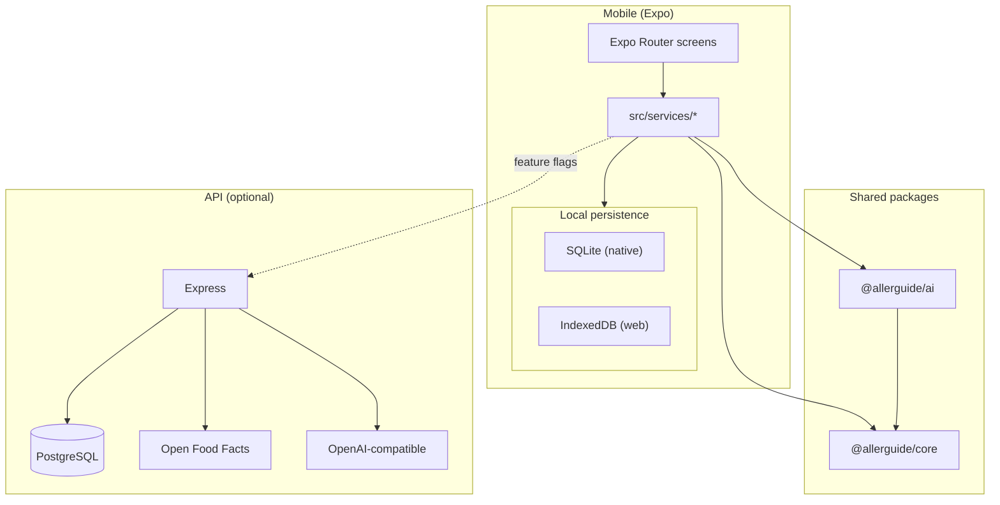
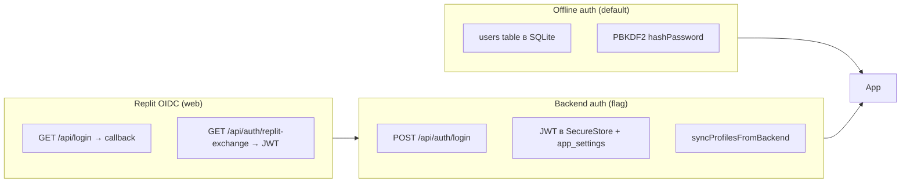

# AllerGuide — архитектура

AllerGuide — offline-first приложение для управления аллергией (Expo / React Native, Web + native). Пользовательский интерфейс на русском и ещё пяти языках. Ядро продукта работает **без сети**: профили, дневник, SOS, сканер (mock/keyword + опционально LLM), PDF-отчёты. Backend (`apps/api`) — **опциональный**: JWT-аутентификация, каталог продуктов, LLM-скан, облачный бэкап.

Репозиторий — **pnpm workspaces + Turborepo** monorepo.

> **Правила разработки:** при написании кода обязательно следовать [`docs/development-rules.md`](./development-rules.md) (архитектура §1–9, TypeScript и стиль §10). Этот документ описывает *что* и *как устроено*; правила — *куда класть код* и *как писать*.

---

## Содержание

1. [Структура monorepo](#структура-monorepo)
2. [Высокоуровневая схема](#высокоуровневая-схема)
3. [Mobile-приложение](#mobile-приложение)
4. [Локальное хранилище данных](#локальное-хранилище-данных)
5. [Сканер: сквозной поток](#сканер-сквозной-поток)
6. [Аутентификация и сессии](#аутентификация-и-сессии)
7. [Backend API](#backend-api)
8. [Shared-пакеты](#shared-пакеты)
9. [Интернационализация (i18n)](#интернационализация-i18n)
10. [CI и деплой](#ci-и-деплой)
11. [Наблюдаемость](#наблюдаемость)
12. [Масштабирование](#масштабирование)
13. [Переменные окружения](#переменные-окружения)

---

## Структура monorepo

```
/
├── apps/
│   ├── mobile/          # Expo Router — основной продукт (Web + iOS + Android)
│   └── api/             # Express + Drizzle + PostgreSQL (опционально)
├── packages/
│   ├── core/            # Доменная логика, типы, справочники (без React)
│   ├── ai/              # Сканер, OCR-подготовка, LLM-клиент
│   └── ui/              # Общие RN-компоненты (минимальный набор)
├── docs/                # Архитектура, QA, деплой, клинические фичи
├── scripts/             # Сборка APK, Replit deploy
├── .github/workflows/   # CI, Neon preview branches
├── turbo.json           # Граф задач Turborepo (build, lint, typecheck, test)
└── package.json         # Корневые скрипты: pnpm typecheck | test | lint
```

### Граф зависимостей

| Пакет | Зависит от |
|-------|------------|
| `apps/mobile` | `@allerguide/core`, `@allerguide/ai`, `@allerguide/ui` |
| `apps/api` | `@allerguide/core`, `@allerguide/ai` |
| `@allerguide/ai` | `@allerguide/core` |
| `@allerguide/ui` | React Native (peer) |

**Правило:** вся бизнес-логика, не привязанная к UI или HTTP, живёт в `packages/core`. Сканирование и OCR — в `packages/ai`. Mobile и API — тонкие адаптеры (экраны, сервисы, маршруты).

---

## Высокоуровневая схема



**Режимы работы:**

| Режим | Описание |
|-------|----------|
| **Offline (по умолчанию)** | Только local DB + keyword-сканер из `@allerguide/ai` |
| **+ Backend auth** | JWT, профили на сервере, dual-write с локальной копией |
| **+ Product DB** | Поиск штрихкода в Postgres-каталоге до OFF |
| **+ AI scan** | LLM через `POST /api/scan` с кэшем и дневным бюджетом |
| **+ Cloud sync** | AES-GCM бэкап на сервер (zero-knowledge) |

Все опции включаются **флагами** (см. [Переменные окружения](#переменные-окружения)); в `.env.example` всё выключено.

---

## Mobile-приложение

Каталог: `apps/mobile/`. Стек: Expo 53, React Native 0.79, Expo Router 5, Zustand, expo-sqlite / IndexedDB.

### Слои

```
app/                  # Экраны (Expo Router, file-based routing)
src/components/       # Переиспользуемые UI-компоненты
src/services/         # Бизнес-логика, оркестрация, API-клиенты
src/db/               # Инициализация БД, миграции, web-store
src/store/            # Глобальный UI-state (Zustand)
src/i18n/             # Локализация (6 языков)
src/constants/        # Feature flags, тема, типографика
src/hooks/            # Тема, шрифты, адаптив
metro.config.js       # Monorepo resolution, web-stubs (i18next, crypto)
```

Экраны **не** обращаются к БД напрямую — только через `src/services/*`. Это упрощает тестирование и перенос логики в `packages/core`.

### Роутинг (Expo Router)

**Bootstrap** (`app/index.tsx`):

1. `initDb()` — создание таблиц / загрузка IndexedDB
2. Replit callback (`?replit_auth=1` на web) → обмен на JWT
3. Проверка `isAuthenticated()` → иначе `/login`
4. `resolveBootstrapRoute()` из `@allerguide/core` → onboarding / home

**Стек аутентификации и onboarding:**

| Маршрут | Назначение |
|---------|------------|
| `login.tsx`, `register.tsx` | Локальная или backend-аутентификация |
| `forgot-password.tsx`, `reset-password.tsx` | Сброс пароля (backend) |
| `onboarding-intro.tsx` | Вводная карусель |
| `onboarding.tsx` | Выбор сценария: `self` / `child` / `both` |
| `profile-setup.tsx` | Мастер создания профиля |
| `profile-edit.tsx` | Редактирование профиля |
| `profiles.tsx` | Список профилей, выход, удаление аккаунта |
| `settings.tsx` | Тема, язык, бэкап, юридические ссылки |

**Вкладки** (`app/(tabs)/_layout.tsx`):

| Вкладка | Файл | Функция |
|---------|------|---------|
| Главная | `home.tsx` | Дашборд, wellness, быстрые действия |
| Дневник | `diary.tsx` | Записи + структурированный wizard |
| Сканер | `scanner.tsx` | Штрихкод, OCR, ручной ввод |
| SOS | `sos.tsx` | Карточка SOS, паспорт, контакты |
| *(скрыты)* | `market.tsx`, `map.tsx` | Маркетплейс, карта (`href: null`) |

**Дополнительные экраны (stack):**

`expert.tsx`, `doctor-report.tsx`, `asit-course.tsx`, `insect-action-plan.tsx`, `food-drug-registry.tsx`, `sos-edit.tsx`, `legal/terms.tsx`, `legal/privacy.tsx`

### Onboarding

Сценарий `both` запускает **двухшаговый wizard**: профиль «Я» → профиль «Ребёнок`. Логика в `@allerguide/core`:

- `getWizardStep()` — какой шаг мастера сейчас
- `resolveBootstrapRoute()` — куда направить после splash
- `shouldCompleteOnboarding()` — когда считать onboarding завершённым

Флаги хранятся в `app_settings`: `onboardingComplete`, `introComplete`, `scenario`.

### Профили

CRUD в `profile-service.ts`: создание, список, редактирование (`/profile-edit`), удаление с каскадом записей дневника (`/profiles`). Профили привязаны к `userId` (миграция схемы v2 на native). При `BACKEND_AUTH_ENABLED` — dual-write с `/api/profiles`.

### Глобальное состояние (Zustand)

| Store | Файл | Содержимое |
|-------|------|------------|
| App | `store/app-store.ts` | `scenario`, `activeProfileId`, `activeProfile` |
| Locale | `store/locale-store.ts` | `locale`, хук `useTranslation()` → `t()`, `content()` |
| Theme | `store/theme-store.ts` | `light` / `dark` / `system` |

Основные данные (профили, дневник, история сканов) — в SQLite/IndexedDB, не в Zustand.

### Ключевые сервисы (`src/services/`)

| Сервис | Роль |
|--------|------|
| `scanner-service.ts` | Оркестрация сканера: каталог → OFF → `runSmartScan` → история |
| `catalog-api.ts` | `GET /api/products/:barcode`, search (при `PRODUCT_DB_ENABLED`) |
| `open-food-facts-service.ts` | Прямой запрос к OFF v2 с мобильного клиента |
| `scan-history-service.ts` | Локальная история сканов |
| `profile-service.ts` | CRUD профилей, миграция legacy → userId |
| `auth-service.ts` | Локальные users **или** backend JWT + SecureStore |
| `backend-api.ts` | Обёртки `/api/auth/*`, `/api/profiles/*` |
| `sync-service.ts` | Шифрованный облачный бэкап (`CLOUD_SYNC_ENABLED`) |
| `sync-restore.ts` | Восстановление payload в локальную БД |
| `backup-crypto.ts` | AES-GCM через `@allerguide/core` |
| `diary-service.ts` | Записи дневника |
| `doctor-report-service.ts` | PDF-отчёт для врача |
| `asit-course-service.ts`, `asit-reminder-service.ts` | Курс АСИТ + локальные напоминания |
| `insect-action-plan-service.ts` | План действий при укусе насекомого |
| `sos-passport-service.ts`, `emergency-contact-service.ts` | SOS и контакты |
| `wellness-service.ts` | Wellness score на главной |
| `analytics-service.ts` | Opt-in аналитика экранов и событий |
| `error-reporting.ts` | Обёртка Sentry (заглушка до подключения SDK) |

### Feature flags (mobile)

Файл: `src/constants/features.ts`. Все флаги читают `EXPO_PUBLIC_*` и по умолчанию **false**.

| Константа | Env | Эффект |
|-----------|-----|--------|
| `BACKEND_AUTH_ENABLED` | `EXPO_PUBLIC_BACKEND_AUTH` | JWT + серверные профили |
| `PRODUCT_DB_ENABLED` | `EXPO_PUBLIC_PRODUCT_DB` | Каталог на backend до OFF |
| `AI_SCAN_ENABLED` | `EXPO_PUBLIC_AI_SCAN_ENABLED` | LLM через `/api/scan` |
| `CLOUD_SYNC_ENABLED` | `EXPO_PUBLIC_CLOUD_SYNC` | Облачный бэкап |

---

## Локальное хранилище данных

Приложение **offline-first**: сеть нужна только для опциональных фич.

### Платформенное разрешение

Импорт всегда `@/src/db/init`. Metro/Expo выбирает реализацию:

| Платформа | Файл | Движок |
|-----------|------|--------|
| iOS / Android | `init.native.ts` | `expo-sqlite` → `allerguide.db` |
| Web | `init.ts` | `WebDb` — SQL-подобный API поверх JSON в IndexedDB |

### Таблицы (native SQLite)

Создаются в `init.native.ts`:

| Таблица | Назначение |
|---------|------------|
| `profiles` | Профили аллергика (`userId`, `allergies` JSON) |
| `diary_entries` | Записи дневника |
| `scan_history` | История сканирований |
| `app_settings` | KV: onboarding, locale, theme, auth token |
| `users` | Локальные учётные записи (offline auth) |
| `emergency_contacts` | Экстренные контакты по profileId |
| `profile_sos` | SOS-заметки |

### Web (IndexedDB)

`src/db/web-store.ts`:

- Store `allerguide` / `kv` с in-memory кэшем
- Синхронный API (`loadJson` / `saveJson`) + асинхронная фоновая запись (debounce)
- Одноразовая миграция из устаревшего `localStorage`
- Ключи: `ag_profiles`, `ag_diary`, `ag_scan_history`, `ag_settings`, и т.д.

Это снимает лимит `localStorage` (~5–10 МБ), блокировку главного потока и O(n)-перезапись всего хранилища на каждом чтении.

`WebDb` (`init.ts`) парсит SQL-строки и маршрутизирует к JSON-коллекциям — тот же интерфейс `DbLike`, что и у SQLite.

### Миграции (`migrations.ts`)

- `CURRENT_SCHEMA_VERSION = 2`
- v1: таблица `schema_version`
- v2: колонка `userId` в `profiles` (multi-user)
- **Только native** — на web схема неявная в ключах JSON

### Облачный бэкап

Клиент собирает `SyncPayload` (`@allerguide/core`), шифрует AES-GCM (`backup-crypto.ts`), загружает на `POST /api/sync/backup`. Сервер хранит opaque blob — **zero-knowledge**.

---

## Сканер: сквозной поток

### Режимы

| Режим | UI | Ввод |
|-------|-----|------|
| `product` | Камера штрихкода / ручной текст | EAN/UPC или состав |
| `menu` | Фото меню | OCR (demo) или ручной ввод |
| `medicine`, `cosmetics` | Фото упаковки | OCR (demo) или ручной ввод |

### Диаграмма потока (штрихкод)

```mermaid
sequenceDiagram
  participant UI as scanner.tsx
  participant SS as scanner-service
  participant CAT as catalog-api
  participant API as API /api/products
  participant OFF as Open Food Facts
  participant AI as runSmartScan
  participant LLM as POST /api/scan

  UI->>SS: scanBarcode(barcode, profile)
  alt PRODUCT_DB_ENABLED
    SS->>CAT: fetchProductFromCatalog
    CAT->>API: GET /api/products/:barcode
    API-->>SS: ingredients + allergenTags
  end
  alt каталог не нашёл
    SS->>OFF: fetchProductByBarcode (direct)
    OFF-->>SS: name, ingredients
  end
  alt продукт не найден
    SS->>AI: analyzeText(barcode as text)
    SS-->>UI: lookupFailed: true
  else продукт найден
    SS->>AI: analyzeText(ingredients)
    alt AI_SCAN_ENABLED
      AI->>LLM: POST /api/scan
      LLM-->>AI: structured verdict
    else LLM off / fail
      AI->>AI: runMockScan (keywords + cross-reactions)
    end
    SS->>SS: saveScanHistory
    SS-->>UI: ScanResult + source
  end
```

### Анализ текста (`@allerguide/ai`)

1. **`runSmartScan`** — если задан `llmEndpoint` и сервер доступен → LLM; иначе fallback
2. **`runMockScan`** — keyword-match по аллергенам профиля + перекрёстные реакции из `@allerguide/core`
3. Уровни риска: `low` | `medium` | `high`
4. **OCR** (`ocr.ts`): `simulateOcrFromCapture` (demo-тексты), `prepareScanTextFromOcr`, `buildOcrScanProductName` — нативный OCR SDK пока не подключён

### Источники результата (`source`)

| Значение | Значение для пользователя |
|----------|---------------------------|
| `openfoodfacts` | Данные из Open Food Facts |
| `barcode` | Каталог backend (Postgres) |
| `ocr` | Распознанный текст упаковки/меню |
| `manual` | Ручной ввод |

### Маппинг аллергенов

Внешние теги (OFF `en:milk`, датасет Food-Allergy) приводятся к канонической RU-таксономии через `mapExternalAllergenNames` в `@allerguide/core` — и при импорте в Postgres, и при write-through с OFF.

---

## Аутентификация и сессии

### Два пути на mobile



| Режим | Хранение | Когда |
|-------|----------|-------|
| **Локальный** | `users` в SQLite/IndexedDB, `authUserId` в settings | `BACKEND_AUTH=false` |
| **Backend JWT** | Token в SecureStore (native) / settings (web) | `BACKEND_AUTH=true` + `JWT_SECRET` на API |
| **Replit OIDC** | Сессия в Postgres `public.sessions`, обмен на JWT для mobile | `REPL_ID` на API, web callback |

JWT: HS256 (`jose`), issuer `allerguide-api`, audience `allerguide-mobile`, TTL 7 дней (`apps/api/src/lib/jwt.ts`).

---

## Backend API

Каталог: `apps/api/`. Express + Drizzle ORM + PostgreSQL. **Не обязателен** для core flows.

### Точка входа

- `src/index.ts` — HTTP-сервер (`API_PORT`, по умолчанию 3001 в `.env.example`)
- `src/app.ts` — фабрика `createApp()`: middleware, маршруты, static/proxy

### Режимы отдачи

| Условие | Поведение |
|---------|-----------|
| `METRO_URL` задан | Proxy на Expo dev server (Replit dev) |
| Иначе | Static `apps/mobile/dist` + SPA fallback |

### HTTP-маршруты

| Файл | Эндпоинты |
|------|-----------|
| `routes/mobile-auth.ts` | `POST /api/auth/register`, `login`, `forgot-password`, `reset-password`; `GET verify-reset-token`, `me`; `DELETE account` |
| `routes/profiles.ts` | `GET/POST /api/profiles`, `GET/PATCH/DELETE /api/profiles/:id` (JWT) |
| `routes/catalog.ts` | `GET /api/allergens`, `GET /api/products/search?q=`, `GET /api/products/:barcode` |
| `routes/scan.ts` | `POST /api/scan` |
| `routes/sync.ts` | `POST /api/sync/backup`, `GET /api/sync/backup/:userId` |
| Replit auth | `GET /api/login`, `/api/callback`, `/api/logout`, `/api/auth/user`, `/api/auth/replit-exchange` |
| — | `GET /api/health` |

### Middleware

| Файл | Функция |
|------|---------|
| `middleware/security.ts` | `helmet`, CORS allowlist (`CORS_ORIGINS`), rate-limit (global + `/api/auth` + `/api/scan`); `RATE_LIMIT_DISABLED` для тестов |
| `middleware/require-jwt.ts` | Bearer JWT → `req.authUser` |

### Разделение БД на схемы (`profile` и `catalog`)

Данные разнесены по двум Postgres-схемам:

| Схема | Таблицы | Файл определения |
|-------|---------|------------------|
| **`profile`** | `app_users`, `profiles`, `diary_entries`, `scan_history`, `emergency_contacts`, `profile_sos`, `sync_backups`, `password_reset_tokens` | `src/db/app-schema.ts` |
| **`catalog`** | `allergens`, `cross_reactions`, `products` | `src/db/catalog-schema.ts` |
| **`public`** | `users`, `sessions` (Replit OIDC) | `src/db/auth-schema.ts` |

Drizzle-объекты схемо-квалифицированы — код запросов не меняется. Справочные SQL-артефакты: `sql/profile.sql`, `sql/catalog.sql`. Живая БД — миграции в `drizzle/`.

### Каталог продуктов

- **Сид аллергенов:** `db:seed-allergens` из `@allerguide/core`
- **Импорт штрихкодов:** `db:import-food-allergy` ← `data/food-allergy/` ([Food-Allergy-SQL-Database](https://github.com/alexf388/Food-Allergy-SQL-Database))
- **Индексация** (`drizzle/0002_*`): `pg_trgm` + GIN по `name`, полнотекст по `ingredients`, GIN по `allergen_tags`
- **Write-through OFF:** при промахе `GET /api/products/:barcode` тянет товар из OFF и кэширует в `catalog.products` (`PRODUCT_OFF_FALLBACK`, default `true`)
- **Поиск:** `GET /api/products/search?q=` — локальный trigram/FTS, при пустом результате — OFF search

Чтения каталога идут в `readDb` (если задан `READ_DATABASE_URL`), записи — в primary `db`.

### AI-сканер (`routes/scan.ts`, `lib/scan-cache.ts`)

- Кэш результатов (ключ — хэш режима/текста/аллергенов)
- Дневной бюджет на user/IP; биллится только промах кэша
- `SCAN_REQUIRE_AUTH` — опциональное требование JWT
- OpenAI-compatible: `OPENAI_API_KEY`, `OPENAI_BASE_URL`, `OPENAI_MODEL`

### Облачная синхронизация (`routes/sync.ts`)

- Payload в `sync_backups` (in-memory fallback без БД)
- Auth: mobile JWT **или** legacy `SYNC_API_KEY`
- Владение по `userId` из токена
- Клиент шифрует до загрузки — сервер zero-knowledge

### Production hardening

- **Безопасность:** helmet, строгий CORS, rate-limiting per-IP
- **Stateless JWT** для mobile — горизонтальное масштабирование API
- **Версионированные миграции:** `db:generate` → SQL в `drizzle/` (коммитится), `db:migrate` через drizzle migrator; `db:push` — только dev

### Neon (serverless Postgres)

Слой БД (`src/db/index.ts`, `src/db/config.ts`):

| Аспект | Поведение |
|--------|-----------|
| **Pooled vs direct** | Runtime: `DATABASE_URL` (pooled `-pooler`); миграции: `DIRECT_DATABASE_URL` (direct, без PgBouncer) |
| **Опции из env** | `DB_SSL=require`, `DB_PREPARE=false` (PgBouncer), pool tuning |
| **Read replica** | `READ_DATABASE_URL` → `readDb` для каталога; без переменной — fallback на primary |
| **Branching CI** | `.github/workflows/neon-preview.yml` — эфемерная ветка БД на PR |
| **Cold start** | Ленивый синглтон подключения; на проде отключить scale-to-zero или принять задержку |

`migrate.ts` совмещает Neon direct URL с `prepareReplitAuthBeforeMigrate` для Replit deploy.

---

## Shared-пакеты

### `@allerguide/core` (`packages/core/`)

Чистый TypeScript, Vitest-тесты. Основные модули:

| Модуль | Назначение |
|--------|------------|
| `types.ts` | `Profile`, `DiaryEntry`, `ScanHistoryEntry`, `Scenario`, `RiskLevel` |
| `allergen-database.ts`, `allergen-aliases.ts` | Каноническая RU-таксономия, маппинг OFF/датасетов |
| `cross-reactions/` | Перекрёстные реакции, уровни риска |
| `onboarding.ts` | `resolveBootstrapRoute`, wizard steps |
| `diary.ts`, `diary-stats.ts`, `diary-profile.ts`, `diary-triggers.ts` | Структурированный дневник, инсайты, триггеры |
| `clinical-scales.ts` | ARIA-lite, ACT, SCORAD-lite, UAS7 |
| `asit-therapy.ts`, `insect-allergy.ts`, `food-drug-allergy.ts` | Клинические модули P3–P5 |
| `allergy-passport.ts`, `emergency-contacts.ts` | SOS-паспорт, контакты |
| `doctor-report.ts` | Блоки отчёта для врача |
| `sync.ts`, `crypto.ts` | Sync payload, AES-GCM бэкап |
| `auth.ts`, `password.ts` | Валидация форм, PBKDF2 |
| `catalog.ts`, `wellness.ts`, `geo.ts` | Статический каталог, wellness, гео |
| `expert-content.ts`, `pollen-calendar.ts`, `adair-catalog.ts` | Контент и справочники |

### `@allerguide/ai` (`packages/ai/`)

| Модуль | Назначение |
|--------|------------|
| `scan.ts` | `runMockScan` — keyword + cross-reactions |
| `smart-scan.ts` | `runSmartScan`, LLM prompt/parse, fallback на mock |
| `ocr.ts` | Нормализация OCR-текста, demo capture, извлечение блока состава |

### `@allerguide/ui` (`packages/ui/`)

Минимальный набор: `PrimaryButton`, `Badge`. Зависимость объявлена в mobile, но экраны пока используют локальные компоненты (`src/components/`).

---

## Интернационализация (i18n)

Каталог: `apps/mobile/src/i18n/`. **Два стека** (важно для разработчиков):

### Основной — Zustand + typed messages

| Часть | Файлы |
|-------|-------|
| Типы | `types.ts` — `AppLocale` = `ru\|en\|es\|fr\|de\|it`, интерфейс `LocaleMessages` |
| UI-строки | `locales/{ru,en,es,fr,de,it}.ts` |
| Rich content | `content/{locale}.ts` — дневник, экспертные статьи, блоки отчёта |
| Хелперы | `translate.ts` — `localizeScanResult()`, маппинг ошибок |
| Хук | `store/locale-store.ts` → `useTranslation()` — **то, что используют экраны** |

Язык по умолчанию: **ru**. Сохраняется в `app_settings`.

### Legacy — i18next

`i18n/index.ts` — инициализация `i18next` + `react-i18next` (только ru/en). На native **заглушен** через `metro.config.js` (`src/stubs/i18next-stub.js`).

---

## CI и деплой

### GitHub Actions

| Workflow | Триггер | Задачи |
|----------|---------|--------|
| `ci.yml` | push/PR → `main` | `pnpm install --frozen-lockfile` → `typecheck` → `lint` → `test` |
| `neon-preview.yml` | PR open/sync/close | Создание Neon branch `preview/pr-<n>`, migrate + seed + test; удаление при close |

Корневые проверки:

```bash
pnpm typecheck   # TypeScript во всех пакетах
pnpm test        # Vitest: core, ai, mobile, api
pnpm --filter mobile lint
```

### Replit

- `.replit` — autoscale deploy, `ignoreDatabaseMigrations`
- `scripts/replit-deploy-build.sh` — install → `db:migrate` → `expo export`
- API отдаёт static web + опционально Metro proxy
- Подробнее: `docs/replit-deploy.md`

### Android APK (preview)

- `scripts/build-preview-apk.sh` — local Gradle `assembleRelease`
- EAS profiles: `apps/mobile/eas.json`
- Подробнее: `docs/eas-internal-preview.md`

---

## Наблюдаемость

| Компонент | Файл | Включение |
|-----------|------|-----------|
| Аналитика | `analytics-service.ts` | `EXPO_PUBLIC_ANALYTICS_ENABLED`, опционально `EXPO_PUBLIC_ANALYTICS_ENDPOINT` |
| События | — | `screen_view`, `profile_created`, `scan_completed` |
| Crash reporting | `error-reporting.ts` | `EXPO_PUBLIC_SENTRY_DSN` (SDK пока не подключён — console stub) |

---

## Масштабирование

### В коде (уже есть)

- Stateless JWT для mobile
- Read replica для каталога
- Scan result cache + daily budget
- Lazy DB singleton, Neon pooled/direct split
- Rate limiting, helmet, CORS allowlist

### Инфраструктура (вне репозитория, при росте до ~1M MAU)

| Компонент | Зачем |
|-----------|-------|
| Несколько stateless API за LB | Горизонтальное масштабирование (`trust proxy` включён) |
| PgBouncer | Пул соединений при многих инстансах |
| Redis для rate-limit store | Согласованные лимиты между инстансами |
| Redis для Replit OIDC сессий | Mobile JWT уже stateless |
| Read-реплики | Тяжёлые чтения sync backup |
| CDN | Static web-сборка |
| Meilisearch / Typesense | Поиск по миллионам SKU (Postgres остаётся source of truth) |

---

## Переменные окружения

Полный список — `.env.example`. Краткая сводка:

### Mobile (`EXPO_PUBLIC_*`)

| Переменная | Default | Назначение |
|------------|---------|------------|
| `EXPO_PUBLIC_API_URL` | `http://localhost:3001` | Base URL backend |
| `EXPO_PUBLIC_BACKEND_AUTH` | `false` | JWT auth + server profiles |
| `EXPO_PUBLIC_PRODUCT_DB` | `false` | Backend catalog lookup |
| `EXPO_PUBLIC_AI_SCAN_ENABLED` | `false` | LLM scan via API |
| `EXPO_PUBLIC_CLOUD_SYNC` | `false` | Encrypted cloud backup |
| `EXPO_PUBLIC_ANALYTICS_ENABLED` | `false` | Product analytics |
| `EXPO_PUBLIC_SENTRY_DSN` | — | Crash reporting |

### API

| Переменная | Назначение |
|------------|------------|
| `DATABASE_URL` / `DIRECT_DATABASE_URL` / `READ_DATABASE_URL` | Postgres connections |
| `DB_SSL`, `DB_PREPARE`, `DB_POOL_*` | Neon / PgBouncer tuning |
| `JWT_SECRET` | Mobile JWT signing |
| `SESSION_SECRET` | Replit session cookies |
| `CORS_ORIGINS` | CORS allowlist |
| `RATE_LIMIT_*`, `RATE_LIMIT_DISABLED` | Rate limiting |
| `SYNC_ENABLED`, `SYNC_API_KEY` | Cloud sync endpoints |
| `PRODUCT_OFF_FALLBACK` | OFF write-through on catalog miss |
| `OPENFOODFACTS_USER_AGENT` | Required by OFF API |
| `AI_SCAN_ENABLED`, `OPENAI_*` | LLM scan provider |
| `SCAN_REQUIRE_AUTH`, `SCAN_CACHE_*`, `SCAN_DAILY_BUDGET` | Scan cost controls |
| `REPL_ID`, `ISSUER_URL` | Replit OIDC |
| `METRO_URL` | Dev proxy to Expo |

---

## Связанные документы

| Документ | Тема |
|----------|------|
| `README.md` | Быстрый старт |
| `docs/development-rules.md` | **Обязательные правила разработки** (слои, чеклист, антипаттерны) |
| `AGENTS.md` | Инструкции для разработки / Cloud Agent |
| `docs/functional-requirements.md` | Функциональные требования |
| `docs/clinical-features-raaci.md` | Клинические фичи (RAACI) |
| `docs/replit-deploy.md` | Деплой на Replit |
| `docs/eas-internal-preview.md` | EAS / preview builds |
| `docs/qa-checklist.md` | QA чеклист |
| `docs/roadmap-to-prod.md` | Roadmap к production |
