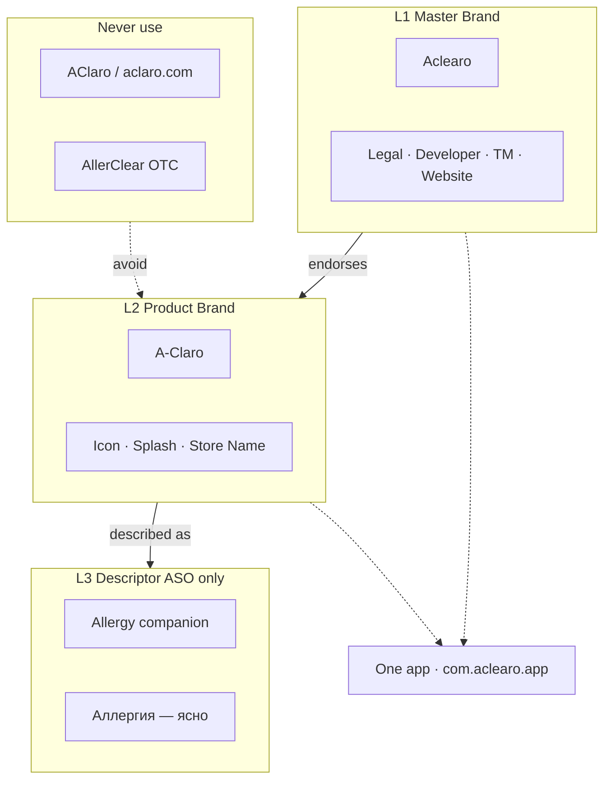
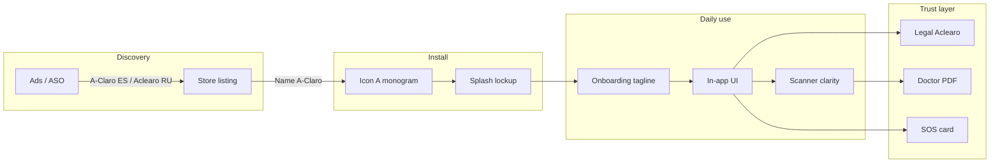
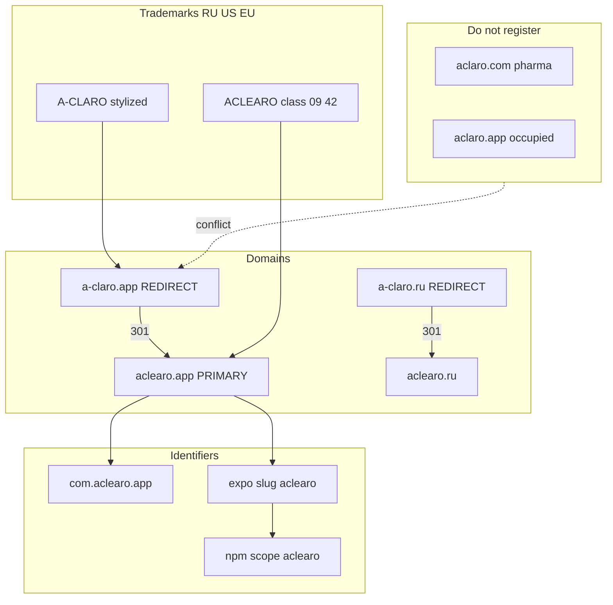
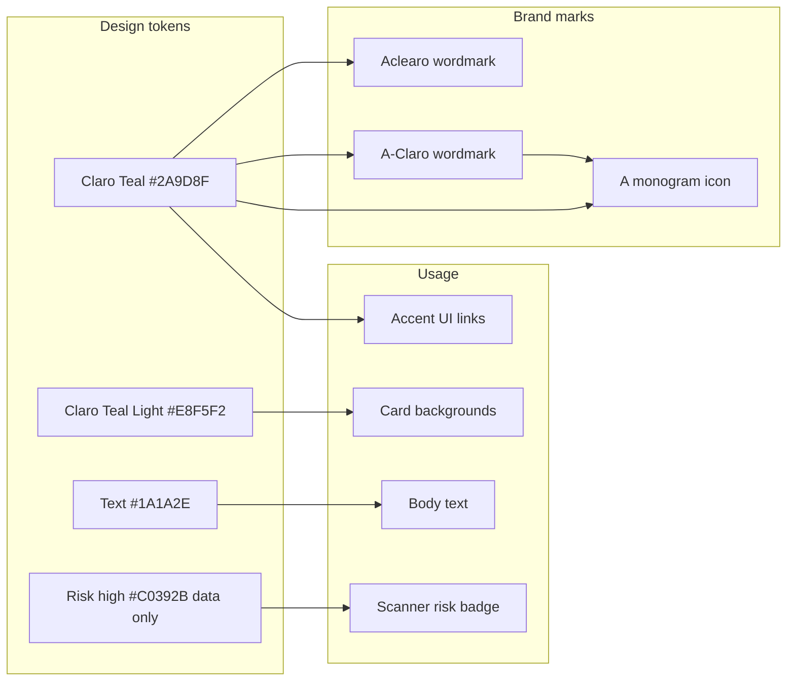
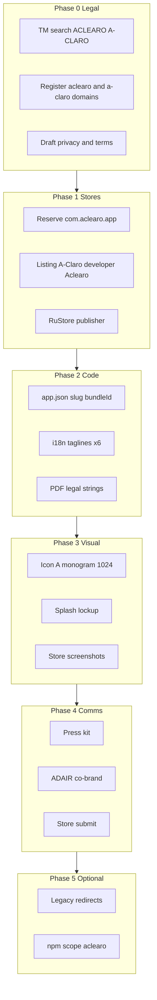
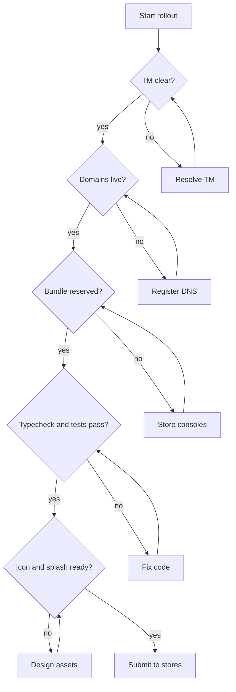

# Aclearo × A-Claro — бренд-архитектура (диаграммы)

Master brand **Aclearo** · product mark **A-Claro** · один продукт (`com.aclearo.app`).

Lockup: **A-Claro** · *an Aclearo app*

Полная матрица touchpoints, фазы rollout и чеклисты — в plan artifact `allergocare_availability_check` (раздел «Полная схема»).

---

## 1. Иерархия имён

| Уровень | Имя | Пользователь | Регулятор / партнёр |
|---------|-----|--------------|---------------------|
| L1 | Aclearo | About, PDF, press | TM, privacy, developer |
| L2 | A-Claro | Icon, store, splash | Product mark |
| L3 | Allergy companion | Subtitle, keywords | Health category |

---

## 2. User journey (touchpoints)

---

## 3. Domains, identifiers & trademarks

| Актив | Назначение |
|-------|------------|
| `aclearo.app` | Privacy, terms, marketing |
| `a-claro.app` | 301 → primary или ES landing |
| `com.aclearo.app` | iOS + Android bundle ID |

---

## 4. Design tokens → marks

| Token | Value | Применение |
|-------|-------|------------|
| Claro Teal | `#2A9D8F` | Accent, monogram A |
| Claro Teal Light | `#E8F5F2` | Cards, surfaces |
| Text primary | `#1A1A2E` | Body |
| Risk high | `#C0392B` | Только data UI, не бренд |

Lockup: A-Claro 100% · «an Aclearo app» 28% · clear space = высота «A».

---

## 5. Rollout pipeline

| Phase | Gate |
|-------|------|
| 0 | TM report без блокеров |
| 1 | Bundle ID уникален |
| 2 | `pnpm typecheck` + tests |
| 3 | Assets в store console |
| 4 | Review submitted |

---

## 6. Go / no-go flow

### Checklist

| ☐ | Check | Owner |
|---|-------|-------|
| ☐ | TM search ACLEARO + A-CLARO | Legal |
| ☐ | aclearo.app + .ru registered | Ops |
| ☐ | a-claro.app + .ru registered | Ops |
| ☐ | com.aclearo.app reserved | Product |
| ☐ | app.json updated | Eng |
| ☐ | i18n taglines ×6 | Eng |
| ☐ | Icon A monogram | Design |
| ☐ | Privacy/Terms on aclearo.app | Legal |
| ☐ | pnpm rc-gate green | Eng |

---

## Guardrails

| Не путать с | Наше написание |
|-------------|----------------|
| Aclaro® (hydroquinone) | **A-Claro** с дефисом |
| Claro (telecom LATAM) | Health category + allergy subtitle |
| klarify (ALK) | Full app scope in copy |
| AllerClear (Costco OTC) | **Aclearo** |
| ComerClaro (food ES) | Allergy companion positioning |
