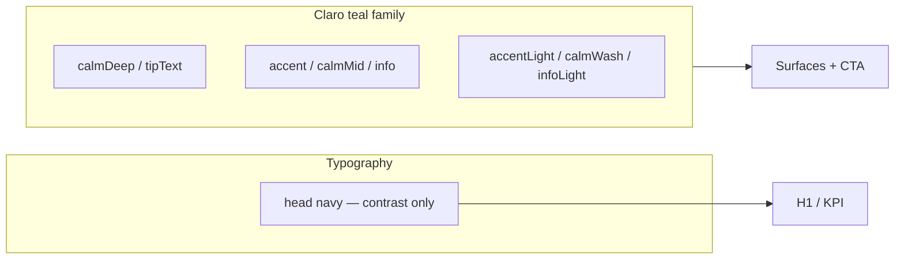

# Claro Green — единая teal-палитра

**Статус:** Фаза 1 (токены) — medical blue ambient снят  
**Связано:** [`brand-rollout.md`](./brand-rollout.md) · [`apps/mobile/src/constants/theme.ts`](../apps/mobile/src/constants/theme.ts)

> Ранее документ описывал **Dual Calm** (Medical blue × Claro teal). Решение продукта: **уходим от синего света**, ambient и product — одна семья Claro teal. Имена токенов `calm.*` сохранены как aliases, чтобы не ломать вызовы; значения = teal.

---

## Зачем

После онбординга (#160, #186) chrome и иллюстрации стали teal, но wellness/tab/`GlassCard`/`info` оставались на `#2563EB` / `#EFF4FF`. Два конкурирующих accent ломали бренд.

**Claro Green:** один продуктовый цвет для CTA, ambient, info и градиентов.

---

## Палитра

### Claro (product + ambient)

| Token | Light | Dark | Роль |
|-------|-------|------|------|
| `accent` | `#2A9D8F` | `#3DB8A8` | CTA, табы, ссылки, monogram |
| `accentLight` | `#E6F6F4` | `#134E48` | Мягкий фон |
| `accentMid` | `#9FD9D1` | `#2A9D8F` | Бордеры / mid fill |
| `calmDeep` | `#1F6B62` | `#0B1120` | Глубина градиента (= `tipText` light) |
| `calmMid` | `#2A9D8F` | `#3DB8A8` | = `accent` |
| `calmLight` | `#9FD9D1` | `#3DB8A8` | Светлый край градиента |
| `calmWash` | `#E6F6F4` | `#134E48` | = `accentLight` — wellness / tab pill |
| `calmMist` | `#9FD9D1` | `#2A9D8F` | = `accentMid` — ambient border |
| `info` | `#2A9D8F` | `#3DB8A8` | = `accent` (клинические подсказки) |
| `infoLight` | `#E6F6F4` | `#134E48` | = `accentLight` |

### Общие

- `head` light: `#1E3A5F` — **только типографика** (не ambient fill)
- `bg`: `#F4F6F9` · `danger` / SOS: `#B91C1C`
- `success` / traffic-light — без изменений

### Градиент

`getCalmGradient(isDark)` в [`calm-gradient.ts`](../apps/mobile/src/constants/calm-gradient.ts):

- **Light:** `#1F6B62` → `#2A9D8F` → `#9FD9D1`
- **Dark:** `#0B1120` → `#134E48` → `#2A9D8F`

---

## Правила (non-negotiable)

1. **CTA, табы, ссылки, ambient wash, info** — Claro teal family. Нет `#2563EB` / `#3B82F6` / `#EFF4FF` / `#DBEAFE` в fills.
2. **SOS** — только `danger`, не teal.
3. **Не вводить второй «медицинский» hue** рядом с accent.
4. **Icon / store** — monogram A на teal.
5. **Запрещённые написания бренда** — см. [`brand-rollout.md`](./brand-rollout.md).
6. Внешние карты (Google/Yandex tiles) — исключение, не бренд-токены.

---

## Матрица UI

| Элемент | Токен |
|---------|--------|
| Screen background | `bg` |
| Hero / wellness / `GlassCard variant="calm"` | `calmWash` / `calmMist` (= teal) |
| Onboarding waves | `accentLight` + `accent` |
| H1, KPI | `head` |
| Primary button, active tab, links | `accent` |
| Tab pill | `calmWash` |
| Info banners | `info` / `infoLight` |
| Scanner «Claro: …» | `accent` |
| Safe scan | `success` |
| SOS | `danger` |

---

## Roadmap

| Фаза | Содержание | Статус |
|------|------------|--------|
| **P3.x Dual Calm** | blue ambient + teal CTA | ✅ historical |
| **Фаза 1** | `calm.*` + `info` + gradient → teal; docs/tests | ✅ |
| **Фаза 2** | UI sweep: `GlassCard`/tabs → `accent*`, SOS tip → `tip*`, `design-mockup.html`, regression tests | ✅ этот PR |
| **Фаза 3** | Онбординг map/sos арты; remaining mockup polish | ☐ |
| **Фаза 4** | Rename `calm*` → aliases / deprecate Dual Calm naming | ☐ |

---

## QA-чеклист

- [x] Нет medical blue hex в `theme.ts` / `calm-gradient.ts` (кроме `head` navy)
- [x] Tab pill + `GlassCard` calm → `accentLight` / `accentMid`
- [x] SOS tip → `tipBg` / `tipBorder` / `tipText` + icon `accent`
- [x] `design-mockup.html` sync (light + dark)
- [ ] Dark mode smoke на device
- [x] `calm-gradient.test.ts` (Phase 1–2 alias + no medical blue)

---

## Ссылки

- Brand kit: [`brand/brand-preview.html`](./brand/brand-preview.html)
- Токены: [`apps/mobile/src/constants/theme.ts`](../apps/mobile/src/constants/theme.ts)
- Градиент: [`apps/mobile/src/constants/calm-gradient.ts`](../apps/mobile/src/constants/calm-gradient.ts)
