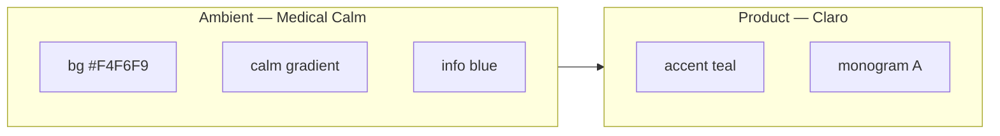

# Dual Calm — Medical blue × Claro teal

**Статус:** P3.0 (документ) + P3.1 (токены) — в коде  
**Связано:** [`brand-rollout.md`](./brand-rollout.md) · [`apps/mobile/src/constants/theme.ts`](../apps/mobile/src/constants/theme.ts)

---

## Зачем

После ребренда A-Claro продуктовый accent стал **Claro Teal** (`#2A9D8F`). Каркас **Clinical Calm** (типографика, радиусы, плоские карточки, navy-заголовки) сохранился, но **синяя атмосфера доверия** ушла вместе с заменой `#2563EB` на teal во всех ролях.

**Dual Calm** возвращает Medical Calm как **ambient-слой** (фон, градиенты, wellness, клинические подсказки), не откатывая бренд:

| Слой | Цвет | Роль |
|------|------|------|
| **Medical Calm** (синий) | navy → blue | Среда, доверие, клинический контекст |
| **Claro** (teal) | `#2A9D8F` | CTA, активные табы, ссылки, monogram, «Claro: …» |

---

## Палитра

### Claro (product) — без изменений

| Token | Light | Dark |
|-------|-------|------|
| `accent` | `#2A9D8F` | `#3DB8A8` |
| `accentLight` | `#E6F6F4` | `#134E48` |
| `accentMid` | `#9FD9D1` | `#2A9D8F` |

### Medical Calm (ambient) — `calm.*`

| Token | Light | Dark | Роль |
|-------|-------|------|------|
| `calmDeep` | `#1E3A5F` | `#0B1120` | Глубина градиента (= `head` light) |
| `calmMid` | `#2563EB` | `#1D4ED8` | Середина градиента, бывший primary |
| `calmLight` | `#3B82F6` | `#3B82F6` | Hover, светлый край градиента |
| `calmWash` | `#EFF4FF` | `#0F172A` | Фон wellness-карточек, мягкие зоны |
| `calmMist` | `#DBEAFE` | `#1E293B` | Бордеры, вторичные ambient-поверхности |

### Info (клиническая информация)

| Token | Light | Dark |
|-------|-------|------|
| `info` | `#2563EB` | `#3B82F6` |
| `infoLight` | `#EFF4FF` | `#0C4A6E` |

### Общие (без изменений)

- `head` light: `#1E3A5F` · `bg`: `#F4F6F9` · `danger` / SOS: `#B91C1C`

### Градиент

`getCalmGradient(isDark)` в [`calm-gradient.ts`](../apps/mobile/src/constants/calm-gradient.ts) (re-export из `theme.ts`):

- **Light:** `#1E3A5F` → `#2563EB` → `#3B82F6` (135°)
- **Dark:** `#0B1120` → `#1E3A5F` → `#1D4ED8`

---

## Правила (non-negotiable)

1. **CTA, активные табы, ссылки** — только `accent` (teal), не `calmMid`.
2. **SOS** — только `danger`, не blue/teal.
3. **Синий** — не более ~25% площади экрана (фон, hero, wellness atmosphere).
4. **Не смешивать** teal и blue в одной кнопке или badge.
5. **Icon / store asset** — monogram A на teal; синий — in-app atmosphere, не icon fill.
6. **Запрещённые написания бренда** — см. [`brand-rollout.md`](./brand-rollout.md).

---

## Матрица UI

| Элемент | Токен |
|---------|--------|
| Screen background | `bg` |
| Hero / waves / wellness atmosphere | `calm*` + `getCalmGradient` |
| H1, KPI numbers | `head` |
| Primary button, active tab icon, links | `accent` |
| Tab pill background (план P3.3) | `calmWash` |
| Info banners, clinical hints | `info` / `infoLight` |
| Scanner «Claro: …» | `accent` |
| Safe scan / success | `success` |
| SOS | `danger` |

---

## Roadmap внедрения

| Фаза | PR | Содержание | Статус |
|------|-----|------------|--------|
| **P3.0** | этот PR | `brand-dual-calm.md`, cross-link в rollout, dual palette в `brand-preview.html` | ✅ |
| **P3.1** | этот PR | `calm.*` tokens, `info` → blue, `getCalmGradient()` | ✅ |
| **P3.2** | этот PR | Onboarding waves, home wellness + hero — ambient blue | ✅ |
| **P3.3** | этот PR | Tab pill `calmWash`, `GlassCard variant="calm"` на клинических экранах | ✅ |
| **P3.4** | опц. | Store screenshots, `design-mockup.html` sync | ☑ (июль 2026) |
| **P3.5** | опц. | QA checklist: accent teal + calm blue | ☐ |

---

## Быстрый визуальный тест (P3.2 preview)

В `OnboardingWaveBackground` временно подставить `calmWash` / `calmMid` вместо `accentLight` / `accent` — CTA и `BrandLogo` оставить teal. Если atmosphere «медицинская» вернулась, модель подтверждена.

---

## QA-чеклист (после P3.2+)

- [ ] Контраст WCAG: белый на `calmMid` / `calmDeep`
- [ ] Dark mode: градиент не пересвечивает OLED
- [ ] Color-blind: teal CTA отличим от blue wash
- [ ] Бренд: A-Claro, endorser, «Claro: …» на месте
- [ ] `pnpm typecheck` / mobile tests green

---

## Ссылки

- Референс Clinical Calm (legacy blue): [`design-mockup.html`](./design-mockup.html)
- Актуальный brand kit: [`brand/brand-preview.html`](./brand/brand-preview.html)
- Токены: [`apps/mobile/src/constants/theme.ts`](../apps/mobile/src/constants/theme.ts)
