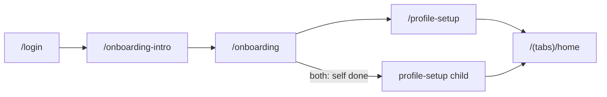
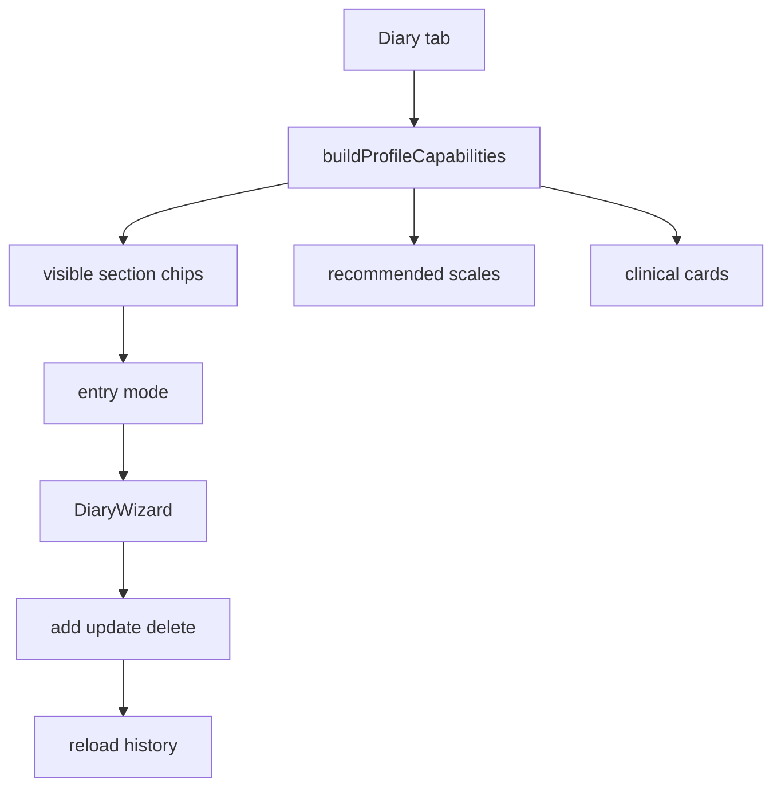

# CJM и сценарии: профиль и дневник

**Основание:** текущий код (`packages/core`, `apps/mobile`), FR §6–8 в [`functional-requirements.md`](./functional-requirements.md).  
**Приоритет при расхождении с** [`qa-test-cases.md`](./qa-test-cases.md): **код**.

Каждый сценарий ниже имеет **ровно один** наблюдаемый исход (маршрут, error code, набор chips/capabilities или факт записи в БД).

---

## 1. Правило gating (explicit-first)

Модули дневника, home quick actions, блоки PDF и reminders `asit` / `act` / `epinephrine` завязаны на **явно выбранные** типы состояний (`profileConditions` / `explicitConditions`), а не на эвристику по названиям аллергенов.

Источник: [`buildProfileCapabilities`](../packages/core/src/profile-capabilities.ts).

| Поле | Как считается |
|------|----------------|
| `gatingConditions` | только explicit condition ids |
| `inferredConditions` | эвристика по allergy labels — **soft-hint**, не gating |
| `foodFocus` | explicit `food` **или** есть пищевые аллергены в профиле |
| `drugFocus` | explicit `drug` **или** непустые `drugIntolerances` в SOS passport |
| `uas7` в scales | explicit `urticaria` **или** метка «крапивниц…» в labels |
| `reminders.pollen` | `pollinosis` / `rhinitis` **или** (`household` + pollen allergen ids) |

Карта, маркет и все режимы сканера **не скрываются** типами (FR-PROF-12). В этом документе для дневника фиксируются: секции дневника, шкалы, home quick actions, `defaultScannerMode`, reminders, `reportBlockIds`.

---

## 2. Источники истины

| Слой | Код |
|------|-----|
| Bootstrap | [`packages/core/src/onboarding.ts`](../packages/core/src/onboarding.ts) |
| Wizard профиля | [`packages/core/src/profile-setup-wizard.ts`](../packages/core/src/profile-setup-wizard.ts) |
| Persist / валидация | [`profile-validation.ts`](../packages/core/src/profile-validation.ts), [`profile-service.ts`](../apps/mobile/src/services/profile-service.ts) |
| Типы состояний (11) | [`allergy-conditions.ts`](../packages/core/src/allergy-conditions.ts) |
| Capabilities | [`profile-capabilities.ts`](../packages/core/src/profile-capabilities.ts), тесты S1–S8 |
| Секции дневника | [`diary.ts`](../packages/core/src/diary.ts), [`diary-profile.ts`](../packages/core/src/diary-profile.ts) |
| UI | [`profile-setup.tsx`](../apps/mobile/app/profile-setup.tsx), [`(tabs)/diary.tsx`](../apps/mobile/app/(tabs)/diary.tsx), [`clinical-scales.tsx`](../apps/mobile/app/clinical-scales.tsx) |

---

## 3. CJM A — заполнение профиля

### 3.1. Базовый поток

### 3.2. Touchpoints

| Этап | Экран | Действие пользователя | Система | Критерий успеха |
|------|-------|----------------------|---------|-----------------|
| Auth | `/login` | вход / регистрация | сессия | `isAuthenticated` → bootstrap |
| Intro | `/onboarding-intro` | 5 слайдов или Skip | `markIntroComplete` | → `/onboarding` |
| Scenario | `/onboarding` | `self` / `child` / `both` | `setStoredScenario` | → `/profile-setup` |
| Wizard | `/profile-setup` | шаги ниже | validate per step | draft валиден |
| Persist | (save) | Сохранить | `createProfile` + side-writes | row в `profiles` + settings |
| Home | `/(tabs)/home` | — | `markOnboardingComplete` (если scenario complete) | UI по capabilities |

### 3.3. Шаги wizard и влияние на путь

Порядок: `PROFILE_SETUP_WIZARD_STEPS` — name → birthYear → conditions → allergens → crossReactions → allergenConfirmations → symptomBaseline → conditionHistory → comorbidity → phenotypeSummary → contacts.

| Шаг | Обязателен | Skip / условие | Влияние на дальнейший CJM |
|-----|------------|----------------|---------------------------|
| `name` | да | — | отображение профиля |
| `birthYear` | да; + consent для child | — | возраст дебюта; legal для `child` |
| `conditions` | ≥1 | — | **главный ключ gating** |
| `allergens` | ≥1 id | — | сканер, cross, foodFocus heuristic, pollen reminders, hints |
| `crossReactions` | нет | нет related allergens | `crossReactionAllergies` отдельно от primary |
| `allergenConfirmations` | нет | 0 allergens | источники подтверждения |
| `symptomBaseline` | нет (Skip) | — | не запись дневника |
| `conditionHistory` | нет | 0 conditions | хронология / debut |
| `comorbidity` | нет | &lt;2 conditions | связи типов |
| `phenotypeSummary` | нет | 0 conditions | МКБ-подсказки, **не** gating |
| `contacts` | нет | пустые drafts отбрасываются | SOS / epinephrine context |

Доп. данные вне wizard, влияющие на дневник-CJM:

- SOS `drugIntolerances` → `drugFocus`, prefill `intoleranceAlert`
- Курс АСИТ / терапии по назначению → упрощённые шаги секций
- Food-drug registry → avoid list / блок PDF `foodDrug`
- Active profile: предпочтение `self` (`resolvePreferredActiveProfile`)

### 3.4. Ветки CJM A по типу состояния

После save capabilities считаются от `explicitConditions` + allergies. Подробные исходы — §4 (матрица) и сценарии CAP-*.

| Persona | Типичные allergens | Особенность wizard | Исход capabilities (кратко) |
|---------|-------------------|--------------------|-----------------------------|
| food | `milk`, `eggs`, `peanut` | options food | foodFocus; home `[symptoms,food]`; epinephrine; без ASIT/PEF/insect |
| pollinosis | `birch-pollen`, `ragweed-pollen` | season options; cross часто показан | ASIT; aria-lite; pollen reminder; home +asit |
| asthma | любой + explicit asthma | — | PEF + ACT; home +peakFlow |
| rhinitis | — | — | aria-lite; pollen; **ASIT off** |
| dermatitis | — | — | skinFocus; scorad-lite; scanner cosmetics |
| urticaria | или label «крапивница» | — | uas7 |
| household | `house-dust`, `dust-mites`, `mold` | pollen reminder только + pollen ids | без ASIT/PEF |
| animal | `cat-dander`, `dog-dander` | — | baseline + medicine quick action |
| drug | `penicillin`… | — | drugFocus; scanner medicine; epinephrine |
| insect | `bee` / `bee-venom`… | — | insectSting; секция «Укус»; epinephrine |
| other | + `otherConditionLabel` | label в `app_settings` | только baseline-секции (если один тип) |

Комбинации:

- **asthma + pollinosis** → PEF + ASIT + aria-lite + act
- **food + birch без pollinosis** → ASIT/pollen reminder off; inferred pollinosis; soft hint
- **≥2 conditions** → шаг comorbidity показан; модули объединяются

---

## 4. Матрица ProfileCapabilities

**Базовые секции дневника (всегда):** Симптомы, Лекарство, Питание, Триггер, Кожа, Заметка, Визит к врачу, Терапия.

**Условные секции:** Пикфлоуметрия ⟺ `asthma`; АСИТ ⟺ `pollinosis`; Укус насекомого ⟺ `insect`.

**Baseline report blocks** (всегда в default set): `symptoms`, `medicine`, `food`, `triggers`, `triggerContext`, `timeline`.

Ниже — однозначные исходы для профиля с **одним** explicit condition и указанными allergen ids (без SOS intolerances, если не сказано иное). Home actions — порядок из `getHomeQuickActionsForCapabilities`.

| Explicit | Example allergies | peakFlow | asit | insect | foodFocus | drugFocus | skinFocus | Scales | Home quick actions | Scanner default | reminders.pollen | reminders.asit | reminders.act | reminders.epinephrine | Extra report blocks |
|----------|-------------------|----------|------|--------|-----------|-----------|-----------|--------|--------------------|-----------------|------------------|----------------|---------------|----------------------|---------------------|
| `food` | `milk` | — | — | — | ✓ | — | — | — | `symptoms`, `food` | product | — | — | — | ✓ | `foodDrug` |
| `pollinosis` | `birch-pollen` | — | ✓ | — | —* | — | — | `aria-lite` | `symptoms`, `medicine`, `asit` | product | ✓ | ✓ | — | — | `asit`, `scales` |
| `asthma` | `birch-pollen` | ✓ | — | — | —* | — | — | `act` | `symptoms`, `medicine`, `peakFlow` | product | — | — | ✓ | — | `peakflow`, `scales` |
| `rhinitis` | — | — | — | — | — | — | — | `aria-lite` | `symptoms`, `medicine` | product | ✓ | — | — | — | `scales` |
| `dermatitis` | `milk` | — | — | — | ✓† | — | ✓ | `scorad-lite` | `symptoms`, `food`, `medicine` | cosmetics | — | — | — | — | `foodDrug`, `skin`, `scales` |
| `urticaria` | — | — | — | — | — | — | — | `uas7` | `symptoms`‡ | product | — | — | — | — | `scales` |
| `household` | `dust-mite` | — | — | — | — | — | — | — | `symptoms`, `medicine` | product | — | — | — | — | — |
| `household` | `dust-mite`, `birch-pollen` | — | — | — | —* | — | — | — | `symptoms`, `medicine` | product | ✓ | — | — | — | — |
| `animal` | `cat-dander` | — | — | — | — | — | — | — | `symptoms`, `medicine` | product | — | — | — | — | — |
| `drug` | `penicillin` | — | — | — | — | ✓ | — | — | `symptoms`, `medicine` | medicine | — | — | — | ✓ | `foodDrug` |
| `insect` | `bee-venom` | — | — | ✓ | — | — | — | — | `symptoms`, `medicine` | product | — | — | — | ✓ | `insect` |
| `other` | (любой ≥1) | — | — | — | —* | — | — | — | `symptoms`‡ | product | — | — | — | — | —* |

\* `foodFocus` включается, если среди allergies есть пищевые ids (эвристика), даже без explicit `food`.  
† В примере `milk` → foodFocus on.  
‡ `medicine` добавляется только для `drug` / drugFocus или типов из списка `pollinosis|rhinitis|asthma|dermatitis|household|animal|insect` — не для голого `food` / `urticaria` / `other`.

### 4.1. Комбинации и mismatch

| Профиль | Однозначный исход |
|---------|-------------------|
| `[asthma, pollinosis]` + `birch-pollen` | peakFlow ✓, asit ✓, scales `{aria-lite, act}`, home содержит `peakFlow` и `asit`, pollen+asit+act reminders |
| `[food]` + `milk`, `birch-pollen` | asit/peakFlow/insect **off**; `reminders.pollen` **off**; `inferredConditions` ⊇ pollinosis, rhinitis; soft hint missing conditions |
| `[food]` + allergy label «крапивница» | modules как food; scales содержат `uas7` (heuristic labels) |
| SOS `drugIntolerances=["аспирин"]`, conditions=`[food]` | `drugFocus` ✓ (эвристика passport); `defaultScannerMode=medicine` (т.к. `modules.drugFocus`); home получает `medicine` через drugFocus |
| ≥2 conditions в wizard | шаг `comorbidity` **показан** |

Эталонные unit-кейсы: `profile-capabilities.test.ts` S1–S8.

---

## 5. CJM B — ведение дневника

### 5.1. Поток

### 5.2. Touchpoints (для каждой persona CAP-*)

| Этап | Действие | Система | Критерий успеха |
|------|----------|---------|-----------------|
| Open | Tab «Дневник» | `getDiaryEntries(activeProfileId)` | список / EmptyState; chips = матрица §4 |
| Entry | «Новая запись» picker / «Настроить курс» / card | `EditorState` section или `/asit-course` / `/prescribed-therapy` | открыт wizard / экран курса |
| Fill | required поля секции | `validateDiarySectionStep` | null error |
| Save create | Сохранить | `addDiaryEntries` + photos | INSERT; `closeEditor`; `load`; event `diary_entry_saved` (если analytics) |
| Save update | Сохранить | `updateDiaryEntry` | UPDATE; close+load; **без** analytics |
| Delete | подтверждение Alert | attachments + DELETE | строки нет в списке |
| Report | «Отчёт для врача» | `router.push('/doctor-report')` | экран отчёта; блоки ⊇ матрица |

### 5.3. Точки входа

| Режим | Как открыть | Исход editor |
|-------|-------------|--------------|
| picker | «Новая запись» | модалка «Что добавить» (`buildDiaryEntryPickerOptions`) → одна секция |
| visit | picker → «Запись к врачу» | секция визита |
| scale | picker → «Шкала» | `getClinicalScaleSection` в том же editor |
| course | «Настроить курс» | модалка Терапия/АСИТ → `/prescribed-therapy` / `/asit-course` |
| edit structured | tap row | prefilled answers |
| edit legacy | tap row с plain details | `DiaryLegacyEditor` |

### 5.4. Ветки от доп. данных профиля

| Ветка | Предусловие | Исход |
|-------|-------------|-------|
| ASIT course | курс АСИТ настроен + pollinosis | упрощённые шаги секции АСИТ |
| Therapy course | терапия настроена | упрощённые шаги «Терапия» |
| Food prefill | food allergens / scan 24h | prefill Питание |
| Med intolerance | SOS drugIntolerances | `intoleranceAlert` в Лекарство |
| Trigger / auto metadata | wellness / today's medicine / recent scan | скрытые поля при save (`attachDiaryAutoMetadata`), не шаги wizard |
| Profile switch | 2+ профиля | другой `profileId` → другие chips и история |

---

## 6. Сценарии профиля (P-*)

Формат: **ID** · предусловия · шаги · **исход** · источник.

### 6.1. Bootstrap

| ID | Предусловия | Шаги | Исход | Источник |
|----|-------------|------|-------|----------|
| P-BOOT-01 | нет сессии | открыть приложение | `/login` | `app/index.tsx` |
| P-BOOT-02 | auth, 0 профилей, `introComplete=false` | cold start | `/onboarding-intro` | `resolveAuthedBootstrapRoute` |
| P-BOOT-03 | auth, 0 профилей, intro done | cold start | `/onboarding` | то же |
| P-BOOT-04 | ≥1 профиль, `onboardingComplete=true` | cold start | `/(tabs)/home` | `resolveBootstrapRoute` |
| P-BOOT-05 | scenario=`both`, есть только `self` | cold start | `/profile-setup` (шаг child) | `getWizardStep` |

### 6.2. Выбор сценария онбординга

| ID | Шаги | Исход |
|----|------|-------|
| P-SCN-01 | на `/onboarding` выбрать «Для себя» | `scenario=self` в settings → `/profile-setup` |
| P-SCN-02 | выбрать «Для ребёнка» | `scenario=child` → setup с типом child |
| P-SCN-03 | выбрать «Для себя и ребёнка» | `scenario=both` → setup, затем второй проход child |

### 6.3. Wizard и валидация

| ID | Предусловия | Шаги | Исход |
|----|-------------|------|-------|
| P-WIZ-01 | scenario=`self` | имя `Анна`, год `1990`, conditions=`[food]`, allergen=`milk`; optional steps Skip/auto-skip; Save | `createProfile`; `profileConditions`/`allergies` сохранены; `markOnboardingComplete`; `/(tabs)/home`; capabilities = строка `food` §4 |
| P-WIZ-02 | scenario=`both` | завершить self как в P-WIZ-01 | форма сброшена; остаёмся на `/profile-setup` для child; onboarding **не** complete |
| P-WIZ-02b | продолжение P-WIZ-02 | child: имя `Миша`, год `2018`, consent ✓, conditions=`[food]`, `milk`; Save | второй профиль; onboarding complete → home |
| P-WIZ-03 | type/scenario child | birthYear без consent → Next | error `child_consent_required`; профиль не создан |
| P-WIZ-04 | step name | пустое имя → Next | `name_required` |
| P-WIZ-05 | step birthYear | год `1800` или пусто | `birth_year_invalid` |
| P-WIZ-06 | step conditions | 0 типов → Next | `conditions_required` |
| P-WIZ-07 | step allergens | 0 allergens → Next | `allergen_required` |
| P-WIZ-08 | allergens без cross-matches | Next с allergens | шаг `crossReactions` **пропущен** (`shouldSkipCrossReactionsStep`) |
| P-WIZ-09a | ровно 1 condition | навигация | шаг `comorbidity` **пропущен** |
| P-WIZ-09b | ≥2 conditions | навигация | шаг `comorbidity` **показан** |
| P-WIZ-10 | contacts пустые | Save | create OK; 0 строк `emergency_contacts` |

### 6.4. Управление профилями

| ID | Шаги | Исход |
|----|------|-------|
| P-ADD-01 | есть профиль; `/profile-setup?mode=add`; валидный draft; Save | новый профиль; onboarding уже complete; `router.back()` или home |
| P-EDIT-01 | `/profile-edit?id=N`; изменить имя; Save | `updateProfile`; `router.back()` |
| P-DEL-01 | удалить профиль с diary/scans/contacts; confirm | cascade delete связанных данных; профиля нет в списке |

---

## 7. Сценарии capabilities (CAP-*)

Предусловие всех CAP: авторизован, активный профиль с указанными полями. Действие «открыть diary/home» — проверить capabilities UI.

| ID | Предусловие | Действие | Однозначный исход |
|----|-------------|----------|-------------------|
| CAP-food-01 | conditions=`[food]`, allergies=`[milk]` | diary + home | нет chips АСИТ / Пикфлоуметрия / Укус; home `[symptoms, food]`; scanner product; epinephrine reminder on; report +`foodDrug` |
| CAP-pollinosis-01 | `[pollinosis]` + `birch-pollen` | diary + home | chip АСИТ; scales ⊇ `aria-lite`; pollen+asit reminders; home содержит `asit` |
| CAP-asthma-01 | `[asthma]` | diary + home | chip Пикфлоуметрия; scales ⊇ `act`; home содержит `peakFlow`; ASIT off |
| CAP-rhinitis-01 | `[rhinitis]` | diary | scales ⊇ `aria-lite`; chip АСИТ **отсутствует**; pollen reminder on |
| CAP-dermatitis-01 | `[dermatitis]` (+ опц. `milk`) | home / scanner default | skinFocus; scorad-lite; scanner `cosmetics` |
| CAP-urticaria-01 | `[urticaria]` | `/clinical-scales` | recommended ⊇ `uas7` |
| CAP-urticaria-02 | `[food]`, allergy label содержит «крапивница» | scales | `uas7` есть; gated-секции как у food (без ASIT/PEF/insect) |
| CAP-household-01 | `[household]` + только dust | reminders | `pollen` **off**; ASIT off |
| CAP-household-02 | `[household]` + `birch-pollen` | reminders | `pollen` **on**; ASIT **off** |
| CAP-animal-01 | `[animal]` + `cat-dander` | home | `[symptoms, medicine]`; baseline diary sections |
| CAP-drug-01 | `[drug]` | scanner + home | scanner `medicine`; drugFocus; epinephrine on; home содержит `medicine` |
| CAP-insect-01 | `[insect]` + `bee-venom` | diary | chip «Укус насекомого»; report ⊇ `insect`; epinephrine on |
| CAP-other-01 | `[other]` + `otherConditionLabel="латекс"` | settings + diary | label в settings; только baseline-секции; home `[symptoms]` |
| CAP-combo-01 | `[asthma, pollinosis]` + `birch-pollen` | diary + home | PEF+ASIT chips; scales ⊇ aria-lite+act; reminders pollen+asit+act |
| CAP-mismatch-01 | `[food]` + `birch-pollen` | capabilities | asit/peakFlow/`reminders.pollen` false; inferred ⊇ pollinosis; `getMissingConditionsForAllergens` ⊇ pollinosis |
| CAP-hint-01 | allergen без matching explicit condition | UI setup/edit | soft «Добавить тип»; модули **не** включаются автоматически |

---

## 8. Сценарии дневника (D-*)

### 8.1. Просмотр и CRUD

| ID | Предусловия | Шаги | Исход |
|----|-------------|------|-------|
| D-VIEW-01 | activeProfileId, ≥1 запись | открыть tab diary | видимая история без типа `Шкала`; новые сверху (`ORDER BY id DESC`) |
| D-VIEW-02 | 0 записей | открыть diary | EmptyState |
| D-CRT-01 | профиль есть | «Новая запись» → Симптомы: `symptoms="зуд"`, `severity0_3="2 — умеренная"` → Save | INSERT `type=Симптомы`; structured `answers`; editor закрыт; список обновлён |
| D-CRT-02 | wizard Симптомы | заполнить symptoms, **не** severity → завершить | ошибка «Укажите выраженность симптомов (0–3).»; INSERT нет |
| D-CRT-03 | chip Лекарство | `medicine="цетиризин"`, `dosage="10 мг"` → Save | INSERT `type=Лекарство` |
| D-CRT-04 | chip Питание | `food="борщ"`; при checklist отметить компоненты → Save | INSERT `Питание`; answers содержат `food` (+ `foodComponents` если чеклист пройден) |
| D-CRT-05 | chip Кожа | area/appearance/itching + N∈[1..5] фото → Save | INSERT + `diary_attachments`; N&gt;5 отклонено хелпером |
| D-CRT-06 | full wizard | Save без answers ни в одной секции | сообщение `diaryWizard.fillOneSection`; INSERT нет |
| D-EDT-01 | structured запись | tap row → изменить поле → Save | `updateDiaryEntry`; список показывает новое summary |
| D-EDT-02 | legacy plain `details` | tap row | `DiaryLegacyEditor`; save обновляет текст того же type |
| D-DEL-01 | запись (+фото) | Delete → confirm | attachments + row удалены; id нет в списке |
| D-SW-01 | 2 профиля, записи у обоих | переключить active | список только нового profileId; chips по его conditions |
| D-RPT-01 | diary | «Отчёт для врача» | `/doctor-report` |

### 8.2. Gating секций (парные исходы)

| ID | Предусловия | Шаги | Исход |
|----|-------------|------|-------|
| D-GATE-01 | conditions без `asthma` | открыть diary | chip «Пикфлоуметрия» **отсутствует** |
| D-GATE-02 | conditions ⊇ `asthma` | chip Пикфлоуметрия → `pefTime="Утро"`, `pefValue="320"` → Save | INSERT `Пикфлоуметрия` |
| D-GATE-03 | без `insect` | открыть diary | chip «Укус насекомого» **отсутствует** |
| D-GATE-04 | ⊇ `insect` | chip Укус → required fields → Save | INSERT `Укус насекомого` |
| D-GATE-05 | без `pollinosis` | открыть diary | chip «АСИТ» **отсутствует** |
| D-GATE-06 | ⊇ `pollinosis` | chip АСИТ → заполнить required → Save | INSERT `АСИТ` |

### 8.3. Шкалы

| ID | Шаги | Исход |
|----|------|-------|
| D-SCL-01 | diary → «Клинические оценки» → ACT; все 5 ответов `5` → Save | INSERT `type=Шкала`; interpretation содержит «Хороший контроль»; total 25; в ленте дневника запись **не** видна |
| D-SCL-02 | ACT: заполнены 2 из 5 → завершить | валидация `validateClinicalScale`; INSERT нет |

### 8.4. Prefill / курсы

| ID | Предусловия | Исход |
|----|-------------|-------|
| D-ASIT-course | pollinosis + курс АСИТ настроен | секция АСИТ с упрощённым набором шагов |
| D-THERAPY-course | курс терапии настроен | секция Терапия упрощена |
| D-FOOD-prefill | food allergies / scan 24h | открытие Питание с prefill (`foodSource` / `scanRef`) |
| D-MED-intolerance | SOS intolerances, chip Лекарство | при совпадении названия — `intoleranceAlert` |
| D-TRIGGER-prefill | wellness загружен / medicine today / scan 24h | автополя Триггера заполнены, редактируемы |

---

## 9. Трассировка

| Тема | FR | Код / тесты |
|------|----|-------------|
| Структура профиля, 11 типов | FR-PROF-01…03 | `allergy-conditions.ts` |
| Wizard порядок / skip | FR-PROF-18…20 | `profile-setup-wizard.ts` |
| Capabilities / gating дневника | FR-PROF-12…13 | `profile-capabilities.ts`, `diary-profile.ts` |
| Дневник CRUD / секции | FR-DIARY-01…07 | `diary.ts`, `diary-wizard-route.ts`, `diary.tsx` |
| Шкалы / ACT | FR-DIARY-14 | `clinical-scales.tsx`, `clinical-scales.ts`, `gina-asthma.ts` |
| PDF блоки | FR-DIARY-08…12 | `doctor-report.ts` |
| Unit эталоны CAP | — | `profile-capabilities.test.ts` S1–S8 |
| QA TC (частично устарели) | — | `qa-test-cases.md` TC-030… / TC-070… |

---

## 10. Вне скоупа этого документа

- Скрытие карты / маркета / режимов сканера типами (в коде нет)
- OFF / STT как условие успеха CRUD (не ломают wizard при отказе)
- Полная перепись `qa-test-cases.md` — здесь CJM + однозначные сценарии; TC остаются чеклистом QA
