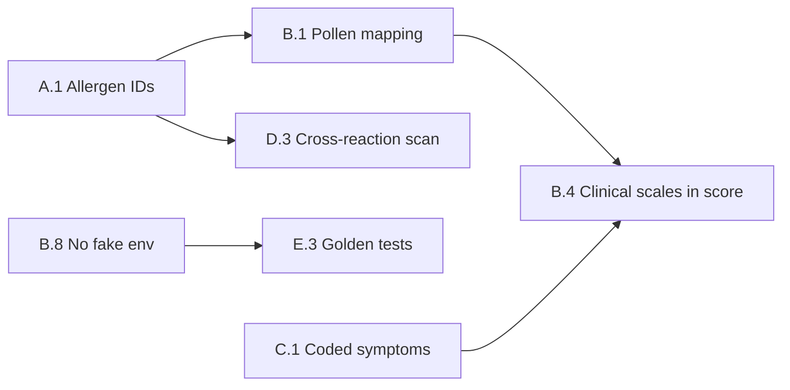

# AllerGuide — Clinical Accuracy Roadmap

Дорожная карта повышения точности **индекса самочувствия**, **профиля аллергика**, **дневника** и **сканера** на основе международных стандартов аллергологии и иммунологии.

**Связано:** [Roadmap to Production](./roadmap-to-prod.md) · [Functional Requirements](./functional-requirements.md)

---

## 1. Baseline (текущее состояние)

| Компонент | Реализация | Ограничение |
|-----------|------------|-------------|
| Индекс самочувствия | `packages/core/src/wellness.ts` + Open-Meteo | Эмпирические пороги; клинические шкалы не в score |
| Профиль | `allergen-database.ts`, `AllergenPicker` | ~~Хранились RU-лейблы~~ → **A.1: canonical ids** |
| Дневник | Structured wizard + `diary-stats` | Симптомы без SNOMED/ICD кодов |
| Сканер | `@allerguide/ai` + cross-reactions | Keyword matching; traces не различаются |
| Справочники | OFF, food-allergy DB, EAACI-контент | Частично интегрированы |

---

## 2. Международные опоры

| Область | Стандарт | Применение |
|---------|----------|------------|
| Таксономия | EAACI Molecular Allergology, ICD-11 CA08.* | Canonical allergen ids + crosswalk |
| Пищевая аллергия | EU 1169/2011 (14), FDA FALCPA (9) | `allergen-aliases` + OFF tags |
| Поллиноз | EAACI / GA²LEN calendars | Региональные календари (сейчас: Москва) |
| Воздух | EEA European AQI | Open-Meteo EAQI |
| Ринит / астма / кожа / крапивница | ARIA, GINA/ACT, SCORAD, UAS7 | `clinical-scales.ts` → wellness v2 |
| Кросс-реактивность | iFAAM, Allergome | `cross-reactions/` |

---

## 3. Фазы

### Phase A — Verified Allergy Profile

| ID | Задача | Статус |
|----|--------|--------|
| **A.1** | Миграция `profiles.allergies` на canonical ids (`milk`, `birch-pollen`) | ✅ Done |
| **A.2** | Маппинг EU14 / FDA9 / OFF → `allergenId` | ✅ Done |
| A.3 | ICD-11 / SNOMED crosswalk в doctor-report | Planned |
| A.4 | `confirmedBy`: self_reported / specific_ige / clinician | Planned |
| A.5 | Валидация профиля при save (дубликаты, consent) | Planned |
| A.6 | Catalog DB = source of truth + offline cache | Planned |

**A.1 deliverables:**
- `packages/core/src/profile-allergens.ts` — parse, serialize, migrate legacy labels
- DB migration v4 — rewrite stored JSON to ids
- `AllergenPicker` / catalog — select by id
- `ProfileInput.allergies` — canonical ids

**A.2 deliverables:**
- `packages/core/src/regulatory-allergens.ts` — EU14, FDA9, OFF explicit maps
- `mapExternalAllergenToId` / `mapExternalAllergenIds` — canonical ids from external vocabularies
- `expandAllergenTagsForScan` — ids → keywords for barcode ingredient enrichment
- `products.allergenTags` — canonical ids (OFF import + food-allergy dataset)
- EU14 gaps in taxonomy: `mustard`, `sulphites`, `lupin`

### Phase B — Wellness Engine v2

| ID | Задача | Статус |
|----|--------|--------|
| **B.8** | Убрать fake Open-Meteo fallback (42/45) | ✅ Done |
| B.1 | Пыльца по `pollen_taxon_id`, не substring | Partial (OPEN_METEO_POLLEN_ALLERGEN_IDS) |
| B.2 | Региональные pollen calendars | Planned |
| B.3 | Пороги пыльцы по EAACI / перцентилям | Planned |
| B.4 | ACT / ARIA / UAS7 в `computeWellnessScore` | Planned |
| B.5 | Дневник как time-series (7 дней) | Planned |
| B.6 | Cross-reactions в wellness risk | Planned |
| B.7 | `confidence` / `envDataAvailable` в UI | Partial (B.8) |
| B.9 | Калибровка весов (expert panel + beta) | Planned |

**B.8 deliverables:**
- `wellness-service.ts` — `envDataAvailable: false` при ошибке API
- Индекс считается по дневнику без синтетической среды
- i18n: `envUnavailable` / `envUnavailableSummary` (6 языков)

### Phase C — Diary & Symptoms

| ID | Задача |
|----|--------|
| C.1 | Симптомы по SNOMED / ICD кодам |
| C.2 | Severity 0–3 единая шкала |
| C.3 | Корреляция симптом ↔ триггер ±4 ч |
| C.4 | ACT auto-prompt раз в 4 недели |
| C.5 | АСИТ-трекинг в wellness trend |
| C.6 | Аномалии (3 дня симптомов без триггера) |
| C.7 | PDF timeline для врача |

### Phase D — Scanner v2

| ID | Задача |
|----|--------|
| D.1 | Risk: direct / cross / traces / unknown |
| D.2 | Catalog → OFF write-through priority |
| D.3 | OAS medium vs true allergy high |
| D.4 | «May contain» parsing |
| D.5 | Feedback queue для aliases |

### Phase E — Governance

| ID | Задача |
|----|--------|
| E.1 | Medical advisory board |
| E.2 | Evidence registry (порог → guideline + version) |
| E.3 | Golden test suite (20+ clinical scenarios) |
| E.4 | Beta metrics (ρ score ↔ ACT/ARIA) |
| E.5 | MDR / disclaimer v2 |

---

## 4. Критический путь

---

## 5. Метрики успеха

| Метрика | Target |
|---------|--------|
| Профили с canonical ids | ≥95% |
| Wellness без fake env data | 100% |
| Корреляция score ↔ ACT/ARIA (beta) | ρ ≥ 0.5 |
| False positive сканера (golden set) | <10% |
| Coded symptoms в дневнике | ≥80% |

---

## 6. Связанные файлы

| Файл | Назначение |
|------|------------|
| `packages/core/src/profile-allergens.ts` | A.1 — ids, migration |
| `packages/core/src/wellness.ts` | Scoring engine |
| `apps/mobile/src/services/wellness-service.ts` | Open-Meteo + B.8 |
| `packages/core/src/cross-reactions/` | Кросс-реактивность |
| `packages/core/src/clinical-scales.ts` | ARIA, ACT, SCORAD, UAS7 |
| `packages/core/src/diary-profile.ts` | Условия → шкалы дневника |

---

## 7. Disclaimer

Индекс самочувствия и рекомендации AllerGuide — **decision support**, не медицинский диагноз. Любые изменения весов и порогов требуют клинической валидации перед позиционированием как SaMD.
