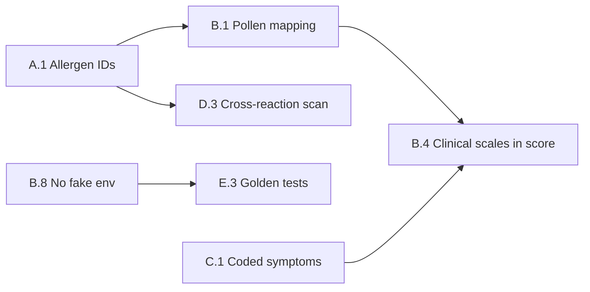

# AllerGuide — Clinical Accuracy Roadmap

Дорожная карта повышения точности **индекса самочувствия**, **профиля аллергика**, **дневника** и **сканера** на основе международных стандартов аллергологии и иммунологии.

**Связано:** [Roadmap to Production](./roadmap-to-prod.md) · [Functional Requirements](./functional-requirements.md)

---

## 1. Baseline (текущее состояние)

| Компонент | Реализация | Ограничение |
|-----------|------------|-------------|
| Индекс самочувствия | `packages/core/src/wellness.ts` + Open-Meteo | Эмпирические пороги; клинические шкалы не в score |
| Профиль | `allergen-database.ts`, `AllergenPicker` | ~~Хранились RU-лейблы~~ → **A.1: canonical ids** |
| Дневник | Structured wizard + `diary-stats` | Симптомы без SNOMED/ICD кодов |
| Сканер | `@allerguide/ai` + cross-reactions | Keyword matching; traces не различаются |
| Справочники | OFF, food-allergy DB, EAACI-контент | Частично интегрированы |

---

## 2. Международные опоры

| Область | Стандарт | Применение |
|---------|----------|------------|
| Таксономия | EAACI Molecular Allergology, ICD-11 CA08.* | Canonical allergen ids + crosswalk |
| Пищевая аллергия | EU 1169/2011 (14), FDA FALCPA (9) | `allergen-aliases` + OFF tags |
| Поллиноз | EAACI / GA²LEN calendars | Региональные календари (сейчас: Москва) |
| Воздух | EEA European AQI | Open-Meteo EAQI |
| Ринит / астма / кожа / крапивница | ARIA, GINA/ACT, SCORAD, UAS7 | `clinical-scales.ts` → wellness v2 |
| Кросс-реактивность | iFAAM, Allergome | `cross-reactions/` |

---

## 3. Фазы

### Phase A — Verified Allergy Profile

| ID | Задача | Статус |
|----|--------|--------|
| **A.1** | Миграция `profiles.allergies` на canonical ids (`milk`, `birch-pollen`) | ✅ Done |
| **A.2** | Маппинг EU14 / FDA9 / OFF → `allergenId` | ✅ Done |
| **A.3** | ICD-11 / SNOMED crosswalk в doctor-report | ✅ Done |
| **A.4** | `confirmedBy`: self_reported / specific_ige / clinician | ✅ Done |
| **A.5** | Валидация профиля при save (дубликаты, consent) | ✅ Done |
| **A.6** | Catalog DB = source of truth + offline cache | ✅ Done |

**A.1 deliverables:**
- `packages/core/src/profile-allergens.ts` — parse, serialize, migrate legacy labels
- DB migration v4 — rewrite stored JSON to ids
- `AllergenPicker` / catalog — select by id
- `ProfileInput.allergies` — canonical ids

**A.2 deliverables:**
- `packages/core/src/regulatory-allergens.ts` — EU14, FDA9, OFF explicit maps
- `mapExternalAllergenToId` / `mapExternalAllergenIds` — canonical ids from external vocabularies
- `expandAllergenTagsForScan` — ids → keywords for barcode ingredient enrichment
- `products.allergenTags` — canonical ids (OFF import + food-allergy dataset)
- EU14 gaps in taxonomy: `mustard`, `sulphites`, `lupin`

**A.3 deliverables:**
- `packages/core/src/clinical-coding.ts` — ICD-11 / SNOMED crosswalk per allergen id
- `buildCodedAllergyLines` / `formatCodedAllergiesReportHtml` in doctor PDF

**A.4 deliverables:**
- `packages/core/src/allergy-confirmations.ts` — `confirmedBy` per allergen
- `profiles.allergyConfirmations` JSON column (mobile v5 + API)
- `AllergyConfirmationEditor` UI in profile setup/edit

**A.5 deliverables:**
- `packages/core/src/profile-validation.ts` — `validateProfileInput`, dedupe, child consent
- Enforced in mobile `profile-service` and API `profiles` routes

**A.6 deliverables:**
- `packages/core/src/catalog-cache.ts` — TTL helpers
- `catalog-cache-service.ts` — offline SQLite / web storage for allergens + products
- `allergen-catalog-service.ts` — API-first with static fallback; warmed on app start
- `catalog-api.ts` — cache-before-network product lookup

**B.1 deliverables:**
- `packages/core/src/pollen-taxonomy.ts` — `PollenTaxonId`, Open-Meteo hourly keys → allergenId
- `parseOpenMeteoPollenHourly` — profile relevance by taxon id (not substring)
- Wellness fetches all 6 CAMS pollen taxa (incl. mugwort, alder, olive)

**B.2 deliverables:**
- `packages/core/src/pollen-regions.ts` — 5 reference regions + `resolvePollenRegion(lat, lon)`
- `POLLEN_CALENDARS` — Moscow, SPb, Krasnodar, Novosibirsk, Ekaterinburg
- Map pollen layer + wellness seasonal alerts use regional calendar

**B.3 deliverables:**
- `packages/core/src/pollen-thresholds.ts` — EAACI-inspired tiers per taxon + percentile helpers
- `pollenTier()` in `wellness.ts` uses taxon-specific cutoffs (not global 10/50)

**B.4 deliverables:**
- `WellnessInput.clinicalScales` — latest ACT / ARIA / SCORAD / UAS7 from diary
- `buildClinicalScalesFromTrends()` + scale penalties in `computeWellnessScore`

**B.5 deliverables:**
- `WellnessDiarySeries` — 7-day symptom/trigger days, streak, correlation
- `buildDiarySeriesFromInsights()` replaces boolean `recentSymptoms` flags

**B.6 deliverables:**
- `packages/core/src/wellness-cross-reactions.ts` — pollen-food / OAS penalty when pollen elevated
- Cross-reaction recommendations in wellness UI

**B.7 deliverables:**
- `computeWellnessConfidence()` — high / medium / low
- `WellnessSnapshot.confidence` + badge on home screen; `envDataAvailable` hint

**B.9 deliverables:**
- `packages/core/src/wellness-weights.ts` — versioned `WELLNESS_WEIGHTS` registry (`beta-1.0`)
- `computeWellnessScoreBreakdown()` exposes penalty components for E.4 calibration

### Phase B — Wellness Engine v2

| ID | Задача | Статус |
|----|--------|--------|
| **B.8** | Убрать fake Open-Meteo fallback (42/45) | ✅ Done |
| **B.1** | Пыльца по `pollen_taxon_id`, не substring | ✅ Done |
| **B.2** | Региональные pollen calendars | ✅ Done |
| **B.3** | Пороги пыльцы по EAACI / перцентилям | ✅ Done |
| **B.4** | ACT / ARIA / UAS7 в `computeWellnessScore` | ✅ Done |
| **B.5** | Дневник как time-series (7 дней) | ✅ Done |
| **B.6** | Cross-reactions в wellness risk | ✅ Done |
| **B.7** | `confidence` / `envDataAvailable` в UI | ✅ Done |
| **B.9** | Калибровка весов (expert panel + beta) | ✅ Done |

**B.8 deliverables:**
- `wellness-service.ts` — `envDataAvailable: false` при ошибке API
- Индекс считается по дневнику без синтетической среды
- i18n: `envUnavailable` / `envUnavailableSummary` (6 языков)

### Phase C — Diary & Symptoms

| ID | Задача | Статус |
|----|--------|--------|
| **C.1** | Симптомы по SNOMED / ICD кодам | ✅ Done |
| **C.2** | Severity 0–3 единая шкала | ✅ Done |
| **C.3** | Корреляция симптом ↔ триггер ±4 ч | ✅ Done |
| **C.4** | ACT auto-prompt раз в 4 недели | ✅ Done |
| **C.5** | АСИТ-трекинг в wellness trend | ✅ Done |
| **C.6** | Аномалии (3 дня симптомов без триггера) | ✅ Done |
| **C.7** | PDF timeline для врача | ✅ Done |

**C.1 deliverables:**
- `packages/core/src/symptom-coding.ts` — symptom catalog + SNOMED/ICD crosswalk
- `enrichSymptomAnswers()` on save; symptom picker step in diary wizard

**C.2 deliverables:**
- `packages/core/src/diary-severity.ts` — unified 0–3 scale + legacy 0–10 mapping
- `severity0_3` step in symptoms section; `severity` canonical field in answers

**C.3 deliverables:**
- `computeTemporalCorrelations()` — ±4h pairing in `diary-stats.ts`
- `DiaryInsights.temporalCorrelationKind` + wellness temporal bonus

**C.4 deliverables:**
- `isActPromptDue()` in `diary-profile.ts` (28-day interval)
- ACT prompt banner on diary screen for asthma profiles

**C.5 deliverables:**
- `WellnessInput.asit` + `computeAsitPenalty()` in wellness engine
- `wellness-service.ts` wires `computeAsitCompliance`

**C.6 deliverables:**
- `detectSymptomWithoutTriggerAnomaly()` — 3+ consecutive days
- Anomaly alert in `DiaryInsightsCard` + wellness recommendation

**C.7 deliverables:**
- `packages/core/src/doctor-report-timeline.ts` — chronological merge
- `timeline` block in doctor PDF (`doctor-report-service.ts`)

### Phase D — Scanner v2

| ID | Задача |
|----|--------|
| D.1 | Risk: direct / cross / traces / unknown |
| D.2 | Catalog → OFF write-through priority |
| D.3 | OAS medium vs true allergy high |
| D.4 | «May contain» parsing |
| D.5 | Feedback queue для aliases |

### Phase E — Governance

| ID | Задача |
|----|--------|
| E.1 | Medical advisory board |
| E.2 | Evidence registry (порог → guideline + version) |
| E.3 | Golden test suite (20+ clinical scenarios) |
| E.4 | Beta metrics (ρ score ↔ ACT/ARIA) |
| E.5 | MDR / disclaimer v2 |

---

## 4. Критический путь

---

## 5. Метрики успеха

| Метрика | Target |
|---------|--------|
| Профили с canonical ids | ≥95% |
| Wellness без fake env data | 100% |
| Корреляция score ↔ ACT/ARIA (beta) | ρ ≥ 0.5 |
| False positive сканера (golden set) | <10% |
| Coded symptoms в дневнике | ≥80% |

---

## 6. Связанные файлы

| Файл | Назначение |
|------|------------|
| `packages/core/src/profile-allergens.ts` | A.1 — ids, migration |
| `packages/core/src/clinical-coding.ts` | A.3 — ICD-11 / SNOMED |
| `packages/core/src/allergy-confirmations.ts` | A.4 — confirmedBy |
| `packages/core/src/profile-validation.ts` | A.5 — save validation |
| `apps/mobile/src/services/catalog-cache-service.ts` | A.6 — offline catalog |
| `packages/core/src/pollen-taxonomy.ts` | B.1 — pollen taxon ids |
| `packages/core/src/pollen-regions.ts` | B.2 — regional calendars |
| `packages/core/src/pollen-thresholds.ts` | B.3 — EAACI pollen tiers |
| `packages/core/src/wellness-weights.ts` | B.9 — scoring weights registry |
| `packages/core/src/wellness-cross-reactions.ts` | B.6 — cross-reaction risk |
| `packages/core/src/wellness.ts` | Scoring engine v2 (B.4–B.7) |
| `apps/mobile/src/services/wellness-service.ts` | Open-Meteo + B.8 |
| `packages/core/src/cross-reactions/` | Кросс-реактивность |
| `packages/core/src/clinical-scales.ts` | ARIA, ACT, SCORAD, UAS7 |
| `packages/core/src/diary-profile.ts` | Условия → шкалы дневника |
| `packages/core/src/symptom-coding.ts` | C.1 — SNOMED/ICD symptoms |
| `packages/core/src/diary-severity.ts` | C.2 — unified 0–3 severity |
| `packages/core/src/doctor-report-timeline.ts` | C.7 — PDF timeline |

---

## 7. Disclaimer

Индекс самочувствия и рекомендации AllerGuide — **decision support**, не медицинский диагноз. Любые изменения весов и порогов требуют клинической валидации перед позиционированием как SaMD.
