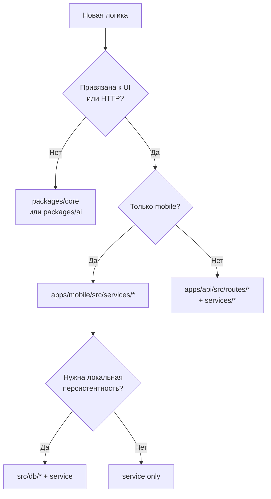

# AllerGuide — правила разработки

Обязательные правила для людей и AI-агентов при написании кода. Основаны на [`docs/architecture.md`](./architecture.md).

**Перед любой задачей:** прочитать релевантные разделы архитектуры → сверить с чеклистом в конце этого документа → писать код.

---

## 1. Иерархия документов

| Приоритет | Документ | Когда смотреть |
|-----------|----------|----------------|
| 1 | [`docs/architecture.md`](./architecture.md) | Куда класть код, слои, потоки данных, флаги |
| 2 | **Этот файл** | Конкретные правила и антипаттерны |
| 3 | [`docs/functional-requirements.md`](./functional-requirements.md) | Что должен делать продукт (FR-*) |
| 4 | [`docs/roadmap-to-prod.md`](./roadmap-to-prod.md) | В какой фазе задача, критерии готовности |
| 5 | [`AGENTS.md`](../AGENTS.md) | Команды, env, operational gotchas |

**Конфликт:** если требование FR противоречит архитектуре — сначала обсудить изменение архитектуры в `architecture.md`, потом код. Не обходить слои «для скорости».

---

## 2. Фундаментальные принципы

### 2.1. Offline-first

- Core flows (профили, дневник, SOS, сканер keyword/mock, PDF) **работают без сети и без API**.
- Новая фича не должна ломать offline-режим при выключенных `EXPO_PUBLIC_*` флагах.
- Сеть — **опциональное ускорение или обогащение**, не единственный источник правды для пользовательских данных.

### 2.2. Тонкие адаптеры

```
packages/core   — доменная логика, типы, справочники (без React, без HTTP)
packages/ai     — сканер, OCR-подготовка, LLM-клиент
apps/mobile     — экраны + src/services/* (оркестрация, локальная БД)
apps/api        — HTTP-маршруты, Drizzle, интеграции (OFF, OpenAI)
```

**Запрещено:** бизнес-правила (matching аллергенов, scoring дневника, bootstrap routing) в `app/*.tsx` или `routes/*.ts`.

### 2.3. Feature flags

- Опциональная интеграция с backend **всегда** за флагом (`src/constants/features.ts` на mobile, env на API).
- По умолчанию флаги **выключены** (см. `.env.example`).
- Не хардкодить URL API и не предполагать, что Postgres/LLM доступны.

### 2.4. Один источник правды для домена

| Данные | Источник правды |
|--------|-----------------|
| Таксономия аллергенов, cross-reactions | `@allerguide/core` |
| Маппинг OFF/датасет → RU ids | `mapExternalAllergenNames` в core |
| Пользовательские профили/дневник (offline) | Локальная БД (SQLite / IndexedDB) |
| Каталог продуктов (online) | Postgres `catalog.products` (+ OFF write-through) |
| Sync payload | Клиент шифрует; сервер хранит opaque blob |

---

## 3. Куда класть код

### 3.1. Дерево решений



### 3.2. `apps/mobile`

| Слой | Правило |
|------|---------|
| `app/**/*.tsx` | Только UI, навигация, вызовы сервисов и `useTranslation()`. **Без** прямого `getDb()`, SQL, `fetch` к API. |
| `src/services/*` | Оркестрация: локальная БД + вызов core/ai + опционально backend. Один сервис — одна предметная область. |
| `src/db/*` | Инициализация, миграции, web-store. Без бизнес-правил. |
| `src/store/*` | Только UI-state: активный профиль, locale, theme. **Не** хранить дневник/профили в Zustand. |
| `src/components/*` | Презентационные и составные компоненты без доступа к БД. |
| `src/i18n/*` | Строки и rich content. Новые ключи — во **все 6** локалей + `types.ts`. |

### 3.3. `apps/api`

| Слой | Правило |
|------|---------|
| `routes/*` | Парсинг запроса, auth, вызов service, HTTP-ответ. Без тяжёлой доменной логики. |
| `services/*` | Интеграции (OFF, users), нормализация. Домен — из core. |
| `db/*` | Схемы `profile` / `catalog` / `public`. Миграции версионированы в `drizzle/`. |
| `middleware/*` | Cross-cutting: security, JWT. |

**Схемы Postgres:** пользовательские данные → `profile`; справочники → `catalog`; Replit OIDC → `public`. Не смешивать.

### 3.4. `packages/core`

- Чистый TypeScript, без `react`, `expo`, `express`.
- Каждый нетривиальный модуль — unit-тест в `*.test.ts`.
- Публичный API — через `src/index.ts`.

### 3.5. `packages/ai`

- Сканирование, OCR-подготовка, LLM prompt/parse.
- Зависит только от `core` (аллергены, cross-reactions).
- Mobile/API вызывают `runSmartScan`, не дублируют keyword-matching.

---

## 4. Правила по подсистемам

### 4.1. Локальное хранилище

- Импорт БД: **только** `@/src/db/init` (платформа выбирается автоматически).
- Новые таблицы/колонки на native: `init.native.ts` + миграция в `migrations.ts` с инкрементом `CURRENT_SCHEMA_VERSION`.
- Web: те же сущности через JSON-ключи в IndexedDB; не вводить отдельную модель данных без синхронизации с native.
- `app_settings` — только KV настройки (onboarding, locale, auth ids), не бизнес-сущности.

### 4.2. Сканер

Поток (не нарушать порядок без ADR):

1. Опционально backend catalog (`PRODUCT_DB_ENABLED`)
2. Open Food Facts (direct с mobile или write-through на API)
3. `runSmartScan` → опционально LLM (`AI_SCAN_ENABLED`) → fallback `runMockScan`
4. `saveScanHistory` + analytics

Новые источники продуктов — через единый lookup-сервис на mobile и/или write-through на API, не дублировать цепочку в `scanner.tsx`.

### 4.3. Аутентификация

- Offline: `users` в локальной БД + `auth-service.ts`.
- Backend: JWT через `backend-api.ts`; токен в SecureStore (native) / settings (web).
- Не размазывать проверку auth по экранам — `auth-service.isAuthenticated()`, bootstrap в `app/index.tsx`.

### 4.4. Sync и бэкап

- Шифрование **на клиенте** (`@allerguide/core` crypto) до upload.
- Сервер не расшифровывает payload (zero-knowledge).
- Restore через `sync-restore.ts`, не вручную в экранах.

### 4.5. i18n

- **Активный стек:** `useTranslation()` из `locale-store.ts` + `locales/*.ts` + `content/*.ts`.
- Не добавлять строки в legacy i18next (`i18n/index.ts`) — он заглушен на native.
- Медицинские disclaimer и scan results: `translate.ts` / `localizeScanResult()`.

### 4.6. API и миграции

- Prod: `db:generate` → коммит SQL → `db:migrate`. **Не** `db:push` на БД с данными.
- Миграции на Neon: `DIRECT_DATABASE_URL`, `DB_PREPARE=false` для pooled runtime.
- Новые эндпоинты: rate-limit, CORS, тест в `routes/*.test.ts`.
- Внешние теги аллергенов: всегда `mapExternalAllergenNames` перед сохранением в `catalog`.

---

## 5. Качество и тесты

### 5.1. Обязательные проверки перед PR

```bash
pnpm install
pnpm typecheck
pnpm test
pnpm --filter mobile lint   # при изменениях в apps/mobile
```

### 5.2. Где писать тесты

| Изменение | Тест |
|-----------|------|
| `packages/core` | `packages/core/src/*.test.ts` |
| `packages/ai` | `packages/ai/src/*.test.ts` |
| `apps/api` routes/services | `apps/api/src/**/*.test.ts` |
| `apps/mobile` services | `apps/mobile/src/services/*.test.ts` |
| UI-экраны | E2E (Phase 2 roadmap); unit на сервисы, не на JSX |

### 5.3. Scope изменений

- Минимальный diff, решающий задачу.
- Не рефакторить несвязанный код в том же PR.
- Не добавлять зависимости без необходимости; Expo-пакеты — через `npx expo install`.

---

## 6. Соглашения

### 6.1. Именование

Общие соглашения (дополняют архитектурные правила §3):

| Сущность | Стиль | Пример |
|----------|-------|--------|
| Классы, React-компоненты | PascalCase | `ProfileSwitcher`, `BarcodeCacheEntry` |
| Переменные, функции, методы | camelCase | `resolveProductByBarcode`, `getUserData` |
| Файлы, каталоги | kebab-case | `barcode-lookup-service.ts`, `scan-history-service.ts` |
| Константы, env | UPPERCASE | `PRODUCT_DB_ENABLED`, `JWT_SECRET` |
| Типы / интерфейсы | PascalCase | `ScanResult`, `LocaleMessages` |

Специфика monorepo:

- Сервисы mobile: `*-service.ts` (`profile-service.ts`)
- API routes: `register*Routes(app)` в `routes/*.ts`
- Feature flags: `*_ENABLED` в `features.ts`, env `EXPO_PUBLIC_*` / server env
- Миграции Drizzle: коммитить сгенерированный SQL в `apps/api/drizzle/`

### 6.2. Зависимости между пакетами

```
mobile → core, ai, ui
api    → core, ai
ai     → core
ui     → (peer RN only)
```

**Запрещено:** `core` → `mobile`/`api`; `ai` → `mobile`.

### 6.3. Безопасность

- Секреты только в env, не в коде.
- JWT secret, SESSION_SECRET — длинные random строки.
- Пользовательские данные на API: проверка `userId` из JWT (без IDOR).
- Sync/backup: opaque storage, no server-side decrypt.

---

## 7. План разработки и фазы

Задачи привязываются к фазам из [`docs/roadmap-to-prod.md`](./roadmap-to-prod.md). При взятии задачи:

1. Определить фазу (P0–P5) и затронутые слои (mobile / api / core / ai).
2. Проверить, не нарушает ли offline-first и feature flags.
3. Если задача требует новый env-флаг — обновить `.env.example`, `features.ts`, `architecture.md` (таблица env).

### Архитектурные гейты по фазам

| Фаза | Архитектурный критерий |
|------|------------------------|
| **P0** Stabilization | Core flows без API; регрессия по `qa-checklist.md` |
| **P1** Backend | Флаги auth/sync/scan/product DB; dual-write через services, не в UI |
| **P2** Quality | Тесты на сервисах и core; E2E smoke; не ломать offline |
| **P3** Compliance | Account deletion через auth-service + API; zero-knowledge sync сохранён |
| **P4** Launch | Production env матрица из roadmap §4; все optional paths задокументированы |
| **P5** Post-launch | OCR/масштабирование — расширение `packages/ai` и API, не обход слоёв |

---

## 8. Чеклист перед merge

Использовать для self-review и code review:

- [ ] Прочитан релевантный раздел [`architecture.md`](./architecture.md)
- [ ] Бизнес-логика в `core` / `ai`, не в экранах и не в route handlers
- [ ] Экраны не обращаются к БД и API напрямую
- [ ] Offline-режим работает при выключенных флагах
- [ ] Новые строки i18n — во всех 6 локалях + `types.ts`
- [ ] Новые env — в `.env.example` и документации
- [ ] Postgres: миграция сгенерирована и закоммичена (если менялась схема)
- [ ] `pnpm typecheck` и `pnpm test` проходят
- [ ] Нет unrelated изменений в diff
- [ ] Типизация без `any`; `import type` для type-only импортов
- [ ] Нет дублирования логики; ошибки обработаны осмысленно
- [ ] Публичные API (`core`, `ai`, services) задокументированы JSDoc (см. §10)

---

## 9. Антипаттерны (не делать)

| Антипаттерн | Правильно |
|-------------|-----------|
| SQL в `app/(tabs)/*.tsx` | `*-service.ts` |
| Keyword matching аллергенов в mobile | `@allerguide/ai` + `core` |
| `fetch('/api/...')` в компоненте | `api-client.ts` / `backend-api.ts` / domain service |
| Хранение профилей в Zustand | SQLite / IndexedDB via `profile-service` |
| `db:push` на staging/prod | `db:migrate` |
| Новая фича только с backend | Offline fallback + feature flag |
| Строки только в `ru.ts` | Все 6 локалей |
| Дублирование OFF lookup в UI и service | Один lookup в service layer |

---

## 10. TypeScript и стандарты кода

> **Приоритет:** архитектурные правила (§2–3) и offline-first важнее общих соглашений ниже.  
> Стек AllerGuide: TypeScript, Node.js (`apps/api`), Expo / React Native (`apps/mobile`), pnpm workspaces, Drizzle, Vitest. **Zod** — для новых API-схем валидации; **Lodash** — только при явной необходимости (в проекте по умолчанию не используется).

### Overview

You are an expert in TypeScript and Node.js development, and in the libraries and frameworks used in this monorepo. Follow user and architecture requirements carefully.

**Before coding:**

1. Restate the objective of the change in a short summary.
2. Think step-by-step: describe the plan in pseudocode or bullet points with enough detail to implement.
3. Confirm which layer owns the change (`core` / `ai` / `services` / `routes` / UI) per §3.

### Tech stack (this repo)

| Layer | Stack |
|-------|--------|
| Shared domain | TypeScript, Vitest (`packages/core`, `packages/ai`) |
| API | TypeScript, Node.js, Express, Drizzle, Zod (new validation) |
| Mobile | TypeScript, Expo, React Native, Zustand, expo-sqlite / IndexedDB |
| Tooling | pnpm, Turborepo, ESLint |

Performance: prefer `Promise.all()` for independent async work; avoid N+1 queries; batch DB reads in services.

### Shortcuts (Cursor / pair programming)

| Trigger | Action |
|---------|--------|
| **CURSOR:PAIR** | Act as pair programmer and senior dev: suggest alternatives, weigh trade-offs, align with architecture. |
| **RFC** | Refactor per provided instructions; follow architecture layers and minimal scope. |
| **RFP** | Improve the prompt: break into steps, clarify goal first; follow [Google Technical Writing Style Guide](https://developers.google.com/tech-writing). |

### Core principles

- Write straightforward, readable, maintainable code.
- Follow SOLID and familiar design patterns within monorepo constraints.
- Use strong typing; avoid `any` (use `unknown` + narrowing when needed).
- Prefer immutability (`readonly` fields, spread over mutation) in domain types.

### Functions

- Descriptive names: verbs + nouns (`getUserData`, `resolveBootstrapRoute`).
- Prefer arrow functions for short callbacks; named `function` for hoisted exports if clearer.
- Use default parameters and object destructuring for optional args.
- Document **exported** functions with JSDoc (TypeDoc-compatible tags only).

### Types and interfaces

- **API boundaries (new code):** prefer a Zod schema + `z.infer<typeof Schema>` for request/response bodies.
- **Domain (`packages/core`):** TypeScript interfaces/types are fine; keep schemas close to modules that own the data.
- Use `import type` when an import is only used as a type.
- Use `readonly` for immutable properties on shared types.
- Re-export public types from package `index.ts` when part of the package API.

### Code review checklist

In addition to §8:

- [ ] Proper typing (no stray `any`)
- [ ] No duplicated logic across mobile / API / core
- [ ] Error handling: user-safe messages; no swallowed failures in services
- [ ] Tests for non-trivial behavior in the right package
- [ ] Naming matches §6.1
- [ ] Structure readable; files stay focused (single responsibility)

### Documentation

When writing READMEs, architecture docs, or JSDoc:

- Follow [Google Technical Writing Style Guide](https://developers.google.com/tech-writing).
- Define terms when needed; use active voice and present tense.
- Use lists and tables for structured information.
- **JSDoc:** TypeDoc-compatible tags only (`@param`, `@returns`, `@throws`, `@example`).
- **Scope in this repo:** JSDoc on exported functions, classes, and types in `packages/core`, `packages/ai`, and `apps/*/src/services`. Internal helpers need JSDoc only when behavior is non-obvious.

### Git commit rules

- **Title:** brief, imperative mood; [Conventional Commits](https://www.conventionalcommits.org/) (`feat:`, `fix:`, `docs:`, `refactor:`, `test:`, `chore:`).
- **Body:** elaborate context after a blank line (two newlines after title); mention architecture impact if any.
- **Example:**

  ```
  feat(scanner): add local barcode cache lookup

  Route barcode resolution through barcode-lookup-service before OFF.
  Keeps offline-first path when PRODUCT_DB_ENABLED is false.
  ```

---

## Связанные документы

- [`docs/architecture.md`](./architecture.md) — полная архитектура
- [`docs/roadmap-to-prod.md`](./roadmap-to-prod.md) — фазы и критерии релиза
- [`docs/functional-requirements.md`](./functional-requirements.md) — FR-требования
- [`docs/qa-checklist.md`](./qa-checklist.md) — регрессия
- [`AGENTS.md`](../AGENTS.md) — команды для агентов и разработчиков
