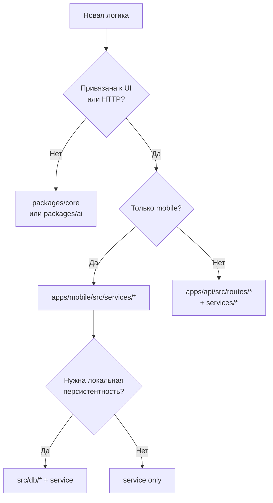

# AllerGuide — правила разработки

Обязательные правила для людей и AI-агентов при написании кода. Основаны на [`docs/architecture.md`](./architecture.md).

**Перед любой задачей:** прочитать релевантные разделы архитектуры → сверить с чеклистом в конце этого документа → писать код.

---

## 1. Иерархия документов

| Приоритет | Документ | Когда смотреть |
|-----------|----------|----------------|
| 1 | [`docs/architecture.md`](./architecture.md) | Куда класть код, слои, потоки данных, флаги |
| 2 | **Этот файл** | Конкретные правила и антипаттерны |
| 2.1 | **Этот файл §10** | Стиль и качество кода (Code Complete) |
| 2.2 | [`docs/codebase-index.md`](./codebase-index.md) | Быстрая карта файлов: маршруты, сервисы, «куда менять X» |
| 3 | [`docs/functional-requirements.md`](./functional-requirements.md) | Что должен делать продукт (FR-*) |
| 4 | [`docs/roadmap-to-prod.md`](./roadmap-to-prod.md) | В какой фазе задача, критерии готовности |
| 5 | [`AGENTS.md`](../AGENTS.md) | Команды, env, operational gotchas |

**Конфликт:** если требование FR противоречит архитектуре — сначала обсудить изменение архитектуры в `architecture.md`, потом код. Не обходить слои «для скорости».

---

## 2. Фундаментальные принципы

### 2.1. Offline-first

- Core flows (профили, дневник, SOS, сканер keyword/mock, PDF) **работают без сети и без API**.
- Новая фича не должна ломать offline-режим при выключенных `EXPO_PUBLIC_*` флагах.
- Сеть — **опциональное ускорение или обогащение**, не единственный источник правды для пользовательских данных.

### 2.2. Тонкие адаптеры

```
packages/core   — доменная логика, типы, справочники (без React, без HTTP)
packages/ai     — сканер, OCR-подготовка, LLM-клиент
apps/mobile     — экраны + src/services/* (оркестрация, локальная БД)
apps/api        — HTTP-маршруты, Drizzle, интеграции (OFF, OpenAI)
```

**Запрещено:** бизнес-правила (matching аллергенов, scoring дневника, bootstrap routing) в `app/*.tsx` или `routes/*.ts`.

### 2.3. Feature flags

- Опциональная интеграция с backend **всегда** за флагом (`src/constants/features.ts` на mobile, env на API).
- По умолчанию флаги **выключены** (см. `.env.example`).
- Не хардкодить URL API и не предполагать, что Postgres/LLM доступны.

### 2.4. Один источник правды для домена

| Данные | Источник правды |
|--------|-----------------|
| Таксономия аллергенов, cross-reactions | `@allerguide/core` |
| Маппинг OFF/датасет → RU ids | `mapExternalAllergenNames` в core |
| Пользовательские профили/дневник (offline) | Локальная БД (SQLite / IndexedDB) |
| Каталог продуктов (online) | Postgres `catalog.products` (+ OFF write-through) |
| Sync payload | Клиент шифрует; сервер хранит opaque blob |

### 2.5. Бронхиальная астма — только GINA

Вся логика, пороги, контент и отчёты по **бронхиальной астме** должны опираться на публичные ориентиры [GINA](https://ginasthma.org/) (Global Initiative for Asthma):

| Область | Модуль в `packages/core` |
|---------|--------------------------|
| Единый источник порогов и метаданных | `gina-asthma.ts` |
| Зоны ПСВ (traffic-light) | `pef-zones.ts` → константы из `gina-asthma.ts` |
| Шкала ACT | `clinical-scales.ts` → `classifyActScoreGina()` |
| Напоминание ACT (4 нед.) | `diary-profile.ts` → `GINA_ACT_PROMPT_INTERVAL_DAYS` |
| План действий | `asthma-action-plan.ts` |
| Экспертные статьи | `expert-content.ts` — id из `GINA_ASTHMA_EXPERT_ARTICLE_IDS`, упоминание GINA в body/tags |
| Evidence registry | `evidence-registry.ts` — guideline `GINA`, citation `gina-asthma.ts` |

**Запрещено:** произвольные пороги ACT/ПСВ в mobile или API; парсинг сайта GINA; встраивание PDF без лицензии; пользовательские тексты главной, называющие ACT/ARIA/GINA (логика остаётся в core, copy — plain-language, `home-insights` + `wellness-display`).

**Обязательно:** при новой астма-фиче — зарегистрировать id в `GINA_ASTHMA_FEATURE_IDS`, добавить тест в `gina-asthma.test.ts`, обновить evidence при изменении порогов. Пользовательский ввод шкал — экран `/clinical-scales`, не полный wizard дневника.

---

## 3. Куда класть код

### 3.1. Дерево решений



### 3.2. `apps/mobile`

| Слой | Правило |
|------|---------|
| `app/**/*.tsx` | Только UI, навигация, вызовы сервисов и `useTranslation()`. **Без** прямого `getDb()`, SQL, `fetch` к API. |
| `src/services/*` | Оркестрация: локальная БД + вызов core/ai + опционально backend. Один сервис — одна предметная область. |
| `src/db/*` | Инициализация, миграции, web-store. Без бизнес-правил. |
| `src/store/*` | Только UI-state: активный профиль, locale, theme. **Не** хранить дневник/профили в Zustand. |
| `src/components/*` | Презентационные и составные компоненты без доступа к БД. |
| `src/i18n/*` | Строки и rich content. Новые ключи — во **все 6** локалей + `types.ts`. |

### 3.3. `apps/api`

| Слой | Правило |
|------|---------|
| `routes/*` | Парсинг запроса, auth, вызов service, HTTP-ответ. Без тяжёлой доменной логики. |
| `services/*` | Интеграции (OFF, users), нормализация. Домен — из core. |
| `db/*` | Схемы `profile` / `catalog` / `public`. Миграции версионированы в `drizzle/`. |
| `middleware/*` | Cross-cutting: security, JWT. |

**Схемы Postgres:** пользовательские данные → `profile`; справочники → `catalog`. Не смешивать.

### 3.4. `packages/core`

- Чистый TypeScript, без `react`, `expo`, `express`.
- Каждый нетривиальный модуль — unit-тест в `*.test.ts`.
- Публичный API — через `src/index.ts`.

### 3.5. `packages/ai`

- Сканирование, OCR-подготовка, LLM prompt/parse.
- Зависит только от `core` (аллергены, cross-reactions).
- Mobile/API вызывают `runSmartScan`, не дублируют keyword-matching.

---

## 4. Правила по подсистемам

### 4.1. Локальное хранилище

- Импорт БД: **только** `@/src/db/init` (платформа выбирается автоматически).
- Новые таблицы/колонки на native: `init.native.ts` + миграция в `migrations.ts` с инкрементом `CURRENT_SCHEMA_VERSION`.
- Web: те же сущности через JSON-ключи в IndexedDB; не вводить отдельную модель данных без синхронизации с native.
- `app_settings` — только KV настройки (onboarding, locale, auth ids), не бизнес-сущности.

### 4.2. Сканер

Поток (не нарушать порядок без ADR):

1. Опционально backend catalog (`PRODUCT_DB_ENABLED`)
2. Open Food Facts (direct с mobile или write-through на API)
3. `runSmartScan` → опционально LLM (`AI_SCAN_ENABLED`) → fallback `runMockScan`
4. `saveScanHistory` + analytics

Новые источники продуктов — через единый lookup-сервис на mobile и/или write-through на API, не дублировать цепочку в `scanner.tsx`.

### 4.3. Аутентификация

- Offline: `users` в локальной БД + `auth-service.ts`.
- Backend: JWT через `backend-api.ts`; токен в SecureStore (native) / settings (web).
- Не размазывать проверку auth по экранам — `auth-service.isAuthenticated()`, bootstrap в `app/index.tsx`.

### 4.4. Sync и бэкап

- Шифрование **на клиенте** (`@allerguide/core` crypto) до upload.
- Сервер не расшифровывает payload (zero-knowledge).
- Restore через `sync-restore.ts`, не вручную в экранах.

### 4.5. i18n

- **Активный стек:** `useTranslation()` из `locale-store.ts` + `locales/*.ts` + `content/*.ts`.
- Не добавлять строки в legacy i18next (`i18n/index.ts`) — он заглушен на native.
- Медицинские disclaimer и scan results: `translate.ts` / `localizeScanResult()`.

### 4.6. API и миграции

- Prod: `db:generate` → коммит SQL → `db:migrate`. **Не** `db:push` на БД с данными.
- Миграции на Neon: `DIRECT_DATABASE_URL`, `DB_PREPARE=false` для pooled runtime.
- Новые эндпоинты: rate-limit, CORS, тест в `routes/*.test.ts`.
- Внешние теги аллергенов: всегда `mapExternalAllergenNames` перед сохранением в `catalog`.

---

## 5. Качество и тесты

### 5.1. Обязательные проверки перед PR

```bash
pnpm install
pnpm typecheck
pnpm test
pnpm --filter mobile lint   # при изменениях в apps/mobile
```

### 5.2. Где писать тесты

| Изменение | Тест |
|-----------|------|
| `packages/core` | `packages/core/src/*.test.ts` |
| `packages/ai` | `packages/ai/src/*.test.ts` |
| `apps/api` routes/services | `apps/api/src/**/*.test.ts` |
| `apps/mobile` services | `apps/mobile/src/services/*.test.ts` |
| UI-экраны | E2E (Phase 2 roadmap); unit на сервисы, не на JSX |

### 5.3. Scope изменений

- Минимальный diff, решающий задачу.
- Не рефакторить несвязанный код в том же PR.
- Не добавлять зависимости без необходимости; Expo-пакеты — через `npx expo install`.

---

## 6. Соглашения

### 6.1. Именование

- Сервисы mobile: `*-service.ts` (`profile-service.ts`)
- API routes: `register*Routes(app)` в `routes/*.ts`
- Feature flags: `*_ENABLED` в `features.ts`, env `EXPO_PUBLIC_*` / server env
- Миграции Drizzle: коммитить сгенерированный SQL в `apps/api/drizzle/`

### 6.2. Зависимости между пакетами

```
mobile → core, ai, ui
api    → core, ai
ai     → core
ui     → (peer RN only)
```

**Запрещено:** `core` → `mobile`/`api`; `ai` → `mobile`.

### 6.3. Безопасность

- Секреты только в env, не в коде.
- JWT secret, SESSION_SECRET — длинные random строки.
- Пользовательские данные на API: проверка `userId` из JWT (без IDOR).
- Sync/backup: opaque storage, no server-side decrypt.

---

## 7. План разработки и фазы

Задачи привязываются к фазам из [`docs/roadmap-to-prod.md`](./roadmap-to-prod.md). При взятии задачи:

1. Определить фазу (P0–P5) и затронутые слои (mobile / api / core / ai).
2. Проверить, не нарушает ли offline-first и feature flags.
3. Если задача требует новый env-флаг — обновить `.env.example`, `features.ts`, `architecture.md` (таблица env).

### Архитектурные гейты по фазам

| Фаза | Архитектурный критерий |
|------|------------------------|
| **P0** Stabilization | Core flows без API; регрессия по `qa-checklist.md` |
| **P1** Backend | Флаги auth/sync/scan/product DB; dual-write через services, не в UI |
| **P2** Quality | Тесты на сервисах и core; E2E smoke; не ломать offline |
| **P3** Compliance | Account deletion через auth-service + API; zero-knowledge sync сохранён |
| **P4** Launch | Production env матрица из roadmap §4; все optional paths задокументированы |
| **P5** Post-launch | OCR/масштабирование — расширение `packages/ai` и API, не обход слоёв |

---

## 8. Чеклист перед merge

Использовать для self-review и code review:

- [ ] Прочитан релевантный раздел [`architecture.md`](./architecture.md)
- [ ] Бизнес-логика в `core` / `ai`, не в экранах и не в route handlers
- [ ] Экраны не обращаются к БД и API напрямую
- [ ] Offline-режим работает при выключенных флагах
- [ ] Новые строки i18n — во всех 6 локалях + `types.ts`
- [ ] Новые env — в `.env.example` и документации
- [ ] Postgres: миграция сгенерирована и закоммичена (если менялась схема)
- [ ] `pnpm typecheck` и `pnpm test` проходят
- [ ] Сложность и читаемость: guard clauses, без магических чисел, defensive input ([§10](./development-rules.md#10-стандарты-качества-кода-code-complete))
- [ ] Нет unrelated изменений в diff
- [ ] Астма-логика ссылается на `gina-asthma.ts` (см. §2.5), не дублирует пороги ACT/ПСВ

---

## 9. Антипаттерны (не делать)

| Антипаттерн | Правильно |
|-------------|-----------|
| SQL в `app/(tabs)/*.tsx` | `*-service.ts` |
| Keyword matching аллергенов в mobile | `@allerguide/ai` + `core` |
| `fetch('/api/...')` в компоненте | `api-client.ts` / `backend-api.ts` / domain service |
| Хранение профилей в Zustand | SQLite / IndexedDB via `profile-service` |
| `db:push` на staging/prod | `db:migrate` |
| Новая фича только с backend | Offline fallback + feature flag |
| Строки только в `ru.ts` | Все 6 локалей |
| Дублирование OFF lookup в UI и service | Один lookup в service layer |

---

## 10. Стандарты качества кода (Code Complete)

При написании и рефакторинге кода следовать принципам Стива Макконнелла («Совершенный код»). Основная метрика — **минимизация сложности и максимальная читаемость** (главы 5 и 33).

### 1. Проектирование и сложность (Главы 5–7: Design in Construction)

- **High Cohesion, Low Coupling:** Классы и модули должны выполнять одну четкую задачу. Если класс содержит данные и методы, которые не используются совместно в 80% случаев, предложи разделение.
- **Скрытие информации (Information Hiding):** Скрывай детали реализации за чистыми интерфейсами. Не генерируй публичные поля; используй геттеры/сеттеры только там, где это действительно необходимо для внешнего мира.
- **Дефенсивное программирование (Defensive Programming, Глава 8):** Проверяй все входные данные из внешних источников (API, пользовательский ввод). Используй ассерты для внутренних инвариантов и исключения для обработки внештатных ситуаций во внешнем взаимодействии. Никогда не пропускай "мусор" (Garbage in, garbage out).

### 2. Именование (Глава 11: The Power of Variable Names)

- **Длина имени соответствует области видимости:** `i` допустимо для цикла из 3 строк, но категорически запрещено в полях класса. Имена полей класса должны быть полными и описательными.
- **Избегай магических чисел:** Любое число, кроме 0, 1, `null`, должно быть вынесено в хорошо названную константу.
- **Читаемость важнее математической краткости:** Не пиши `i < a.length - 1`, если имеешь в виду "предпоследний элемент" — напиши метод `isNotLastElement(i, array)`.
- **Булевы переменные:** Должны отвечать на вопрос "да/нет" (`isValid`, `hasErrors`, `canProceed`). Избегай отрицаний в названиях (`isNotValid` → используй `isValid` с инверсией логики).

### 3. Структура кода (Главы 14–17: Control Flow & Layout)

- **Единый выход (Single Exit):** Избегай глубокой вложенности (более 3 уровней). Если условие в начале метода делает продолжение бессмысленным, используй Guard Clauses (ранний возврат).
- **Форматирование как оглавление:** Код должен читаться как газетная статья — сверху вниз, важное первым. Используй пустые строки для разделения логических блоков, а не просто декоративно.
- **Правила для конструкторов:** Инициализируй ВСЕ поля класса. Не вызывай виртуальные методы в конструкторах.

### 4. Качество и ревью (Главы 20–23)

- **Пиши код для чтения, а не для написания.** Если я прошу сгенерировать алгоритм, сначала напиши комментарий о намерении (Pseudocode Programming Process, PPP), затем воплоти его.
- **Обработка ошибок:** Не возвращай null из методов, возвращающих коллекции (возвращай пустой список). Используй Optional для значений, которые могут отсутствовать семантически. Не глотай исключения (`catch (Exception e) {}` строго запрещен, всегда логируй или пробрасывай дальше).

### 5. Стиль ответов

- **Перед написанием кода** проверяй, можно ли упростить задачу на уровне дизайна (ищи "вторую правду", а не первую пришедшую в голову реализацию).
- При рефакторинге предлагай изменения в терминах книги: "Это нарушает High Cohesion...", "Здесь нужно применить Information Hiding...".

---

## Связанные документы

- [`docs/architecture.md`](./architecture.md) — полная архитектура
- [`docs/roadmap-to-prod.md`](./roadmap-to-prod.md) — фазы и критерии релиза
- [`docs/functional-requirements.md`](./functional-requirements.md) — FR-требования
- [`docs/qa-checklist.md`](./qa-checklist.md) — регрессия
- [`AGENTS.md`](../AGENTS.md) — команды для агентов и разработчиков
