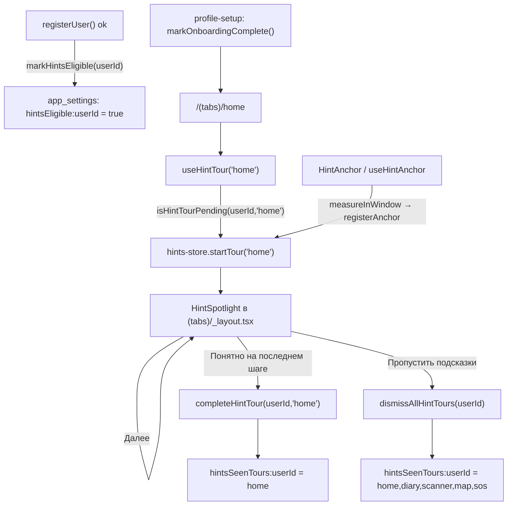

# План: подсказки по основным функциям после регистрации

Регистрация → intro → сценарий → мастер профиля → главная. Сразу после того, как **новый** пользователь впервые попадает на главную, поверх интерфейса показывается серия coach marks: затемняющий оверлей с вырезом вокруг реального элемента и бабл с объяснением. Тур повторяется по одному разу на каждом ключевом табе (главная, дневник, сканер, карта, SOS) при первом заходе. При повторном открытии приложения подсказок нет.

**Связано:** [`functional-requirements.md`](./functional-requirements.md) §5 (FR-ONB-01…06) · [`architecture.md`](./architecture.md) · [`development-rules.md`](./development-rules.md) · [`maestro.md`](./maestro.md) · [`.cursor/rules/design-tokens.mdc`](../.cursor/rules/design-tokens.mdc) · [`.cursor/rules/analytics-events.mdc`](../.cursor/rules/analytics-events.mdc)

---

## 1. Сценарии

| # | Сценарий | Ожидаемое поведение |
|---|----------|---------------------|
| S1 | Новый пользователь завершил мастер профиля и попал на `/(tabs)/home` | Тур `home` запускается автоматически: 5 шагов со спотлайтом на реальных элементах |
| S2 | Пользователь дошёл до последнего шага тура и нажал «Понятно» | Тур этого экрана помечается просмотренным; на этом экране больше не появляется |
| S3 | Пользователь нажал «Пропустить подсказки» на любом шаге | Завершаются **все** туры сразу — ни один экран больше не показывает подсказок |
| S4 | После тура `home` пользователь открывает таб «Дневник» | Запускается тур `diary` (свои шаги). Аналогично `scanner`, `map`, `sos` |
| S5 | Пользователь закрыл приложение и открыл снова | Подсказок нет: просмотренные туры сохранены локально, непросмотренные показываются только если пользователь так и не заходил на этот таб |
| S6 | Существующий пользователь обновил приложение и вошёл (не регистрация) | Подсказок нет: тур привязан к факту **регистрации**, а не к «ещё не видел» |
| S7 | На том же устройстве регистрируется второй аккаунт | Второй пользователь видит подсказки заново: состояние хранится по `userId` |
| S8 | Элемент шага не отрисован (главная в скелетоне, карта без данных, SOS без профиля) | Шаг пропускается; если не резолвится ни один шаг — тур не показывается и **не** помечается просмотренным |
| S9 | Offline, все `EXPO_PUBLIC_*` флаги выключены | Подсказки работают полностью: данные и состояние локальные, сеть не нужна |

Не входит в объём: пункт «Показать подсказки снова» в настройках (осознанно отказались), подсказки на вложенных экранах (`/profile`, `/expert`, `/market`), изменение intro-карусели и мастера профиля, обучающие видео.

---

## 2. Что есть сейчас

| Слой | Файл | Поведение |
|------|------|-----------|
| Bootstrap-маршрут | [`apps/mobile/app/index.tsx`](../apps/mobile/app/index.tsx) → `resolveAuthedBootstrapRoute` в [`packages/core/src/onboarding.ts`](../packages/core/src/onboarding.ts) | Решает, куда идти: `/login`, `/onboarding-intro`, `/onboarding`, `/profile-setup`, `/(tabs)/home` |
| Флаги первого запуска | [`apps/mobile/src/services/settings-service.ts`](../apps/mobile/src/services/settings-service.ts) | `introComplete`, `onboardingComplete`, `scenario`, `activeProfileId`, `authUserId` — KV в `app_settings` |
| Регистрация | [`apps/mobile/src/services/auth-service.ts`](../apps/mobile/src/services/auth-service.ts) `registerUser()` | Две ветки (backend / локальная), обе заканчиваются `setSessionUserId(user.id)` |
| Intro-карусель | [`apps/mobile/app/onboarding-intro.tsx`](../apps/mobile/app/onboarding-intro.tsx) | 5 полноэкранных слайдов **до** создания профиля; про элементы интерфейса не рассказывает |
| Оверлей на весь экран | [`apps/mobile/src/components/AppLockGate.tsx`](../apps/mobile/src/components/AppLockGate.tsx) | Абсолютный `View` поверх `children` — образец для оверлея без `Modal` |
| Скрим модалок | [`apps/mobile/src/components/ListPickerSheet.tsx`](../apps/mobile/src/components/ListPickerSheet.tsx) | `colors.overlay` @ 0.45 — образец токена затемнения |
| Reduce motion | [`apps/mobile/src/components/Skeleton.tsx`](../apps/mobile/src/components/Skeleton.tsx) | Локальный `useReduceMotion()` через `AccessibilityInfo` |

**Разрыв.** Ни tooltip, ни coach mark, ни spotlight в `apps/mobile` нет: «подсказки» в коде — это статичный текст (`*Hint`-ключи, токены `tipBg` / `tipBorder` / `tipText`). Intro-карусель рассказывает про продукт **до** того, как пользователь увидел интерфейс, и не привязана к элементам. После мастера профиля пользователь оказывается на главной без объяснения, что такое индекс самочувствия, зачем таб «Сканер» и где SOS.

**Почему нельзя переиспользовать `introComplete`.** Он глобален по устройству и не сбрасывается при логауте, а показ по правилу «ещё не видел» покажет подсказки всем существующим пользователям после обновления (нарушает S6). Нужен отдельный признак «пользователь только что зарегистрировался», проставляемый в `registerUser`.

---

## 3. Целевая архитектура

Доменная логика (гейтинг, сериализация состояния) — в `packages/core`; персистентность и аналитика — в `src/services/*`; измерение и рендер — в компонентах. Экраны только объявляют якоря и вызывают хук ([`development-rules.md`](./development-rules.md) §2.2, §3.2).

### 3.1. Поток



### 3.2. Ядро

`packages/core/src/first-run-hints.ts` — чистый TypeScript, без React:

```ts
export const HINT_TOUR_IDS = ['home', 'diary', 'scanner', 'map', 'sos'] as const;
export type HintTourId = (typeof HINT_TOUR_IDS)[number];

/** Незнакомые id из хранилища отбрасываются: список мог быть записан старой версией. */
export function parseSeenHintTours(raw: string | null): HintTourId[]
export function serializeSeenHintTours(ids: readonly HintTourId[]): string
export function withSeenHintTour(raw: string | null, tourId: HintTourId): string
export function withAllHintToursSeen(): string

/** Единственное правило показа. */
export function shouldShowHintTour(
  tourId: HintTourId,
  state: { eligible: boolean; seenRaw: string | null },
): boolean

export function areAllHintToursSeen(seenRaw: string | null): boolean
```

Правила:

- `shouldShowHintTour` возвращает `true` только когда `eligible === true` **и** тур не в списке просмотренных. Отсутствие `eligible` (существующий пользователь, S6) — жёсткий стоп.
- Формат хранения — CSV из id (`home,diary`), устойчивый к порядку и дублям; парсер игнорирует пустые и незнакомые токены.
- Экспорт через barrel `packages/core/src/index.ts` (рядом с `onboarding`).
- Определения шагов в ядро **не** кладём: якоря и ключи i18n — это UI (§3.7).

### 3.3. Персистентность и аналитика

`apps/mobile/src/services/first-run-hints-service.ts`:

```ts
export function markHintsEligible(userId: number): void
export function isHintTourPending(userId: number, tourId: HintTourId): boolean
export function startHintTour(userId: number, tourId: HintTourId, stepsTotal: number): void
export function completeHintTour(userId: number, tourId: HintTourId, stepsTotal: number): void
export function dismissAllHintTours(userId: number, from: { tourId: HintTourId; stepIndex: number }): void
export function clearHintsState(userId: number): void
```

| Ключ в `app_settings` | Значение | Кто пишет |
|-----------------------|----------|-----------|
| `hintsEligible:<userId>` | `'true'` | `registerUser()` после `setSessionUserId` — **только** при регистрации |
| `hintsSeenTours:<userId>` | CSV просмотренных туров | `completeHintTour` / `dismissAllHintTours` |

- Ключи per-user (S7). Схема БД не меняется: `app_settings` — KV, миграция не нужна.
- Когда `areAllHintToursSeen()` становится `true`, `hintsEligible:<userId>` очищается — дальше гейт отвечает `false` одной проверкой.
- `deleteAccount()` вызывает `clearHintsState(userId)` рядом с остальной очисткой.
- **Без циклического импорта:** сервис подсказок не импортирует `auth-service`; `userId` приходит параметром. `auth-service` импортирует `markHintsEligible` / `clearHintsState`.
- Вся эмиссия событий — здесь, не в компонентах ([`analytics-events.mdc`](../.cursor/rules/analytics-events.mdc)).

### 3.4. UI-state

`apps/mobile/src/store/hints-store.ts` (Zustand, по образцу `app-store.ts` — только UI-состояние):

```ts
type AnchorRect = { x: number; y: number; width: number; height: number };

type HintsState = {
  anchors: Record<string, AnchorRect>;
  activeTour: { tourId: HintTourId; stepIndex: number } | null;
  registerAnchor(anchorId: string, rect: AnchorRect): void;
  unregisterAnchor(anchorId: string): void;
  startTour(tourId: HintTourId): void;
  goToNextStep(): void;
  closeTour(): void;
};
```

### 3.5. Регистрация якорей

`apps/mobile/src/components/hints/HintAnchor.tsx`:

- `useHintAnchor(anchorId)` → `{ ref, onLayout }`. В `onLayout` вызывает `ref.current?.measureInWindow(...)` и пишет прямоугольник в стор; на unmount — `unregisterAnchor`.
- `<HintAnchor id="home.wellness">{children}</HintAnchor>` — обёртка `View` с `collapsable={false}` (без него на Android View выпадает из иерархии и `measureInWindow` возвращает нули).
- Кнопки таб-бара нельзя обернуть: хук вызывается **внутри** `TabBarButton` в `apps/mobile/app/(tabs)/_layout.tsx` и регистрирует `tab.home` … `tab.sos`.
- Оверлей мерит собственный контейнер тем же `measureInWindow` и вычитает его origin — координаты якорей и выреза остаются в одной системе даже при edge-to-edge на Android.
- Перемер при `useFocusEffect`, смене ориентации (`useWindowDimensions`) и скролле не нужен: тур блокирует ввод, а `onLayout` перед показом уже отработал. Если якорь не зарегистрирован — ждём до `ANCHOR_WAIT_MS` (600 мс), затем шаг пропускается (S8).

### 3.6. Оверлей спотлайта (спецификация)

**Файл:** `apps/mobile/src/components/hints/HintSpotlight.tsx`. **Монтируется один раз** в `app/(tabs)/_layout.tsx`: `<View style={{ flex: 1 }}><Tabs .../><HintSpotlight /></View>`.

**Почему не `Modal`:** таб-бар в `Tabs` позиционирован абсолютно, сиблинг после него отрисуется выше и на native, и на web; `Modal` в react-native-web уходит в портал и ломает измерение якорей относительно контейнера. `AppLockGate` уже использует этот паттерн.

**Геометрия выреза:** маска собирается из **четырёх** прямоугольников (сверху, снизу, слева, справа от отверстия), каждый `backgroundColor: colors.overlay`, `opacity: 0.6`. Отверстие остаётся полностью прозрачным — реальный элемент видно как есть. SVG-маска не нужна, новая зависимость не добавляется. Вокруг отверстия — рамка: `borderWidth: 2`, `borderColor: colors.accent`, `borderRadius: radii.md`, отступ `HINT_HOLE_PADDING` (6).

**Бабл:** `backgroundColor: colors.card`, `borderColor: colors.border`, `borderRadius: radii.lg`, `shadows.md`. Размещается под отверстием, если до низа экрана есть `BUBBLE_MIN_SPACE` (160), иначе над ним; по горизонтали прижимается к `layout.horizontalPadding` и не выходит за `layout.contentMaxWidth`.

**Иерархия внутри бабла** ([`development-rules.md`](./development-rules.md) §3.2):

| Уровень | Компонент / стиль | Содержимое |
|---------|-------------------|------------|
| Группа | `ui.sectionLabel` (11 uppercase) | `hints.step` — «Шаг 2 из 5» |
| Карточка | `CardTitle` | Заголовок шага |
| Текст | `ui.feedSub` | Описание шага |
| Действия | `Button variant="ghost"` + `Button variant="primary" size="sm"` | «Пропустить подсказки» · «Далее» / «Понятно» |

**Токены:** цвет только из `useTheme()`, радиусы из `radii`, отступы из `space` / `density`. `radii.full` не применяется (в бабле нет ACTION-элемента круглой формы), тап-цели кнопок ≥ `density.tapMinHeightSm` + `hitSlop`.

**Состояния и ввод:**

| Состояние | Поведение |
|-----------|-----------|
| Тап по скриму или по отверстию | Следующий шаг. Отверстие накрыто прозрачным перехватчиком, чтобы тап не улетел в реальный элемент и не увёл с экрана |
| Последний шаг | Кнопка «Понятно» → `completeHintTour` → оверлей размонтируется |
| «Пропустить подсказки» | `dismissAllHintTours` (S3) |
| Android hardware back | `BackHandler` → как «Пропустить подсказки»; событие не проваливается в навигацию |
| Якорь не найден | Шаг пропускается; если пропущены все — `closeTour()` без записи в просмотренные (S8) |
| Reduce motion | Появление без анимации. `useReduceMotion` выносится из `Skeleton.tsx` в `src/hooks/use-reduce-motion.ts` и переиспользуется |

**A11y:** корень оверлея — `accessibilityViewIsModal`, бабл — `accessibilityRole="alert"` + `accessibilityLiveRegion="polite"`; кнопки — `accessibilityRole="button"` с полными подписями (не «Далее» в отрыве от контекста, а `accessibilityLabel` вида «Далее, шаг 2 из 5»). Скрим-прямоугольники `accessibilityElementsHidden` — скринридер читает только бабл.

**testID для Maestro:** `hint-overlay`, `hint-next`, `hint-skip`, `hint-step-<tourId>-<stepId>`.

### 3.7. Наборы шагов

`apps/mobile/src/constants/hint-tours.ts` — карта `HintTourId → HintStep[]`, где `HintStep = { id, anchorId, titleKey, bodyKey }`. UI-данные, поэтому в mobile, а не в ядре.

| Тур | # | `anchorId` | Элемент | Уже есть testID |
|-----|---|-----------|---------|-----------------|
| `home` | 1 | `home.profile` | `ProfileHeaderButton` в `brandHeaderRight` | `profile-header-button` |
| `home` | 2 | `home.wellness` | Hero-KPI индекса самочувствия в `home.tsx` | — (добавить `home-wellness-kpi`) |
| `home` | 3 | `home.insights` | Карточка «Рекомендации» (`buildHomeInsightItems`) | — (добавить `home-insights`) |
| `home` | 4 | `tab.scanner` | Кнопка таба «Сканер» | `tab-scanner` |
| `home` | 5 | `tab.sos` | Кнопка таба «SOS» | `tab-sos` |
| `diary` | 1 | `diary.newEntry` | «Новая запись» | `diary-new-entry` |
| `diary` | 2 | `diary.course` | «Курс» (АСИТ / назначенная терапия) | `diary-setup-course` |
| `diary` | 3 | `diary.report` | «Отчёт» → `/doctor-report` | — (добавить `diary-report`) |
| `scanner` | 1 | `scanner.photo` | Съёмка состава | `scanner-primary-camera` |
| `scanner` | 2 | `scanner.barcode` | Штрихкод | `scanner-barcode` |
| `scanner` | 3 | `scanner.manual` | Ручной ввод состава | `scanner-toggle-manual` |
| `map` | 1 | `map.status` | `MapPollenStatusCard` | — (добавить `map-status-card`) |
| `map` | 2 | `map.layers` | `MapLayerSwitcher` (слои + выбор таксона) | — (добавить `map-layer-switcher`) |
| `sos` | 1 | `sos.call` | `SosEmergencyBar` (звонок 103 / контакту) | `sos-emergency-bar` |
| `sos` | 2 | `sos.passport` | Карточка паспорта аллергика | `sos-profile-card` |
| `sos` | 3 | `sos.contacts` | «Экстренные контакты» | `sos-edit-contacts` |

Итого 5 туров, 16 шагов. Порядок шагов внутри тура — от «кто я» к «что нажать», сверху вниз по экрану.

### 3.8. Триггер

`apps/mobile/src/hooks/use-hint-tour.ts`:

```ts
useHintTour('home', { ready: !loadingWellness });
```

- Внутри `useFocusEffect`: если `ready`, активного тура нет и `isHintTourPending(getCurrentUserId(), tourId)` — `startTour(tourId)`.
- `ready` обязателен на главной (скелетон вместо карточек) и карте (нет снапшота пыления) — иначе шаги промахнутся мимо ещё не отрисованных элементов (S8).
- Хук вызывается в пяти экранах табов; в `market` не вызывается (не в объёме).
- Один активный тур на приложение: `startTour` игнорируется, если `activeTour !== null`.

### 3.9. i18n

Новый namespace `hints` в [`src/i18n/types.ts`](../apps/mobile/src/i18n/types.ts) и во **всех 6** локалях (`ru`, `en`, `es`, `fr`, `de`, `it`) — рядом с `onboardingIntro`:

```ts
hints: {
  step: string;   // «Шаг {{current}} из {{total}}»
  next: string;   // «Далее»
  done: string;   // «Понятно»
  skip: string;   // «Пропустить подсказки»
  tours: {
    home: Record<'profile' | 'wellness' | 'insights' | 'scanner' | 'sos', { title: string; body: string }>;
    diary: Record<'newEntry' | 'course' | 'report', { title: string; body: string }>;
    scanner: Record<'photo' | 'barcode' | 'manual', { title: string; body: string }>;
    map: Record<'status' | 'layers', { title: string; body: string }>;
    sos: Record<'call' | 'passport' | 'contacts', { title: string; body: string }>;
  };
};
```

36 ключей на локаль. Параметры — через `formatTemplate` (как `t('sos.call', { number })`). Копирайтинг — plain language, без ACT / ARIA / GINA и без слова «шкала» в пользовательском тексте (гард [`src/i18n/user-facing-copy.test.ts`](../apps/mobile/src/i18n/user-facing-copy.test.ts)); тексты SOS не обещают медицинскую помощь. Массовую вставку по локалям делать через [`scripts/patch-locales.mjs`](../scripts/patch-locales.mjs).

---

## 4. Аналитика

Три новых имени в `ANALYTICS_EVENT_NAMES` ([`packages/core/src/analytics-events.ts`](../packages/core/src/analytics-events.ts)):

| Событие | Props | Когда |
|---------|-------|-------|
| `hint_tour_started` | `tour_id`, `steps_total` | Тур реально показан (есть хотя бы один резолвнутый якорь) |
| `hint_tour_completed` | `tour_id`, `steps_total` | Нажато «Понятно» на последнем шаге |
| `hint_tour_skipped` | `tour_id`, `step_id`, `step_index`, `steps_total` | «Пропустить подсказки» или Android back |

Отдельное событие на просмотр шага не вводим: воронка «started → completed» плюс `step_index` в `skipped` уже дают точку отвала, а per-step событие умножает объём на 16 без новых решений. Props без PII, `snake_case`, ни один ключ не пересекается с `ANALYTICS_FORBIDDEN_KEYS`. Эмиссия — в `first-run-hints-service.ts`.

**Метрики успеха:** доля завершивших тур `home` от зарегистрировавшихся; доля пропустивших на первом шаге (сигнал «мешает»); заходы в таб «Сканер» и «Дневник» в первую сессию до/после.

---

## 5. Этапы

| Этап | Объём | Проверка |
|------|-------|----------|
| P1 | Ядро: `first-run-hints.ts` + экспорт в barrel + тесты. UI не меняется | `pnpm --filter @allerguide/core test` |
| P2 | `first-run-hints-service.ts`, ключи в `settings-service`, вызов `markHintsEligible` в `registerUser` и `clearHintsState` в `deleteAccount`, `hints-store.ts` | `pnpm --filter mobile test` |
| P3 | `HintAnchor` + `useReduceMotion` в `src/hooks/` + `HintSpotlight`, монтирование в `(tabs)/_layout.tsx`, якоря таб-бара | `pnpm typecheck`, `pnpm --filter mobile lint` |
| P4 | `hint-tours.ts`, `use-hint-tour.ts`, якоря и новые testID на 5 экранах, i18n (6 локалей + `types.ts`) | ручной прогон на web, `pnpm --filter mobile test` |
| P5 | Аналитика (таксономия + тест), Maestro (`_dismiss-hints.yaml` + инвариант), документы | `pnpm rc-gate`, `pnpm check:analytics-taxonomy` |

Каждый этап — отдельный коммит. P1–P2 пользователь не видит: без оверлея флаги просто пишутся.

---

## 6. Тесты

**Ядро** — `packages/core/src/first-run-hints.test.ts`:

- `shouldShowHintTour('home', { eligible: true, seenRaw: null })` → `true`
- `eligible: false` при пустом `seenRaw` → `false` (S6 — существующий пользователь)
- `seenRaw: 'home'` → `home` скрыт, `diary` показан (S4)
- `withSeenHintTour` идемпотентен: повторный вызов не дублирует id
- `parseSeenHintTours('home,,bogus,diary')` → `['home','diary']` (мусор из хранилища не ломает гейт)
- `withAllHintToursSeen()` → `areAllHintToursSeen` истинно для всех `HINT_TOUR_IDS` (S3)
- инвариант: у каждого id из `HINT_TOUR_IDS` есть набор шагов (проверяется на стороне mobile, см. ниже)

**Mobile** — `apps/mobile/src/services/first-run-hints-service.test.ts` (node-окружение, мок репозитория настроек по образцу существующих сервисных тестов):

- `markHintsEligible` + `isHintTourPending` → `true`; для другого `userId` → `false` (S7)
- `completeHintTour` для всех туров подряд → `hintsEligible` очищен
- `dismissAllHintTours` → `isHintTourPending` ложно для всех туров
- `clearHintsState` стирает оба ключа

Чистая геометрия бабла и выреза выносится в `apps/mobile/src/components/hints/hint-geometry.ts` и тестируется отдельно (`hint-geometry.test.ts`): размещение под/над отверстием, клэмп по горизонтали, четыре прямоугольника скрима не перекрывают отверстие. JSX не рендерим (в `apps/mobile` нет testing-library, `include` — только `*.test.ts`).

Инвариант «на каждый `HintTourId` есть непустой набор шагов, и все ключи i18n существуют во всех 6 локалях» — `apps/mobile/src/constants/hint-tours.test.ts`.

**Maestro** — критично: оверлей перехватывает тапы, поэтому существующие флоу сломаются без правки.

| Флоу | Изменение |
|------|-----------|
| `_offline-bootstrap.yaml`, `_staging-bootstrap.yaml` | В конце (после `tab-home`) — `runFlow: _dismiss-hints.yaml` |
| `_dismiss-hints.yaml` (новый) | `runFlow` c `when: visible: id: hint-skip` → `tapOn: id: hint-skip`. Один вызов гасит все туры (S3) |
| `onboarding-smoke.yaml` | Добавить проверку самих подсказок: `assertVisible: id: hint-overlay` **до** `_dismiss-hints.yaml`, затем `assertNotVisible: id: hint-overlay` |
| `scripts/maestro-ci-check.test.mjs` | Инвариант: оба bootstrap-флоу содержат `_dismiss-hints.yaml`; `onboarding-smoke.yaml` проверяет `hint-overlay` |

Ручная проверка на web (`npx expo start --web --port 5000`): регистрация → пропуск intro → сценарий «только для себя» → мастер → главная → тур; перезагрузка страницы → тура нет; вход вторым аккаунтом → тур снова есть.

---

## 7. Риски

| Риск | Митигация |
|------|-----------|
| Оверлей ломает nightly Maestro | `_dismiss-hints.yaml` в обоих bootstrap-флоу + инвариант в `maestro-ci-check.test.mjs` (§6) |
| `measureInWindow` даёт нули на Android | `collapsable={false}` на обёртке якоря; при нулевом или вырожденном прямоугольнике шаг пропускается |
| Оверлей рисуется под таб-баром | Оверлей — сиблинг **после** `<Tabs>` в `(tabs)/_layout.tsx`; проверка на Android (edge-to-edge) и web (`maxWidth: 720` у таб-бара) |
| Тур стартует на скелетоне и мажет мимо | Обязательный `ready` в `useHintTour` для главной и карты (§3.8) |
| Пользователь тапает «сквозь» вырез и уходит с экрана | Прозрачный перехватчик над отверстием; тап = «Далее» |
| Подсказки показались существующим пользователям после обновления | Гейт по `hintsEligible`, который проставляется только в `registerUser` (S6, закреплено тестом ядра) |
| 36 × 6 ключей i18n — рассинхрон локалей | `types.ts` делает пропуск ошибкой компиляции; вставка через `scripts/patch-locales.mjs`; инвариант в `hint-tours.test.ts` |
| Тур мешает при повторной регистрации на устройстве QA | «Пропустить подсказки» гасит всё одним тапом; `clearState: true` в Maestro и так сбрасывает `app_settings` |
| Слишком много шагов подряд (16) | Разбиты по экранам и показываются только при первом заходе на таб; пропуск — один тап |

---

## 8. Документы к обновлению

| Документ | Что |
|----------|-----|
| [`functional-requirements.md`](./functional-requirements.md) | Новые **FR-ONB-07** (после регистрации на ключевых экранах показываются coach marks по одному разу) и **FR-ONB-08** (пропуск гасит все подсказки; повторный запуск подсказок не показывает); строка в таблице «экран → FR» |
| [`architecture.md`](./architecture.md) | `store/hints-store.ts` в таблицу сторов (§ рядом с `app-store`); `first-run-hints` в список модулей ядра; новые события в таблицу аналитики |
| [`codebase-index.md`](./codebase-index.md) | Новый сервис, стор, хук, компоненты `components/hints/`, модуль ядра |
| [`maestro.md`](./maestro.md) | Новый subflow `_dismiss-hints.yaml` + шаг в описании bootstrap |
| [`qa-checklist.md`](./qa-checklist.md) | Пункты в §2 «Онбординг и первый запуск»: тур на главной, пропуск, отсутствие при повторном входе, второй аккаунт на устройстве |
| [`qa-test-cases.md`](./qa-test-cases.md) | TC на S1–S9 (следующие номера после TC-197) |
