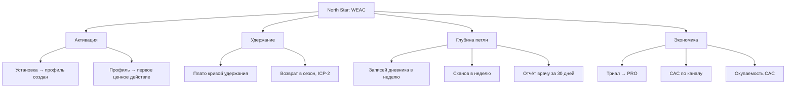

# A-Claro — GTM Playbook: ICP, оффер, PMF, экономика

**Продукт:** A-Claro (master brand **Aclearo**) · версия 1.0.4
**Назначение:** рабочие рамки принятия решений под OKR из [`okr.md`](./okr.md). Здесь — *как решать*, в OKR — *какие цифры достигаем*.
**Связано:** [`strategy.md`](./strategy.md) · [`pricing-discovery.md`](./pricing-discovery.md) · [`analytics-beta.md`](./analytics-beta.md) · [`beta-cohort.md`](./beta-cohort.md) · [`launch-playbook.md`](./launch-playbook.md) · модель подписки [`subscription-monetization-plan.md`](../subscription-monetization-plan.md)

> **Правило документа:** каждый раздел заканчивается решением («что делаем / чего не делаем») и указанием, откуда берутся данные. Утверждение без источника данных — гипотеза, а не вывод.

---

## 0. Продуктовая правда, на которой всё строится

Стратегия ломается, когда опирается на несуществующие функции. Актуальный срез кода:

| Факт | Состояние | Где в коде |
|------|-----------|------------|
| Видимых вкладок | **5**: Главная, Дневник, Сканер, Карта, SOS | [`_layout.tsx`](../../apps/mobile/app/(tabs)/_layout.tsx) |
| Маркет | Скрыт за флагом `EXPO_PUBLIC_MARKET` (по умолчанию `false`) | [`features.ts`](../../apps/mobile/src/constants/features.ts) |
| Подписка / paywall / IAP | **Кода нет.** Только план фазы P5.7 | [`subscription-monetization-plan.md`](../subscription-monetization-plan.md) |
| Атрибуция установок (UTM / install source) | **Кода нет** | — |
| Аналитика | Работает, выключена флагом `EXPO_PUBLIC_ANALYTICS_ENABLED` | [`analytics-events.ts`](../../packages/core/src/analytics-events.ts) |
| Туры подсказок | Есть: `home`, `diary`, `scanner`, `map`, `sos` | [`first-run-hints.ts`](../../packages/core/src/first-run-hints.ts) |
| Отчёт врачу | PDF + системный Share | [`doctor-report-service.ts`](../../apps/mobile/src/services/doctor-report-service.ts) |
| Облачный ИИ (скан, OCR, STT) | За флагами, по умолчанию выключен | `.env.example` |

Два пункта из этой таблицы — прямые ограничения для GTM: **без атрибуции нельзя считать CAC по каналам**, **без IAP нельзя считать LTV и окупаемость**. Разделы 4, 6 и 8 исходят из этого.

---

## 1. Как определить ICP

### Проблема текущей формулировки

В [`strategy.md`](./strategy.md) сегменты заданы как «родители детей с пищевой аллергией; взрослые с поллинозом/астмой». Это **описание аудитории**, а не ICP: под него подходит и мама, которая один раз испугалась сыпи, и семья, живущая с анафилаксией пятый год. У них разная частота боли, разное удержание и разная готовность платить — усреднять их нельзя.

### Рамка: ICP = пересечение пяти осей

Сегмент попадает в ICP, только если набирает высокий балл **по всем пяти**, а не в сумме. Низкий балл по любой оси — это причина не масштабировать канал, даже если остальные четыре сильны.

| Ось | Вопрос | Что делает балл низким |
|-----|--------|------------------------|
| **Частота боли** | Как часто человек принимает решение «безопасно ли это?» | Реже раза в неделю — привычка не формируется, удержание падает |
| **Триггер входа** | Что заставляет искать решение именно сейчас | Нет события — нет мотива установить приложение |
| **Готовность платить** | Кто платит и из какого бюджета | Боль есть, но её уже решает бесплатная альтернатива |
| **Достижимость** | Есть ли канал, где сегмент собран плотно и дёшево | Достижим только через дорогой платный трафик |
| **Совпадение с петлёй продукта** | Нужен ли ему еженедельный возврат в приложение | Разовая задача → установил, решил, удалил |

### Применение к A-Claro

| Сегмент | Частота | Триггер | Платёж | Достижимость | Петля | Вердикт |
|---------|---------|---------|--------|--------------|-------|---------|
| **ICP-1.** Родитель ребёнка (до 12) с подтверждённой пищевой аллергией, ведёт элиминационную диету | Ежедневно (каждый приём пищи, состав в саду/школе) | Постановка диагноза, реакция, начало сада/школы | Родитель платит за спокойствие; бюджет здоровья ребёнка | Клиники АДАИР, родительские сообщества | Дневник + сканер + PDF к приёму | **Ядро** |
| **ICP-2.** Взрослый с поллинозом/астмой, на АСИТ или готовится к ней | Ежедневно в сезон, редко вне сезона | Начало сезона, назначение АСИТ | Платит за себя; чувствителен к цене | Клиники АДАИР, поиск в сезон | Карта пыльцы + дневник симптомов + шкалы | **Ядро, сезонное** |
| Взрослый с непереносимостью (не аллергия) | Ежедневно | Диета | Средний | Плохая: размыт | Только сканер | Вторичный, не таргетировать |
| Врач-аллерголог | Еженедельно | Нужен структурированный анамнез | Не платит сам | Отличная: АДАИР | Не пользователь, а рекомендатель | **Канал, не ICP** |
| **Anti-ICP.** ЗОЖ-интересующиеся, ищут generic-сканер Е-добавок | Эпизодически | Любопытство | Низкий | Дешёвый трафик — соблазн | Нет | **Явно не таргетировать** |

**Почему anti-ICP важнее, чем кажется.** ЗОЖ-аудитория дешевле всех в закупке и портит все метрики сразу: сносит удержание, снижает конверсию в оплату, генерирует отзывы «мало продуктов в базе» и уводит продуктовые приоритеты в сторону generic-сканера — то есть в конкуренцию с продуктами, у которых база больше. Дешёвый нецелевой трафик обходится дороже, чем отсутствие трафика.

### Как валидировать данными, а не мнением

Разрез когорт возможен уже сейчас, без нового кода:

| Прокси ICP | Событие / источник |
|------------|--------------------|
| ICP-1 vs ICP-2 | `onboarding_scenario_selected` (`child` / `self` / `both`) |
| Глубина кейса | Число аллергенов и наличие анафилаксии в профиле |
| Активность петли | `diary_entry_saved`, `scan_completed` на пользователя в неделю |
| Сезонность ICP-2 | `map_pollen_refreshed`, `pollen_alert_sent` |

**Решение:** удержание, активацию и WTP считать **отдельно по `scenario`**, а не в среднем по базе. Средняя цифра по смешанной когорте не показывает PMF ни для одного сегмента.

**Уточнить ICP через:** 10 интервью по [`pricing-discovery.md`](./pricing-discovery.md) + разрез удержания beta-когорты из [`beta-cohort.md`](./beta-cohort.md) по `scenario`.

---

## 2. Как сформулировать оффер

### Оффер — не список функций

«Сканер, дневник, карта пыльцы, SOS, PDF» — это оглавление. Оффер отвечает на: *какую работу решаю, что обещаю, чем докажу, чем снимаю риск, сколько стою*.

### Канва оффера

| Слой | Что в нём | Ошибка |
|------|-----------|--------|
| **Работа** | Что человек нанимает продукт сделать | Описывать функцию вместо работы |
| **Обещание** | Результат на языке пользователя | Обещать то, чего продукт не делает |
| **Доказательство** | Почему верить | «Мы лучшие» без основания |
| **Снятие риска** | Что теряет, если не подойдёт | Требовать оплату до ценности |
| **Цена и рамка** | Что бесплатно навсегда, что платно | Платный доступ к безопасности |

### Оффер ICP-1 (родитель)

- **Работа:** «Не ошибиться с едой ребёнка и внятно рассказать врачу, что происходило между приёмами».
- **Обещание:** «Проверка состава за секунды и готовый отчёт врачу вместо тетрадки и памяти».
- **Доказательство:** экспертиза АДАИР, клинические шкалы, коды ICD/SNOMED в отчёте, работа офлайн (в магазине без связи — тоже работает).
- **Снятие риска:** ядро безопасности бесплатно навсегда; данные локально на устройстве; экспорт и удаление в один шаг.
- **Цена:** 7 дней всё включено → дальше бесплатное ядро → PRO только за облачный ИИ.

### Оффер ICP-2 (взрослый, поллиноз/астма)

- **Работа:** «Понять, почему сегодня плохо, и что будет завтра».
- **Обещание:** «Дневник симптомов + карта пыльцы и воздуха показывают связь и предупреждают заранее».
- **Доказательство:** 17 таксонов пыльцы, индексы UPI/UAQI, валидированные шкалы, экспорт динамики к врачу перед АСИТ.
- **Снятие риска:** без регистрации, офлайн, бесплатно в базовом объёме.

### Оффер для врача и клиники (это разные офферы)

| Кому | Работа | Обещание | Что просим взамен |
|------|--------|----------|-------------------|
| **Врач** | Получить достоверный анамнез за 12 минут приёма | «Пациент приходит со структурированным отчётом, а не с воспоминаниями» | Рекомендовать на приёме |
| **Клиника** | Приверженность пациента и отстройка от конкурентов | «Пациент между приёмами остаётся в контуре наблюдения» | QR на ресепшене, размещение материалов |

### Рамка бесплатного и платного

Модель зафиксирована в [`subscription-monetization-plan.md`](../subscription-monetization-plan.md) и оффер обязан ей соответствовать:

| Тариф | Что даёт |
|-------|----------|
| **Триал, 7 дней** | Всё, включая облачный ИИ |
| **Free, бессрочно** | Профили, дневник **без лимита записей**, SOS, карта, локальный keyword-скан |
| **PRO, IAP** | Облачный ИИ: LLM-вердикт, распознавание блюда и упаковки, OCR, облачный STT |

**Продающая формулировка:** «Безопасность бесплатна навсегда. Платите только за то, что за вас думает нейросеть». Это одновременно этично, соответствует правилам сторов для health-приложений и снимает главное возражение — «а вдруг в критический момент попросят денег».

### Чего оффер не должен обещать

Полноценный OCR «из коробки», телемедицину, облачную синхронизацию по умолчанию, покупку внутри приложения, диагноз или назначение. Маркет упоминать только там, где флаг `EXPO_PUBLIC_MARKET` включён.

---

## 3. Как найти product-market fit

### Проблема формулировки «paid только после PMF»

Она встречается в [`strategy.md`](./strategy.md) и [`okr.md`](./okr.md), но без определения PMF превращается в вопрос вкуса. Ниже — измеримые критерии.

### Три независимых сигнала

PMF засчитывается, когда сходятся **все три**, и считается **отдельно по каждому ICP**.

| Сигнал | Метрика | Порог гипотезы | Почему именно он |
|--------|---------|----------------|------------------|
| **Разочарование** | Тест Шона Эллиса: «Как вы себя почувствуете, если продукт исчезнет?» | ≥40% «очень расстроюсь» внутри ICP-1 | Прямая проверка незаменимости |
| **Удержание** | Кривая удержания когорты | Кривая **выполаживается** к D30, а не идёт в ноль | Форма кривой важнее значения D7 |
| **Поведение** | WEAC на пользователя внутри ICP | Растёт или стабилен от когорты к когорте | Мнение может льстить, поведение — нет |

**Про форму кривой.** D7 ≥20% из KR4.1 сам по себе не доказывает PMF: когорта может дать 20% на D7 и 2% на D30 — это отсутствие фита при формально выполненном KR. Фит выглядит как **плато**: часть пользователей перестаёт отваливаться и остаётся неограниченно долго. Величина плато определяет, есть ли вообще бизнес; наличие плато определяет, есть ли смысл покупать трафик.

**Про сезонность ICP-2.** Спад активности летом после сезона пыльцы — не потеря PMF. Для ICP-2 удержание меряется **внутри сезона** и отдельно проверяется возврат в следующем сезоне. Смешивать сезонную когорту с ICP-1 в одной цифре нельзя.

### Матрица решений

| Состояние | Как выглядит | Что делаем | Чего не делаем |
|-----------|--------------|------------|----------------|
| **Фит есть** | ≥40% Эллис + плато + растущий WEAC в ICP-1 | Масштабируем канал, включаем платный тест | Не переписываем продукт |
| **Слабый сигнал** | 20–40% Эллис, плато низкое | Сужаем ICP до тех, кто остался на плато; изучаем именно их | Не покупаем трафик |
| **Фита нет** | <20%, кривая в ноль | Возвращаемся к проблемным интервью; проверяем гипотезу оффера, а не рекламы | Не увеличиваем бюджет |
| **Ложный фит** | Метрики хорошие, но на anti-ICP | Пересобираем ICP; чистим каналы | Не празднуем |

### Порядок работ

1. Beta-когорта (200–500) по [`beta-cohort.md`](./beta-cohort.md), аналитика включена.
2. Опрос Эллиса на D14 — только тем, кто прошёл активацию (иначе меряем качество онбординга, а не продукта).
3. Кривые удержания в разрезе `scenario`.
4. Интервью с верхним децилем по WEAC: **что именно** они заменили этим продуктом. Их формулировки идут прямо в оффер (раздел 2) и в тексты сторов.
5. Гейт: без трёх сигналов бюджет на платное продвижение не открывается.

---

## 4. Что критично сделать до масштабирования

Масштабирование умножает то, что уже есть. Если удержание дырявое, платный трафик оплачивает уход пользователей быстрее.

### Стоп-лист: пока хоть один пункт красный — не масштабируем

| # | Условие | Проверка | Статус сейчас |
|---|---------|----------|---------------|
| 1 | **PMF по разделу 3** хотя бы для ICP-1 | Три сигнала | Не измерено |
| 2 | **Crash-free ≥99.5%** на 14-дневном soak | Sentry (KR2.1) | DSN не включён |
| 3 | **Аудит ложноотрицательных вердиктов сканера** | Ручная проверка на списке заведомо аллергенных продуктов | Не проведён |
| 4 | **Юридический контур** | 152-ФЗ, дисклеймер во всех локалях, подписанное соглашение с АДАИР | Черновики готовы |
| 5 | **Аналитика включена и проверена** | [`analytics-beta.md`](./analytics-beta.md), чеклист «Verify before beta» | Флаг `false` |
| 6 | **Атрибуция источника установки** | Невозможно сейчас — кода нет | **Блокер для платного трафика** |
| 7 | **Юнит-экономика измерима** | Нужен IAP/paywall (P5.7) | **Блокер для оценки LTV** |
| 8 | **Ёмкость поддержки** | Кто и за какое время отвечает на обращение о реакции | Не назначено |
| 9 | **Один канал даёт предсказуемый результат** | Клиники: заданное число QR → предсказуемое число установок | Пилот не запущен |

**Пункт 3 — специфика медицинской категории.** Ложноположительный вердикт («опасно», хотя безопасно) раздражает. Ложноотрицательный («безопасно», хотя аллерген есть) — это вред здоровью, отзыв в сторе и репутационный инцидент, который отменяет весь маркетинг. Аудит ложноотрицательных обязателен **до** роста аудитории, а не после.

**Пункты 6 и 7 вместе означают:** платный трафик сейчас нельзя ни атрибутировать, ни окупить в модели. Любой бюджет на рекламу до их закрытия — трата без обратной связи. Отсюда приоритет партнёрских каналов (раздел 7), где обратную связь даёт офлайн-учёт по `clinic_id`.

### Что делать вместо масштабирования, пока стоп-лист красный

Углублять один канал: довести клиничный пилот с 1–2 до 5 клиник, отладить конверсию внутри канала, снять возражения врачей. Канал, который не работает на 5 клиниках, не заработает на 50.

---

## 5. Как получить первые системные продажи

### «Системные» = повторяемые

Разовые всплески (пост в сообществе, публикация, знакомый врач) — это не канал. Канал существует, когда описано: **вход → действие → выход → стоимость → срок**, и повтор входа даёт сопоставимый выход.

### Канал №1: клиника → врач → пациент

| Этап | Действие | Артефакт | Замер |
|------|----------|----------|-------|
| 1. Заход в клинику | Договорённость с руководством | [`adair-co-marketing-agreement-draft.md`](./adair-co-marketing-agreement-draft.md) | Число подключённых клиник |
| 2. Обучение врачей | 15 минут: когда рекомендовать и как формулировать | [`doctor-brief.html`](./doctor-brief.html) | Число врачей, прошедших бриф |
| 3. Рекомендация на приёме | Одна фраза врача + QR в раздатке | [`patient-one-pager.html`](./patient-one-pager.html) | Установки по `utm_content={clinic_id}` |
| 4. Установка и активация | Онбординг → первый профиль | Туры подсказок | `onboarding_completed` |
| 5. Возврат к врачу | Пациент приносит PDF на повторный приём | [`doctor-report-service.ts`](../../apps/mobile/src/services/doctor-report-service.ts) | `diary_report_exported` |

**Этап 5 замыкает петлю.** Врач видит пользу своими глазами и начинает рекомендовать без напоминаний. Это превращает канал из разовой раздачи листовок в самоподдерживающийся: каждый принесённый отчёт — аргумент для следующей рекомендации.

### Clinic kit: то, что делает канал тиражируемым

Пилот на 1–2 клиниках нужен, чтобы собрать воспроизводимый комплект. Следующая клиника подключается по нему без участия основателя:

1. Одностраничник для руководства: что клиника получает.
2. Скрипт врача: одна фраза для приёма плюс ответы на три типовых возражения («это не заменит меня?», «а данные?», «а если ошибётся?»).
3. Печатный QR со своим `clinic_id`.
4. Три касания: установка материалов → контроль на 14-й день → отчёт по установкам на 30-й.
5. Ответственный на стороне клиники.

**Критерий готовности к тиражу:** две клиники подряд, подключённые по kit без ручной доработки, дают сопоставимую конверсию.

### От установок к первым оплатам

Оплаты появятся только после IAP (P5.7). Готовим заранее:

| Шаг | Суть |
|-----|------|
| Целевая когорта | Клиничные ICP-1, прошедшие активацию, — у них боль ежедневная |
| Момент оффера | Не при установке, а на попытке использовать облачный ИИ, когда ценность уже понятна |
| Первые 100 платящих | Как источник обратной связи, а не выручки: интервью с каждым десятым |
| Что считаем | Конверсия триал → PRO **в разрезе канала**: клиничная когорта против органики |

Разница конверсии между каналами — это и есть ответ, куда вкладывать деньги. Без неё выбор канала делается вслепую.

---

## 6. Какие метрики действительно важны

### Дерево метрик



### Что решает, а что льстит

| Метрика | Тип | Почему |
|---------|-----|--------|
| Установки, MAU, число скачиваний | **Vanity** | Растут от бюджета, ничего не говорят о ценности |
| Рейтинг в сторе | Гигиена | Ниже 4.0 блокирует рост, выше 4.5 не ускоряет |
| Число функций, охват прессы | Vanity | Не связаны с поведением |
| **Активация** (установка → первое ценное действие) | **Решающая** | Дешевле поднять, чем купить столько же трафика |
| **Плато удержания** | **Решающая** | Отвечает, есть ли бизнес |
| **WEAC по ICP** | **Решающая** | Единственная метрика, отражающая суть продукта |
| **Конверсия триал → PRO** | **Решающая** | Проверка оффера, не продукта |
| **CAC по каналу и его окупаемость** | **Решающая** | Определяет, какой канал масштабировать |

### Одна главная метрика на фазу

| Фаза | Главная метрика | Почему остальные подождут |
|------|-----------------|---------------------------|
| Closed beta | Активация (`onboarding_completed` / начавшие) | Пока не активируем, мерить удержание не на ком |
| Soft launch | Плато удержания D30 в ICP-1 | Решает, масштабировать ли вообще |
| Public launch | WEAC | Смысл продукта, а не трафик |
| Монетизация | Триал → PRO по каналам | Определяет источник роста |

### Что измеримо сейчас, а что нет

| Метрика | Событие | Готово? |
|---------|---------|---------|
| Воронка онбординга | `onboarding_scenario_selected` → `profile_setup_step_*` → `profile_created` → `onboarding_completed` | Да |
| Активация после онбординга | `hint_tour_completed` + первое `diary_entry_saved` / `scan_completed` | Да |
| Глубина петли | `diary_entry_saved`, `scan_completed`, `scan_saved_to_diary` | Да |
| Ценность для врача | `diary_report_exported` | Да |
| Готовность к реакции | `sos_opened` | Да |
| Сезонность | `map_pollen_refreshed`, `pollen_alert_sent` | Да |
| Маркет | `market_impression`, `market_click`, `market_catalog_refresh` | Только при `EXPO_PUBLIC_MARKET=true` |
| **CAC по каналу** | Нужна атрибуция установки | **Нет** |
| **Триал → PRO, LTV** | Нужны события paywall и IAP | **Нет** (P5.7) |
| **Виральность** | Нужны события шеринга | **Нет** |

Прокси на время беты: `utm_content={clinic_id}` в лендинге ([`landing/index.html`](./landing/index.html)) плюс ручной учёт розданных QR по клиникам. Точность ниже, направление верное.

---

## 7. Почему партнёрский маркетинг эффективнее прямой рекламы

Это не общий тезис, а следствие категории. Пять причин, специфичных для аллергологии в России.

### 1. Перенос доверия

Решение установить медицинское приложение упирается в доверие, а не в осведомлённость. Реклама сообщает о существовании продукта, но доверие ей приходится строить с нуля — в категории, где цена ошибки высока. Врач переносит на рекомендацию собственный авторитет, накопленный годами. Купить это медийным размещением нельзя.

### 2. Регуляторные ограничения рекламы медтематики

Реклама в области здоровья в РФ ограничена: часть формулировок требует подтверждения, обязательны предупреждения, площадки проводят дополнительную модерацию, а формулировки о пользе для здоровья режутся. В итоге до аудитории доходит выхолощенное сообщение — самое сильное («поможет не ошибиться с едой ребёнка») в рекламе сказать нельзя, а на приёме у врача — можно и уместно. **Ограничение канала важнее его цены.**

### 3. Момент максимальной интентности

Рекламу человек видит в случайный момент. Рекомендацию врача он получает через несколько минут после того, как услышал диагноз ребёнка, — в точке наивысшей мотивации что-то делать. Конверсия из одного и того же сообщения в этих двух точках различается кратно.

### 4. Предельная стоимость контакта

| | Платная реклама | Клиничный канал |
|---|---|---|
| Стоимость первого контакта | Есть | Разработка kit, переговоры |
| Стоимость 1000-го контакта | **Такая же или выше** | **Близка к нулю** |
| Что происходит при остановке платежей | Поток исчезает в тот же день | Материалы остаются, врачи продолжают рекомендовать |
| Что накапливается | Ничего | Отношения, привычка врача, репутация |

Реклама — аренда внимания: платёж прекращается, поток прекращается. Партнёрство — актив: усилие вложено один раз, отдача идёт дальше. Плюс цена аукциона растёт с конкуренцией, а цена уже установленных отношений — нет.

### 5. Качество аудитории

Клиника фильтрует за нас: у пациента аллерголога диагноз уже есть. Платный трафик приводит смесь ICP и anti-ICP, причём anti-ICP кликает охотнее (любопытство дешевле боли). Формально CAC ниже, фактически стоимость **удержавшегося целевого** пользователя выше.

### Когда прямая реклама всё-таки оправдана

Партнёрский канал не бесплатен: он медленный, упирается в число клиник и требует ручной работы. Платная реклама включается, когда одновременно:

1. Стоп-лист раздела 4 зелёный, включая атрибуцию.
2. PMF подтверждён по разделу 3 хотя бы для одного ICP.
3. Партнёрский канал упёрся в потолок (все доступные клиники подключены).
4. Есть посчитанная окупаемость: понятно, за сколько возвращается вложенный рубль.
5. Начинается с ограниченного теста (в [`launch-playbook.md`](./launch-playbook.md) — 50–100 тыс. ₽), а не с масштаба.

Разумный первый платный формат — не привлечение холодной аудитории, а **ретаргетинг на незавершённый онбординг** и брендовый поиск: там реклама не создаёт доверие, а достраивает уже начатый путь.

---

## 8. Как снизить CAC

### Сначала арифметика

```
Blended CAC = все затраты на привлечение / все новые пользователи
Paid CAC    = только платные затраты / привлечённые платно
```

Мешать их — классическая ошибка: органика маскирует дорогой платный канал. Считать надо оба и **отдельно по каналам**.

Целевой ориентир из KR5.4 — blended CAC < 150 ₽. При модели «7 дней триал → Free → PRO» окупаемость определяет не установка, а конверсия в PRO: если из установки в PRO переходит доля *c*, а месячная цена *p*, то на возврат CAC нужно `CAC / (c × p)` месяцев подписки. При *c* = 3% и *p* = 399 ₽ один установленный пользователь приносит около 12 ₽ в месяц — значит CAC 150 ₽ окупается больше чем за год, и **удержание становится главным рычагом экономики**, а не цена клика. Пока IAP нет, *c* — гипотеза, и это ещё один довод не тратить деньги на трафик сейчас.

### Рычаги по убыванию отдачи

**Уровень 1. Конверсия воронки — до любых закупок.**
Удвоение конверсии эквивалентно двукратному снижению CAC, но не требует бюджета и действует на все каналы сразу.

| Шаг | Рычаг | Замер |
|-----|-------|-------|
| Лендинг → установка | Одно ясное действие, снятие возражения про данные | `waitlist_joined` |
| Установка → онбординг начат | Ценность до регистрации, не наоборот | `onboarding_scenario_selected` |
| Онбординг → завершён | Сокращение шагов, ранние пропуски необязательных полей | `onboarding_completed` (KR2.2 ≥70%) |
| Завершён → активирован | Туры подсказок доводят до первого ценного действия | `hint_tour_completed` |

Экран `onboarding-intro.tsx` сейчас не шлёт событий — это дыра в самом начале воронки, где отвал обычно максимален (см. backlog).

**Уровень 2. Продуктовый реферал — CAC стремится к нулю.**
Три поверхности уже есть в продукте:

| Поверхность | Механика | Что нужно |
|-------------|----------|-----------|
| PDF врачу | Отчёт уходит через Share и попадает к врачу — а врач рекомендует другим пациентам | Аккуратная подпись и ссылка в PDF |
| SOS-паспорт | Родитель передаёт данные ребёнка воспитателю, бабушке, тренеру — каждый видит продукт | Шеринг паспорта |
| Семейные профили | Второй родитель ставит приложение для того же ребёнка | Приглашение в семью |

Первая механика особенно ценна: PDF попадает **к врачу**, то есть в узел, который влияет на десятки пациентов. Это реферал не по горизонтали (пользователь → друг), а по вертикали (пользователь → рекомендатель).

**Уровень 3. Накопительные каналы.**
ASO ([`store-metadata.md`](./store-metadata.md)) — трафик по запросам вроде «дневник аллергии» бесплатен и не иссякает. Экспертный контент АДАИР работает годами и одновременно закрывает возражение о доверии. Оба требуют времени, но их стоимость не растёт с объёмом.

**Уровень 4. Партнёрские каналы.** См. раздел 7.

**Уровень 5. Платная реклама — только по условиям раздела 7.** Внутри платного: ретаргетинг на незавершённый онбординг дешевле холодного привлечения, потому что работает по людям, уже проявившим намерение.

### Чего не делать

| Антипаттерн | Последствие |
|-------------|-------------|
| Покупать дешёвый нецелевой трафик ради снижения средней цифры | Blended CAC падает, стоимость удержавшегося ICP растёт |
| Масштабировать канал без атрибуции | Нельзя отличить работающее от неработающего |
| Сравнивать каналы по CAC без учёта удержания | Дорогой канал с плато выгоднее дешёвого без него |
| Оптимизировать CAC до PMF | Эффективное привлечение в дырявое ведро |

---

## 9. Backlog инструментовки

Разделы 4, 6 и 8 упираются в отсутствующие в коде вещи. Это не делается в рамках GTM-документов и выносится в продуктовый бэклог.

| # | Что нужно | Зачем | Где | Приоритет |
|---|-----------|-------|-----|-----------|
| 1 | Атрибуция источника установки (сохранить `utm_source` / `clinic_id` при первом запуске) | CAC по каналам, KR1.4 | Мобильный первый запуск + `analytics-service` | **Блокер платного трафика** |
| 2 | События paywall и подписки (`paywall_shown`, `subscription_purchase_*`) | Конверсия триал → PRO, LTV | P5.7, [`subscription-monetization-plan.md`](../subscription-monetization-plan.md) | Высокий |
| 3 | События экрана `onboarding-intro.tsx` | Первый шаг воронки не виден | [`onboarding-intro.tsx`](../../apps/mobile/app/onboarding-intro.tsx) | Высокий |
| 4 | Событие шеринга отчёта и подпись со ссылкой в PDF | Вертикальный реферал через врача | [`doctor-report-service.ts`](../../apps/mobile/src/services/doctor-report-service.ts) | Средний |
| 5 | Шеринг SOS-паспорта | Реферал через окружение ребёнка | SOS | Средний |
| 6 | Опрос Шона Эллиса (in-app или email на D14) | Сигнал PMF | Beta-инфраструктура | Средний |

---

## Ритуал пересмотра

Раз в цикл вместе со скоркардом [`okr.md`](./okr.md):

1. ICP не изменился? Проверить по разрезу удержания, а не по ощущениям.
2. Три сигнала PMF: где находимся по матрице раздела 3.
3. Стоп-лист раздела 4: что стало зелёным, что застряло.
4. Каналы: какой даёт предсказуемый выход, какой упёрся в потолок.
5. Продуктовая правда раздела 0 всё ещё соответствует коду.
