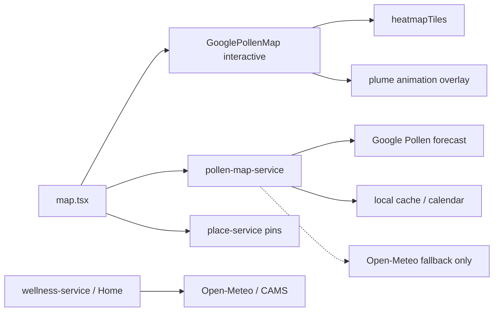

# План: интерактивная обзорная карта пыления

Связано с экраном `apps/mobile/app/(tabs)/map.tsx` и [`yandex-pollen-map-integration.md`](./yandex-pollen-map-integration.md).  
Цель: заменить статичную обзорную подложку на **интерактивную** карту (pan/zoom, слои уровней пыльцы, пины POI) без скрейпинга и без ключей в клиенте.

**Статус (код):** Phase **2** и **3a** реализованы за флагами  
`EXPO_PUBLIC_MAP_POLLEN_GOOGLE_PRIMARY` / `EXPO_PUBLIC_MAP_POLLEN_PLUME` (default off; **on** в EAS `staging`).  
Wellness/Home по-прежнему на Open-Meteo.

---

## 1. As-is

| Слой | Сейчас |
|------|--------|
| Basemap (default) | `YandexMap` WebView-виджет, `interactive={false}` |
| Basemap (флаги Google) | `GooglePollenMap` + опциональный heatmapTiles |
| Числа уровней | Open-Meteo / CAMS (и кэш / календарный fallback) через `pollen-map-service` |
| Deep-link | Яндекс Погода «Активность пыльцы» (внешнее приложение / браузер) |

Пользователь на default-пути видит **немасштабируемую** карту и вынужден уходить в Яндекс за интерактивом.

---

## 2. Варианты basemap + данные

### A. Яндекс Карты (JS API / Mobile SDK) + Open-Meteo уровни

| | |
|--|--|
| **Basemap** | Яндекс JS API в WebView или native SDK (Android/iOS) |
| **Пыльца** | Точки / isolines / choropleth из Open-Meteo (сетка или nearby samples уже в snapshot) |
| **Плюсы** | Привычный RU-картостиль; хорошие тайлы для РФ/СНГ; можно позже подключить B2B pollen Яндекса |
| **Минусы** | Ключ API + ToS; WebView-SDK сложнее в Expo; **публичного pollen-layer у Яндекса нет** (см. существующий doc) |
| **Оценка** | Лучший UX для RU, если есть бюджет на ключ и обёртку |

### B. Open-Meteo only (сетка + свой рендер)

| | |
|--|--|
| **Basemap** | Любой (OSM via MapLibre, Яндекс, Google) |
| **Пыльца** | Сетка запросов Air Quality API → клиентский heatmap / цветные клетки |
| **Плюсы** | Уже есть числовой pipeline; без vendor lock на pollen |
| **Минусы** | Heatmap в API нет — сетка дорогая по квотам/Latency; CAMS слабее за Уралом; нужна своя отрисовка |
| **Оценка** | Хорошо как **слой данных**, плохо как единственный «готовый» продукт карты |

### C. Google Maps + Google Pollen (heatmapTiles) + Open-Meteo fallback

| | |
|--|--|
| **Basemap** | `react-native-maps` / Maps JS (уже частично за флагами) |
| **Пыльца** | Google Pollen heatmapTiles + forecast; числа — Google UPI или Open-Meteo |
| **Плюсы** | Нативный pan/zoom; готовый heatmap; код пути уже в репо |
| **Минусы** | GCP биллинг/ключи; покрытие/модель не заточены под RU crowdsourcing; heatmap — tree/grass/weed, не точные таксоны «берёза» |
| **Оценка** | Быстрый путь к интерактиву, если GCP уже оплачен (stage) |

---

## 3. Рекомендация (фазы)

### Phase 1 — интерактив без смены источника чисел (минимальный риск)

1. Включить **интерактивный basemap** по умолчанию:
   - **Предпочтительно для stage/prod с GCP:** `GOOGLE_MAP_PRIMARY_ENABLED=true` + `GooglePollenMap` (pan/zoom/markers).
   - **Альтернатива без Google:** MapLibre + OSM тайлы (нет ключа Яндекса/Google) — отдельный spike.
2. Временно оставить Open-Meteo как primary numeric feed на карте (как сейчас) — **до Phase 2**.
3. Убрать зависимость UX от «откройте в Яндексе» (deep-link — secondary/overflow).
4. На карте: текущая точка, цвет уровня выбранного таксона, POI-пины в режиме «Места/Оба».

**Критерий готовности:** на web + Android пользователь зумит/двигает карту; уровни и прогноз не деградируют offline (кэш/календарь).

### Phase 2 — Google-прогноз только на карте (не wellness)

**Скоуп:** заменить Open-Meteo **целиком** как numeric/forecast feed экрана `/(tabs)/map` на Google Pollen (`forecast:lookup` + UPI / plant info).  
**Вне скоупа этой фазы:** `wellness-service` и домашний индекс пыльцы — **оставляют Open-Meteo / CAMS** без замены.

| Компонент | До | После Phase 2 |
|-----------|----|----------------|
| `pollen-map-service` | Open-Meteo primary, Google optional | Google Pollen primary; Open-Meteo только как emergency fallback / нет ключа |
| Статус, strip прогноза, UPI, карточка растения на карте | смешанный | Google |
| `wellness-service` / Home | Open-Meteo | **без изменений** |
| Offline | кэш snapshot карты | кэш Google snapshot + календарный fallback (как сейчас) |

Шаги:

1. Расширить API-proxy (`apps/api`) для стабильного `forecast:lookup` (дневной горизонт, таксоны → tree/grass/weed + plant details).
2. В `pollen-map-service`: primary = Google; маппинг UPI → `PollenTierLevel`; сохранить контракт snapshot для UI.
3. Флаг: например `EXPO_PUBLIC_MAP_POLLEN_GOOGLE_PRIMARY=true` (default off в `.env.example`).
4. Атрибуция на карте: Google Pollen (ToS); не тащить Open-Meteo attribution, пока fallback не активен.
5. Тесты: map snapshot без вызова Open-Meteo при зелёном Google; wellness-тесты не трогать.

**Критерий готовности:** на Map при валидном GCP-ключе нет запросов Open-Meteo; Home/wellness по-прежнему ходят в Open-Meteo.

### Phase 3 — визуальный слой пыльцы + реал-тайм шлейф

| Путь | Когда выбирать |
|------|----------------|
| Google heatmapTiles (tree/grass/weed) | Уже есть ключи; ок упрощение таксонов → группы |
| Свои круги/isolines из Google nearby / grid proxy | Нужна отрисовка поверх basemap без тайлов heatmap |
| Яндекс B2B pollen (если появится API) | Договор с Яндексом; заменить/дополнить слой |

Не строить плотную глобальную сетку Open-Meteo на клиенте (квоты, ToS, батарея) — после Phase 2 Open-Meteo на карте не primary.

#### 3a. Реал-тайм анимация шлейфа пыльцы (in scope)

Цель: на интерактивной карте пользователь видит **движущийся шлейф / plume** нагрузки (не только статичный heatmap), чтобы считывать направление заноса относительно ветра и выбранного аллергена.

| Элемент | Предложение |
|---------|-------------|
| **Данные** | Google Pollen heatmap / index tiles + метеоветер (Google Weather или уже доступный wind из API/прокси); кадры — time-series на 6–24 ч |
| **Рендер** | Overlay на `GooglePollenMap`: particle / streak layer (Canvas/Skia или Map polyline bursts), opacity по UPI, вектор = ветер |
| **«Реал-тайм»** | Не WebSocket пыльцы (его нет): **near-real-time** = refresh 15–60 мин + клиентская интерполяция между forecast hours; pause при background |
| **Таксон** | Шлейф для выбранного аллергена → группа Google (tree/grass/weed); подпись в UI честная («группа деревьев», не «только берёза») |
| **Производительность** | Max particles / FPS cap; отключать анимацию при Low Power / `reduceMotion`; web — упрощённый CSS/opacity pulse, если Skia тяжел |
| **Флаг** | `EXPO_PUBLIC_MAP_POLLEN_PLUME=true` |
| **Слой** | Логика частиц/интерполяции — `packages/core` или тонкий `pollen-plume-service`; UI только рисует |

**Критерий готовности:** при высоком уровне и известном ветре шлейф смещается по направлению ветра; при `reduceMotion` показывается статичный слой; wellness не затрагивается.

### Phase 4 — Яндекс как опция RU-premium

1. Оценить JS API 3.0 vs native SDK vs продолжение deep-link.
2. Ключ только через `apps/api` proxy / remote config, не `EXPO_PUBLIC_*` секреты для платных квот.
3. Если B2B pollen недоступен — Яндекс = basemap + POI, пыльца = Google (Phase 2–3).

---

## 4. Архитектурные ограничения (обязательные)

- Offline-first: карта — enrichment; статус/прогноз из кэша при отсутствии сети.
- Тонкий UI: оркестрация в `map.tsx` / `src/services/*`; геометрия/пороги/plume math в `@allerguide/core` или map-services.
- **Разделение источников:** Map → Google Pollen (Phase 2+); Wellness/Home → Open-Meteo. Не смешивать в одном сервисе без явного `source: 'map' | 'wellness'`.
- Feature flags: `EXPO_PUBLIC_GOOGLE_MAP_*`, `EXPO_PUBLIC_MAP_POLLEN_GOOGLE_PRIMARY`, `EXPO_PUBLIC_MAP_POLLEN_PLUME`, будущий `EXPO_PUBLIC_YANDEX_MAP_INTERACTIVE`.
- Атрибуция провайдера — в settings/about или мелкий footer по ToS, не как главный CTA.
- Без скрейпинга `yandex.ru/pogoda/.../allergies`.
- Анимация шлейфа уважает accessibility (`reduceMotion`) и не блокирует pan/zoom.

---

## 5. Целевой стек после Phase 2–3

1. Default-on interactive Google basemap на stage (ключи уже в GCP doc).  
2. Map numeric/forecast → Google; Home/wellness → Open-Meteo (без замены).  
3. Plume — отдельный флаг поверх heatmap.  
4. Dev/fallback без ключа: MapLibre+OSM **или** текущий Yandex widget + календарь.  
5. Документировать выбор в `architecture.md` §карта после Phase 1–2.

---

## 6. Вне скоупа

- Парсинг UI Яндекс Погоды  
- Редактор своих зон «безопасно/опасно»  
- **Замена wellness / Home Open-Meteo целиком Google-прогнозом** (только Map — Phase 2)  
- WebSocket «живой» пыльцы от провайдера (нет API) — вместо этого near-real-time refresh + интерполяция (Phase 3a)  

---

## 7. Следующие шаги (после Phase 2 / 3a)

| # | Шаг | Зачем |
|---|-----|--------|
| 1 | **Phase 1 дожать:** default interactive Google basemap вне staging (ключ Maps + `GOOGLE_MAP_PRIMARY` в preview/prod по готовности) | Иначе plume/heatmap видны только при уже включённом Google map |
| 2 | **Гео-привязка шлейфа:** particles в lat/lng (Map polyline / Circle / Skia) вместо screen-space overlay | Сейчас шлейф — экранный слой; не следует за pan/zoom карты |
| 3 | **Интерполяция forecast hours** + refresh wind/pollen 15–60 мин (background pause уже есть) | Ближе к «near-real-time» из Phase 3a |
| 4 | **Nearby / «безопасные точки»** на Google-primary пути: либо Google grid proxy, либо редкий OM nearby только как secondary | Сейчас при `source: google` `nearbyLocations` пустой |
| 5 | **Phase 4 spike:** Яндекс JS API / SDK vs deep-link; без scrape allergies | RU basemap premium |
| 6 | **Атрибуция ToS** мелким footer на карте (Google Pollen / Maps) когда primary | Юридическая чистота |
| 7 | **Observability:** счётчики fallback OM→calendar на map; алерт если Google forecast error rate высок на stage | Операционка |
| 8 | **Не делать:** перенос Home/wellness на Google без отдельного продуктового решения | Разделение источников сохраняем |

### Флаги

| Env | Default | Staging EAS |
|-----|---------|-------------|
| `EXPO_PUBLIC_MAP_POLLEN_GOOGLE_PRIMARY` | `false` | `true` |
| `EXPO_PUBLIC_MAP_POLLEN_PLUME` | `false` | `true` |
| `EXPO_PUBLIC_GOOGLE_MAP_PRIMARY` | `false` | `true` |
| `EXPO_PUBLIC_POLLEN_HEATMAP` | `off` | `google` |

### Код (ориентиры)

- Map Google primary: `apps/mobile/src/services/pollen-map-service.ts`
- Google → readings: `packages/core/src/pollen-google-forecast.ts`
- Plume math: `packages/core/src/pollen-plume.ts` · UI: `PollenPlumeOverlay.tsx`
- Wind: `apps/mobile/src/services/wind-service.ts` (Open-Meteo Forecast, не AQ)
