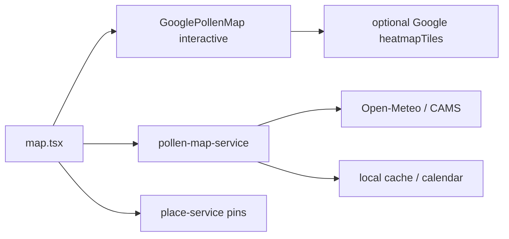

# План: интерактивная обзорная карта пыления

Связано с экраном `apps/mobile/app/(tabs)/map.tsx` и [`yandex-pollen-map-integration.md`](./yandex-pollen-map-integration.md).  
Цель: заменить статичную обзорную подложку на **интерактивную** карту (pan/zoom, слои уровней пыльцы, пины POI) без скрейпинга и без ключей в клиенте.

---

## 1. As-is

| Слой | Сейчас |
|------|--------|
| Basemap (default) | `YandexMap` WebView-виджет, `interactive={false}` |
| Basemap (флаги Google) | `GooglePollenMap` + опциональный heatmapTiles |
| Числа уровней | Open-Meteo / CAMS (и кэш / календарный fallback) через `pollen-map-service` |
| Deep-link | Яндекс Погода «Активность пыльцы» (внешнее приложение / браузер) |

Пользователь на default-пути видит **немасштабируемую** карту и вынужден уходить в Яндекс за интерактивом.

---

## 2. Варианты basemap + данные

### A. Яндекс Карты (JS API / Mobile SDK) + Open-Meteo уровни

| | |
|--|--|
| **Basemap** | Яндекс JS API в WebView или native SDK (Android/iOS) |
| **Пыльца** | Точки / isolines / choropleth из Open-Meteo (сетка или nearby samples уже в snapshot) |
| **Плюсы** | Привычный RU-картостиль; хорошие тайлы для РФ/СНГ; можно позже подключить B2B pollen Яндекса |
| **Минусы** | Ключ API + ToS; WebView-SDK сложнее в Expo; **публичного pollen-layer у Яндекса нет** (см. существующий doc) |
| **Оценка** | Лучший UX для RU, если есть бюджет на ключ и обёртку |

### B. Open-Meteo only (сетка + свой рендер)

| | |
|--|--|
| **Basemap** | Любой (OSM via MapLibre, Яндекс, Google) |
| **Пыльца** | Сетка запросов Air Quality API → клиентский heatmap / цветные клетки |
| **Плюсы** | Уже есть числовой pipeline; без vendor lock на pollen |
| **Минусы** | Heatmap в API нет — сетка дорогая по квотам/Latency; CAMS слабее за Уралом; нужна своя отрисовка |
| **Оценка** | Хорошо как **слой данных**, плохо как единственный «готовый» продукт карты |

### C. Google Maps + Google Pollen (heatmapTiles) + Open-Meteo fallback

| | |
|--|--|
| **Basemap** | `react-native-maps` / Maps JS (уже частично за флагами) |
| **Пыльца** | Google Pollen heatmapTiles + forecast; числа — Google UPI или Open-Meteo |
| **Плюсы** | Нативный pan/zoom; готовый heatmap; код пути уже в репо |
| **Минусы** | GCP биллинг/ключи; покрытие/модель не заточены под RU crowdsourcing; heatmap — tree/grass/weed, не точные таксоны «берёза» |
| **Оценка** | Быстрый путь к интерактиву, если GCP уже оплачен (stage) |

---

## 3. Рекомендация (фазы)

### Phase 1 — интерактив без смены источника чисел (минимальный риск)

1. Включить **интерактивный basemap** по умолчанию:
   - **Предпочтительно для stage/prod с GCP:** `GOOGLE_MAP_PRIMARY_ENABLED=true` + `GooglePollenMap` (pan/zoom/markers).
   - **Альтернатива без Google:** MapLibre + OSM тайлы (нет ключа Яндекса/Google) — отдельный spike.
2. Оставить Open-Meteo как primary numeric feed (как сейчас).
3. Убрать зависимость UX от «откройте в Яндексе» (deep-link — secondary/overflow).
4. На карте: текущая точка, цвет уровня выбранного таксона, POI-пины в режиме «Места/Оба».

**Критерий готовности:** на web + Android пользователь зумит/двигает карту; уровни и прогноз не деградируют offline (кэш/календарь).

### Phase 2 — визуальный слой пыльцы

| Путь | Когда выбирать |
|------|----------------|
| Google heatmapTiles (tree/grass/weed) | Уже есть ключи; ок упрощение таксонов → группы |
| Свои круги/isolines из `nearbyLocations` Open-Meteo | Нужна точность по берёзе/злакам/амброзии без Google pollen |
| Яндекс B2B pollen (если появится API) | Договор с Яндексом; заменить/дополнить слой |

Не строить плотную глобальную сетку Open-Meteo на клиенте (квоты, ToS, батарея).

### Phase 3 — Яндекс как опция RU-premium

1. Оценить JS API 3.0 vs native SDK vs продолжение deep-link.
2. Ключ только через `apps/api` proxy / remote config, не `EXPO_PUBLIC_*` секреты для платных квот.
3. Если B2B pollen недоступен — Яндекс = basemap + POI, пыльца = Open-Meteo/Google как в Phase 2.

---

## 4. Архитектурные ограничения (обязательные)

- Offline-first: карта — enrichment; статус/прогноз из кэша при отсутствии сети.
- Тонкий UI: оркестрация в `map.tsx` / `src/services/*`; геометрия/пороги в `@allerguide/core`.
- Feature flags: `EXPO_PUBLIC_GOOGLE_MAP_*` / будущий `EXPO_PUBLIC_YANDEX_MAP_INTERACTIVE`.
- Атрибуция провайдера — в settings/about или мелкий footer по ToS, не как главный CTA.
- Без скрейпинга `yandex.ru/pogoda/.../allergies`.

---

## 5. Предлагаемый стек «по умолчанию» для следующего PR

1. Default-on interactive Google basemap на stage (ключи уже в GCP doc).  
2. Dev/fallback без ключа: MapLibre+OSM **или** текущий Yandex widget, но с честным «обзор» без обещания интерактива.  
3. Документировать выбор в `architecture.md` §карта после внедрения Phase 1.

---

## 6. Вне скоупа Phase 1

- Парсинг UI Яндекс Погоды  
- Реал-тайм анимация шлейфа пыльцы  
- Редактор своих зон «безопасно/опасно»  
- Замена wellness Open-Meteo целиком Google-прогнозом  
