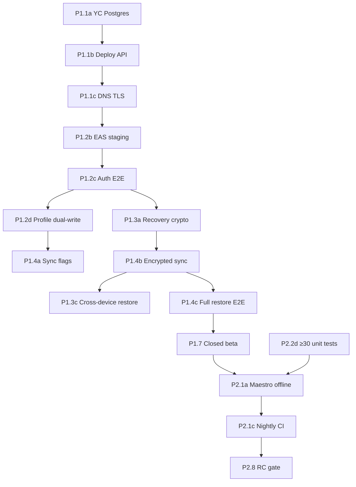

# Phase 1–2: детальные GitHub issues

Пошаговая разбивка [roadmap-to-prod.md](./roadmap-to-prod.md) Phase 1 и Phase 2 на **45 исполнимых задач** с зависимостями и оценками.

**Создание issues в GitHub:**

```bash
chmod +x scripts/create-phase-issues.sh
./scripts/create-phase-issues.sh --dry-run   # предпросмотр
./scripts/create-phase-issues.sh             # создать issues
```

**Windows (Git Bash):** пошаговая инструкция — [`docs/git-bash-roadmap.md`](./git-bash-roadmap.md) (установка `gh`/`jq`, CRLF, `gh pr create`).

Данные: [`scripts/phase1-phase2-issues.json`](../scripts/phase1-phase2-issues.json). Скрипт идемпотентен (пропускает существующие по префиксу `[P1.1a]` и т.д.).

Родительские задачи P1.1–P1.6, P2.1–P2.7 создаются скриптом [`create-roadmap-issues.sh`](../scripts/create-roadmap-issues.sh); этот файл — **подзадачи** с графом зависимостей.

---

## Сводка по оценкам

| Фаза | Подзадач | Person-days | Роли |
|------|----------|-------------|------|
| **Phase 1** | 27 | ~32 | DevOps, Backend, Mobile, QA |
| **Phase 2** | 17 | ~27 | Mobile, QA, DevOps, Backend |
| **Итого** | 45 | ~59.5 | 2–3 разработчика + QA part-time |

Оценки — календарные дни одного исполнителя на задачу. Параллельная работа сокращает wall-clock time.

---

## Критический путь



**Блокеры прода на этом этапе:** P1.3 (recovery key), P1.4 (sync), P2.1 (E2E), P2.6 (API security).

---

## Phase 1 — Backend integration

### P1.1 Deploy API staging (5 подзадач, ~3.5 дн.)

| ID | Задача | Дн. | Роль | Зависит от | Блокирует |
|----|--------|-----|------|------------|-----------|
| **P1.1a** | YC Managed Postgres staging + секреты | 0.5 | DevOps | — | P1.1b, P1.6d |
| **P1.1b** | Deploy API на хостинг | 1 | DevOps/Backend | P1.1a | P1.1c–e, P1.5a |
| **P1.1c** | DNS + TLS `api.staging.*` | 0.5 | DevOps | P1.1b | P1.2b–c, P1.4a, P1.5b, P2.6a |
| **P1.1d** | `.env.staging.example` + runbook | 0.5 | Backend | P1.1b | — |
| **P1.1e** | CI/CD deploy staging | 1 | DevOps | P1.1b | — |

### P1.2 Backend auth E2E (5 подзадач, ~5 дн.)

| ID | Задача | Дн. | Роль | Зависит от | Блокирует |
|----|--------|-----|------|------------|-----------|
| **P1.2a** | ADR: dual-write policy | 0.5 | Backend/Mobile | — | P1.2d |
| **P1.2b** | EAS profile `staging` | 0.5 | Mobile | P1.1c | P1.2c |
| **P1.2c** | E2E register → login → JWT | 1 | Mobile/QA | P1.1c, P1.2b | P1.2d, P1.3a, P1.4a |
| **P1.2d** | Profile dual-write CRUD | 2 | Mobile | P1.2a, P1.2c | P1.2e, P1.4a |
| **P1.2e** | Offline regression | 1 | QA | P1.2d | P1.6a |

### P1.3 Recovery key (5 подзадач, ~7.5 дн.)

| ID | Задача | Дн. | Роль | Зависит от | Блокирует |
|----|--------|-----|------|------------|-----------|
| **P1.3a** | Recovery key crypto | 2 | Mobile | P1.2c | P1.3b–d, P1.4b |
| **P1.3b** | UX экран recovery key | 1.5 | Mobile | P1.3a | P1.3e, P1.4c |
| **P1.3c** | Restore на новом устройстве | 2 | Mobile/QA | P1.3a, P1.4b | P1.4c |
| **P1.3d** | Unit tests backup-crypto | 1 | Mobile | P1.3a | — |
| **P1.3e** | Миграция device-only key | 1 | Mobile | P1.3b | — |

### P1.4 Cloud sync E2E (4 подзадачи, ~5 дн.)

| ID | Задача | Дн. | Роль | Зависит от | Блокирует |
|----|--------|-----|------|------------|-----------|
| **P1.4a** | SYNC flags staging | 1 | Backend/Mobile | P1.1c, P1.2c, P1.2d | P1.4b |
| **P1.4b** | Encrypted upload/download v2 | 2 | Mobile/Backend | P1.4a, P1.3a | P1.3c, P1.4c, P1.6b |
| **P1.4c** | E2E full restore cross-device | 1.5 | QA | P1.4b, P1.3b, P1.3c | P1.4d, P2.1b |
| **P1.4d** | Conflict policy docs | 0.5 | Backend | P1.4c | — |

### P1.5 AI scan staging (3 подзадачи, ~3 дн.)

| ID | Задача | Дн. | Роль | Зависит от | Блокирует |
|----|--------|-----|------|------------|-----------|
| **P1.5a** | OpenAI + scan env API | 0.5 | Backend/DevOps | P1.1b | P1.5b |
| **P1.5b** | E2E mobile → /api/scan | 1.5 | Mobile/QA | P1.5a, P1.1c, P1.2c | P1.5c, P1.6c |
| **P1.5c** | Budget + cache metrics | 1 | Backend | P1.5b | — |

### P1.6 API integration tests (4 подзадачи, ~5 дн.)

| ID | Задача | Дн. | Роль | Зависит от | Блокирует |
|----|--------|-----|------|------------|-----------|
| **P1.6a** | CI tests: auth flow | 1.5 | Backend | P1.2c | P1.6d |
| **P1.6b** | CI tests: sync + IDOR | 1.5 | Backend | P1.4b | P1.6d |
| **P1.6c** | CI tests: scan + budget | 1 | Backend | P1.5b | P1.6d |
| **P1.6d** | Postgres service in CI | 1 | DevOps | P1.6a–c, P1.1a | P1.7 |

### P1.7 Milestone gate — Closed beta (1 задача, ~2 дн.)

| ID | Задача | Дн. | Зависит от |
|----|--------|-----|------------|
| **P1.7** | 10–20 тестеров staging | 2 | P1.4c, P1.5c, P1.6d, P1.2e |

---

## Phase 2 — Quality & Security

### P2.2 Mobile unit tests (4 подзадачи, ~6.5 дн.) — параллельно с P1

| ID | Задача | Дн. | Зависит от | Блокирует |
|----|--------|-----|------------|-----------|
| **P2.2a** | Unit tests auth-service | 2 | — | P2.2d |
| **P2.2b** | Unit tests profile-service | 2 | — | P2.2d |
| **P2.2c** | Unit tests sync + diary | 2 | P1.3a | P2.2d |
| **P2.2d** | Gate: ≥30 tests in CI | 0.5 | P2.2a–c | P2.1a |

### P2.1 Maestro E2E (3 подзадачи, ~5 дн.)

| ID | Задача | Дн. | Зависит от | Блокирует |
|----|--------|-----|------------|-----------|
| **P2.1a** | 5 offline smoke flows | 2 | P2.2d, P1.7 | P2.1b, P2.1c |
| **P2.1b** | Staging flows auth+backup | 1.5 | P2.1a, P1.4c | P2.1c |
| **P2.1c** | Nightly CI Maestro | 1.5 | P2.1a, P2.1b | P2.7a, P2.8 |

### P2.3 Sentry (2 подзадачи, ~2.5 дн.)

| ID | Задача | Дн. | Зависит от |
|----|--------|-----|------------|
| **P2.3a** | Sentry project + DSN | 1 | — |
| **P2.3b** | Source maps + verify crash | 1.5 | P2.3a |

### P2.4 Analytics (2 подзадачи, ~2.5 дн.)

| ID | Задача | Дн. | Зависит от |
|----|--------|-----|------------|
| **P2.4a** | Event schema (no PII) | 1 | — |
| **P2.4b** | Wire analytics + dashboard | 1.5 | P2.4a |

### P2.5 Mobile security (1 подзадача, ~2 дн.)

| ID | Задача | Дн. | Зависит от |
|----|--------|-----|------------|
| **P2.5a** | OWASP Mobile audit | 2 | P2.3b |

### P2.6 API pen-test (2 подзадачи, ~3.5 дн.)

| ID | Задача | Дн. | Зависит от |
|----|--------|-----|------------|
| **P2.6a** | Pen-test JWT/IDOR/rate-limit | 2 | P1.1c |
| **P2.6b** | Fix 0 critical findings | 1.5 | P2.6a |

### P2.7 Performance + infra (3 подзадачи, ~5.5 дн.)

| ID | Задача | Дн. | Зависит от |
|----|--------|-----|------------|
| **P2.7a** | Cold start p95 <3s | 2 | P2.1c, P2.4b, P2.5a, P2.6b |
| **P2.7b** | Redis rate-limit + health DB | 2 | P2.6a |
| **P2.7c** | IndexedDB profiling (web) | 1.5 | P2.7a, P2.7b |

### P2.8 Milestone gate — Release candidate (1 задача)

| ID | Задача | Дн. | Зависит от |
|----|--------|-----|------------|
| **P2.8** | RC gate + 2-week soak | 1 + 2 нед. | P2.7c |

---

## Параллелизация (рекомендуемые потоки)

```text
Поток A (DevOps/Backend):  P1.1a → P1.1b → P1.1c → P1.5a → P1.6d → P2.7b
Поток B (Mobile):          P1.2a → P1.2b → P1.2c → P1.2d → P1.3a → P1.3b → P1.4b
Поток C (QA):              P1.2e → P1.4c → P1.7 → P2.1a → P2.1b
Поток D (Quality, parallel): P2.2a/b (сразу) → P2.3a → P2.4a → P2.6a
```

---

## Ресурсы и доступы

| Ресурс | Задачи | Когда заказать |
|--------|--------|----------------|
| YC Managed Postgres staging | P1.1a | День 1 |
| API hosting (Railway/Render/Fly) | P1.1b | День 1 |
| Домен `api.staging.allerguide.app` | P1.1c | День 2–3 |
| OpenAI API key + billing cap | P1.5a | После P1.1b |
| EAS staging profile | P1.2b | После P1.1c |
| Apple Developer + TestFlight | P1.7, P2.1 | Phase 0/1 |
| Sentry.io | P2.3a | Параллельно P1 |
| Analytics (PostHog/Amplitude) | P2.4b | Phase 2 |
| Upstash Redis | P2.7b | Phase 2 |
| Maestro CLI | P2.1a | Phase 2 |

---

## Связанные документы

- [roadmap-to-prod.md](./roadmap-to-prod.md) — родительские P1.x / P2.x
- [architecture.md](./architecture.md) — архитектурные гейты
- [development-rules.md](./development-rules.md) — чеклист перед merge
- [qa-checklist.md](./qa-checklist.md) — регрессия
- [eas-internal-preview.md](./eas-internal-preview.md) — EAS preview (Phase 0)
