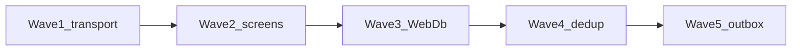

# Рефакторинг: упрощение и отказоустойчивость

Дорожная карта упрощения кода, читаемости, управляемости, надёжности и
отказоустойчивости AllerGuide. Сохраняет offline-first, слои
`core` / `ai` → `services` → UI и существующие инварианты ownership /
Result из рефакторингов профиля, дневника и сканера.

**Связанные документы:** [`architecture.md`](./architecture.md) ·
[`development-rules.md`](./development-rules.md) ·
[`refactoring-profile-module.md`](./refactoring-profile-module.md) ·
[`refactoring-diary-module.md`](./refactoring-diary-module.md) ·
[`refactoring-scanner-module.md`](./refactoring-scanner-module.md) ·
[`ux-improvement-plan.md`](./ux-improvement-plan.md) ·
[`adr/001-dual-write.md`](./adr/001-dual-write.md)

---

## 1. Принципы

| Принцип | Практика |
|---------|----------|
| High cohesion / low coupling | Один сервис — одна предметная область; экраны только связывают state → services |
| Information hiding | Нет SQL/fetch в `app/**`; WebDb/SQLite за `DbLike` или typed repository |
| Defensive enrichment | Сеть — опционально: timeout + soft-fail → локальный fallback |
| Единый fault contract | `{ ok: false, code/error }` или `null` для enrichment; не глотать без `logCaughtError` |
| Минимальный diff | Каждая волна — отдельный PR; не смешивать с фичами продукта |

**Не трогаем без ADR:** алгоритмы keyword/LLM scan, dual-write SoT, zero-knowledge sync,
GINA-пороги в `packages/core`.

---

## 2. Диагностика (baseline)

### Читаемость / управляемость

| Hotspot | Проблема |
|---------|----------|
| `apps/mobile/app/(tabs)/scanner.tsx` (~1.5k LOC) | God-экран: камера, OCR/VL, история, alias feedback |
| `apps/mobile/app/(tabs)/map.tsx` (~1.3k LOC) | Пыльца / AQI / places / basemap failover в одном компоненте |
| `apps/mobile/src/db/init.ts` (`WebDb`) | SQL-string emulator: новые таблицы легко «тихо» не работают |
| `packages/core/src/diary.ts`, doctor-report HTML | Крупные модули, смешанные обязанности |
| OFF mobile ↔ API | Дублирование клиента; риск дрейфа |
| `@deprecated` aliases | Двойные API (theme, gradients, pollen helpers) |

### Надёжность / отказоустойчивость

| Gap | Риск |
|-----|------|
| `runLlmScan` без try/catch и timeout | Сеть бросает → нет fallback на `runMockScan` |
| `*-api-service.ts` на сыром `fetch` | Зависший «Подождите…» |
| Нет replay pending alias feedback | Локальная очередь не дренируется |
| Нет global Express error handler | Пропущенный `catch` в route → падение процесса |
| Нет offline mutation outbox (ADR 001) | `BACKEND_AUTH` + offline create профиля |
| Sync без timeout | Долгий hang на backup |

Сильные стороны (сохраняем): feature flags, barcode cascade, `apiRequest` timeout,
`logCaughtError`, Result+ownership после profile/diary/scanner, `ErrorState` /
`useAsyncState`.

---

## 3. Волны

### Wave 1 — Transport resilience (этот PR)

Цель: enrichment и LLM никогда не роняют и не вешают core-flow.

| # | Изменение | Файлы |
|---|-----------|-------|
| 1.1 | `runLlmScan`: AbortSignal timeout + catch → `null` → mock | `packages/ai/src/smart-scan.ts` |
| 1.2 | Общий `enrichmentPost` (timeout + soft-fail + log) | `apps/mobile/src/services/enrichment-api.ts` |
| 1.3 | OCR / intent / dish-vision / STT / search / dish-resolve → `enrichmentPost` | `*-api-service.ts` |
| 1.4 | Sync backup: `fetchWithTimeout` | `sync-service.ts` |
| 1.5 | `flushPendingAliasFeedback` + DELETE-by-id в WebDb + warmup на старте | `alias-feedback-service`, `init.ts`, `_layout.tsx` |
| 1.6 | Global Express error middleware | `apps/api/src/middleware/error-handler.ts`, `app.ts` |
| 1.7 | Тесты failure contracts | smart-scan, enrichment-api, alias-feedback, error-handler |

**Критерий готовности:** `pnpm --filter @allerguide/ai test`, `pnpm --filter mobile test`,
`pnpm --filter api test` зелёные; LLM/network throw → mock; hung fetch abort ≤ timeout;
pending alias уходит после успешного POST; unhandled route error → 500 JSON.

### Wave 2 — Screen decomposition

- Извлечь hooks/subviews из `scanner.tsx` и `map.tsx` (камера, результат, история;
  pollen/AQI/places/basemap).
- Экраны только wiring; логика остаётся в services.
- ASIT / prescribed-therapy: shared course-editor primitives (после scanner/map).

### Wave 3 — Kill WebDb SQL parsing

- Typed collection repositories (одна модель native + web), без `startsWith('insert into…')`.
- Сохранить `DbLike` на переходный период или заменить точечно по доменам
  (diary → profiles → scans).
- Регрессия: существующие `init-*.test.ts` + service tests.

### Wave 4 — Dedup и вычистка

- Shared OFF / catalog client (core или общий модуль для mobile + API).
- Split `diary.ts` (wizard schema vs formatters) и doctor-report HTML builder.
- Ownership helper для SOS / reminders / scans (дожать follow-up diary-doc).
- Sweep `@deprecated` theme/logo/gradient aliases после короткого окна совместимости.

### Wave 5 — Offline→online reconciliation

- Mutation outbox для профилей при `BACKEND_AUTH` (ADR 001 Phase 3+).
- Sync: retry-once на 502/503; fail-closed если encryption недоступна на stage.
- Redis-backed scan daily budget (multi-instance).
- Ops: enrichment fallback rates (по аналогии с `map_pollen_fallback`).

---

## 4. Порядок и риски

| Волна | Риск регрессии | Почему сейчас / позже |
|-------|----------------|------------------------|
| 1 | Низкий | Адаптеры + тесты; UI не трогаем |
| 2 | Средний | Большие экраны; нужны smoke Maestro / ручной QA |
| 3 | Высокий | Persistence; только с полной web/native матрицей тестов |
| 4 | Средний | Дрейф OFF / i18n doctor-report |
| 5 | Высокий | Dual-write и деньги/бюджет LLM |

UX Stage B (`useAsyncState` / `ErrorState`) из [`ux-improvement-plan.md`](./ux-improvement-plan.md)
дополняет Wave 1–2: транспорт soft-fail + UI retry.

---

## 5. Чеклист каждой волны

- [ ] Offline core flows при выключенных `EXPO_PUBLIC_*`
- [ ] Бизнес-логика не утекает в `app/**` / толстые routes
- [ ] `pnpm typecheck` + релевантные `pnpm --filter … test`
- [ ] Обновлены `codebase-index.md` и этот документ (статус волны)
- [ ] Нет unrelated diff

---

## 6. Статус

| Волна | Статус |
|-------|--------|
| Wave 1 | ✅ реализована (этот PR) |
| Wave 2–5 | 📝 запланированы |

После merge Wave 1 отметить ✅ и завести follow-up issues по Wave 2+.
