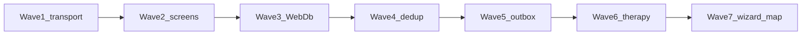

# Рефакторинг: упрощение и отказоустойчивость

Дорожная карта упрощения кода, читаемости, управляемости, надёжности и
отказоустойчивости AllerGuide. Сохраняет offline-first, слои
`core` / `ai` → `services` → UI и существующие инварианты ownership /
Result из рефакторингов профиля, дневника и сканера.

**Связанные документы:** [`architecture.md`](./architecture.md) ·
[`development-rules.md`](./development-rules.md) ·
[`refactoring-profile-module.md`](./refactoring-profile-module.md) ·
[`refactoring-diary-module.md`](./refactoring-diary-module.md) ·
[`refactoring-scanner-module.md`](./refactoring-scanner-module.md) ·
[`ux-improvement-plan.md`](./ux-improvement-plan.md) ·
[`adr/001-dual-write.md`](./adr/001-dual-write.md)

---

## 1. Принципы

| Принцип | Практика |
|---------|----------|
| High cohesion / low coupling | Один сервис — одна предметная область; экраны только связывают state → services |
| Information hiding | Нет SQL/fetch в `app/**`; WebDb/SQLite за `DbLike` или typed repository |
| Defensive enrichment | Сеть — опционально: timeout + soft-fail → локальный fallback |
| Единый fault contract | `{ ok: false, code/error }` или `null` для enrichment; не глотать без `logCaughtError` |
| Минимальный diff | Каждая волна — отдельный PR; не смешивать с фичами продукта |

**Не трогаем без ADR:** алгоритмы keyword/LLM scan, dual-write SoT, zero-knowledge sync,
GINA-пороги в `packages/core`.

---

## 2. Диагностика (baseline)

### Читаемость / управляемость

| Hotspot | Проблема |
|---------|----------|
| `apps/mobile/app/(tabs)/scanner.tsx` (~1.5k LOC) | God-экран: камера, OCR/VL, история, alias feedback |
| `apps/mobile/app/(tabs)/map.tsx` (~1.3k LOC) | Пыльца / AQI / places / basemap failover в одном компоненте |
| `apps/mobile/src/db/init.ts` (`WebDb`) | SQL-string emulator: новые таблицы легко «тихо» не работают |
| `packages/core/src/diary.ts`, doctor-report HTML | Крупные модули, смешанные обязанности |
| OFF mobile ↔ API | Дублирование клиента; риск дрейфа |
| `@deprecated` aliases | Двойные API (theme, gradients, pollen helpers) |

### Надёжность / отказоустойчивость

| Gap | Риск |
|-----|------|
| `runLlmScan` без try/catch и timeout | Сеть бросает → нет fallback на `runMockScan` |
| `*-api-service.ts` на сыром `fetch` | Зависший «Подождите…» |
| Нет replay pending alias feedback | Локальная очередь не дренируется |
| Нет global Express error handler | Пропущенный `catch` в route → падение процесса |
| Нет offline mutation outbox (ADR 001) | `BACKEND_AUTH` + offline create профиля |
| Sync без timeout | Долгий hang на backup |

Сильные стороны (сохраняем): feature flags, barcode cascade, `apiRequest` timeout,
`logCaughtError`, Result+ownership после profile/diary/scanner, `ErrorState` /
`useAsyncState`.

---

## 3. Волны

### Wave 1 — Transport resilience

Цель: enrichment и LLM никогда не роняют и не вешают core-flow.

| # | Изменение | Файлы |
|---|-----------|-------|
| 1.1 | `runLlmScan`: AbortSignal timeout + catch → `null` → mock | `packages/ai/src/smart-scan.ts` |
| 1.2 | Общий `enrichmentPost` (timeout + soft-fail + log) | `apps/mobile/src/services/enrichment-api.ts` |
| 1.3 | OCR / intent / dish-vision / STT / search / dish-resolve → `enrichmentPost` | `*-api-service.ts` |
| 1.4 | Sync backup: `fetchWithTimeout` | `sync-service.ts` |
| 1.5 | `flushPendingAliasFeedback` + DELETE-by-id в WebDb + warmup на старте | `alias-feedback-service`, `init.ts`, `_layout.tsx` |
| 1.6 | Global Express error middleware | `apps/api/src/middleware/error-handler.ts`, `app.ts` |
| 1.7 | Тесты failure contracts | smart-scan, enrichment-api, alias-feedback, error-handler |

**Критерий готовности:** `pnpm --filter @allerguide/ai test`, `pnpm --filter mobile test`,
`pnpm --filter api test` зелёные; LLM/network throw → mock; hung fetch abort ≤ timeout;
pending alias уходит после успешного POST; unhandled route error → 500 JSON.

### Wave 2 — Screen decomposition (в `main`, #324)

- `scanner.tsx` (~1537 → ~264 LOC): `useScannerController` + `ScannerCameraModal` /
  `ScannerResultPanel` / `ScannerLists` / `scanner-styles` / `scanSourceLabelKey`.
- `map.tsx`: `useMapLiveData` (`refreshMapLiveData` / `searchMapThisArea`) +
  `MapLayerSwitcher` / `MapPollenStatusCard` / `MapDoctorsSection` / `map-constants`.
- Экраны — wiring; I/O остаётся в services.
- ASIT / prescribed-therapy: shared course-editor — Wave 6.

### Wave 3 — Kill WebDb SQL parsing (в `main`, #325)

Цель: SQL-string parsing — тонкий роутер, не 687-строчный god-class.
Сервисы по-прежнему вызывают `getDb().runSync` / `getFirstSync` / `getAllSync`.
Native SQLite не дублируем (`init.native.ts`).

| # | Изменение | Файлы |
|---|-----------|-------|
| 3.1 | Typed get/save accessors + `StoredUser` / `StoredAliasFeedback` / `BarcodeCacheRow` / `StoredDiaryAttachment` | `apps/mobile/src/db/web-collections.ts` |
| 3.2 | Каждая ветка `runSync` / `getFirstSync` / `getAllSync` — именованная функция; тот же порядок params и ownership | `apps/mobile/src/db/web-sql-handlers.ts` |
| 3.3 | `normalizeSql` + dispatch в том же порядке `startsWith` / `includes` | `apps/mobile/src/db/web-sql-router.ts` |
| 3.4 | `WebDb` только делегирует в роутер; `execSync` no-op; `getDb` / `initDb` / `persistDbWrites` без изменений | `apps/mobile/src/db/init.ts` |
| 3.5 | Unmatched SQL → `console.warn('[WebDb] unmatched SQL', sql)` и `void` / `null` / `[]` (не throw) | router |
| 3.6 | Регрессия + unmatched / alias DELETE-by-id | `init-*.test.ts`, `web-sql-router.test.ts` |

Полные typed repositories (одна модель native + web без SQL-строк) — follow-up;
в этом PR `DbLike` сохраняем.

**Критерий готовности:** `init-diary` / `init-profile` / `init-scan` зелёные;
unmatched SQL варнит и возвращает `[]` / `null`; alias DELETE-by-id через `getDb`.

### Wave 4 — Dedup и вычистка (в `main`, #326)

Цель: один OFF-парсер без HTTP в core, тонкий `diary.ts`, удаление неиспользуемых `@deprecated` alias.

| # | Изменение | Файлы |
|---|-----------|-------|
| 4.1 | Shared OFF: типы, barcode/product normalize, URL builders, константы (без HTTP) | `packages/core/src/open-food-facts.ts` |
| 4.2 | Slim-адаптеры: fetch + env + публичные имена | `apps/mobile/.../open-food-facts-service.ts`, `apps/api/.../open-food-facts.ts` |
| 4.3 | Split `diary.ts`: schema vs format; barrel реэкспортирует оба | `diary-schema.ts`, `diary-format.ts`, `diary.ts` |
| 4.4 | Удалены неиспользуемые deprecated alias | product-service, `useGlassStyles`, `AppLogo`, `calm-gradient`, theme `colors`/`shadows`, `POLLEN_CALENDAR_MOSCOW`, core `PlumeParticle`, wellness `recentSymptoms`/`recentTriggers`, `ACT_PROMPT_INTERVAL_DAYS` → `GINA_ACT_PROMPT_INTERVAL_DAYS` |

**Не в этом PR (follow-up):** doctor-report HTML builder; ownership helper для SOS / reminders / scans.

**Критерий готовности:** `pnpm --filter @allerguide/core test` + typecheck core/mobile/api; API `open-food-facts.test.ts` зелёный; импорты `diary.ts` / `@allerguide/core` без изменений.

### Wave 5 — Offline→online reconciliation (в `main`, #327)

- Mutation outbox профилей: при `BACKEND_AUTH` + network fail — локальная запись + очередь,
  `flushProfileOutbox` на старте.
- Sync: `fetchSyncWithRetry` (502/503 / сеть, один повтор); upload **fail-closed**
  если `encryptBackup` вернул `null` (`encryption_unavailable`).
- Scan daily budget: Redis `INCR` + TTL при `REDIS_URL`, иначе in-memory.
- Enrichment fallback rates — follow-up (pollen ops уже есть).

### Wave 6 — Unified therapy + prescription OCR (в `main`, #333)

Цель: один OCR/камера/PDF-флоу и общая оболочка шагов `form` → `verify` → `review`
для АСИТ и базисной терапии. Уникальные поля (аллерген, фаза, клинический диагноз,
мульти-напоминания) остаются на экранах.

| # | Изменение | Файлы |
|---|-----------|-------|
| 6.1 | Чистые хелперы шагов / расписания / OCR-hint | `components/therapy/course-editor.ts`, `prescription-ocr-copy.ts` |
| 6.2 | `usePrescriptionParser` — камера, PDF, recognize, paste-sheet | `hooks/use-prescription-parser.ts` |
| 6.3 | `CourseEditorLayout` + `CourseVerifyStep` + `CourseReviewSummary` | `components/therapy/*` |
| 6.4 | `PrescriptionImportPanel` + `PrescriptionImportModals` | `components/therapy/*` |
| 6.5 | Экраны только wiring + ASIT/PT-специфика | `asit-course.tsx`, `prescribed-therapy.tsx` |

**Критерий готовности:** тесты `course-editor.test.ts`; `testID` камеры/PDF/OCR/verify/review
без изменений; offline save курса без API.

### Wave 7 — DiaryWizard + map final split (в `main`, #334)

- `DiaryWizard.tsx` → `useDiaryWizardController` + `components/diary/wizard/*`
  (`DiaryStepField`, `DiaryPhotoToolbar`, `DiaryDishComponentsField`,
  `DiaryPefZonePreview`, `DiaryLegacyEditor`, preview helpers).
- `map.tsx` → `MapCanvas` / `MapLayerLegend` / `MapPollenDetails` / `MapPlacesPanel`.
- Публичные пропсы, `testID` и i18n без изменений.

---

## 4. Порядок и риски

| Волна | Риск регрессии | Почему сейчас / позже |
|-------|----------------|------------------------|
| 1 | Низкий | Адаптеры + тесты; UI не трогаем |
| 2 | Средний | Большие экраны; нужны smoke Maestro / ручной QA |
| 3 | Высокий | Persistence; только с полной web/native матрицей тестов |
| 4 | Средний | Дрейф OFF / i18n doctor-report |
| 5 | Высокий | Dual-write и деньги/бюджет LLM |

UX Stage B (`useAsyncState` / `ErrorState`) из [`ux-improvement-plan.md`](./ux-improvement-plan.md)
дополняет Wave 1–2: транспорт soft-fail + UI retry.

---

## 5. Чеклист каждой волны

- [ ] Offline core flows при выключенных `EXPO_PUBLIC_*`
- [ ] Бизнес-логика не утекает в `app/**` / толстые routes
- [ ] `pnpm typecheck` + релевантные `pnpm --filter … test`
- [ ] Обновлены `codebase-index.md` и этот документ (статус волны)
- [ ] Нет unrelated diff

---

## 6. Статус

| Волна | Статус |
|-------|--------|
| Wave 1 | ✅ в `main` (#321) |
| Wave 2 | ✅ в `main` (#324) — hooks + подэкраны scanner/map |
| Wave 3 | ✅ в `main` (#325) — typed WebDb collections / handlers / router |
| Wave 4 | ✅ в `main` (#326) — OFF core mapping, diary split, unused aliases |
| Wave 5 | ✅ в `main` (#327) — profile outbox, sync fail-closed, Redis scan budget |
| Wave 6 | ✅ в `main` (#333) — shared course editor + prescription OCR |
| Wave 7 | ✅ в `main` (#334) — DiaryWizard + map canvas/panels |
| Wave 8 | 📝 запланирована — typed repositories |
