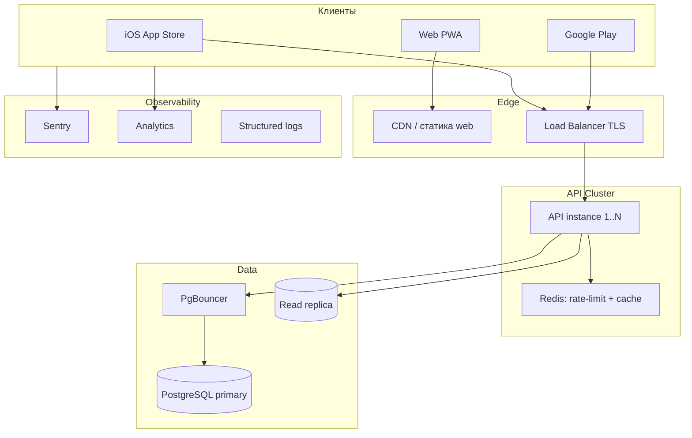
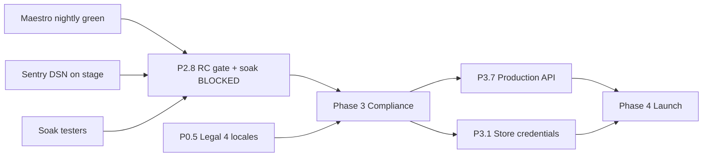

# AllerGuide — Roadmap to Production

Дорожная карта от текущего MVP до публичного релиза v1.0 и пост-релизного развития.

**Статус документа:** сверен с кодом и CI **2026-08-17**. Продукт под брендом **Aclearo / A-Claro**; stage API — Yandex Cloud (`api.staging.aclearo.com`).

**Архитектура и правила кода:** [`docs/architecture.md`](./architecture.md) · [`docs/development-rules.md`](./development-rules.md)

### Сводка по фазам

| Фаза | Статус | Что осталось |
|------|--------|--------------|
| Phase 0 — Stabilization MVP | ✅ кроме P0.5 | Legal только `ru` + `en` (нужны `de`, `es`, `fr`, `it`) |
| Phase 1 — Backend integration | ✅ | — (см. [`phase-1-run.md`](./phase-1-run.md)) |
| Phase 2 — Quality & Security | ⚠️ P2.1–P2.7 ✅, **P2.8 BLOCKED** | Maestro nightly красный, Sentry crash-free не собран, 0 soak-тестеров |
| Phase 3 — Compliance & Store | ⛔ не начата (гейтится P2.8) | Store credentials, prod API, legal sign-off |
| Phase 4 — v1.0 Launch | ⛔ не начата | — |
| Phase 5 — Post-launch | 🔶 частично сделана досрочно | Осталось масштабирование (P5.6) |
| YC-миграция (off Replit) | ✅ gates 0–4, ⚠️ Phase 5 | Поставить Replit host на pause → `REQUIRE_REPLIT_PAUSED=1 pnpm yc-stage-phase5` |

Единственный жёсткий блокер продвижения — **P2.8** (RC gate + soak). Автоматическая часть гейта зелёная, ручная (G3/G5/G7) — нет.

### Трекинг в GitHub (требует пересоздания)

Схема `[P0.x]`…`[P5.x]` + метки `phase-0`…`phase-5` в репозитории **не создана**: на 2026-08-17 открытых issues нет, из milestones существуют только `Beta` и `readmap` (оба пустые), меток `phase-*` / `roadmap` нет. Ссылки на `milestone/1…6` из прежней версии этого документа не работают.

Пересоздать из [`scripts/roadmap-issues.json`](../scripts/roadmap-issues.json):

```bash
chmod +x scripts/create-roadmap-issues.sh
./scripts/create-roadmap-issues.sh --dry-run   # предпросмотр
./scripts/create-roadmap-issues.sh             # 6 milestones + 34 issues
```

Требуется `gh` с правами `issues:write`. Скрипт идемпотентен: повторный запуск пропускает существующие issues (по префиксу `[Px.x]`). При пересоздании завести только незакрытые задачи (Phase 3–5 + P0.5 + P2.8), иначе milestone-и сразу заполнятся выполненным.

**Windows:** инструкция через Git Bash — [`docs/git-bash-roadmap.md`](./git-bash-roadmap.md).

Отдельный долг процесса: **30 открытых PR** (часть — с 2026-07). Пока они не разобраны, «0 P0/P1» и Go/No-Go по Phase 4 не проверяемы.

---

## 1. Текущая стадия (baseline на 2026-08-17)

### Реализовано

| Область | Статус |
|---------|--------|
| Mobile | 6 табов (`home`, `diary`, `scanner`, `map`, `market`, `sos`) + профили, онбординг, отчёт врачу, настройки, клинические планы |
| Дизайн | Clinical Calm, бренд Aclearo / A-Claro, 6 локалей UI |
| Данные | SQLite (native) + IndexedDB с async write-through (web), offline-first |
| Сканер | Штрихкод (каталог → cache → OFF), Vision OCR, LLM-скан, intent-классификатор, search ingredients, dish vision (VL) |
| Wellness / карта | Open-Meteo + Google Pollen (heatmap, forecast, plume), Google Air Quality, Places API (New), Yandex basemap |
| PDF | Отчёт для врача (`expo-print`) |
| API | Express + Drizzle + Postgres (схемы `profile` / `catalog`), JWT, sync, scan/OCR/intent/search/VL, health |
| Безопасность | helmet, strict CORS, rate-limit (Redis-store), zero-knowledge бэкапы, audits без critical |
| Приватность | `DELETE /api/auth/account` + `GET /api/auth/export`; профили/дневник/история удаляются каскадом от `app_users` |
| Тесты | core 458, ai 52, mobile 189, api 160; 13 Maestro-файлов (offline + staging suites, включая bootstrap); CI `typecheck` + `lint` + `test` + `api-integration` |
| Staging | YC Serverless Container + Managed PG + Lockbox; `Dockerfile`, `deploy-staging.yml`, EAS `staging`, Gradle APK workflow |
| Observability | `error-reporting.ts` (Sentry) + `analytics-service` + `/api/analytics` (код готов, DSN на stage не задан) |

### Частично / за feature flags

| Фича | Переменная | Ограничение |
|------|------------|-------------|
| Backend auth | `EXPO_PUBLIC_BACKEND_AUTH` | Локальная auth остаётся дефолтом; на stage включено |
| Cloud sync | `EXPO_PUBLIC_CLOUD_SYNC` | Cross-device restore есть (recovery key, 12 слов); escrow ключа нет — потеря фразы = потеря бэкапа |
| AI-сканер / OCR / VL | `EXPO_PUBLIC_AI_SCAN_ENABLED`, `EXPO_PUBLIC_YC_OCR`, `EXPO_PUBLIC_AI_DISH_VISION` | Провайдер на stage — Yandex AI (`AI_PROVIDER=yandex`), не OpenAI; нужны YC-ключи + бюджет |
| Places / Air Quality | `EXPO_PUBLIC_MAP_PLACES`, `EXPO_PUBLIC_AIR_QUALITY=google` | Отдельные server-ключи в Lockbox; Pollen-only ключ не подходит |
| STT | `EXPO_PUBLIC_YC_STT` (+ `_MIC`) | Cloud-микрофон только как fallback к OS speech |
| Sentry / analytics | `EXPO_PUBLIC_SENTRY_DSN`, `EXPO_PUBLIC_ANALYTICS_ENABLED` | Analytics на stage включена; Sentry DSN в EAS `staging` **не** задан |

### Пробелы (проверено)

| Пробел | Факт |
|--------|------|
| Maestro nightly красный | 10 подряд `failure` до 2026-08-11, после — прогонов нет. Две разные причины: offline-джоб — `Timeout waiting for emulator to boot` (`macos-latest` теперь arm64, а в workflow `arch: x86_64`); staging-джоб — `Maestro Android driver did not start up in time` на ubuntu |
| Crash-free метрики | `EXPO_PUBLIC_SENTRY_DSN` не задан в EAS `staging` → G5 нечем закрыть |
| Soak-тестеры | 0 enrolled ([`staging-soak-log.md`](./staging-soak-log.md)) |
| Legal локализация | Тексты только `ru` + `en` ([`apps/mobile/src/i18n/legal-docs.ts`](../apps/mobile/src/i18n/legal-docs.ts)); `de`/`es`/`fr`/`it` падают на fallback |
| Store credentials | `eas.json`: `ascAppId: 0000000000`, `appleTeamId: XXXXXXXXXX` (EAS `projectId` — уже реальный) |
| Production API | Есть только staging-контур; prod-домен, monitoring и backups не подняты |
| PR backlog | 30 открытых PR |
| Escrow ключа бэкапа | Recovery key держит пользователь; серверного восстановления нет (осознанный zero-knowledge trade-off) |

---

## 2. Целевая архитектура продакшена



**Принцип v1.0:** mobile остаётся offline-first; backend — auth, sync, AI-scan, опционально push.

Подробнее: [`docs/architecture.md`](./architecture.md) · правила кода: [`docs/development-rules.md`](./development-rules.md) · env: [`AGENTS.md`](../AGENTS.md).

### Архитектурные гейты (обязательны для каждой фазы)

Каждая задача фазы должна проходить гейты из [`development-rules.md` §7](./development-rules.md#7-план-разработки-и-фазы):

| Фаза | Архитектурный гейт |
|------|-------------------|
| P0 | Core flows без API; регрессия `qa-checklist.md` |
| P1 | Backend только за флагами; dual-write в `src/services/*`, не в UI |
| P2 | Тесты на core/ai/services; offline не ломается |
| P3 | Account deletion + zero-knowledge sync; миграции versioned |
| P4 | Production env-матрица (§4); документация флагов актуальна |
| P5 | Новые фичи расширяют `core`/`ai`, не обходят слои |

**Чеклист перед merge любой задачи:** [`development-rules.md` §8](./development-rules.md#8-чеклист-перед-merge).

---

## 3. Фазы и задачи

### Phase 0 — Stabilization MVP (→ internal alpha) — ✅ кроме P0.5

| ID | Задача | Статус | Критерий готовности |
|----|--------|--------|---------------------|
| P0.1 | Регрессионный чеклист | ✅ | [`qa-checklist.md`](./qa-checklist.md) + прогон [`qa-run-2026-07-04.md`](./qa-run-2026-07-04.md) |
| P0.2 | Критичные баги MVP | ✅ | 0 открытых issues (трекер пустой — см. оговорку про GitHub) |
| P0.3 | Актуализировать README | ✅ | README + `AGENTS.md` + [`codebase-index.md`](./codebase-index.md) |
| P0.4 | EAS preview-сборки | ✅ | [`eas-internal-preview.md`](./eas-internal-preview.md), [`android-local-build.md`](./android-local-build.md) |
| P0.5 | Локализация legal | ⛔ **не закрыт** | Privacy/Terms есть только `ru` + `en`; нужны `de`, `es`, `fr`, `it` в `legal-docs.ts` |

---

### Phase 1 — Backend integration (→ closed beta) — ✅

**Детальные подзадачи и лог:** [`phase1-phase2-issues.md`](./phase1-phase2-issues.md) · [`phase-1-run.md`](./phase-1-run.md)

| ID | Задача | Статус | Артефакт |
|----|--------|--------|----------|
| P1.1 | Deploy API staging | ✅ | YC Serverless + Managed PG; [`staging-yandex-cloud.md`](./staging-yandex-cloud.md), [`migrate-off-replit-to-yc.md`](./migrate-off-replit-to-yc.md) |
| P1.2 | Backend auth E2E | ✅ | `auth-service` + `backend-api`, `refreshProfilesFromBackend` |
| P1.3 | Ключ восстановления бэкапа | ✅ | `backup-crypto` recovery API, `RecoveryKeyModal` |
| P1.4 | Cloud sync E2E | ✅ | `sync-encrypted-e2e.test.ts`, [ADR 002](adr/002-sync-conflict-policy.md) |
| P1.5 | AI scan staging | ✅ | `/api/scan` + cache + budget; Yandex-провайдер ([`staging-yandex-ai.md`](./staging-yandex-ai.md)) |
| P1.6 | Интеграционные тесты API | ✅ | CI job `api-integration` + Postgres 16 |
| P1.7 | Closed beta gate | ✅ | [`closed-beta-p17.md`](./closed-beta-p17.md) (gate-out не перенесён в soak-лог) |

**Dual-write:** [ADR 001](adr/001-dual-write.md) — offline-first, local source of truth, server mirror.

---

### Phase 2 — Quality & Security (→ release candidate) — ⚠️ блокирует всё дальше

**Лог:** [`phase-2-run.md`](./phase-2-run.md) · гейт: [`rc-gate.md`](./rc-gate.md) · soak: [`staging-soak-log.md`](./staging-soak-log.md)

| ID | Задача | Статус | Факт |
|----|--------|--------|------|
| P2.1 | E2E mobile (Maestro) | ✅ код / ⛔ CI | Флоу + nightly workflow есть; nightly падает на старте эмулятора / драйвера |
| P2.2 | Mobile unit tests | ✅ | 189 тестов (цель была ≥30), гейт `mobile-test-gate.mjs` |
| P2.3 | Sentry | ✅ код / ⛔ stage | `error-reporting.ts` + EAS hook; DSN на stage не задан |
| P2.4 | Analytics | ✅ | `analytics-service` + `/api/analytics` ([`analytics-staging.md`](./analytics-staging.md)) |
| P2.5 | Security audit mobile | ✅ | [`security-audit-mobile.md`](./security-audit-mobile.md) |
| P2.6 | Pen-test API | ✅ | [`security-audit-api.md`](./security-audit-api.md), 0 critical |
| P2.7 | Performance | ✅ | [`performance-cold-start.md`](./performance-cold-start.md), `-api-infra`, `-web-store` |
| P2.8 | RC gate + soak | ⛔ **BLOCKED** | Автогейт зелёный (`pnpm rc-gate`, RC Gate CI 2026-08-17 `success`); G3/G5/G7 закрыть нечем |

**Инфра готова:** Redis rate-limit store, health checks (DB + Redis), опциональная read-replica.

---

### Phase 3 — Compliance & Store readiness — ⛔ гейтится P2.8

| ID | Задача | Статус | Критерий готовности |
|----|--------|--------|---------------------|
| P3.1 | EAS production certs | 🔶 частично | `projectId` реальный; `ascAppId` / `appleTeamId` — плейсхолдеры |
| P3.2 | Store metadata | ⛔ | Скриншоты, описания 6 локалей, age rating |
| P3.3 | Medical disclaimer | 🔶 | Дисклеймеры в приложении есть; юридической подписи и store-текста нет |
| P3.4 | Privacy compliance | 🔶 | Export + account deletion + каскадный wipe реализованы; нужен audit-документ GDPR / 152-ФЗ |
| P3.5 | Permissions justification | ⛔ | Camera, Location, Notifications — тексты для review |
| P3.6 | Soft launch | ⛔ | Closed beta 50–100 users, crash-free ≥99.5% |
| P3.7 | Production API | ⛔ | Prod-контур на YC + домен + monitoring + backups |

---

### Phase 4 — v1.0 Launch — ⛔ не начата

| ID | Задача | Критерий готовности |
|----|--------|---------------------|
| P4.1 | Production feature flags | Auth, sync, AI scan, Sentry, analytics ON |
| P4.2 | Go/No-Go checklist | 0 P0, E2E green, legal signed, rollback plan, PR backlog разобран |
| P4.3 | Public store release | App Store + Google Play live |

**Конфигурация v1.0:**

| Компонент | Значение |
|-----------|----------|
| `EXPO_PUBLIC_API_URL` | `https://api.aclearo.com` (профиль `production` в [`eas.json`](../apps/mobile/eas.json)) |
| Auth | Backend JWT для новых пользователей |
| Sync | ON + recovery key |
| AI scan | ON, `SCAN_DAILY_BUDGET` per user |
| Карта / Маркет | Отдельные табы: Google/Yandex basemap + affiliate offers |

---

### Phase 5 — Post-launch (v1.1+) — 🔶 частично сделана досрочно

| Приоритет | ID | Фича | Статус |
|-----------|-----|------|--------|
| P1 | P5.1 | Реальный OCR меню | ✅ Yandex Vision OCR + intent + VL |
| P1 | P5.2 | Персонализированные push-напоминания | ✅ `notification-*-service` + `reminder-policy` |
| P1 | P5.3 | Отдельные разделы Map / Market | ✅ табы `map` / `market` |
| P2 | P5.4 | Live карта мест | ✅ Places API (New) через `/api/places/nearby` |
| P2 | P5.4b | Карта пыления (Google + Yandex + гео) | ✅ [`yandex-pollen-map-integration.md`](./yandex-pollen-map-integration.md), [`interactive-pollen-map-plan.md`](./interactive-pollen-map-plan.md) |
| P2 | P5.5 | Маркетплейс (affiliate) | ✅ [`yandex-market-affiliate.md`](./yandex-market-affiliate.md) |
| P2 | P5.6 | Масштабирование | 🔶 Redis rate-limit + read-replica есть; распределённый scan-cache и PgBouncer в prod — нет |

Досрочно закрытые P5-пункты не заменяют Phase 2/3: они увеличили площадь, которую нужно покрыть soak-ом и store-комплаенсом.

---

## 4. Матрица окружений

| Env | Mobile | API | Флаги |
|-----|--------|-----|-------|
| Local | Expo dev / web `:5000` | `localhost:3001` | все OFF |
| Preview | EAS `preview` | — | backend OFF (offline-демо) |
| Staging | EAS `staging` | `api.staging.aclearo.com` (YC) | auth + sync + scan + OCR + VL + pollen + places/AQ ON |
| Production | EAS `production` | `api.aclearo.com` (не поднят) | все ON |

Серверные ключи stage — только Yandex Lockbox ([`staging-secrets-inventory.md`](./staging-secrets-inventory.md)); в `EXPO_PUBLIC_*` они запрещены.

---

## 5. Критический путь



**Топ-5 блокеров прода (актуально):**

1. Maestro nightly не зелёный — без него нет G3 и нет E2E-гейта перед релизом
2. `EXPO_PUBLIC_SENTRY_DSN` не задан на stage — нет crash-free метрики для G5
3. Нет soak-тестеров — G7 не закрывается даже при зелёном CI
4. Store credentials (`ascAppId`, `appleTeamId`) — плейсхолдеры
5. Production-контур API не поднят (домен, monitoring, backups)

Снятые прежние блокеры: cross-device restore (recovery key), account deletion + server wipe (каскад от `app_users`), production deploy артефакты (`Dockerfile` + YC-скрипты).

---

## 6. Дальнейшие шаги

Порядок отражает зависимости, а не желаемость: шаги 1–4 разблокируют P2.8, дальше открывается Phase 3.

### Шаг 1 — починить Maestro nightly (разблокирует G3)

Два независимых дефекта в [`maestro-nightly.yml`](../.github/workflows/maestro-nightly.yml), оба инфраструктурные, не в приложении:

| Джоб | Ошибка | Направление фикса |
|------|--------|-------------------|
| `maestro-offline` (`macos-latest`) | `Timeout waiting for emulator to boot` | `macos-latest` теперь arm64, а в шаге задан `arch: x86_64` → перевести на `arch: arm64-v8a` либо перенести джоб на `ubuntu-latest`, где x86_64-эмулятор работает |
| `maestro-staging` (`ubuntu-latest`) | `AndroidDriverTimeoutException: Maestro Android driver did not start up in time` | Эмулятор загружается, падает старт драйвера: закрепить версию Maestro CLI (сейчас ставится `latest` без пина), поднять таймаут/добавить один retry шага |

Критерий выхода: оба джоба зелёные вручную (`workflow_dispatch`), затем ≥7 зелёных ночей подряд. Заодно проверить, почему после 2026-08-11 расписание не запускалось.

### Шаг 2 — включить Sentry на stage (разблокирует G5)

Задать `EXPO_PUBLIC_SENTRY_DSN` в EAS-секретах профиля `staging` (+ `SENTRY_ORG` / `SENTRY_PROJECT` для source maps), пересобрать RC APK, убедиться, что события доходят до проекта. Метрика для гейта — crash-free sessions ≥99% на окне soak.

### Шаг 3 — набрать soak-когорту (разблокирует G7)

Взять когорту из [`closed-beta-p17.md`](./closed-beta-p17.md), внести в [`staging-soak-log.md`](./staging-soak-log.md) ответственного продукта и ежедневный headcount. Окно 14 дней стартует только после шагов 1–2, иначе метрики опять не соберутся.

### Шаг 4 — разобрать PR backlog и пересоздать трекинг

30 открытых PR делают критерий «0 P0/P1» непроверяемым. Разделить на «мержить / закрыть как устаревшие», затем пересоздать milestones и метки `phase-*` только для незакрытых задач.

### Шаг 5 — P0.5: legal на 4 локали

Дописать `de`, `es`, `fr`, `it` в [`legal-docs.ts`](../apps/mobile/src/i18n/legal-docs.ts) по образцу `ru`/`en`. Это единственный незакрытый пункт Phase 0 и вход в P3.2 (store-описания на 6 языках).

### Шаг 6 — подготовка Phase 3 (параллельно шагам 1–5)

- **P3.1:** реальные `ascAppId` / `appleTeamId` в [`eas.json`](../apps/mobile/eas.json); production-профиль secrets отдельно от staging (не переиспользовать Maestro recovery key)
- **P3.4:** оформить audit-документ: что именно удаляется (`DELETE /api/auth/account` + каскад от `app_users`), что отдаёт export, где остаётся зашифрованный бэкап
- **P3.5:** тексты обоснования разрешений (camera, location, notifications)
- **P3.7:** prod-контур на YC по образцу stage — отдельный Lockbox, отдельная Managed PG, домен `api.aclearo.com`, backups + alerting; сначала записать план, потом деплой

### Шаг 7 — закрыть YC-миграцию

Поставить Replit host на pause в UI, затем `REQUIRE_REPLIT_PAUSED=1 pnpm yc-stage-phase5` — это последний незакрытый гейт в [`migrate-off-replit-to-yc.md`](./migrate-off-replit-to-yc.md).

### Не делать сейчас

- Новые продуктовые фичи из P5 — площадь уже опережает Phase 2/3
- Escrow ключа бэкапа — меняет zero-knowledge модель; отдельное решение с ADR, не внутри RC
- Оптимизации P5.6 (распределённый scan-cache, PgBouncer) — до появления prod-нагрузки

---

## 7. Метрики успеха v1.0

| Метрика | Target |
|---------|--------|
| Crash-free sessions | ≥99.5% |
| Cold start (p95) | <3 сек |
| Onboarding completion | ≥70% |
| D7 retention | ≥25% (beta) |
| API p95 (без LLM) | <500 ms |
| Scan cache hit rate | ≥60% |

---

## 8. Роли (минимум)

| Роль | Фокус |
|------|-------|
| Mobile dev | EAS, permissions, offline, store |
| Backend dev | API, migrations, AI budget |
| DevOps | Postgres, Redis, deploy, monitoring |
| QA | Чеклисты, E2E, beta |
| Legal | Disclaimers, privacy, store compliance |
| Product | Metadata, beta cohort, приоритеты |

---

## 9. Связанные документы

- [`scripts/roadmap-issues.json`](../scripts/roadmap-issues.json) — данные для GitHub milestones/issues
- [`scripts/create-roadmap-issues.sh`](../scripts/create-roadmap-issues.sh) — скрипт создания milestones и issues
- [`docs/clinical-accuracy-roadmap.md`](./clinical-accuracy-roadmap.md) — точность wellness, профиля, дневника (фазы A–E)
- [`scripts/phase1-phase2-issues.json`](../scripts/phase1-phase2-issues.json) — 45 подзадач P1/P2 с зависимостями
- [`scripts/create-phase-issues.sh`](../scripts/create-phase-issues.sh) — скрипт создания подзадач
- [`docs/phase1-phase2-issues.md`](./phase1-phase2-issues.md) — граф зависимостей и оценки
- [`docs/qa-checklist.md`](./qa-checklist.md) — регрессионный чеклист internal alpha (P0.1)
- [`docs/eas-internal-preview.md`](./eas-internal-preview.md) — первая EAS preview-сборка (P0.4)
- [`docs/phase-1-run.md`](./phase-1-run.md) · [`docs/phase-2-run.md`](./phase-2-run.md) — run-логи фаз
- [`docs/rc-gate.md`](./rc-gate.md) — критерии RC-гейта (P2.8)
- [`docs/staging-soak-log.md`](./staging-soak-log.md) — soak и его блокеры
- [`docs/phase-3-readiness.md`](./phase-3-readiness.md) — вход в Phase 3
- [`docs/closed-beta-p17.md`](./closed-beta-p17.md) — когорта закрытой беты
- [`docs/migrate-off-replit-to-yc.md`](./migrate-off-replit-to-yc.md) — YC-миграция stage (gates 0–5)
- [`docs/staging-secrets-inventory.md`](./staging-secrets-inventory.md) — Lockbox / EAS / GitHub секреты
- [`docs/architecture.md`](./architecture.md) — архитектура и production hardening
- [`docs/development-rules.md`](./development-rules.md) — обязательные правила разработки
- [`docs/functional-requirements.md`](./functional-requirements.md) — функциональные требования
- [`docs/design-mockup.html`](./design-mockup.html) — UI mockup Clinical Calm
- [`docs/brand/brand-preview.html`](./brand/brand-preview.html) — бренд-кит
- [`AGENTS.md`](../AGENTS.md) — env flags и команды для агентов/разработчиков
