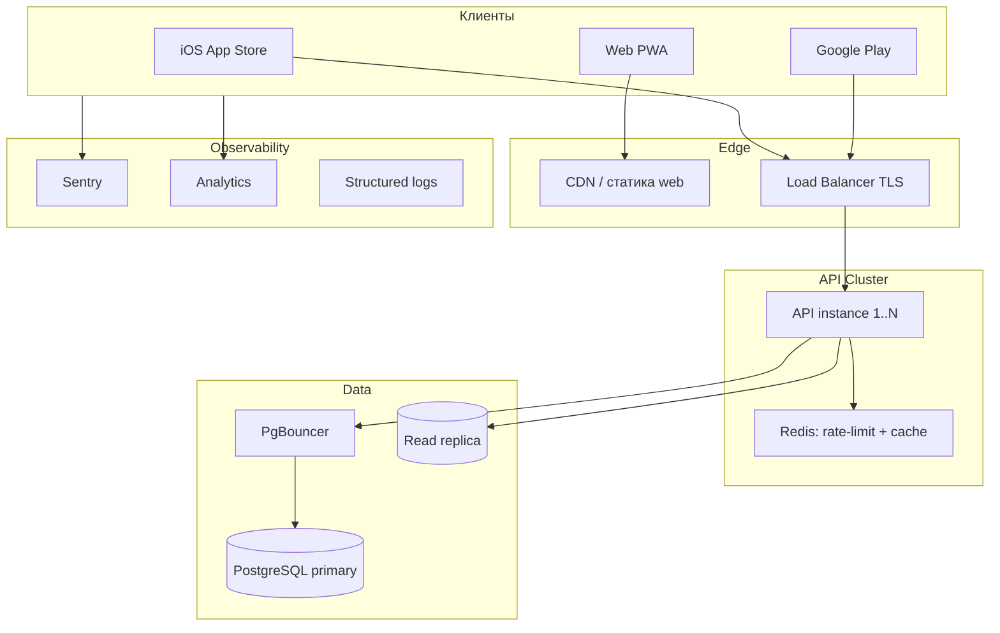
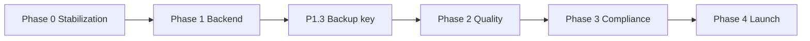

# AllerGuide — Roadmap to Production

Дорожная карта от текущего MVP до публичного релиза v1.0 и пост-релизного развития.

**Архитектура и правила кода:** [`docs/architecture.md`](./architecture.md) · [`docs/development-rules.md`](./development-rules.md)

**Трекинг в GitHub:** [Milestones](https://github.com/zuevfoton-art/AllerGuide/milestones) · метки `phase-0` … `phase-5`, `roadmap` · префиксы задач `[P0.x]` … `[P5.x]`

### Bootstrap (один раз)

Milestones и issues создаются скриптом из [`scripts/roadmap-issues.json`](../scripts/roadmap-issues.json):

```bash
chmod +x scripts/create-roadmap-issues.sh
./scripts/create-roadmap-issues.sh --dry-run   # предпросмотр
./scripts/create-roadmap-issues.sh             # 6 milestones + 34 issues
```

Требуется `gh` с правами `issues:write` на репозиторий. Скрипт идемпотентен: повторный запуск пропускает уже существующие issues (по префиксу `[Px.x]`).

**Windows:** полная инструкция через Git Bash — [`docs/git-bash-roadmap.md`](./git-bash-roadmap.md).

| Milestone | Задач | Due (ориентир) |
|-----------|-------|----------------|
| [Phase 0: Stabilization MVP](https://github.com/zuevfoton-art/AllerGuide/milestone/1) | P0.1–P0.5 | 2026-07-04 |
| [Phase 1: Backend integration](https://github.com/zuevfoton-art/AllerGuide/milestone/2) | P1.1–P1.6 | 2026-08-01 |
| [Phase 2: Quality & Security](https://github.com/zuevfoton-art/AllerGuide/milestone/3) | P2.1–P2.7 | 2026-08-29 |
| [Phase 3: Compliance & Store](https://github.com/zuevfoton-art/AllerGuide/milestone/4) | P3.1–P3.7 | 2026-09-26 |
| [Phase 4: v1.0 Launch](https://github.com/zuevfoton-art/AllerGuide/milestone/5) | P4.1–P4.3 | 2026-10-10 |
| [Phase 5: Post-launch](https://github.com/zuevfoton-art/AllerGuide/milestone/6) | P5.1–P5.6 | — |

---

## 1. Текущая стадия (baseline)

### Реализовано

| Область | Статус |
|---------|--------|
| Mobile MVP | 20+ экранов: онбординг, профили, дневник, сканер, SOS, отчёт врачу, настройки, эксперт, карта/маркет |
| Дизайн | Clinical Calm (Concept A), бренд Shield Chart, 6 языков |
| Данные | SQLite (native) + IndexedDB (web), offline-first |
| Сканер | Штрихкод + Open Food Facts + keyword-matching (`@allerguide/ai`) |
| Wellness | Индекс самочувствия через Open-Meteo (пыльца, AQI) |
| PDF | Отчёт для врача (`expo-print`) |
| API | Express + Drizzle + Postgres, JWT-auth, sync, LLM-scan с кэшем |
| Безопасность API | helmet, CORS, rate-limit, client-side шифрование бэкапов |
| CI | `typecheck` + `lint` + `test` (core, ai, mobile, api) |
| Инфра-заготовки | `eas.json`, Sentry/analytics hooks (выключены) |

### Частично / за feature flags

| Фича | Переменная | Ограничение |
|------|------------|-------------|
| Backend auth | `EXPO_PUBLIC_BACKEND_AUTH` | По умолчанию локальная auth в SQLite |
| Cloud sync | `EXPO_PUBLIC_CLOUD_SYNC` | Ключ шифрования только на устройстве — нет restore на другом девайсе |
| AI-сканер | `EXPO_PUBLIC_AI_SCAN_ENABLED` | Требует API + `OPENAI_API_KEY` |
| Аналитика / Sentry | `EXPO_PUBLIC_*` | Не настроены в production |
| Карта / Маркет | скрыты из tab bar | Статический каталог из `@allerguide/core` |

### Пробелы

- Нет E2E / UI-тестов
- Mobile unit tests: сервисы (`apps/mobile/src/services/*.test.ts`); цель Phase 2 — ≥30 тестов
- Нет production deploy API в репозитории (Docker/K8s)
- `eas.json`: placeholder Apple/Google IDs
- Legal docs только на русском
- OCR меню — mock
- Account deletion / server wipe — неполный compliance flow

---

## 2. Целевая архитектура продакшена



**Принцип v1.0:** mobile остаётся offline-first; backend — auth, sync, AI-scan, опционально push.

Подробнее: [`docs/architecture.md`](./architecture.md) · правила кода: [`docs/development-rules.md`](./development-rules.md) · env: [`AGENTS.md`](../AGENTS.md).

### Архитектурные гейты (обязательны для каждой фазы)

Каждая задача фазы должна проходить гейты из [`development-rules.md` §7](./development-rules.md#7-план-разработки-и-фазы):

| Фаза | Архитектурный гейт |
|------|-------------------|
| P0 | Core flows без API; регрессия `qa-checklist.md` |
| P1 | Backend только за флагами; dual-write в `src/services/*`, не в UI |
| P2 | Тесты на core/ai/services; offline не ломается |
| P3 | Account deletion + zero-knowledge sync; миграции versioned |
| P4 | Production env-матрица (§4); документация флагов актуальна |
| P5 | Новые фичи расширяют `core`/`ai`, не обходят слои |

**Чеклист перед merge любой задачи:** [`development-rules.md` §8](./development-rules.md#8-чеклист-перед-merge).

---

## 3. Фазы и задачи

### Phase 0 — Stabilization MVP (→ internal alpha)

**Milestone:** [Phase 0: Stabilization MVP](https://github.com/zuevfoton-art/AllerGuide/milestone/1)

| ID | Задача | Критерий готовности | Архитектура |
|----|--------|---------------------|-------------|
| P0.1 | Регрессионный чеклист | [`docs/qa-checklist.md`](./qa-checklist.md), пройден на iOS + Android + web | Offline-first не нарушен |
| P0.2 | Критичные баги MVP | 0 открытых P0/P1 | Фиксы через services/core, не хаки в UI |
| P0.3 | Актуализировать README | IndexedDB, feature flags, env, ссылки на docs | Документация синхронна с `architecture.md` |
| P0.4 | EAS preview-сборки | [`docs/eas-internal-preview.md`](./eas-internal-preview.md), TestFlight / internal APK на 3+ устройствах | — |
| P0.5 | Локализация legal | Privacy/Terms на 6 языках | Все локали + `types.ts` |

---

### Phase 1 — Backend integration (→ closed beta)

**Детальные подзадачи:** [`docs/phase1-phase2-issues.md`](./phase1-phase2-issues.md) (27 issues, граф зависимостей) · создать в GitHub: `./scripts/create-phase-issues.sh`

**Milestone:** [Phase 1: Backend integration](https://github.com/zuevfoton-art/AllerGuide/milestone/2)

| ID | Задача | Критерий готовности | Архитектура |
|----|--------|---------------------|-------------|
| P1.1 | Deploy API staging | Health check, миграции, TLS, CORS | `db:migrate`, не `db:push` |
| P1.2 | Backend auth E2E | Register → login → profiles на сервере | `auth-service` + `backend-api`; флаг `BACKEND_AUTH` |
| P1.3 | Ключ восстановления бэкапа | Cross-device restore | Клиентское шифрование core/crypto сохранено |
| P1.4 | Cloud sync E2E | Encrypted upload/download, полный restore | `sync-service` → zero-knowledge API |
| P1.5 | AI scan staging | Budget + cache, без превышения лимитов | `runSmartScan` + `/api/scan`; флаги AI |
| P1.6 | Интеграционные тесты API | CI: auth, sync, scan | `routes/*.test.ts` |

**Открытый вопрос:** dual-write (local + server) vs server-authoritative после login.

---

### Phase 2 — Quality & Security (→ release candidate)

**Детальные подзадачи:** [`docs/phase1-phase2-issues.md`](./phase1-phase2-issues.md#phase-2--quality--security) (17 issues) · создать в GitHub: `./scripts/create-phase-issues.sh`

**Milestone:** [Phase 2: Quality & Security](https://github.com/zuevfoton-art/AllerGuide/milestone/3)

| ID | Задача | Критерий готовности | Архитектура |
|----|--------|---------------------|-------------|
| P2.1 | E2E mobile (Maestro) | 5 smoke-flows, nightly CI | Smoke покрывает offline paths |
| P2.2 | Mobile unit tests | ≥30 тестов (auth, diary, profiles) | Тесты на `src/services/*`, не JSX |
| P2.3 | Sentry production | DSN + source maps через EAS | `error-reporting.ts` |
| P2.4 | Analytics | Screen views + key events | `analytics-service.ts`, opt-in |
| P2.5 | Security audit mobile | OWASP mobile checklist | Нет секретов в коде |
| P2.6 | Pen-test API | 0 critical (JWT, IDOR, rate-limit) | JWT stateless, `require-jwt` |
| P2.7 | Performance | Cold start p95 <3s, профилирование IndexedDB | Web-store async write-through |

**Инфра:** Redis rate-limit store, PgBouncer, health checks.

---

### Phase 3 — Compliance & Store readiness

**Milestone:** [Phase 3: Compliance & Store](https://github.com/zuevfoton-art/AllerGuide/milestone/4)

| ID | Задача | Критерий готовности |
|----|--------|---------------------|
| P3.1 | EAS production certs | Реальный `projectId`, signing, store IDs |
| P3.2 | Store metadata | Скриншоты, описания 6 языков, age rating |
| P3.3 | Medical disclaimer | Юридическая подпись, store listing |
| P3.4 | Privacy compliance | GDPR + 152-ФЗ: export, account deletion, server wipe |
| P3.5 | Permissions justification | Camera, Location, Notifications |
| P3.6 | Soft launch | Closed beta 50–100 users, crash-free ≥99.5% |
| P3.7 | Production API | `api.allerguide.app`, monitoring, backups |

---

### Phase 4 — v1.0 Launch

**Milestone:** [Phase 4: v1.0 Launch](https://github.com/zuevfoton-art/AllerGuide/milestone/5)

| ID | Задача | Критерий готовности |
|----|--------|---------------------|
| P4.1 | Production feature flags | Auth, sync, AI scan, Sentry, analytics ON |
| P4.2 | Go/No-Go checklist | 0 P0, E2E green, legal signed, rollback plan |
| P4.3 | Public store release | App Store + Google Play live |

**Конфигурация v1.0:**

| Компонент | Значение |
|-----------|----------|
| `EXPO_PUBLIC_API_URL` | `https://api.allerguide.app` |
| Auth | Backend JWT для новых пользователей |
| Sync | ON + recovery key |
| AI scan | ON, budget 50/user/day |
| Карта/Маркет | Quick links, статический каталог |

---

### Phase 5 — Post-launch (v1.1+)

**Milestone:** [Phase 5: Post-launch](https://github.com/zuevfoton-art/AllerGuide/milestone/6)

| Приоритет | ID | Фича |
|-----------|-----|------|
| P1 | P5.1 | Реальный OCR меню |
| P1 | P5.2 | Персонализированные push-напоминания |
| P1 | P5.3 | Вкладка «Ещё» (Map, Market, Settings) |
| P2 | P5.4 | Live карта мест (partner API) |
| P2 | P5.5 | Маркетплейс (affiliate / deep links) |
| P2 | P5.6 | Масштабирование: Redis scan cache, read replicas |

---

## 4. Матрица окружений

| Env | Mobile | API | Флаги |
|-----|--------|-----|-------|
| Local | Expo dev | `localhost:3001` | все OFF |
| Staging | EAS preview | `api.staging.*` | auth + sync + scan ON |
| Production | EAS production | `api.allerguide.app` | все ON |

---

## 5. Критический путь



**Топ-5 блокеров прода:**

1. Реальные Apple/Google credentials в EAS
2. Cross-device backup restore (ключ шифрования)
3. Account deletion + server data wipe
4. E2E smoke перед каждым релизом
5. Staging soak с реальными пользователями

---

## 6. Метрики успеха v1.0

| Метрика | Target |
|---------|--------|
| Crash-free sessions | ≥99.5% |
| Cold start (p95) | <3 сек |
| Onboarding completion | ≥70% |
| D7 retention | ≥25% (beta) |
| API p95 (без LLM) | <500 ms |
| Scan cache hit rate | ≥60% |

---

## 7. Роли (минимум)

| Роль | Фокус |
|------|-------|
| Mobile dev | EAS, permissions, offline, store |
| Backend dev | API, migrations, AI budget |
| DevOps | Postgres, Redis, deploy, monitoring |
| QA | Чеклисты, E2E, beta |
| Legal | Disclaimers, privacy, store compliance |
| Product | Metadata, beta cohort, приоритеты |

---

## 8. Связанные документы

- [`scripts/roadmap-issues.json`](../scripts/roadmap-issues.json) — данные для GitHub milestones/issues
- [`scripts/create-roadmap-issues.sh`](../scripts/create-roadmap-issues.sh) — скрипт создания milestones и issues
- [`scripts/phase1-phase2-issues.json`](../scripts/phase1-phase2-issues.json) — 45 подзадач P1/P2 с зависимостями
- [`scripts/create-phase-issues.sh`](../scripts/create-phase-issues.sh) — скрипт создания подзадач
- [`docs/phase1-phase2-issues.md`](./phase1-phase2-issues.md) — граф зависимостей и оценки
- [`docs/qa-checklist.md`](./qa-checklist.md) — регрессионный чеклист internal alpha (P0.1)
- [`docs/eas-internal-preview.md`](./eas-internal-preview.md) — первая EAS preview-сборка (P0.4)
- [`docs/architecture.md`](./architecture.md) — архитектура и production hardening
- [`docs/development-rules.md`](./development-rules.md) — обязательные правила разработки
- [`docs/functional-requirements.md`](./functional-requirements.md) — функциональные требования
- [`docs/design-mockup.html`](./design-mockup.html) — UI mockup Clinical Calm
- [`docs/brand/brand-preview.html`](./brand/brand-preview.html) — бренд-кит
- [`AGENTS.md`](../AGENTS.md) — env flags и команды для агентов/разработчиков
