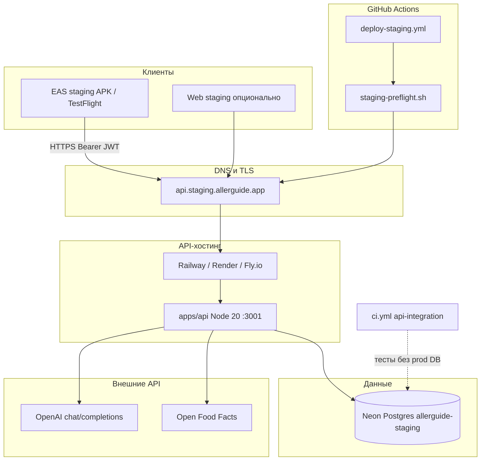
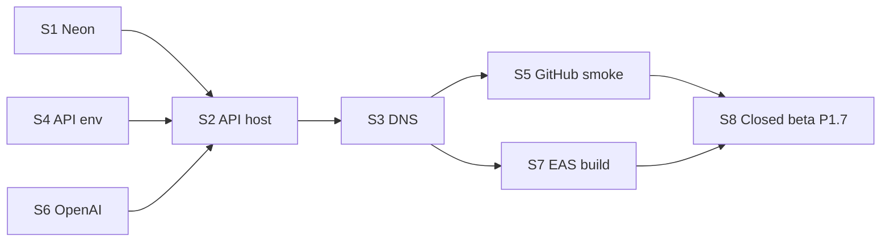

# Staging — план инфраструктуры

**Назначение:** единый план развёртывания staging для closed beta (Phase 1) и smoke перед Phase 2.  
**Связанные runbook'и:** [deploy API](staging-deploy.md) · [EAS staging](eas-staging-build.md) · [closed beta](closed-beta-p17.md) · [roadmap P1.1](roadmap-to-prod.md)

Staging = **backend-интегрированная** среда: mobile profile `staging` в EAS + API на `api.staging.allerguide.app` + Neon Postgres. Offline-only smoke — profile `preview` ([eas-internal-preview.md](eas-internal-preview.md)).

---

## Содержание

1. [Целевая архитектура](#1-целевая-архитектура)
2. [Компоненты](#2-компоненты)
3. [Переменные окружения](#3-переменные-окружения)
4. [План внедрения по фазам](#4-план-внедрения-по-фазам)
5. [Проверки готовности](#5-проверки-готовности)
6. [Доступы и автоматизация](#6-доступы-и-автоматизация)
7. [Опционально и Phase 2+](#7-опционально-и-phase-2)
8. [Связанные артефакты в репозитории](#8-связанные-артефакты-в-репозитории)

---

## 1. Целевая архитектура



**Потоки данных (кратко):**

| Поток | Протокол | Хранение |
|-------|----------|----------|
| Auth / profiles | JWT → REST `/api/auth/*`, `/api/profiles` | Postgres `profile.*` |
| Cloud backup | JWT → `/api/sync/backup` | Opaque ciphertext в `profile.sync_backups` |
| AI scan | JWT → `/api/scan` → OpenAI | In-memory cache + daily budget |
| Каталог (опц.) | `/api/products/*` | Postgres `catalog.*` + OFF fallback |

Политики: [ADR 001 dual-write](adr/001-dual-write.md) · [ADR 002 sync LWW](adr/002-sync-conflict-policy.md).

---

## 2. Компоненты

### 2.1 Обязательные

| # | Компонент | Провайдер (рекомендация) | Roadmap | Критерий готовности |
|---|-----------|--------------------------|---------|---------------------|
| S1 | **Postgres** | [Neon](https://neon.tech) project `allerguide-staging` | P1.1a | `db:migrate` OK |
| S2 | **API runtime** | Railway / Render / Fly.io | P1.1b | `/api/health` 200 |
| S3 | **DNS + TLS** | Cloudflare / registrar + хостинг LE | P1.1c | `curl https://api.staging.allerguide.app/api/health` |
| S4 | **Секреты API** | Dashboard хостинга | P1.1a–b | `authDatabase: true`, `features.sync/aiScan: true` |
| S5 | **GitHub Secrets** | Repository settings | P1.1e | `deploy-staging.yml` smoke Pass |
| S6 | **OpenAI** | platform.openai.com | P1.5a | `staging-scan-smoke.sh` Pass |
| S7 | **EAS staging build** | expo.dev | P1.2b | APK/TestFlight с profile `staging` |

### 2.2 Зависимости между компонентами



### 2.3 Целевой health check

```bash
curl -sf https://api.staging.allerguide.app/api/health | jq .
```

```json
{
  "ok": true,
  "authDatabase": true,
  "features": { "sync": true, "aiScan": true },
  "scan": {
    "enabled": true,
    "cacheEntries": 0,
    "dailyBudget": 50
  },
  "database": { "ok": true, "latencyMs": 42 }
}
```

---

## 3. Переменные окружения

Канонический шаблон: [`apps/api/.env.staging.example`](../apps/api/.env.staging.example).

### 3.1 API (хостинг)

| Переменная | Обязательно | Значение staging |
|------------|-------------|------------------|
| `DATABASE_URL` | да | Neon **pooled** (`-pooler` в host) |
| `DIRECT_DATABASE_URL` | да | Neon **direct** (миграции) |
| `DB_SSL` | да | `require` |
| `DB_PREPARE` | да | `false` |
| `JWT_SECRET` | да | `openssl rand -hex 32` |
| `SESSION_SECRET` | да | `openssl rand -hex 32` |
| `SYNC_ENABLED` | да | `true` |
| `AI_SCAN_ENABLED` | да | `true` |
| `OPENAI_API_KEY` | да для scan | секрет OpenAI |
| `OPENAI_MODEL` | нет | `gpt-4o-mini` (default) |
| `SCAN_REQUIRE_AUTH` | да | `true` |
| `SCAN_DAILY_BUDGET` | рекомендуется | `50` |
| `CORS_ORIGINS` | для web | `https://staging.allerguide.app,...` |
| `OPENFOODFACTS_USER_AGENT` | рекомендуется | см. example |
| `RATE_LIMIT_DISABLED` | нет | `false` |
| `METRO_URL` | **не задавать** | API-only deploy |

### 3.2 GitHub Secrets

| Secret | Назначение |
|--------|------------|
| `STAGING_DATABASE_URL` | pooled Neon (migrate job) |
| `STAGING_DIRECT_DATABASE_URL` | direct Neon |
| `STAGING_JWT_SECRET` | синхрон с API (резерв) |
| `STAGING_API_URL` | `https://api.staging.allerguide.app` |
| `NEON_API_KEY` | PR preview DB ([neon-preview.yml](../.github/workflows/neon-preview.yml)) |
| `NEON_PROJECT_ID` | variable, тот же Neon project |

### 3.3 Mobile (EAS profile `staging`)

Зафиксировано в [`apps/mobile/eas.json`](../apps/mobile/eas.json):

| Переменная | Значение |
|------------|----------|
| `EXPO_PUBLIC_API_URL` | `https://api.staging.allerguide.app` |
| `EXPO_PUBLIC_BACKEND_AUTH` | `true` |
| `EXPO_PUBLIC_CLOUD_SYNC` | `true` |
| `EXPO_PUBLIC_AI_SCAN_ENABLED` | `true` |
| `EXPO_PUBLIC_PRODUCT_DB` | `false` |

Дополнительно для сборки: реальный `extra.eas.projectId` в `app.json`, `eas login`, credentials Android/iOS.

---

## 4. План внедрения по фазам

### Этап 0 — Подготовка аккаунтов

| Шаг | Действие | Владелец |
|-----|----------|----------|
| 0.1 | Аккаунт Neon + billing | DevOps |
| 0.2 | Аккаунт хостинга API (Railway/Render/Fly) | DevOps |
| 0.3 | Доступ к DNS зоны `allerguide.app` | DevOps |
| 0.4 | OpenAI API key + spending limit | Backend |
| 0.5 | Expo / EAS + Apple Developer (iOS) | Mobile |

### Этап 1 — База и API (P1.1)

| Шаг | Команда / действие | Документ |
|-----|-------------------|----------|
| 1.1 | Создать Neon `allerguide-staging`, скопировать pooled + direct URL | [staging-deploy.md § P1.1a](staging-deploy.md#p11a--neon-staging-postgres--secrets) |
| 1.2 | Сгенерировать `JWT_SECRET`, `SESSION_SECRET` | там же |
| 1.3 | `pnpm --filter api db:migrate` | `./scripts/staging-migrate.sh` |
| 1.4 | Задеплоить `apps/api` на хостинг (build + start) | [§ P1.1b](staging-deploy.md#p11b--deploy-api-на-хостинг) |
| 1.5 | CNAME `api.staging` → хостинг, TLS | [§ P1.1c](staging-deploy.md#p11c--dns--tls) |
| 1.6 | Заполнить GitHub Secrets `STAGING_*` | [§ P1.1e](staging-deploy.md#p11e--cicd) |
| 1.7 | Опционально: `db:seed-allergens` | [§ P1.1d](staging-deploy.md#p11d--seed-опционально) |

**Build / start (monorepo root):**

```bash
pnpm install --frozen-lockfile
pnpm --filter api db:migrate
pnpm --filter api start
```

### Этап 2 — Smoke API (P1.2c – P1.5)

| Скрипт | Проверяет |
|--------|-----------|
| `./scripts/staging-smoke.sh` | health, `features.sync`, `features.aiScan` |
| `./scripts/staging-auth-smoke.sh` | register → login → `/me` |
| `./scripts/staging-sync-smoke.sh` | encrypted backup round-trip |
| `./scripts/staging-scan-smoke.sh` | JWT scan + cache hit (1 LLM call) |
| `./scripts/staging-preflight.sh` | все четыре скрипта подряд |

### Этап 3 — Mobile staging (P1.2b)

```bash
./scripts/first-staging-build.sh android   # или ios / all
```

Runbook: [eas-staging-build.md](eas-staging-build.md). После установки — сценарии S.*, O.*, B.*, C.* в [qa-checklist.md](qa-checklist.md).

### Этап 4 — Closed beta gate (P1.7)

1. `./scripts/staging-preflight.sh` → Pass  
2. Internal QA (S.1–S.4, O.1–O.3, B.1–B.6, C.1)  
3. 10–20 тестеров, матрица и gate out — [closed-beta-p17.md](closed-beta-p17.md)

---

## 5. Проверки готовности

### Gate «API staging live»

- [ ] `staging-preflight.sh` — Pass  
- [ ] CI `deploy-staging` workflow — Pass (при настроенных secrets)  
- [ ] CI `api-integration` на `main` — Pass (Postgres в GHA, без prod Neon)

### Gate «готов к closed beta»

- [ ] EAS staging build ≤ 7 дней, channel `staging`  
- [ ] Internal QA по чеклисту (минимум S.1–S.4, B.1–B.6, C.1)  
- [ ] Recovery key policy донесена до тестеров ([beta-tester-brief-ru.md](beta-tester-brief-ru.md))  
- [ ] Issue template `beta-feedback` доступен тестерам  

### Gate «Phase 1 закрыт» (P1.7 out)

См. [closed-beta-p17.md § Gate out](closed-beta-p17.md#критерии-выхода-gate-out).

---

## 6. Доступы и автоматизация

Что можно автоматизировать при передаче доступов (Cloud Agent / CI):

| Компонент | Нужный доступ | Автоматизируемо |
|-----------|---------------|-----------------|
| Neon project + migrate | `NEON_API_KEY` или connection strings | да |
| Env на API-хостинге | Railway/Render/Fly API token | да |
| GitHub Secrets | `gh` admin на репозитории | да |
| DNS CNAME | Cloudflare/registrar API token | да (или вручную 1 запись) |
| Smoke / preflight | живой `STAGING_API_URL` | да |
| EAS build | `EXPO_TOKEN` + credentials в Expo | частично (Android проще iOS) |
| OpenAI billing cap | dashboard OpenAI | нет (только вручную) |
| Apple TestFlight | Apple Developer 2FA | нет (человек) |
| Рассылка APK тестерам | — | нет (ops) |

**Минимальный набор для автонастройки API:**

```text
NEON_API_KEY  (или DATABASE_URL + DIRECT_DATABASE_URL)
RAILWAY_TOKEN | RENDER_API_KEY | FLY_API_TOKEN
GITHUB admin  (secrets STAGING_*)
OPENAI_API_KEY
DNS API token (зона allerguide.app) — опционально
```

**Временный обход без DNS:** URL вида `*.up.railway.app` + правка `EXPO_PUBLIC_API_URL` в EAS — только для dev smoke, не для closed beta.

---

## 7. Опционально и Phase 2+

| Компонент | Когда | Зачем |
|-----------|-------|-------|
| `EXPO_PUBLIC_SENTRY_DSN` | P1.7 / P2.3 | crash-free gate |
| `EXPO_PUBLIC_PRODUCT_DB=true` + seed каталога | после P1.1d import | backend-first barcode |
| `staging.allerguide.app` (web) | Phase 2 | web-тестеры |
| Read replica `READ_DATABASE_URL` | нагрузка | каталог read-only |
| Отдельный Neon branch на PR | уже есть | [neon-preview.yml](../.github/workflows/neon-preview.yml) |
| Maestro E2E nightly | Phase 2 P2.1 | после P1.7 |

---

## 8. Связанные артефакты в репозитории

| Тип | Путь |
|-----|------|
| Env template | `apps/api/.env.staging.example` |
| Deploy runbook (Yandex Cloud) | [`docs/staging-yandex-cloud.md`](staging-yandex-cloud.md) |
| Migrate off Replit (Phase 0) | [`docs/migrate-off-replit-to-yc.md`](migrate-off-replit-to-yc.md) · `scripts/yc-stage-phase0-gate.sh` |
| Deploy runbook (generic) | `docs/staging-deploy.md` |
| EAS staging | `docs/eas-staging-build.md` |
| Closed beta | `docs/closed-beta-p17.md` |
| QA чеклисты | `docs/qa-checklist.md` (§ Staging, P1.2e–P1.7) |
| CI deploy | `.github/workflows/deploy-staging.yml` — **Deploy staging (Yandex Cloud)** |
| CI integration tests | `.github/workflows/ci.yml` → `api-integration` |
| Neon PR preview | `.github/workflows/neon-preview.yml` |
| Скрипты | `scripts/staging-*.sh`, `scripts/staging-*-smoke.ts`, `scripts/first-staging-build.sh` |
| Phase 1 статус | `docs/phase-1-run.md` |

---

## Troubleshooting (сводка)

| Симптом | Проверить |
|---------|-----------|
| Migrate fails | `DIRECT_DATABASE_URL`, не pooled |
| Health 503, `database.ok: false` | `DATABASE_URL`, `DB_SSL=require`, Neon allowlist |
| `authDatabase: false` | `JWT_SECRET` на API |
| Sync 401 | `SYNC_ENABLED=true`, JWT на клиенте, не legacy `SYNC_API_KEY` |
| Scan → mock на устройстве | `SCAN_REQUIRE_AUTH` + mobile передаёт JWT; `OPENAI_API_KEY` на API |
| Scan smoke 502 | `OPENAI_API_KEY`, billing, model |
| CORS в web | `CORS_ORIGINS` |
| EAS «Сервер недоступен» | DNS, URL в `eas.json`, TLS |

Подробнее: [staging-deploy.md § Troubleshooting](staging-deploy.md#troubleshooting).
