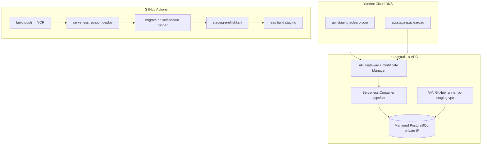

# Staging на Yandex Cloud (РФ)

Runbook для развёртывания `apps/api` на **Yandex Cloud** (`ru-central1`): приватный Managed PostgreSQL (без публичного IP), Serverless Container, API Gateway, TLS, CI/CD и EAS-сборки mobile.

**Связанные документы:** [`staging-yandex-cloud-console.md`](./staging-yandex-cloud-console.md) (поэкранно в UI) · [`staging-deploy.md`](./staging-deploy.md) (общий) · [`staging-infrastructure-plan.md`](./staging-infrastructure-plan.md) · [`brand-rollout.md`](./brand-rollout.md) · [`eas-staging-build.md`](./eas-staging-build.md) · [`yc-stage-gates.md`](./yc-stage-gates.md) (Phase 0–5)

---

## Целевые URL и домены

| Актив | Значение |
|-------|----------|
| Staging API (канонический) | `https://api.staging.aclearo.com` |
| Staging API (RU-зеркало) | `https://api.staging.aclearo.ru` → тот же API GW |
| Mobile `EXPO_PUBLIC_API_URL` | `https://api.staging.aclearo.com` (уже в `eas.json`) |
| Primary / legal | `aclearo.com`, `aclearo.ru` |
| Product redirect | `a-claro.com`, `a-claro.ru` → `aclearo.com` |

Ожидаемый health check:

```bash
curl -sf https://api.staging.aclearo.com/api/health | jq .
```

```json
{
  "ok": true,
  "authDatabase": true,
  "features": { "sync": true, "aiScan": true },
  "database": { "ok": true, "latencyMs": 42 }
}
```

---

## Архитектура



**Ключевое ограничение:** Postgres **без публичного IP** — миграции (`db:migrate`) выполняются только из VPC (self-hosted runner на VM). GitHub-hosted runners к приватной БД **не подключаются**.

---

## Содержание

1. [Предварительные требования](#1-предварительные-требования)
2. [Bootstrap инфраструктуры (Terraform)](#2-bootstrap-инфраструктуры-terraform)
3. [Lockbox — секреты API](#3-lockbox--секреты-api)
4. [DNS и TLS](#4-dns-и-tls)
5. [GitHub self-hosted runner (VPC)](#5-github-self-hosted-runner-vpc)
6. [Первый деплой API](#6-первый-деплой-api)
7. [CI/CD workflow](#7-cicd-workflow)
8. [Mobile: EAS staging после smoke](#8-mobile-eas-staging-после-smoke)
9. [Чеклист](#9-чеклист)
10. [Troubleshooting](#10-troubleshooting)

---

## 1. Предварительные требования

| Инструмент | Версия |
|------------|--------|
| [Yandex Cloud CLI](https://cloud.yandex.ru/docs/cli/quickstart) | latest |
| [Terraform](https://developer.hashicorp.com/terraform/install) | ≥ 1.5 |
| [crane](https://github.com/google/go-containerregistry) или Docker | для push bootstrap-образа в YCR |
| Аккаунт YC | billing, folder |
| Домены | `aclearo.com`, `aclearo.ru` (NS → Yandex Cloud DNS) |
| GitHub | secrets admin |
| Expo | `EXPO_TOKEN`, credentials Android/iOS |

### Service Account для bootstrap

SA (например `aclearo-staging-bootstrap`) должен иметь роль **`admin`** на каталог — не только `editor`.

Причина: Terraform назначает IAM-роли другим SA (`folder_iam_member`, Lockbox bindings). Роль `editor` это запрещает → `PermissionDenied`.

```bash
FOLDER_ID=b1glkbb9i8ufp6bsdn4u
SA_ID=ajeid44fj1ud0n90m01h   # aclearo-staging-bootstrap

yc resource-manager folder add-access-binding "$FOLDER_ID" \
  --role admin \
  --subject serviceAccount:"$SA_ID"
```

```bash
yc init
yc config set folder-id <FOLDER_ID>
```

---

## 2. Bootstrap инфраструктуры (Terraform)

Каталог: [`infra/yandex/staging/`](../infra/yandex/staging/)

Создаёт:

| Ресурс | Назначение |
|--------|------------|
| VPC + subnet | `10.128.0.0/24`, `ru-central1-a` |
| Managed PostgreSQL 15 | **private IP only** (`assign_public_ip = false`) |
| Container Registry | образ `aclearo-api` |
| Serverless Container | `aclearo-staging-api` + VPC connectivity |
| API Gateway | публичный HTTPS → container |
| Certificate Manager | TLS для `api.staging.aclearo.com` (+ `.ru`) |
| Lockbox secret | placeholder для env API |
| Compute VM | GitHub runner для миграций |
| IAM | SA для API и deploy |

### Запуск

```bash
cp infra/yandex/staging/terraform.tfvars.example infra/yandex/staging/terraform.tfvars
# Отредактируйте: folder_id, pg_password, runner_ssh_public_key

./scripts/yc-staging-bootstrap.sh plan
./scripts/yc-staging-bootstrap.sh apply
```

Сохраните чувствительные outputs:

```bash
cd infra/yandex/staging
terraform output -raw database_url          # → STAGING_DATABASE_URL + Lockbox
terraform output -raw deploy_service_account_key > /tmp/yc-sa-key.json  # → YC_SA_JSON
terraform output container_registry_id
terraform output serverless_container_id
terraform output lockbox_secret_id
```

**Remote state (рекомендуется):** раскомментируйте `backend "s3"` в [`versions.tf`](../infra/yandex/staging/versions.tf) и создайте bucket в Object Storage.

---

## 3. Lockbox — секреты API

После `terraform apply` заполните секрет `aclearo-staging-api-env`.

**Pollen (Phase 1):** upsert без потери остальных ключей:

```bash
export GOOGLE_POLLEN_API_KEY='…'   # GCP Pollen API only — never EXPO_PUBLIC_*
export YC_LOCKBOX_SECRET_ID=$(cd infra/yandex/staging && terraform output -raw lockbox_secret_id)
export YC_CONTAINER_ID=$(cd infra/yandex/staging && terraform output -raw serverless_container_id)
export YC_REGISTRY_ID=$(cd infra/yandex/staging && terraform output -raw container_registry_id)
BUILD_PUSH=1 ./scripts/yc-stage-phase1-enable-pollen.sh
```

Ключи для mount: [`apps/api/lockbox-staging.keys`](../apps/api/lockbox-staging.keys). Runbook: [`yc-stage-gates.md`](./yc-stage-gates.md) Phase 1.

Либо вручную новая версия Lockbox:

```bash
LOCKBOX_ID=$(cd infra/yandex/staging && terraform output -raw lockbox_secret_id)
DB_URL=$(cd infra/yandex/staging && terraform output -raw database_url)

yc lockbox secret add-version --id "$LOCKBOX_ID" --payload "[
  {\"key\": \"DATABASE_URL\", \"text_value\": \"$DB_URL\"},
  {\"key\": \"DIRECT_DATABASE_URL\", \"text_value\": \"$DB_URL\"},
  {\"key\": \"JWT_SECRET\", \"text_value\": \"$(openssl rand -hex 32)\"},
  {\"key\": \"SESSION_SECRET\", \"text_value\": \"$(openssl rand -hex 32)\"},
  {\"key\": \"OPENAI_API_KEY\", \"text_value\": \"sk-...\"}
]"
```

> Предпочтительнее `yc-lockbox-upsert.sh` / `yc-stage-phase1-enable-pollen.sh` — они **мержат** payload и не затирают уже лежащие `YC_AI_*` / `SYNC_*`.

Полный список переменных — [`apps/api/.env.staging.example`](../apps/api/.env.staging.example):

| Переменная | Staging |
|------------|---------|
| `SYNC_ENABLED` | `true` |
| `AI_SCAN_ENABLED` | `true` |
| `SCAN_REQUIRE_AUTH` | `true` |
| `CORS_ORIGINS` | `http://localhost:5000,http://127.0.0.1:5000,https://staging.aclearo.com,https://staging.aclearo.ru,https://aclearo.com,https://aclearo.ru` |
| `DB_SSL` | `require` |
| `METRO_URL` | **не задавать** |

> **OpenAI из РФ:** `api.openai.com` может быть недоступен с YC. Варианты: исходящий прокси (`OPENAI_BASE_URL`), YandexGPT (адаптер), или `AI_SCAN_ENABLED=false` на staging.

После заполнения Lockbox revision Serverless Container читает env через `--secret` (не plaintext). Runtime SA — `aclearo-staging-api` (`lockbox.payloadViewer` + `container-registry.images.puller`). Роли задаются в [`iam.tf`](../infra/yandex/staging/iam.tf); для `terraform apply` у применяющего SA нужна роль **`admin`** на folder.

**Yandex AI:** Phase 0 credentials (`aclearo-staging-ai`, smoke) + Phase 1 `/api/scan` + Phase 2 `/api/ocr` — [`docs/staging-yandex-ai.md`](./staging-yandex-ai.md), `./scripts/yc-ai-phase0-smoke.sh --from-lockbox`.

---

## 4. DNS и TLS

### 4.1. Зоны DNS

Перенесите NS доменов `aclearo.com` и `aclearo.ru` в [Yandex Cloud DNS](https://cloud.yandex.ru/docs/dns/).

### 4.2. Валидация сертификата

```bash
cd infra/yandex/staging
terraform output certificate_dns_challenges
```

Добавьте CNAME-записи из output в соответствующие зоны. Дождитесь статуса `ISSUED` в Certificate Manager.

### 4.3. Записи staging API

```bash
GW_DOMAIN=$(cd infra/yandex/staging && terraform output -raw api_gateway_default_domain)
CERT_ID=$(cd infra/yandex/staging && terraform output -raw certificate_id)
GW_ID=$(cd infra/yandex/staging && terraform output -raw api_gateway_id)
```

1. Дождитесь статуса сертификата **ISSUED** (Certificate Manager).
2. Привяжите домен к API Gateway:

```bash
yc serverless api-gateway add-domain \
  --id "$GW_ID" \
  --domain api.staging.aclearo.com \
  --certificate-id "$CERT_ID"
```

3. DNS CNAME:

| Зона | Имя | Тип | Значение |
|------|-----|-----|----------|
| `aclearo.com` | `api.staging` | CNAME | `$GW_DOMAIN` |
| `aclearo.ru` | `api.staging` | CNAME | `$GW_DOMAIN` |

### 4.4. Редиректы product-доменов

| Зона | Запись | Действие |
|------|--------|----------|
| `a-claro.com` | `@`, `www` | 301 → `https://aclearo.com` |
| `a-claro.ru` | `@`, `www` | 301 → `https://aclearo.ru` |

---

## 5. GitHub self-hosted runner (VPC)

VM создаётся Terraform ([`runner.tf`](../infra/yandex/staging/runner.tf)). Подключение:

```bash
RUNNER_IP=$(cd infra/yandex/staging && terraform output -raw github_runner_public_ip)
ssh ubuntu@$RUNNER_IP
```

### Регистрация runner

На VM (под `ubuntu`):

```bash
cd /opt/actions-runner
curl -o actions-runner-linux-x64.tar.gz -L \
  https://github.com/actions/runner/releases/download/v2.321.0/actions-runner-linux-x64-2.321.0.tar.gz
tar xzf actions-runner-linux-x64.tar.gz

# GitHub → Settings → Actions → Runners → New self-hosted runner
./config.sh --url https://github.com/<ORG>/<REPO> \
  --token <RUNNER_TOKEN> \
  --labels yc-staging-vpc,linux,x64 \
  --name aclearo-staging-yc

sudo ./svc.sh install ubuntu
sudo ./svc.sh start
```

**Обязательный label:** `yc-staging-vpc` — используется в [`deploy-staging.yml`](../.github/workflows/deploy-staging.yml) для job `migrate`.

Проверка: в GitHub → Actions → Runners статус **Idle**, labels включают `yc-staging-vpc`.

---

## 6. Первый деплой API

### Локальная проверка образа

```bash
docker build -t aclearo-api:local .
docker run --rm -p 3001:3001 \
  -e API_PORT=3001 \
  -e DATABASE_URL="..." \
  -e JWT_SECRET="test" \
  aclearo-api:local
curl -s http://localhost:3001/api/health | jq .
```

### Push в YCR и revision deploy

```bash
REGISTRY_ID=$(cd infra/yandex/staging && terraform output -raw container_registry_id)
CONTAINER_ID=$(cd infra/yandex/staging && terraform output -raw serverless_container_id)

echo "$YC_SA_JSON" | docker login --username json_key --password-stdin cr.yandex
docker build -t "cr.yandex/${REGISTRY_ID}/aclearo-api:staging" .
docker push "cr.yandex/${REGISTRY_ID}/aclearo-api:staging"

yc serverless container revision deploy \
  --container-id "$CONTAINER_ID" \
  --image "cr.yandex/${REGISTRY_ID}/aclearo-api:staging" \
  --cores 1 --memory 512MB \
  --execution-timeout 30s \
  --secret environment-variable=DATABASE_URL,id="$LOCKBOX_ID",key=DATABASE_URL,version-id=latest \
  --secret environment-variable=JWT_SECRET,id="$LOCKBOX_ID",key=JWT_SECRET,version-id=latest
```

### Миграции (с runner VM или локально через SSH)

```bash
# На runner VM (в VPC):
export DATABASE_URL='...' DIRECT_DATABASE_URL='...' DB_SSL=require
./scripts/staging-migrate.sh
```

### Smoke

```bash
export STAGING_API_URL=https://api.staging.aclearo.com
./scripts/staging-preflight.sh
```

---

## 7. CI/CD workflow

Файл: [`.github/workflows/deploy-staging.yml`](../.github/workflows/deploy-staging.yml)

**Триггер:** push в ветку `staging` или `workflow_dispatch`.

| Job | Runner | Действие |
|-----|--------|----------|
| `gate` | `ubuntu-latest` | Проверка секретов через `env` (нельзя `secrets.*` в job-level `if`) |
| `build-push` | `ubuntu-latest` | `docker build` → YCR |
| `deploy` | `ubuntu-latest` | `yc serverless container revision deploy` + Lockbox secrets |
| `migrate` | **`self-hosted, yc-staging-vpc`** | `pnpm --filter api db:migrate` |
| `smoke` | `ubuntu-latest` | `pnpm install` + `staging-preflight.sh` (sync/scan/yandex-ai через `pnpm exec tsx`) |
| `mobile-android` | `ubuntu-latest` | `npx eas-cli@22.0.0 build --profile staging --platform android` |
| `mobile-ios` | `ubuntu-latest` | Device IPA **только** при repo variable `EAS_IOS_DEVICE=true` (нужны Apple certs). Иначе job `mobile-ios-notice` |

### GitHub Secrets

| Secret | Источник |
|--------|----------|
| `YC_SA_JSON` | `terraform output -raw deploy_service_account_key` |
| `YC_REGISTRY_ID` | `terraform output container_registry_id` |
| `YC_CONTAINER_ID` | `terraform output serverless_container_id` |
| `YC_LOCKBOX_SECRET_ID` | `terraform output lockbox_secret_id` |
| `STAGING_DATABASE_URL` | `terraform output -raw database_url` |
| `STAGING_DIRECT_DATABASE_URL` | то же (YC PG без pooler) |
| `STAGING_API_URL` | `https://api.staging.aclearo.com` |
| `EXPO_TOKEN` | expo.dev → Access Tokens |

> Единственный staging deploy workflow: [`deploy-staging.yml`](../.github/workflows/deploy-staging.yml) — **Deploy staging (Yandex Cloud)**.

---

## 8. Mobile: EAS staging после smoke

Профиль `staging` в [`apps/mobile/eas.json`](../apps/mobile/eas.json) уже указывает на `https://api.staging.aclearo.com`.

После успешного workflow:

| Платформа | Результат |
|-----------|-----------|
| Android | APK internal → QR на expo.dev. Если Expo Gradle падает — запасной путь [`android-stage-build.md`](android-stage-build.md) §C (`staging-apk-gradle.yml`). Красный `mobile-android` **не** откат API: `smoke` уже прошёл. |
| iOS | По умолчанию **пропускается**. `credentials.json` — только Android debug keystore; non-interactive EAS не создаёт Apple certs для `distribution: internal`. Device IPA: интерактивно `eas credentials --platform ios`, затем repo variable `EAS_IOS_DEVICE=true`. |

Ручной запуск:

```bash
cd apps/mobile
pnpm exec eas --version   # нужен eas-cli >= 22 (16.x ломает upload tarball)
pnpm build:staging:android
pnpm build:staging:ios    # упадёт без Apple credentials
```

Чеклист на устройстве: [`eas-staging-build.md`](./eas-staging-build.md), [`qa-checklist.md`](./qa-checklist.md).

---

## 9. Чеклист

Актуальный live-inventory (health / DNS / gaps): [`yc-stage-gates.md`](./yc-stage-gates.md) · `pnpm yc-stage-phase0`.

- [x] `terraform apply` — VPC, private PG, registry, container, API GW, runner VM *(косвенно: live health+DB+TLS на apigw)*
- [x] Lockbox заполнен (`DATABASE_URL`, `JWT_SECRET`, … + **pollen** keys) — see [`staging-secrets-inventory.md`](./staging-secrets-inventory.md)
- [x] DNS: certificate challenges + CNAME `api.staging` → API GW
- [x] `curl https://api.staging.aclearo.com/api/health` → 200
- [ ] GitHub runner зарегистрирован с label `yc-staging-vpc`
- [ ] GitHub Secrets `YC_*`, `STAGING_*`, `EXPO_TOKEN` (deploy workflow gate)
- [ ] Rotation checklist after agent key exposure: [`staging-secrets-rotation-checklist.md`](./staging-secrets-rotation-checklist.md)
- [ ] `pnpm yc-stage-phase4` Pass
- [ ] Push в `staging` → workflow green
- [ ] `./scripts/staging-preflight.sh` → Pass (auth smoke уже Pass отдельно)
- [ ] `pnpm yc-stage-phase0` Pass без `ALLOW_MISSING_POLLEN_HEATMAP`
- [ ] EAS staging APK + iOS установлены, smoke S.1–S.4

---

## 10. Troubleshooting

| Симптом | Решение |
|---------|---------|
| `migrate` job pending forever | Runner не зарегистрирован или нет label `yc-staging-vpc` |
| `connection refused` к Postgres с runner | VM в той же subnet; проверьте SG (`6432` из VPC CIDR) |
| Health 503, `database.ok: false` | Lockbox `DATABASE_URL`; container имеет VPC connectivity |
| Health 403 `API Gateway is stopped` | `yc serverless api-gateway resume --id <gw>` (`aclearo-staging-api-gw`) |
| Health 503 `EAI_AGAIN` / `CONNECT_TIMEOUT` на `*.mdb.yandexcloud.net` | Postgres остановлен: `yc managed-postgresql cluster start --name aclearo-staging-pg` |
| TLS error на API | Дождитесь `ISSUED` сертификата; проверьте CNAME |
| `docker login cr.yandex` fail | `YC_SA_JSON` — полный JSON authorized key deploy SA |
| OpenAI scan 502 | Прокси / `AI_SCAN_ENABLED=false` / billing |
| EAS «Сервер недоступен» | DNS `api.staging.aclearo.com`, TLS, URL в `eas.json` |
| `mobile-ios` / Apple credentials | Ожидаемо без `EAS_IOS_DEVICE`. См. [`eas-staging-build.md`](eas-staging-build.md) |
| `mobile-android` Gradle unknown error | expo.dev → Run gradlew. Запасной APK: `staging-apk-gradle.yml`. Не откатывать API |
| Destroy staging | `./scripts/yc-staging-bootstrap.sh destroy` (подтверждение) |

---

## Связанные артефакты

| Тип | Путь |
|-----|------|
| Console UI (поля) | [`docs/staging-yandex-cloud-console.md`](./staging-yandex-cloud-console.md) |
| Dockerfile | [`Dockerfile`](../Dockerfile) |
| Terraform | [`infra/yandex/staging/`](../infra/yandex/staging/) |
| Bootstrap | [`scripts/yc-staging-bootstrap.sh`](../scripts/yc-staging-bootstrap.sh) |
| CI | [`.github/workflows/deploy-staging.yml`](../.github/workflows/deploy-staging.yml) |
| Env template | [`apps/api/.env.staging.example`](../apps/api/.env.staging.example) |
| Migrate script | [`scripts/staging-migrate.sh`](../scripts/staging-migrate.sh) |
| YC stage gates | [`docs/yc-stage-gates.md`](./yc-stage-gates.md) · [`scripts/yc-stage-phase0-gate.sh`](../scripts/yc-stage-phase0-gate.sh) |
