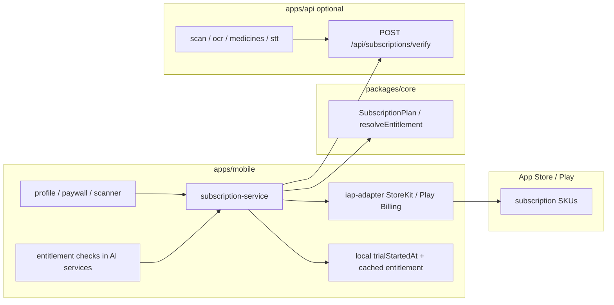

# AllerGuide — план управления подписками (Freemium → PRO)

**Статус:** план (код не реализован).  
**Дата:** 2026-09-03.  
**Решения владельца:** оплата — **In-App Purchase** (Apple / Google); **лимит записей дневника не вводится**.

**Связанные документы:** [`architecture.md`](./architecture.md) · [`development-rules.md`](./development-rules.md) · [`functional-requirements.md`](./functional-requirements.md) · [`roadmap-to-prod.md`](./roadmap-to-prod.md) · skill `product-analyst` / `product-designer`.

---

## 1. Продуктовая модель

| Тариф | Длительность / условие | Что доступно |
|-------|------------------------|--------------|
| **Freemium (trial)** | 7 календарных дней с момента первого запуска приложения (одно устройство / локальный аккаунт) | Все функции, включая ИИ и облачное распознавание (если build-флаги `EXPO_PUBLIC_*` и API включены) |
| **Free (после trial)** | Бессрочно без оплаты | Ядро offline-first: профили, дневник (**без лимита записей**), SOS, карта, маркетплейс (affiliate), локальный keyword-скан. **ИИ и облачное распознавание недоступны** |
| **PRO** | Подписка через Store IAP (период SKU — месячный по умолчанию; SKU задаются в App Store Connect / Play Console) | Всё из Free + ИИ / OCR / VL / medicine recognize / cloud STT enrichment |

### Что входит в «ИИ и распознавание» (платный контур)

| Поверхность | Клиентский choke point | API |
|-------------|------------------------|-----|
| LLM-вердикт сканера | `scan-analysis.ts` → `analyzeText` | `POST /api/scan` |
| Photo dish VL | `scanner-dish-vision-service.ts` | `POST /api/scan/dish-vision` |
| Cloud OCR | `ocr-api-service.ts` | `POST /api/ocr` |
| Intent / search / dish LLM | соответствующие `*-api-service.ts` | `/api/scan/intent`, `/api/search/ingredients`, `/api/dishes/resolve` |
| Medicine package/voice VL | `medicine-recognition-service.ts` | `POST /api/medicines/recognize` |
| Diary dish photo (через OCR/скан) | `NutritionCaptureStep` → `scanFromOcr` | те же |
| Cloud STT (не OS speech) | `stt-api-service.ts` | `POST /api/stt` |
| Prescription cloud OCR | `prescription-ocr-service.ts` | `/api/ocr` |

### Что остаётся бесплатным после trial

- Профили, клинический gating (`ProfileCapabilities`), дневник CRUD без квоты записей.
- SOS, wellness/карта (Open-Meteo / pollen tiles по существующим флагам), маркет affiliate.
- Локальный keyword-скан (`runMockScan` / offline path) — **да**, как offline-first ядро; paywall режет только **облачный** ИИ/распознавание.
- OS / on-device speech (`expo-speech-recognition`) — бесплатно; платный только cloud STT.

**Не путать** с `FR-PROF-12` (клиническая видимость модулей): paywall — отдельный слой entitlements, не типы состояний профиля.

---

## 2. Управление в профиле

Точка входа: хаб [`apps/mobile/app/profile.tsx`](../apps/mobile/app/profile.tsx).

Новая секция **«Подписка»** (между «О приложении» и «Аккаунт» или сразу после списка профилей — предпочтительно **после бэкапа / до «О приложении»**):

| Элемент | Содержимое |
|---------|------------|
| Статус | `Пробный период · осталось N дн.` / `Бесплатный план` / `PRO · активна до …` |
| CTA | «Оформить PRO» / «Управлять подпиской» / «Восстановить покупки» |
| Навигация | `/subscription` — детали тарифа, список преимуществ, кнопка покупки, restore, ссылка на store subscription management |

UI: токены Claro (`GlassCard`, `Button`, `ScreenHeader`), i18n на все 6 локалей, `testID` для Maestro. Спека экрана — по skill `product-designer` перед JSX.

Paywall-модалка / bottom sheet при попытке вызвать платный ИИ-путь из сканера / medicine photo / nutrition photo (не только из профиля).

---

## 3. Архитектура entitlements



### Домен (`packages/core`)

Новый модуль, например `subscription.ts`:

- Типы: `SubscriptionTier = 'trial' | 'free' | 'pro'`.
- `resolveEntitlement({ now, trialStartedAt, proExpiresAt | proActive })`.
- Константа `TRIAL_DURATION_MS = 7 * 24 * 60 * 60 * 1000`.
- Чистые функции + unit-тесты (границы: день 0, день 7 00:00, истечение PRO).

**Не** использовать `EXPO_PUBLIC_*` как тариф: это build-time ops-флаги. Paywall — **runtime** entitlement.

### Mobile service

`apps/mobile/src/services/subscription-service.ts`:

- Старт trial: один раз при первом успешном init приложения (`install-runtime` / `db/init` / root layout) — записать `trialStartedAt` в secure/local settings.
- `canUseCloudAi(): boolean` — единая проверка для всех AI-сервисов.
- IAP: purchase, restore, listen to updates; кэш статуса локально для offline.
- Эмиссия аналитики только из сервиса.

### Где ставить gate (обязательно в services, не в экранах)

1. `analyzeText` / `fetchDishVisionEstimate` / `recognizeImageViaApi` / medicine recognize / cloud STT / enrichment callers.
2. При отказе: структурированная ошибка `EntitlementRequiredError` → UI показывает paywall.
3. API (когда `BACKEND_AUTH` / AI включены): повторная проверка JWT + server entitlement / receipt — клиентский gate недостаточен.

### Persistence

| Поле | Где | Заметка |
|------|-----|---------|
| `trialStartedAt` | local settings / SQLite `app_settings` | Не сбрасывать при logout локального пользователя без явного wipe |
| `proProductId`, `proExpiresAt`, `originalTransactionId` | local cache + опционально `profile` schema на API | Источник истины для native — Store; сервер — для AI budget |
| Receipt / Play purchase token | только на сервере при verify | Не логировать в analytics |

Offline-first: истечение trial определяется **локально по часам устройства** (риск перевода часов — приемлемый для v1; server clock при verify PRO).

---

## 4. In-App Purchase (выбранный канал)

### Рекомендация стека

| Вариант | Вердикт |
|---------|---------|
| **RevenueCat** (`react-native-purchases` + Expo config plugin) | **Предпочтительный** для Expo: единый SDK iOS/Android, webhooks, sandbox, restore, analytics. Dev Client / EAS mandatory (не Expo Go). |
| `react-native-iap` напрямую | Возможен, больше boilerplate StoreKit 2 / Play Billing 5+. |
| `expo-in-app-purchases` | Устарел / не целевой путь. |

### Продукты

- Один auto-renewable subscription: например `aclearo_pro_monthly` (и опционально yearly позже).
- App Store Connect + Google Play Console: одинаковый entitlement `pro`.
- EAS: capability In-App Purchase; Android billing permission через plugin.

### Web

Store IAP на web **нет**. Для web-клиента в v1:

- Trial + free gating работают локально.
- Кнопка PRO на web: «Доступно в приложении App Store / Google Play» (deep link / store badge), либо отложенный web-billing (см. §5 ЮKassa).

### Зависимости продукта

- `EXPO_PUBLIC_BACKEND_AUTH` желателен для привязки покупки к аккаунту и server-side AI; локальный-only PRO cache допустим для alpha, но AI API без verify уязвим к обходу.
- Legal: обновить Terms / Privacy (автопродление, отмена в настройках store) — `FR-SET-07` / legal docs.

---

## 5. Анализ ЮKassa (youcassa / YooKassa)

### Возможности сервиса

- Платежи по API, мобильные SDK (Android / iOS), токены карт, СБП, SberPay, ЮMoney.
- **Автоплатежи** (сохранение `payment_method_id`, рекуррентные списания с бэкенда) — технически покрывают модель подписки.
- Community RN-обёртка (`react-native-yookassa`) + официальные native SDK; для Expo нужен **dev/production build**, не Expo Go.
- Web Checkout / виджет — сильная сторона для браузера и личного кабинета.

### Совместимость с политиками сторов

| Платформа | Цифровая подписка на функции приложения | ЮKassa как единственный способ |
|-----------|------------------------------------------|--------------------------------|
| **iOS App Store** | Требуется Apple IAP (Guideline 3.1.1) | **Недопустимо** как замена IAP |
| **Google Play** | Play Billing для digital goods / subscriptions | **Недопустимо** как замена Billing Library в общем случае |
| **Web / PWA** | Store rules не применяются | **Подходит** |
| Sideload / вне сторов | На усмотрение | Подходит технически |

### Вердикт для AllerGuide

| Вопрос | Ответ |
|--------|--------|
| Использовать ЮKassa как основной биллинг в mobile store-сборках? | **Нет** — выбран IAP; риск отклонения стора. |
| Имеет ли смысл ЮKassa позже? | **Да, опционально**: оплата PRO на **web** (`apps/mobile` web или отдельный кабинет), корпоративные / B2B счета, оплата нецифровых услуг (если появятся). |
| Что нужно для web-ЮKassa (если когда-нибудь)? | Магазин в ЮKassa, секрет только на `apps/api`, `POST /api/billing/yookassa/*`, webhook `payment.succeeded`, запись entitlement в Postgres `profile`, синхронизация на клиент; 54-ФЗ / чеки; feature flag `EXPO_PUBLIC_YOOKASSA_WEB=true`. |
| Конфликт с IAP? | На native не показывать ЮKassa checkout для того же digital entitlement (Apple anti-steering). Web-only SKU или единый server entitlement с источником `store` \| `yookassa`. |

**Итог анализа:** ЮKassa **технически жизнеспособна** для рекуррентных платежей и web, но **не рекомендуется** для текущего контура store-приложения. Реализация v1 — **только IAP**; ЮKassa — отдельный follow-up эпик после web-монетизации.

---

## 6. Черновик FR (добавить в `functional-requirements.md` при реализации)

```
FR-SUB-01
Проблема: нет модели монетизации облачного ИИ.
Пользователь: новый пользователь в первые 7 дней.
Критерии: все облачные ИИ/распознавания доступны в течение 7 суток с trialStartedAt; статус виден в Профиле.
Метрика: trial_started, subscription_status_view.
Flag / offline: trial считается локально; cloud AI по-прежнему за EXPO_PUBLIC_* + сеть.
Фаза: Post-launch (P5.7).

FR-SUB-02
После истечения trial облачный ИИ/распознавание недоступны без PRO; дневник без лимита записей; локальный keyword-скан и ядро работают.
Метрика: paywall_shown (reason=trial_expired|feature_gate), entitlement_denied.

FR-SUB-03
PRO через Store IAP; restore purchases; управление/отмена — через системные подписки store; раздел в Профиле.
Метрика: subscription_purchase_started / _succeeded / _failed / _restored (без PII / receipt).

FR-SUB-04
Серверные AI-роуты отклоняют запросы без активного entitlement, когда verify включён.
Метрика: API 402/403 count (ops), не клиентский PII.
```

Roadmap: новый пункт **P5.7 Monetization (IAP freemium)** в [`roadmap-to-prod.md`](./roadmap-to-prod.md) Phase 5.

---

## 7. Аналитика (таксономия)

Добавить в `ANALYTICS_EVENT_NAMES` (без PII, эмиссия из `subscription-service`):

| Событие | Когда |
|---------|--------|
| `trial_started` | Первая запись `trialStartedAt` |
| `trial_expired` | Первый переход resolve → `free` |
| `paywall_shown` | props: `source` (`profile`\|`scanner`\|`medicine`\|`ocr`\|`stt`), `reason` |
| `subscription_purchase_started` | props: `product_id` (SKU id ok) |
| `subscription_purchase_succeeded` | props: `product_id` |
| `subscription_purchase_failed` | props: `product_id`, `error_code` (не store message с PII) |
| `subscription_restored` | — |
| `subscription_status_view` | Открытие секции/экрана подписки |

Воронка: `trial_started` → (usage) → `trial_expired` → `paywall_shown` → `subscription_purchase_started` → `_succeeded`.

KPI (шаблон аналитика): Conversion trial→PRO за 14 суток; Paywall CTR; AI feature attempts while gated.

---

## 8. Этапы реализации

Порядок фиксирован; без календарных оценок.

### Этап A — Домен и локальный trial (без магазина)

1. `packages/core` entitlement + тесты.
2. `subscription-service` + persist `trialStartedAt`.
3. Gates в AI/OCR/medicine/STT services + `EntitlementRequiredError`.
4. Feature flag `EXPO_PUBLIC_SUBSCRIPTIONS_ENABLED` (default off) — безопасный rollout.
5. Unit-тесты mobile services.

### Этап B — UX Профиль + paywall

1. Секция в `profile.tsx` + экран `/subscription`.
2. Paywall при gate failure (scanner / medicine / nutrition).
3. i18n ×6, a11y, Maestro smoke id.
4. Analytics events + taxonomy check.

### Этап C — Store IAP

1. RevenueCat (или RN IAP) + EAS plugins.
2. Sandbox покупка / restore на iOS и Android.
3. Кэш PRO entitlement offline.
4. Legal copy автопродления.

### Этап D — Server verify (для stage/prod AI)

1. Таблица / поля подписки в schema `profile` (миграция Drizzle, не `db:push` на real data).
2. `POST /api/subscriptions/verify` + webhook RevenueCat или store S2S.
3. Проверка на AI routes + согласование с `consumeScanBudget`.
4. Staging secrets (Lockbox): RevenueCat / Play service account — по [`staging-secrets-inventory.md`](./staging-secrets-inventory.md).

### Вне скоупа v1

- Лимит записей дневника.
- ЮKassa в native store builds.
- Lifetime one-time purchase (можно позже отдельным SKU).
- Family Sharing / multi-profile shared PRO (по умолчанию PRO на аккаунт устройства; уточнить при server verify).

---

## 9. Тест-план (когда пойдёт код)

| Уровень | Что |
|---------|-----|
| Unit | `resolveEntitlement` границы trial/PRO; gates возвращают ошибку при `free` |
| Integration API | AI route без entitlement → 402/403; с PRO → 200 |
| Manual native | Sandbox IAP purchase / restore / expire; секция Профиля; paywall из сканера |
| Web | Trial/free gating; CTA «откройте в приложении»; нет ложного checkout |
| RC | `pnpm typecheck` / `test` / `check:analytics-taxonomy`; Maestro: профиль → подписка |

---

## 10. Риски

| Риск | Митигация |
|------|-----------|
| Обход клиента без server verify | Этап D обязателен до платного prod AI |
| Расхождение часов устройства и trial | Accept v1; server `trialStartedAt` при backend auth |
| App Review: incomplete metadata / restore | Кнопка Restore; ссылки Manage Subscription; sandbox checklist |
| Путаница clinical gating vs paywall | Разные ошибки/копирайт; FR-PROF-12 не менять смыслом |
| Expo Go не поддерживает IAP | Документировать Dev Client / EAS только |

---

## 11. Индекс «куда менять» (для codebase-index при реализации)

| Задача | Куда |
|--------|------|
| Правила тарифа | `packages/core/src/subscription.ts` |
| Trial / IAP / canUseCloudAi | `apps/mobile/src/services/subscription-service.ts` |
| Gates | `scan-analysis.ts`, `ocr-api-service.ts`, `medicine-recognition-service.ts`, `stt-api-service.ts`, enrichment wrappers |
| UI | `app/profile.tsx`, `app/subscription.tsx`, paywall component |
| Flag | `apps/mobile/src/constants/features.ts` → `SUBSCRIPTIONS_ENABLED` |
| API verify | `apps/api/src/routes/subscriptions.ts` + middleware на scan/ocr/… |
| Analytics | `packages/core/src/analytics-events.ts` |
| Docs | этот файл · FR-SUB-* · roadmap P5.7 |
