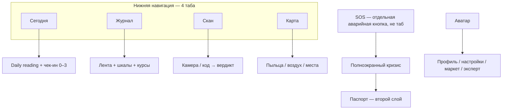

# AllerGuide — north-star UX/UI (wellness «с нуля»)

Документ отвечает на запрос: лучшие мировые практики wellness UX/UI и план улучшения AllerGuide **без обязательства сохранять текущую IA**. Токенный слой Clinical Calm / Claro teal не отменяем как бренд; навигацию, ритуалы, SOS и плотность экранов — пересобираем.

**Макет ключевых экранов:** [`wellness-ux-north-star.html`](./wellness-ux-north-star.html)  
**Связанные документы:** [`brand-claro-green.md`](./brand-claro-green.md) · [`ux-audit-2026-08.md`](./ux-audit-2026-08.md) · [`ux-improvement-plan.md`](./ux-improvement-plan.md) · [`cjm-profile-diary.md`](./cjm-profile-diary.md) · [`functional-requirements.md`](./functional-requirements.md) · [`roadmap-to-prod.md`](./roadmap-to-prod.md)

> Принцип внедрения: экраны остаются тонкими (`app/**` → `services` → `core`). Новые ритуалы (чек-ин, daily reading, кризисный SOS) — доменная логика в `packages/core`, не JSX. Offline-first и 6 локалей не торгуются.

---

## 0. Метод

Разобраны практики и паттерны продуктов, которые реально держат людей в низком ресурсе (тревога, усталость, острый симптом), а не только «красивый wellness»:

| Класс | Референсы | Что снимаем |
|-------|-----------|-------------|
| Mental health / distress | Calm, Headspace, разбор Smashing Magazine (2026) «Designing for distressed users» | Прибежище, а не тренд; цена клика в момент слабости |
| Daily narrative | Oura Readiness, Anthos daily reading, Apple Health Summary | Одно утреннее предложение вместо дашборда |
| Низкий friction логирования | Flo / Daylio vs Bearable | Чек-ин в один тап; глубина — по желанию |
| Allergy / chronic care | AllerRadar, статья SciTePress 2026 (food allergy app), ASCIA / FARE action plans | Safe / Caution / Avoid; SOS как план действий, не энциклопедия |
| HealthTech trust | Insaim HealthTech UX 2026, trauma-informed гайды | Приватность по умолчанию, честный disclaimer, кризис ≤ 2 тапа |

Это **не** рейтинг приложений и **не** призыв копировать медитацию. AllerGuide — инструмент ясности при аллергии. Из wellness берём *как* снижать нагрузку; клинический смысл остаётся своим.

Целевые KPI v1.0 из [`roadmap-to-prod.md`](./roadmap-to-prod.md) §7, которые UX должен двигать: **onboarding ≥70%**, **D7 ≥25%**. Сейчас оба упираются в когнитивную стоимость входа и ежедневного ритуала, а не в недостаток функций.

---

## 1. Мировые практики (что работает)

### 1.1. Дизайн для сниженной ёмкости, не для витрины

У пользователей mHealth медиана 30-дневного retention около **3%**; даже лидеры теряют ~половину за 10 дней. Тренд-UI (нео-брутализм, скрытые жесты, абстрактные иконки, dense dashboards) оптимизирован на внимание. Wellness-оптимум — **снизить стоимость сессии**, когда у человека нет исполнительной функции.

Практики:

- Предсказуемость важнее сюрприза: пользователь знает, что будет *до* тапа.
- Каждый жест имеет видимую кнопку-фолбэк (WCAG 2.2).
- В остром состоянии — мало очевидных действий, а не библиотека контента. Headspace/Calm богаты в режиме исследования и проваливаются, если в панике нужно «найти нужное».
- Bearable показывает обратную сторону: мощный трекер хронических состояний *полезен врачу*, но dense check-in требует той ёмкости, которой нет в плохой день. AllerGuide дневник сегодня ближе к Bearable, чем к Daylio.

### 1.2. Один ритуал «сегодня», а не шесть вкладок равного веса

Oura и Anthos открываются **рассказом**: «сегодня так, вот почему, вот что можно сделать». Apple Health — хранилище без нарратива; люди возвращаются в Oura за интерпретацией.

Для аллергии это звучит так: *«Берёза почти нет, воздух ниже комфорта — прогулка короче, сканер с собой»*. Цифра 88/100 — спутник, не герой (уже заложено в `wellness-display.ts`).

### 1.3. Чек-ин должен быть завершаемым за 2 секунды

Flo / Daylio выигрывают частоту: чипы, не формы. Научный прототип food-allergy app (SciTePress 2026) прямо требует: **все функции ≤ 2 уровней навигации**; ежедневный журнал — секунды, не мастер.

Обязательный многошаговый дневник, стыд за пропуск и streak-давление — dark patterns mental-health UX. Пропуск дня не должен ухудшать «оценку человека». Нулевой чек-ин («нет симптомов») — валидный успех, не пустой день.

### 1.4. Кризис — отдельный режим, не вкладка-энциклопедия

Trauma-informed гайды: кризисные ресурсы **с любого экрана за ≤2 тапа**, не за логином и не внизу скролла. ASCIA / FARE: адреналин → позвать помощь → оставаться с человеком → вторая доза. Медицинский ID Apple — крупный контрастный экран, минимум текста.

Passport, триггеры, PDF врачу — **второй слой**. В кризисе человек не читает «о приложении» и не ищет кнопку 36 pt в конце ScrollView.

### 1.5. Сканер: вердикт, а не отчёт

AllerRadar: Safe / Caution / Avoid; при дырах в данных — **осторожность, никогда ложный «можно»**. Камера и штрихкод — вход; состав, тренды, источник — за «Подробнее». Privacy by design: профиль и матчинг на устройстве.

### 1.6. Атмосфера как сигнал нервной системе

Calm встречает десатурированным пейзажем и тихим звуком *до* меню. Для AllerGuide звук и «озеро» не нужны: нужны **тёплый природный фон, мало хрома, медленное движение, тёмная тема как гигиена зрения, reduce-motion**. Акцент — Claro teal; SOS — единственный красный, не декоративный.

Не копировать модные low-contrast «стекло» и unlabeled icon grids: AA 4.5:1 для текста, тап ≥44 pt (у AllerGuide уже `density.tapMinHeight`).

### 1.7. Онбординг — линейный путь к первой пользе

Headspace снимает стыд новичка короткой линейной последовательностью. Nonori / Bear Room: одно следующее действие вместо библиотеки. AllerGuide wizard из ~11 шагов (`name` → … → `contacts`) — это Bearable на входе. Первая ценность: **аллергены в профиле → сканер и пыльца на Главной**. Остальное — progressive profiling.

### 1.8. Уведомления без вины

«Вы опять не заполнили дневник» в депрессии запускает стыд и удаление. Лимит частоты, quiet hours, пропуск без наказания, re-engagement через ценность (прогноз, карта), а не через долг — уже намечены в политике напоминаний; north-star закрепляет это как **этику копирайта**, не как опцию.

### 1.9. Что сознательно не берём

| Паттерн | Почему не для AllerGuide |
|---------|--------------------------|
| Стыд-стрик «вы всё сломали на 29-й день» | Конфликт с аллергическим контролем; см. §4.7 — берём другую геймификацию |
| AI-чат *вместо* reading / SOS | Чат — слой N9, не дом и не кризис |
| Wearable-first (Oura-кольцо) | Нет железа; симптомы субъективны |
| Скрытая навигация / жесты без кнопок | NFR-05, возраст 50+, кризис |
| Маркетплейс как равный таб | Коммерческий шум в момент «безопасно ли сегодня» |

Шрифт ради атмосферы, мягкая геймификация, AI-чат и декоративные hex в JSX — **в плане**, фазы **N7–N10**.

---

## 2. Разрыв: AllerGuide сегодня

Сильные стороны, которые north-star **наследует**:

- Offline-first ядро, профили, SOS-паспорт, сканер, пыльца/воздух, 6 локалей.
- Claro teal, тёмная тема, `GlassCard`, вербальные градации благополучия.
- Disclaimer на медицинских поверхностях.
- Аудит августа 2026 и план A–E уже закрыли часть примитивов (`EmptyState`, `Skeleton`, pull-to-refresh, часть a11y).

Системный разрыв с практиками §1:

| Практика | Факт в продукте | Цена |
|----------|-----------------|------|
| 3–5 пунктов нижней навигации (HIG / Hick) | **6 равных табов**, включая Маркет и SOS | На 667 pt иконки 22 px, подписи 10 px; SOS конкурирует с «сегодня» и при этом недостаточно «аварийный» |
| Daily reading | Главная = индекс + 3 фактора + пачка инсайтов + эксперт + дисклеймер + бренд-лок | Нет одного предложения «что делать сегодня»; chrome ~180–200 pt до контента (`ScreenBrandHeader` + `TabScreenHeader`, UX-аудит §3) |
| Чек-ин за 2 с | Мастер дневника; «Новая запись» — главный CTA вкладки | D7 упирается в форму, а не в привычку |
| Кризис ≤2 тапа, план сверху | SOS — вкладка-скролл: паспорт, анафилаксия, контакты; бар 103 только если есть профиль; без профиля — EmptyState без вызова | Нарушение NFR-05 в реальном сценарии няни / гостя |
| Вердикт сканера первым | Результат исторически до 17 блоков | Решения у полки нет |
| Онбординг → первая польза | Wizard 11 шагов, intro 5 слайдов | Риск провала KPI onboarding ≥70% |
| Карта как ответ на «куда» | Хром до холста (долг E14) | Карта уезжает за фолд |
| Маркет | Полноценный таб | Равный вес с SOS и дневником |

FR-UX-04 сегодня **фиксирует 6 вкладок**. North-star предлагает изменить FR, а не подгонять дизайн под него.

---

## 3. Продуктовая модель «с нуля»

### 3.1. Jobs-to-be-done (порядок = приоритет UI)

1. **Сегодня безопасно выйти / чем дышать?** — daily reading.
2. **Можно ли это съесть / намазать?** — сканер у полки.
3. **Что делать прямо сейчас при реакции?** — кризисный SOS.
4. **Как я себя вёл и что показать врачу?** — журнал + отчёт.
5. **Где сейчас лучше?** — карта как инструмент, не как дом.
6. **Купить релевантное** — маркет как вторичный хаб, не таб.
7. **Спросить «что это значит»** — AI-чат (N9), не главный экран.

### 3.2. Информационная архитектура



| Было | Стало |
|------|--------|
| Главная | **Сегодня** — нарратив + чек-ин + одна следующая рекомендация |
| Дневник | **Журнал** — лента и клинические модули; быстрый чек-ин живёт на Сегодня |
| Сканер | **Скан** — камера-first, вердикт pinned |
| Карта | **Карта** — холст first, хром в один ряд |
| SOS таб | **Кнопка SOS** справа от таббара (или отдельный слот): всегда 1 тап, `danger`, 44×44 минимум, доступна без профиля |
| Маркет таб | Пункт хаба профиля / карточка на Сегодня по флагу |

Профиль переключается с аватара (switcher), не отдельным табом — это уже так, оставляем.

### 3.3. Визуальная система «Aclearo Refuge»

Не новый бренд и не отказ от Claro. Пересборка иерархии:

| Слой | Правило |
|------|---------|
| Фон | Тёплый природный (`cream` / `foam`), не холодный клинический серо-синий |
| Карточки Сегодня | `GlassCard variant="soft"` — единственный «wellness» fill |
| Типографика | Serif только для H1 экрана и KPI; всё остальное Inter. Line-height ≥ 1.4 для body |
| Хром | Один бренд-марк 28 pt **или** заголовок экрана, не оба на 60+ pt. Слоган — в сплэше и «О приложении», не на каждой вкладке |
| SOS | Полноэкранный `danger` режим; в обычном UI красный только на кнопке SOS и вердикте «избегать» |
| Движение | Токены `motion.ts`; по умолчанию коротко; «спокойные анимации» / OS reduce-motion выключают всё кроме opacity |
| Тап | ≥44 pt; crisis CTA ≥56 pt высота |
| Контраст | AA 4.5:1 текст; слоган никогда не `accent` 12 px на `bg` (аудит E13) |

Макеты в репозитории [`design-mockup.html`](./design-mockup.html) остаются историческим Claro kit. Канон north-star — [`wellness-ux-north-star.html`](./wellness-ux-north-star.html).

---

## 4. Спецификации ключевых поверхностей

Формат — skill `product-designer`. Copy — ключи i18n, не литералы в JSX. RU-first.

### 4.1. Сегодня (`/(tabs)/home`) — главная поверхность продукта

**Назначение:** за 5 секунд ответить «как сегодня» и дать один следующий шаг. Не дашборд модулей.

**Иерархия:**

1. Компактный топ: аватар (switcher) + SOS. Без слогана.
2. Eyebrow дата («Среда, 9 сентября») + H1 имя или «Сегодня».
3. **Reading card** (soft): 1–2 предложения plain language + опционально индекс как подпись, не как герой.
4. **Чек-ин 0–3** — четыре чипа. Если уже отмечен — строка «Отмечено · изменить».
5. Три фактора (пыльца / воздух / дневник) с `TierScale` + вербальный ярлык. «Подробнее» раскрывает числа.
6. Ровно **одна** primary-рекомендация (карта / сканер / журнал / терапия). Остальные инсайты — список ghost-ссылок или скрыты.
7. Collapsible disclaimer.

**Состояния:** loading — `SkeletonCard` hero; empty profile — CTA «Создать профиль», SOS всё равно в топе; offline — reading из кэша, без красной ошибки; error пыльцы — фактор «нет данных», не пустой экран.

**A11y:** reading card `accessibilityRole="summary"`; чипы 0–3 — `adjustable` или отдельные кнопки с полными labels («0 — нет»). Тап чипа ≥44.

**testID:** `today-reading`, `quick-check-in`, `quick-check-in-0..3`, `today-primary-insight`.

**Ключи (новые):** `today.readingCalm`, `today.readingAir`, `today.readingPollen`, `today.checkedIn`, плюс существующие `reengagement.*` / `home.*`.

### 4.2. Кризисный SOS (не вкладка)

**Назначение:** выполнить план действий при анафилаксии / острой реакции. Доступ: кнопка SOS с любого таба, с lock screen (`AppLockGate` already), **без профиля** — всё равно 103.

**Иерархия (первый экран, без скролла на 667 pt если возможно):**

1. Заголовок «Сейчас» / `tabs.sos`.
2. CTA высота ≥56: «Вызвать {103}».
3. Нумерованный план (1 адреналин → 2 помощь → 3 оставаться → 4 вторая доза) — как ASCIA, крупные цифры.
4. Быстрый набор контактов (крупные кнопки, не `sm`).
5. Вторично: «Паспорт», «Поделиться», «Закрыть».

Паспорт, триггеры, чипы непереносимости, PDF — sheet / `/sos-edit` из профиля.

**Состояния:** нет профиля — 103 + общий first-aid план, без EmptyState-тупика; offline — всё локальное.

**A11y:** `accessibilityLiveRegion` не нужен на входе; кнопки звонка — `accessibilityRole="button"` + номер в label. Никаких жестов-only.

**testID:** `sos-crisis-call`, `sos-crisis-step-1..n`, `sos-open-passport`.

### 4.3. Скан

Камера / поле — первый экран. После анализа: **pinned вердикт** (можно / осторожно / избегать) + совпадения. Состав, тренды, источник, дисклеймер — `common.moreDetails`.

При неполных данных вердикт не «можно». Состояния error + retry обязательны (долг старого плана C).

### 4.4. Журнал

Не место ежедневного «закрыть день» — это Сегодня. Журнал = история, шкалы, АСИТ/терапия, отчёт врачу. Primary на пустой ленте: «Открыть Сегодня, чтобы отметить день» *или* «Полная запись».

Полный мастер — для питания, пикфлоу, АСИТ, не для 0–3.

### 4.5. Карта

Холст занимает первый экран на 667 pt. Статус + слои — один ряд над картой. Легенда и индекс — под фолдом. Маркет и эксперт сюда не тащим.

### 4.6. Онбординг (пересборка)

Линейный путь к ценности:

1. Intro — 2 слайда или skip (не 5).
2. Я / ребёнок / оба.
3. Имя, год, **аллергены** (обязательно).
4. Сохранить → **Сегодня** уже с reading и сканером.
5. Условия, контакты, фенотип — баннер «Дополнить профиль» на Сегодня / хабе, не блокер.

Согласие ребёнка остаётся обязательным юридически, если `type === child`.

### 4.7. Шрифт ради эстетики (N7)

**Назначение:** reading и H1 звучат как журнал о природе, а не как выписка. Это сознательный display-слой, не замена UI-гротеска.

**Иерархия шрифтов после N7:**

| Роль | Начертание | Где |
|------|------------|-----|
| Display | новый serif с оптическим размером (кандидаты: Fraunces / Newsreader / Source Serif 4 opsz max) italic или roman 700 | H1 Сегодня, тело reading, заголовок вердикта Скана |
| UI | Inter / текущий `fonts.sans` | табы, кнопки, чипы, паспорт, формы |
| Цифры / KPI | `fonts.sansSemiBold`, не display | 88/100, UPI, 0–3 |

Подключение: `expo-font` + токены в `typography.ts` (`fonts.display`, `textStyles.reading`). В экранах — `textStyles.*`, не `fontFamily: 'Fraunces'` в двадцати файлах.

**Состояния:** text scale large/max не обрезает italic reading (запас +30% RU/DE). Reduce-motion не влияет на шрифт.

**A11y:** display не ниже контраста `head` на `bg` / `soft`. Не ставить светлый display 16 px.

**Не делаем:** Comic / handwritten на SOS и в паспорте; третий гротеск «для уюта».

### 4.8. Геймификация без вины (N8)

**Назначение:** петля «отметил день» как у Flo, без Headspace-стрика, который сгорает.

**Поверхность:** компактное кольцо недели под чек-ином на Сегодня (и дубль в Журнале). Семь слотов Пн–Вс. Заполненный = любой чек-ин 0–3 или полная запись. Пустой = просто пустой.

Копирайт: «На этой неделе отмечено 4 дня» — не «серия 4, не прервите». Нет бейджа «30 дней подряд», нет пуша «вы всё потеряли», нет красного разрыва серии. Нулевой чек-ин («нет симптомов») **считается** отмеченным днём.

Выключатель: `appearance` / уведомления — «неделя на Сегодня». На кризисном SOS кольца нет.

Опционально после 4 отмеченных дней на неделе — ghost «коротко о поллинозе», не конфетти на весь экран.

**Состояния:** empty week — семь пустых слотов, без CTA «исправьте пропуски». Offline — слоты из локального дневника.

**testID:** `week-ring`, `week-ring-slot-0..6`.

**Ключи:** `game.weekTitle`, `game.weekCount`, `game.weekOff`.

### 4.9. AI-чат (N9)

**Назначение:** уточнить reading или состав своими словами. Не терапевт, не замена 103.

**Вход:** ghost «Спросить» на Сегодня (вторая линия, не primary) и с экрана вердикта Скана. Маршрут `/ask` или sheet. SOS, lock screen, онбординг — входа нет.

**Поведение:**

- Флаг `EXPO_PUBLIC_AI_CHAT` (default off в `.env.example`).
- Offline: набор карточек эксперта + «нет сети, вот что уже в приложении».
- Сигналы дистресса / «не могу дышать» / «анафилаксия» → немедленный handoff на кризисный SOS, модель не отвечает советом.
- Disclaimer в шапке чата, collapsible.
- История локально; в analytics только `ai_chat_opened`, `ai_chat_handoff_sos`, длина категории — без текста сообщений и без аллергенов.

**Иерархия:** поле ввода + отправка ≥44; suggested chips («почему воздух», «следы молока») до клавиатуры.

**Не делаем:** чат на всю Главную как у Headspace Ebb; paywall внутри ответа; автозапуск при открытии Сегодня.

### 4.10. Сырые hex в JSX (N10)

**Назначение:** атмосфера Calm (wash, пыльцевой шлейф, мягкий градиент reading) не вытягивается из трёх `accent*`. Декоративный цвет живёт рядом с компонентом, семантический — в теме.

**Где hex/rgba в JSX допустимы:**

- атмосферные слои: wash reading-карточки, pollen plume, декоративный фон карты, иллюстрации EmptyState;
- градиенты, которые не являются CTA (`linear-gradient`, `rgba` тени).

**Где запрещено по-прежнему:**

- цвет текста, иконок табов, `Button`, SOS, вердикт, бордеры полей — только `theme.colors.*`;
- banlist Dual Calm (`#2563EB` и соседи) — [`brand-claro-green.md`](./brand-claro-green.md);
- новые «медицинские» синие fills.

Новые декоративные значения **копируем в макет** (`wellness-ux-north-star.html`) и в короткий список «atmosphere hex» в бренд-доке, чтобы не плодить третий teal. `check:design-tokens` получает allowlist на атмосферные файлы, а не отключается.

**Гейт:** `theme-contrast.test.ts` по-прежнему гоняет `text` / `head` / `textMuted` на `bg` и `card`. Декор не обязан быть текстом.

---

## 5. Требования (черновик FR)

Клиентских A/B нет — проверка флагом на staging или до/после релиза.

```
FR-UX-04 (замена)
Проблема: шесть равных табов размывают ежедневный ритуал и прячут SOS в ряд иконок 22 px.
Пользователь: любой, в т.ч. в остром состоянии.
Критерии: 4 таба Сегодня / Журнал / Скан / Карта; SOS — отдельный control ≥44 pt с любого таба и с lock screen; Маркет не в таббаре.
Метрика: screen_view по новым именам вкладок; доля сессий с sos_opened из non-sos экрана.
Offline: да.
Фаза: UX north-star N1.
```

```
FR-HOME-READING
Проблема: Главная не отвечает на «что делать сегодня» одним предложением.
Критерии: на Сегодня есть reading из пыльцы + воздуха + дневника (core, не экран); чек-ин 0–3 в один тап; одна visible primary-кнопка.
Метрика: доля сессий с diary_entry_saved в день открытия; D7.
Offline: reading деградирует без сети, чек-ин работает.
```

```
FR-SOS-CRISIS
Проблема: вызов 103 и план действий тонут в паспорте; без профиля вызова нет.
Критерии: первый экран SOS = план + вызов; 103 доступен без профиля; паспорт — второй слой.
Метрика: не PII; суррогат — sos_opened + time-to-call-button visible (ручной QA).
Offline: да. NFR-05.
```

```
FR-ONB-VALUE
Проблема: 11 шагов до первой пользы.
Критерии: после аллергенов пользователь на Сегодня; остальные шаги skippable.
Метрика: onboarding completion ≥70% (события profile_setup_step_*).
```

```
FR-TYPE-DISPLAY
Проблема: Inter + Source Serif 4 читаются как «клинический кабинет», не как прибежище.
Критерии: отдельный display-шрифт на H1 Сегодня и теле reading; UI/цифры остаются гротеском; `allowFontScaling` + потолок 1.4; 6 локалей без обрезания.
Метрика: ручной QA светлая/тёмная + text scale large/max.
Фаза: N7.
```

```
FR-GAME-WEEK
Проблема: нет мягкой петли возврата кроме пушей; классический streak стыдит.
Критерии: неделя из 7 слотов на Сегодня/Журнале; пропуск — пустой слот, не «сгоревшая серия»; копирайт без вины; выкл. в настройках; на SOS нет.
Метрика: `diary_entry_saved` / DAU; событие `week_ring_shown` без PII.
Фаза: N8.
```

```
FR-AI-CHAT
Проблема: reading и эксперт статичны; пользователь не может уточнить «а мне с молоком сегодня…».
Критерии: чат не на первом экране Сегодня и не в SOS; флаг `EXPO_PUBLIC_AI_CHAT`; offline — локальные карточки эксперта; дистресс-сигнал → SOS, не ответ модели; disclaimer; фото/PII в пропсы аналитики не уходят.
Метрика: `ai_chat_opened` / `ai_chat_handoff_sos` в таксономии.
Фаза: N9.
```

```
FR-COLOR-ATMOSPHERE
Проблема: только токены `accent*` не дают «пейзаж Calm» на reading/карте.
Критерии: декоративные hex/rgba допустимы в JSX атмосферных слоёв (wash, plume, иллюстрация); текст, кнопки, табы, SOS, вердикт — только `ThemeColors`; новые fills не из banlist Dual Calm; contrast gate на семантике зелёный.
Фаза: N10.
```

Существующие FR-DIARY-03 (карточки терапии на вкладке дневника) и FR-UX-04 нужно синхронизировать при принятии north-star — иначе реализация разъедется с ТЗ.

---

## 6. Метрики (из текущей таксономии + точечные добавления)

Шаблон skill `product-analyst`. Новые имена — только через `ANALYTICS_EVENT_NAMES`. В props нет `profileId`, диагнозов, текстов дневника.

| Имя | Формула | Зачем |
|-----|---------|--------|
| Onboarding completion | `profile_created` / старты `profile_setup_step_view` (шаг name) | KPI ≥70% |
| Time-to-value | медиана времени intro → первый `scan_completed` или `diary_entry_saved` | N2 |
| Daily check-in rate | сессии с `diary_entry_saved` в календарный день / DAU | ритуал |
| D7 | как в roadmap | north-star цель |
| SOS reachability | ручной QA: 103 видим на Сегодня без профиля; Maestro `sos-crisis-call` | безопасность |
| Week ring | дни с `diary_entry_saved` в локальной неделе / 7 | N8, без стыда за нули |
| AI chat | `ai_chat_opened`; доля `ai_chat_handoff_sos` среди чат-сессий | N9, кризис не в модели |

`reengagement_shown` / `reengagement_action` — если лестница 3/5/8/14 уже в коде на другой ветке, оставить; в north-star она **обязательна** (этика возвращения).

---

## 7. План внедрения (фазы N, без календаря)

Порядок = зависимость, не «спринты». Каждая фаза — отдельный PR. Токены и контраст можно делать параллельно с IA, но **не** красить старую 6-табовую кашу вместо смены IA.

| Фаза | Что | Гейт |
|------|-----|------|
| **N0** | Этот документ + макет + правка FR-UX-04 (продуктовое решение владельца) | Согласование IA |
| **N1** | 4 таба + SOS-control; Маркет в хаб; Maestro tab IDs | `pnpm` typecheck/lint; 4 вкладки на 667 pt |
| **N2** | Сегодня: reading (core) + чек-ин 0–3 + одна recommendation; убрать бренд-слоган с табов | ручной: 5-секундный ответ «что сегодня» |
| **N3** | Кризисный SOS: 103 без профиля, план first, паспорт second; CTA ≥56 | QA NFR-05, lock screen |
| **N4** | Скан: вердикт-first; Карта: холст-first (закрыть E14) | 667 pt скрин |
| **N5** | Онбординг: 3 обязательных шага → Сегодня; добор профиля баннером | воронка profile_setup |
| **N6** | Возвращение 3/5/8/14, баннеры вместо низкорисковых Alert, размер текста / calm motion — если ещё не влито | taxonomy + contrast gate |
| **N7** | Display-шрифт для H1 и reading (`fonts.display`); UI остаётся гротеском | text scale max + 6 локалей, без обрезания |
| **N8** | Кольцо недели на Сегодня/Журнале; без сгорающего стрика; выключатель | копирайт без вины; нет на SOS |
| **N9** | AI-чат `/ask` с Сегодня и Скана; флаг; offline-фолбэк; handoff в SOS | `ai_chat_*` в таксономии; чата нет в кризисе |
| **N10** | Сырые hex/rgba в JSX атмосферных слоёв; семантика остаётся в `theme.ts` | contrast gate зелёный; Dual Calm banlist жив |

Связь с уже написанным [`ux-improvement-plan.md`](./ux-improvement-plan.md): этапы A–E — ремонт текущего каркаса. North-star **заменяет каркас**. Если A–E ещё не все закрыты, N1 всё равно важнее оставшихся полировок 6-го таба. N7–N10 идут **после** N2 (иначе красим и «оживляем» старую Главную).

---

## 8. Что сознательно сохраняем

- Offline-first, слои, 6 локалей, `useTranslation()`.
- Claro teal, `danger` только для SOS и «избегать».
- Вербальные градации (`wellness-display.ts`) — reading их *озвучивает*, не заменяет сырым 88/100.
- Сканер, карта пыления, паспорт, отчёт врачу, эксперт ADAIR — как возможности, в новой IA.
- Quiet hours и лимит пушей.

---

## 9. Критерии приёмки north-star

- На 667 pt вкладка Сегодня показывает reading + чек-ин без скролла *или* с одним коротким скроллом <80 pt.
- SOS: вызов экстренного номера виден без профиля и без скролла.
- Таббар: 4 пункта + SOS-control; Маркет не в баре.
- Онбординг можно закончить на шаге аллергенов и получить рабочий Скан.
- Контраст AA, тап ≥44, 6 локалей на новых ключах.
- `pnpm typecheck`, `pnpm test`, `pnpm check:analytics-taxonomy` (и `check:design-tokens`, если скрипт уже в RC).
- N7: H1/reading — display-шрифт; кнопки и табы — гротеск.
- N8: неделя из 7 слотов; пропуск не генерирует «серия сгорела».
- N9: чат не открывается из SOS; дистресс-фраза ведёт на 103.
- N10: в JSX reading/plume есть декоративный hex; `Button`/`Text` цвета по-прежнему из темы.

---

## 10. Источники (практики)

- Kat Homan, [Designing For Distressed Users](https://www.smashingmagazine.com/2026/07/designing-distressed-users-mental-health-apps-ui/) — Smashing Magazine, 2026.
- Trauma-informed / crisis ≤2 taps — обзоры Boundev, Digioxide (2026) по mental health app UX.
- Oura vs Apple Health — нарратив готовности vs хранилище данных.
- Anthos — personalized daily pollen reading.
- AllerRadar — on-device scan + Safe/Caution/Avoid.
- Designing an Effective Food Allergy Management App — SciTePress 2026 (≤2 уровня навигации, SOS-логика WAO/EAACI).
- ASCIA Action Plan / FARE emergency care plan — порядок действий при анафилаксии.
- Apple HIG: 3–5 tab items; крупные crisis targets.
- Insaim, HealthTech UX 2026 — trust, a11y, clinician+patient.
- Bonnie&Slide, Wellness Design — типографика, природный цвет, меньше модалок (точечный слой; IA они не закрывают).
