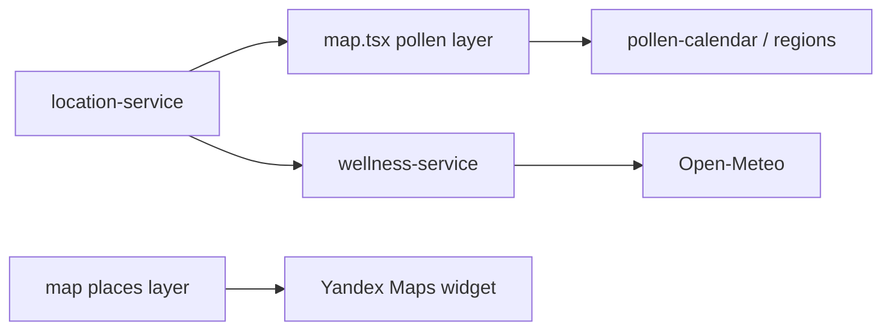
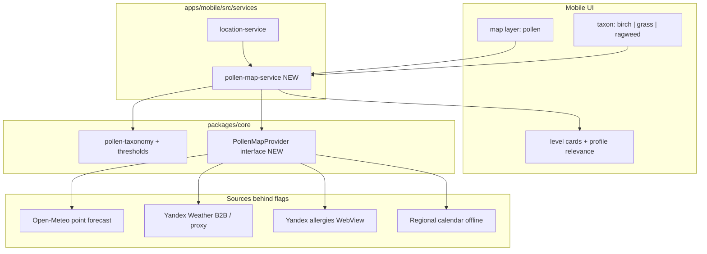

# План: карта пыления (берёза, злаковые, амброзия) + Яндекс + геолокация

Документ описывает **интеграцию и отображение** live-карты пыления для трёх ключевых таксонов поллиноза с привязкой к местоположению пользователя. Источник данных — экосистема Яндекса (Погода / Карты) при соблюдении offline-first и слоёв AllerGuide.

Связанные документы: [`architecture.md`](./architecture.md) · [`development-rules.md`](./development-rules.md) · [`functional-requirements.md`](./functional-requirements.md) §11 · [`clinical-accuracy-roadmap.md`](./clinical-accuracy-roadmap.md).

---

## 1. Цель продукта

На слое **«Пыление»** экрана `/(tabs)/map` пользователь видит:

1. **Карту активности** пыльцы (не только сезонный календарь).
2. Переключение таксонов: **берёза**, **злаковые**, **амброзия**.
3. Центр карты и прогноз **по GPS / ручному региону / дефолту** (уже есть в `location-service`).
4. Карточки уровней (низкий / умеренный / высокий) с привязкой к профилю аллергий.
5. Атрибуцию Яндекса и медицинский disclaimer.

**Не цель v1:** заменить Open-Meteo в wellness целиком; парсить HTML/JS Яндекс Погоды; хранить API-ключи на клиенте.

---

## 2. Исходное состояние (as-is)

| Компонент | Сейчас |
|-----------|--------|
| Базовая карта | Виджет Яндекс.Карт (`YandexMap` + `buildYandexMapWidgetUrl`) — слой «Рестораны» |
| Слой «Пыление» | Статический календарь `getPollenPeaksForMonth` + `resolvePollenRegion` — **без heatmap и без live API** |
| Live-пыльца | Open-Meteo Air Quality в `wellness-service` (берёза, злаки, амброзия и др.) |
| Геолокация | `getCurrentLocation()`: GPS → кэш 30 мин → manual region → Москва |
| Таксономия | `pollen-taxonomy.ts`: `birch_pollen` → `birch-pollen`, `grass_pollen` → `grass-pollen`, `ragweed_pollen` → `ragweed-pollen` |
| FR | FR-MAP-06/07 — пики месяца / карточки (АДАИР + Open-Meteo), не live-карта Яндекса |



---

## 3. Ограничение по источнику данных (критично)

### 3.1. Что есть у Яндекса для пользователей

Сервис **«Активность пыльцы»** в Яндекс Погоде:

- URL-паттерн: `https://yandex.ru/pogoda/ru/{city}/allergies`
- Таксоны (2026): берёза, ольха, злаки, амброзия, полынь, сорняки, лещина, липа
- Карта активности + прогноз ~10 дней + уровни «низкая / умеренная / высокая»
- Учитываются фазы цветения, погода, опросы пользователей, с 2026 — ветряные заносы

### 3.2. Что доступно разработчикам официально

Публичный **API Яндекс Погоды** ([документация параметров](https://yandex.ru/dev/weather/doc/ru/concepts/parameters)):

- Метеопараметры, AQI/IAQI, tiled weather maps (`temperature`, `prec`, `windSpeed`, …)
- **Параметров пыльцы / allergies в публичной документации нет**
- Embed-тариф «Погода на сайте» — факт/прогноз погоды, не карта аллергенов
- Виджет Яндекс.Карт (`map-widget/v1`) — базовые слои карты + маркеры; **слоя пыления нет**

### 3.3. Запрещено

| Подход | Почему нет |
|--------|------------|
| Скрейпинг `…/allergies` / внутренних XHR | ToS, хрупкость, риск блокировок, юридический риск |
| Ключ Weather API в `EXPO_PUBLIC_*` | Утечка ключа, квоты, NFR безопасности |
| Ломать offline core flows при выключенном флаге | [`development-rules.md` §2.1](./development-rules.md) |

**Вывод:** до появления B2B-доступа к pollen-данным Яндекса полноценную heatmap «из API Яндекса» внедрить нельзя. План строится как **двухконтурный**: продуктовый UX сейчас + контракт под официальный провайдер позже.

---

## 4. Рекомендуемая стратегия (два контура)

### Контур A — продуктовый UX (можно делать без B2B)

Обогатить слой «Пыление» так, чтобы он выглядел и вёл себя как карта пыления с привязкой к локации, используя уже легальные куски стека:

1. **Базовая карта** — Яндекс.Карты (виджет), центр = `getCurrentLocation()`.
2. **Точечный live-прогноз** по lat/lon — Open-Meteo (уже есть парсер) для `birch_pollen` / `grass_pollen` / `ragweed_pollen`.
3. **Полноэкранная / встроенная карта Яндекс Погоды** — WebView или deep-link на `…/allergies` с городом/координатами (атрибуция «Данные: Яндекс Погода»).
4. Сохранить сезонный календарь АДАИР как offline fallback.

### Контур B — официальные данные Яндекса (после согласования)

После ответа Яндекс Погоды для бизнеса (`api-weather@support.yandex.ru` / кабинет разработчика):

- либо GraphQL/REST-поля активности пыльцы по точке;
- либо raster/vector tiles слоя allergies;
- либо лицензированный embed/iframe allergies-карты.

Тогда Open-Meteo остаётся **fallback**, а Яндекс — preferred source за feature flag.



---

## 5. Архитектура размещения кода

Следовать правилам слоёв ([`development-rules.md` §3](./development-rules.md)):

| Слой | Ответственность |
|------|-----------------|
| `packages/core` | Типы `PollenMapReading`, маппинг Yandex taxon → `PollenTaxonId`, нормализация уровней (low/mid/high), выбор preferred/fallback провайдера, URL allergies-страницы по lat/lon/region |
| `apps/api` | Опциональный прокси `GET /api/pollen?lat=&lon=&taxa=` (ключ Яндекса только на сервере), кэш, rate limit — по аналогии с OFF/scan |
| `apps/mobile/src/services` | `pollen-map-service.ts`: оркестрация location + fetch + cache; **не** в `app/**/*.tsx` |
| `apps/mobile/app/(tabs)/map.tsx` | UI: переключатели таксонов, карта, карточки, disclaimer |
| `apps/mobile/src/components` | `PollenMapView` (виджет / WebView / overlay), переиспользовать `YandexMap` где возможно |
| Feature flags | `EXPO_PUBLIC_YANDEX_POLLEN=true` (клиент) + `YANDEX_POLLEN_ENABLED` / `YANDEX_WEATHER_API_KEY` (API) — default **off** |

### 5.1. Контракт провайдера (core)

```ts
type PollenMapTaxon = 'birch_pollen' | 'grass_pollen' | 'ragweed_pollen';

type PollenActivityLevel = 'none' | 'low' | 'mid' | 'high';

interface PollenMapSnapshot {
  source: 'yandex' | 'open-meteo' | 'calendar' | 'embed';
  lat: number;
  lon: number;
  regionId: string;
  updatedAt: string; // ISO
  taxa: Array<{
    taxonId: PollenMapTaxon;
    level: PollenActivityLevel;
    /** Концентрация, если провайдер отдаёт числа; иначе null */
    value: number | null;
    unit?: 'grains_m3' | 'activity_index';
    forecastDays?: Array<{ date: string; level: PollenActivityLevel }>;
    profileRelevant: boolean;
  }>;
  /** URL карты Яндекс Погоды для WebView / «Открыть в Яндексе» */
  yandexAllergiesUrl?: string;
}
```

Маппинг имён Яндекса → канон:

| Яндекс (UI) | `PollenTaxonId` | `ProfileAllergenId` |
|-------------|-----------------|---------------------|
| Берёза | `birch_pollen` | `birch-pollen` |
| Злаки | `grass_pollen` | `grass-pollen` |
| Амброзия | `ragweed_pollen` | `ragweed-pollen` |

Пороги для числовых значений — переиспользовать `pollen-thresholds.ts` (EAACI-inspired). Для дискретной шкалы Яндекса — явная таблица `yandexActivityToTier`.

### 5.2. Поток данных (целевой)

```
GPS/manual → location-service
    → pollen-map-service
        → (flag) API /api/pollen  → Yandex B2B
        → else Open-Meteo point
        → always build yandexAllergiesUrl for embed/deep-link
        → calendar fallback if network fail
    → map.tsx (карточки + карта + WebView)
```

Offline: календарь региона + последняя закэшированная `PollenMapSnapshot` (AsyncStorage / settings, TTL 6–12 ч).

---

## 6. UX слоя «Пыление»

### 6.1. Первый экран слоя (одна композиция)

1. Заголовок: «Пыление · {регион}» + источник данных.
2. **Одна** доминирующая карта (Яндекс виджет или allergies WebView) — edge-to-edge в пределах экрана вкладки, без карточки-обёртки вокруг карты.
3. Сегмент таксонов: Берёза | Злаковые | Амброзия (подсветка релевантных профилю).
4. Ниже карты — 1–3 строки уровня «сейчас» + опционально мини-прогноз на 3–7 дней.
5. Disclaimer + атрибуция Яндекс / Open-Meteo.

Не класть в первый viewport: клиники АДАИР, длинный календарь всех таксонов, статистику wellness.

### 6.2. Геолокация

| Источник | Поведение |
|----------|-----------|
| GPS granted (native) | Центр карты + запрос пыльцы по lat/lon |
| Permission denied | Manual region из настроек → иначе дефолт Москва |
| Web | Manual / default (как сейчас); опционально `navigator.geolocation` позже |
| Смена региона в настройках | Инвалидация кэша пыльцы + refetch |

Кнопка «Обновить по моему месту» → `getCurrentLocation({ forceRefresh: true })`.

### 6.3. Режимы отображения карты

| Режим | Когда | Реализация |
|-------|-------|------------|
| **Point + basemap** | Контур A default | `YandexMap` по coords + overlay-бейдж уровня выбранного таксона (не «стикер» на hero-медиа стороннего бренда — бейдж под картой/в легенде) |
| **Yandex allergies embed** | Пользователь / флаг «Карта Яндекс Погоды» | `WebView` URL allergies; центр по городу из `resolvePollenRegion` или geo-slug |
| **Native heatmap tiles** | Контур B, если Яндекс отдаст tiles | JS API / MapKit + overlay; отдельный ADR |

Deep-link «Открыть в Яндекс Погоде» — обязательный escape hatch при embed-ограничениях (CSP, cookie, login wall).

---

## 7. Фазы внедрения

### Фаза 0 — Discovery / legal (блокер для контура B)

- [ ] Запрос в Яндекс Погоду для бизнеса: pollen по точке, tiles, embed, коммерческие условия, атрибуция.
- [ ] Зафиксировать ответ в ADR `003-yandex-pollen-provider.md` (accepted / deferred / rejected).
- [ ] Уточнить ToS на WebView страницы `/allergies` (допустим ли in-app browser).

**Критерий выхода:** письменный статус доступа (есть API / только embed / отказ).

### Фаза 1 — Карта пыления v1 (контур A, без ключа Яндекса)

Объём работ:

1. **core:** `buildYandexAllergiesUrl(region | lat,lon)`, маппинг 3 таксонов, `selectPollenMapSnapshot` (OM + calendar).
2. **mobile service:** `pollen-map-service` — fetch Open-Meteo для точки пользователя, кэш, профиль-релевантность.
3. **UI map pollen layer:**
   - Яндекс.Карты centered on location;
   - toggle берёза / злаки / амброзия;
   - live levels из OM;
   - кнопка / вкладка «Карта Яндекс Погоды» (WebView или Linking);
   - calendar fallback offline.
4. **i18n:** все 6 локалей + `types.ts`; обновить `map.pollenMapSub` (сейчас «Open-Meteo / АДАИР»).
5. **flags:** `EXPO_PUBLIC_YANDEX_POLLEN_EMBED` (default off или on для RU-сборки — решить в PR).
6. **тесты:** core URL builder, маппинг уровней, service с моком fetch; TC в `qa-test-cases.md`.
7. **FR:** расширить FR-MAP-06… (draft ниже) после merge плана.

**Критерий готовности:** на native при GPS слой показывает уровни 3 таксонов для текущих координат + открывается allergies-страница Яндекса для региона; без сети — календарь, без краша.

### Фаза 2 — Прокси Яндекс (контур B, если API есть)

1. `apps/api/src/routes/pollen.ts` + `services/yandex-pollen.ts`.
2. Env: `YANDEX_WEATHER_API_KEY`, `YANDEX_POLLEN_ENABLED`, кэш in-memory/Redis-ready, rate limit.
3. Mobile: при `EXPO_PUBLIC_YANDEX_POLLEN=true` ходить в `/api/pollen`, иначе OM.
4. Нормализация ответа Яндекса → `PollenMapSnapshot`.
5. Опционально: подмешивать уровни в wellness / pollen-reminder (единый source of truth через service).

**Критерий готовности:** при включённых флагах source=`yandex` в snapshot; при 5xx/timeout — silent fallback на OM; ключ не в клиентском бандле.

### Фаза 3 — Heatmap overlay (опционально)

Только при наличии tiles/JS API:

- Заменить point-бейдж на полупрозрачный слой.
- ADR по выбору: WebView JS API vs react-native-yamap vs продолжение widget.
- Нагрузка, квоты tiles, палитры уровней (согласовать с дизайн-системой приложения, без «AI purple glow»).

---

## 8. Изменения требований (draft)

Предлагаемые дополнения к [`functional-requirements.md`](./functional-requirements.md) §11.3 (после утверждения плана):

| ID | Формулировка |
|----|--------------|
| **FR-MAP-11** | Live-уровни пыления для берёзы, злаковых и амброзии по координатам пользователя (или ручному региону). |
| **FR-MAP-12** | Переключатель таксона на слое «Пыление»; релевантные профилю таксоны визуально приоритетны. |
| **FR-MAP-13** | Отображение на базе Яндекс.Карт и/или официальной карты активности пыльцы Яндекс Погоды с атрибуцией. |
| **FR-MAP-14** | При недоступности сети/провайдера — fallback на региональный календарь; без блокировки остальных слоёв карты. |
| **FR-INT-xx** | Интеграция пыльцы Яндекса — только через серверный прокси и feature flag; клиент не хранит секрет. |

Обновить FR-MAP-06: «пики месяца» остаются; live-карта — отдельно (11–14), чтобы не смешивать календарь и прогноз.

---

## 9. Безопасность, квоты, NFR

| Тема | Решение |
|------|---------|
| Секреты | Только API env; mobile знает `EXPO_PUBLIC_API_URL` |
| CORS / abuse | Rate limit на `/api/pollen` по IP (+ optional auth) |
| Privacy | Координаты на сервер только при включённом флаге; не логировать lat/lon в analytics без политики |
| Disclaimer | Уже есть `map.disclaimerPollen` — усилить: «не замена клиническому мониторингу» |
| Offline-first | Флаг off = текущее поведение календаря; флаг on + offline = cache/calendar |
| Атрибуция | «Карта: Яндекс Карты» / «Прогноз пыльцы: Яндекс Погода» / «точечные данные: Open-Meteo» |

---

## 10. Тест-план (кратко)

| ID | Сценарий | Ожидание |
|----|----------|----------|
| TC-P1 | GPS ok, OM available | 3 таксона с уровнями, карта центрирована |
| TC-P2 | GPS denied, manual region | Данные по региону из настроек |
| TC-P3 | Offline | Calendar + cached snapshot; нет crash |
| TC-P4 | Toggle таксонов | Меняется легенда/акцент; профиль birch → birch highlighted |
| TC-P5 | Open Yandex allergies | WebView/Linking открывает страницу региона |
| TC-P6 | Flag Yandex API on, 503 | Fallback OM, UI не показывает пустой экран |
| TC-P7 | Profile without pollen | Таксоны видны, без «релевантно вам» |

Автотесты: unit в `packages/core`, service mocks в mobile; Maestro — smoke открытия слоя (по возможности без сети).

---

## 11. Оценка объёма работ (техническая, не календарная)

| Пакет | Инвазивность | Зависимости |
|-------|--------------|-------------|
| Фаза 0 | Документы / внешняя переписка | Ответ Яндекса |
| Фаза 1 | Средняя: map UI + service + core URL/mapper | Существующие location, OM, YandexMap |
| Фаза 2 | Средняя–высокая: новый API route + flags + contract tests | Фаза 0 positive + ключ |
| Фаза 3 | Высокая: нативный/JS map SDK | Фаза 2 + tiles product |

Риски: отказ Яндекса в B2B → продукт остаётся на контуре A (OM + embed); изменение URL allergies; WebView блокировки на iOS/Android.

---

## 12. Чеклист перед реализацией кода

- [ ] Утвердить контур A как v1 (этот документ).
- [ ] Запустить Фазу 0 (запрос B2B) параллельно с Фазой 1.
- [ ] Добавить ADR-003 по провайдеру после ответа Яндекса.
- [ ] Обновить FR-MAP-* и строку в `architecture.md` (env + схема).
- [ ] Реализация строго: core → service → UI; флаги default off; i18n ×6; тесты; без скрейпинга.

---

## 13. Краткий вердикт

**Сейчас** публичного API пыльцы Яндекса нет — нельзя честно обещать «данные из сервиса Яндекс» как машиночитаемый feed без B2B-договора.

**Практичный путь:** (1) карта на Яндекс.Картах + live по точке через Open-Meteo для берёзы/злаков/амброзии + встроенная/внешняя карта «Активность пыльцы» Яндекс Погоды по локации; (2) параллельно запросить официальный pollen API/tiles и подключить через `apps/api` за флагом с тем же UI-контрактом `PollenMapSnapshot`.
