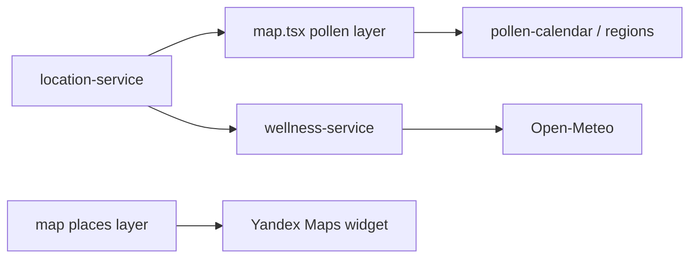
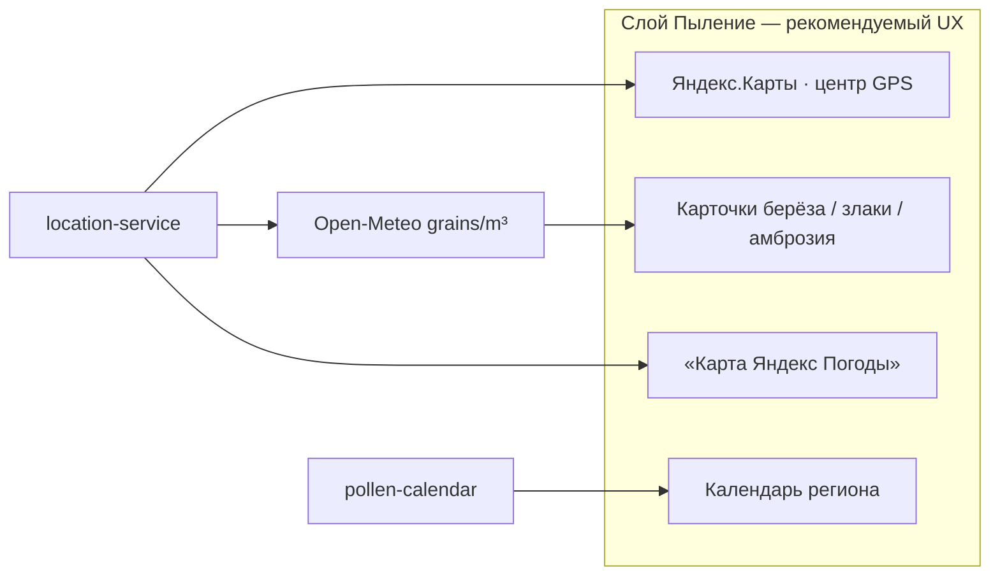
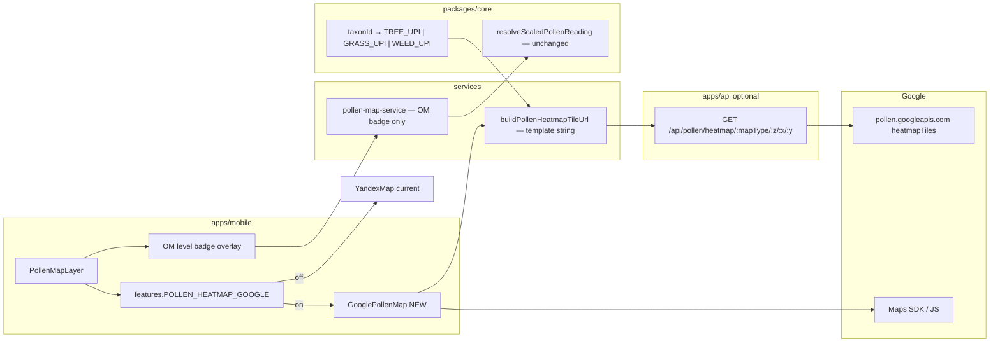
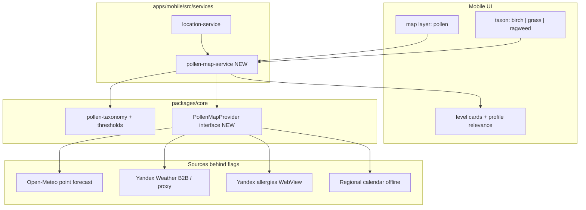

# План: карта пыления (берёза, злаковые, амброзия) + Яндекс + геолокация

Документ описывает **интеграцию и отображение** live-карты пыления для трёх ключевых таксонов поллиноза с привязкой к местоположению пользователя. Источник данных — экосистема Яндекса (Погода / Карты) при соблюдении offline-first и слоёв AllerGuide.

Связанные документы: [`architecture.md`](./architecture.md) · [`development-rules.md`](./development-rules.md) · [`functional-requirements.md`](./functional-requirements.md) §11 · [`clinical-accuracy-roadmap.md`](./clinical-accuracy-roadmap.md).

---

## 1. Цель продукта

На слое **«Пыление»** экрана `/(tabs)/map` пользователь видит:

1. **Карту активности** пыльцы (не только сезонный календарь).
2. Переключение таксонов: **берёза**, **злаковые**, **амброзия**.
3. Центр карты и прогноз **по GPS / ручному региону / дефолту** (уже есть в `location-service`).
4. Карточки уровней (низкий / умеренный / высокий) с привязкой к профилю аллергий.
5. Атрибуцию Яндекса и медицинский disclaimer.

**Не цель v1:** заменить Open-Meteo в wellness целиком; парсить HTML/JS Яндекс Погоды; хранить API-ключи на клиенте.

**Статус:** гибридный контур A реализован: Яндекс.Карты по локации, **одно**
live-значение Open-Meteo в зависимости от масштаба (точка / город / регион),
ссылка на карту Яндекс Погоды, кэш и календарный fallback. Добавлены ольха,
полынь и олива. Контур B / tile heatmap ожидает Google Pollen, CAMS/SILAM WMS
или официальный B2B API Яндекса (см. §4.4).

---

## 2. Исходное состояние (as-is)

| Компонент | Сейчас |
|-----------|--------|
| Базовая карта | Виджет Яндекс.Карт (`YandexMap` + `buildYandexMapWidgetUrl`) — слой «Рестораны» |
| Слой «Пыление» | Статический календарь `getPollenPeaksForMonth` + `resolvePollenRegion` — **без heatmap и без live API** |
| Live-пыльца | Open-Meteo Air Quality в `wellness-service` (берёза, злаки, амброзия и др.) |
| Геолокация | `getCurrentLocation()`: GPS → кэш 30 мин → manual region → Москва |
| Таксономия | `pollen-taxonomy.ts`: `birch_pollen` → `birch-pollen`, `grass_pollen` → `grass-pollen`, `ragweed_pollen` → `ragweed-pollen` |
| FR | FR-MAP-06/07 — пики месяца / карточки (АДАИР + Open-Meteo), не live-карта Яндекса |



---

## 3. Ограничение по источнику данных (критично)

### 3.1. Что есть у Яндекса для пользователей

Сервис **«Активность пыльцы»** в Яндекс Погоде:

- URL-паттерн: `https://yandex.ru/pogoda/ru/{city}/allergies`
- Таксоны (2026): берёза, ольха, злаки, амброзия, полынь, сорняки, лещина, липа
- Карта активности + прогноз ~10 дней + уровни «низкая / умеренная / высокая»
- Учитываются фазы цветения, погода, опросы пользователей, с 2026 — ветряные заносы

### 3.2. Что доступно разработчикам официально

Публичный **API Яндекс Погоды** ([документация параметров](https://yandex.ru/dev/weather/doc/ru/concepts/parameters)):

- Метеопараметры, AQI/IAQI, tiled weather maps (`temperature`, `prec`, `windSpeed`, …)
- **Параметров пыльцы / allergies в публичной документации нет**
- Embed-тариф «Погода на сайте» — факт/прогноз погоды, не карта аллергенов
- Виджет Яндекс.Карт (`map-widget/v1`) — базовые слои карты + маркеры; **слоя пыления нет**

### 3.3. Запрещено

| Подход | Почему нет |
|--------|------------|
| Скрейпинг `…/allergies` / внутренних XHR | ToS, хрупкость, риск блокировок, юридический риск |
| Ключ Weather API в `EXPO_PUBLIC_*` | Утечка ключа, квоты, NFR безопасности |
| Ломать offline core flows при выключенном флаге | [`development-rules.md` §2.1](./development-rules.md) |

**Вывод:** до появления B2B-доступа к pollen-данным Яндекса полноценную heatmap «из API Яндекса» внедрить нельзя. План строится как **двухконтурный**: продуктовый UX сейчас + контракт под официальный провайдер позже.

---

## 4. Сравнение: Яндекс Погода vs Open-Meteo

Критерии — под слой **«Пыление»** AllerGuide (берёза, злаковые, амброзия + геолокация + offline-first + РФ).

| Критерий | Яндекс Погода («Активность пыльцы») | Open-Meteo Air Quality (CAMS) |
|----------|-------------------------------------|-------------------------------|
| **Доступ для разработчиков** | Пыльца **нет** в публичном API; только потребительский UI / возможный B2B | Публичный JSON API, без ключа (non-commercial) / customer-ключ для коммерции |
| **Heatmap / карта** | Есть готовая карта активности в приложении и на `…/allergies` | Точка по lat/lon; heatmap в API **нет** (можно строить сетку запросов — дорого и против ToS/квот) |
| **Точечный прогноз** | В UI по городу; машиночитаемо — только после B2B | Да: `hourly=birch_pollen,grass_pollen,ragweed_pollen` |
| **Единицы** | Дискретная «активность» (низкая / умеренная / высокая) + иногда ед./м³ в UI | `grains/m³` — стыкуется с `pollen-thresholds.ts` (EAACI) |
| **Горизонт** | ~10 дней | Пыльца: до ~4 суток (сезон), hourly |
| **Таксоны (нужные 3)** | Берёза, злаки, амброзия (+ ольха, полынь, сорняки, лещина, липа) | Берёза, злаки, амброзия (+ ольха, полынь, олива) |
| **География для РФ** | РФ + СНГ — сильная сторона модели Яндекса (фазы цветения, погода, опросы, заносы) | Пыльца CAMS — **европейский домен** (~11 км); европейская часть РФ обычно покрыта, Сибирь/Дальний Восток — риск пустых/нулевых значений |
| **Локальная калибровка** | Модель под RU-пользователей, crowdsourcing симптомов | Евромодель CAMS; без RU-опросов |
| **Интеграция в AllerGuide** | Новая; ключ только через `apps/api`; embed WebView — хрупкий UX | **Уже в** `wellness-service` + `parseOpenMeteoPollenHourly` |
| **Лицензия / атрибуция** | Коммерческие условия B2B; для UI — «Яндекс Погода» | CC BY 4.0 + атрибуция Open-Meteo / CAMS |
| **Стоимость / квоты** | Неизвестно до договора; ключ платный | Free tier достаточен для MVP; коммерция — customer API |
| **Offline / кэш** | Без API — только WebView (нужна сеть) или deep-link | JSON легко кэшировать в settings (TTL 6–12 ч) |
| **Юридический риск** | Низкий при embed/B2B; **высокий** при скрейпинге | Низкий при соблюдении attribution и лимитов |
| **Согласованность с wellness** | Разные шкалы → нужен маппинг `yandexActivityToTier` | Одна шкала с индексом самочувствия и pollen reminders |

### 4.1. Сильные и слабые стороны

**Яндекс Погода**

- Плюсы: лучший **RU heatmap UX**, длинный горизонт, учёт заносов/опросов, знакомый бренд для пользователя.
- Минусы: **нет публичного pollen API**, нельзя нативно нарисовать слой на наших маркерах без B2B; WebView — не «свои» карточки/профиль; зависимость от внешнего UI.

**Open-Meteo**

- Плюсы: **легальный API сейчас**, числовые `grains/m³`, уже в коде, единый источник с wellness, кэш и тесты простые, offline-friendly.
- Минусы: **нет готовой карты пыления**; покрытие пыльцой — Europe CAMS (не вся РФ одинаково); горизонт короче; нет crowdsourcing «как чувствуют аллергики рядом».

### 4.2. Рекомендация для слоя «Пыление» (вердикт)

**Лучшее решение сейчас — гибрид с разделением ролей, не «выбрать один источник»:**

| Роль на UI | Источник | Почему |
|------------|----------|--------|
| Базовая карта (подложка) | **Яндекс.Карты** (виджет, уже в приложении) | Единый map UX с слоем «Рестораны», РФ-картография |
| Уровни «сейчас» по 3 таксонам + профиль | **Open-Meteo** (primary data) | Единственный легальный машиночитаемый feed; совпадает с wellness/порогами |
| Региональная heatmap «как у Яндекса» | **Яндекс Погода** — secondary: кнопка / вкладка WebView или «Открыть в Яндекс Погоде» по городу из `resolvePollenRegion` | Даёт настоящую карту активности без скрейпинга |
| Нет сети / пустой OM | **Календарь АДАИР** (`pollen-calendar` + region) | Offline-first |

Почему **не** «только Яндекс» для v1: нечего стабильно парсить в `PollenMapSnapshot` без B2B → либо скрейпинг (запрещён), либо пустой слой с одним WebView (плохой fit с профилем, i18n, reminders).

Почему **не** «только Open-Meteo»: пользователь ждёт **карту** пыления; OM даёт точку. Нарисовать heatmap сеткой запросов — антипаттерн. Календарь уже есть, но это не live.

**Когда переключать primary на Яндекс:** только после Фазы 0 (B2B API или licensed tiles/embed). Тогда OM → fallback; шкалы нормализовать в core.



**Итог одной фразой:** данные уровней — Open-Meteo; подложка и опциональная heatmap — Яндекс; календарь — страховка. Это максимум качества UX при текущих API-ограничениях.

### 4.3. Почему не встраиваем consumer heatmap со скриншота

Страница Яндекс Погоды `/maps/pollen/*` — потребительский cross-origin продукт:
в ней есть реклама и навигация по осадкам, ветру и другим сервисам. Приложение не
может легально удалить эти элементы из iframe/WebView из-за Same-Origin Policy и
условий использования. `map-widget/v1` также не умеет отключать отдельный
`trafficControl`.

Поэтому основной экран показывает **одно** значение уровня выбранного аллергена:
оно зависит от масштаба карты (точка / город / регион) и считается из Open-Meteo/CAMS.
Блок «Пробки» визуально закрыт pollen-бейджем. Полностью чистая интерактивная карта
с `controls: []` возможна после настройки ключа JavaScript API Яндекс.Карт;
офи настоящего heatmap нужен tile-провайдер пыльцы (см. §4.4).

### 4.4. Открытые / API-источники пыльцевого слоя (альтернативы Яндексу)

Публичный API Яндекс Погоды **не отдаёт** параметры пыльцы и raster-тайлы allergies.
Ниже — источники с документированной интеграцией, пригодные для настоящего слоя на карте.

| Источник | Что даёт | API / интеграция | Лицензия / доступ | Fit для AllerGuide |
|----------|----------|------------------|-------------------|--------------------|
| **Open-Meteo Air Quality** (уже в приложении) | Точка: `birch/grass/ragweed/alder/mugwort/olive` grains/m³ | REST `air-quality-api.open-meteo.com/v1/air-quality` (multi lat/lon) | CC BY 4.0, free non-commercial | Primary для **одного** числа; heatmap нет |
| **Google Pollen API** | Forecast + **heatmapTiles** `TREE_UPI` / `GRASS_UPI` / `WEED_UPI` (PNG z/x/y) | `pollen.googleapis.com/v1/mapTypes/{mapType}/heatmapTiles/{z}/{x}/{y}` | Платный Google Maps Platform, ключ | Лучший готовый heatmap; покрытие 65+ стран (**проверить РФ**) |
| **Copernicus CAMS** | Европейский ensemble pollen (те же таксоны, что OM) | Atmosphere Data Store (CDS) API → NetCDF/GRIB | Открытые данные ЕС | Сырые поля; tiles нужно рендерить в `apps/api` |
| **SILAM (FMI)** | Модель пыльцы по Европе | THREDDS / **WMS** каталог FMI (`thredds.fmi.fi`) | Open-code research | WMS-overlay на MapLibre; не clinical-grade |
| **Tomorrow.io / Ambee** | Коммерческие pollen index / timeline | REST + ключ | Платно | Быстрый path, не «open» |
| **Яндекс Погода B2B** | Consumer heatmap RU | Нет публичного pollen API | Коммерческий запрос | Только после договора |

#### Как интегрировать слой (следующие шаги)

1. **Google Pollen `heatmapTiles` (короткий путь к heatmap)**  
   - Endpoint: `GET https://pollen.googleapis.com/v1/mapTypes/{TREE_UPI|GRASS_UPI|WEED_UPI}/heatmapTiles/{z}/{x}/{y}?key=API_KEY`  
   - Клиент: MapLibre / Google Maps `TileOverlay` (не `map-widget` Яндекса — виджет не принимает произвольные тайлы).  
   - Флаг: `EXPO_PUBLIC_POLLEN_HEATMAP=google` + серверный ключ только в `apps/api` proxy (не в бандле).  
   - Ограничение: UPI = tree/grass/weed группы, не отдельные берёза/амброзия; покрытие РФ нужно валидировать.

2. **SILAM / CAMS open path (без Google)**  
   - SILAM: WMS `GetMap` с слоями pollen → tile-proxy `GET /api/pollen/tiles/:z/:x/:y` в `apps/api`.  
   - CAMS ADS: периодический ingest NetCDF → rasterize (например GDAL/Mapnik) → тот же tile endpoint.  
   - Overlay на MapLibre; базовая карта — OSM или Яндекс JS API с `controls: []`.

3. **Оставить Open-Meteo** как источник **одного** числа уровня (как сейчас: точка / среднее города / пик региона) и wellness; heatmap — отдельный провайдер за feature flag (**FR-MAP-18**).

Не подходит как open heatmap API: скрейпинг UI Яндекс Погоды / SILAM HTML.

**Рекомендация продукта:** сейчас — Open-Meteo (одно значение × масштаб) на Яндекс-подложке.  
Следующий инкремент heatmap: **Google basemap + `heatmapTiles` + OM-бейдж** (§4.6), не overlay на Яндекс.  
SILAM/CAMS — только если нужен слой **без** Google Maps ToS.

### 4.5. Feasibility: Google `heatmapTiles` на staging (без реализации)

Проверка возможности stage-сценария **без кода**. Источники: [coverage](https://developers.google.com/maps/documentation/pollen/coverage), [heatmap tiles](https://developers.google.com/maps/documentation/pollen/heatmap-tiles), [policies](https://developers.google.com/maps/documentation/pollen/policies), [billing](https://developers.google.com/maps/documentation/pollen/usage-and-billing).

#### Вердикт

| Вопрос | Ответ |
|--------|--------|
| Можно ли на stage? | **Да, условно** — после GCP billing + ключей + смены basemap на Google Maps |
| Можно ли поверх текущего `map-widget` Яндекса? | **Нет** (виджет не принимает тайлы + **запрещено ToS**) |
| Покрыта ли РФ? | **Да** (`RU`: grass, trees, weeds; растения: birch, olive, grasses, ragweed, alder, mugwort) |
| Endpoint доступен из среды? | Да: без ключа → `403`; невалидный ключ → `400 API key not valid` (Москва z=6 x=38 y=20) |

#### Что даёт API

```
GET https://pollen.googleapis.com/v1/mapTypes/{TREE_UPI|GRASS_UPI|WEED_UPI}/heatmapTiles/{z}/{x}/{y}?key=KEY
→ PNG 256×256, zoom 0–16
```

- Heatmap только по **трём группам** UPI (tree / grass / weed), **не** по отдельной берёзе/амброзии.
- Маппинг UI AllerGuide → слой: `birch_*`/`alder_*`/`olive_*` → `TREE_UPI`; `grass_*` → `GRASS_UPI`; `ragweed_*`/`mugwort_*` → `WEED_UPI`.
- Число зёрен/м³ на бейдже можно оставить Open-Meteo **или** брать из Google Forecast API (plant codes `BIRCH`, `GRAMINALES`, `RAGWEED`…); heatmap и бейдж тогда на разных шкалах, если смешивать провайдеров.

#### Блокеры / жёсткие ToS

1. **Basemap только Google Maps**, если данные Pollen API показываются на карте («using non-Google maps is prohibited»).  
   → Stage: `react-native-maps` (Google) / Maps JS API на web; **не** `YandexMap` iframe и не MapLibre+OSM.
2. **Кэш/prefetch тайлов запрещён** (кроме place IDs). Proxy в `apps/api` может только pass-through / short-lived edge, не долговременный store.
3. Атрибуция: логотип/текст Google Maps + *"Source: Includes pollen data from Google"*.
4. Billing обязателен на GCP-проекте; SKU **Pollen Usage** (Pro): ~5 000 вызовов/мес free, далее ~$10 / 1 000 (см. актуальный прайс GMP).  
   Один pan/zoom viewport ≈ десятки tile-запросов → на stage нужен жёсткий quota + rate limit.

#### Что нужно для stage (чеклист ops, без кода)

| # | Шаг | Где |
|---|-----|-----|
| 1 | GCP project + billing + enable **Pollen API** (+ **Maps JavaScript API** / Maps SDK) | Google Cloud Console |
| 2 | API key(s): server (IP-restricted) для proxy **или** client key с HTTP referrer / Android package / iOS bundle | Secrets staging |
| 3 | Env (план): `GOOGLE_POLLEN_API_KEY` на API; `EXPO_PUBLIC_POLLEN_HEATMAP=google` + `EXPO_PUBLIC_GOOGLE_MAPS_API_KEY` на mobile (EAS `staging`) | `.env.staging` / EAS |
| 4 | Route-proxy (план): `GET /api/pollen/heatmap/:mapType/:z/:x/:y` → Google; ключ не в бандле; rate limit per IP/JWT | `apps/api` |
| 5 | UI (план): при флаге — Google Map + `TileOverlay`/`overlayMapTypes`; иначе текущий Яндекс + Open-Meteo бейдж | `PollenMapLayer` |
| 6 | Offline-first: флаг **off** по умолчанию; без сети — календарь, без тайлов | FR-MAP-14/18 |
| 7 | Smoke: запрос тайла Москвы + визуальный overlay на staging web/APK | QA |

#### Риски stage

- **Продуктовый UX:** heatmap = группа растений, а переключатели — отдельные таксоны → нужна подпись «деревья / злаки / сорняки (UPI)».
- **Стоимость:** активное тестирование карты быстро съест free tier.
- **Дублирование карт:** Яндекс остаётся на «Рестораны»/прочих слоях; слой «Пыление» при флаге — отдельный Google Map (два провайдера на одном табе).
- **РФ billing/аккаунт:** нужен действующий GCP billing account; ограничения оплаты/региона — ops-проверка до старта.

#### Рекомендация по stage

**Реализуемо** как opt-in stage-флаг после появления GCP-ключей.  
Минимальный stage-scope: Google basemap + `TREE_UPI`/`GRASS_UPI`/`WEED_UPI` overlay + атрибуция; бейдж уровня оставить Open-Meteo.  
**Не делать:** overlay Google-тайлов на Яндекс-виджет; клиентский ключ Pollen без ограничений; кэш PNG в БД.

Код heatmap **не начинать**, пока нет staging-секретов GCP и явного go на смену basemap.

### 4.6. План: Google basemap + pollen heatmap (бейдж Open-Meteo)

Цель: на слое **«Пыление»** заменить Яндекс-виджет на **Google Maps basemap**, наложить **Google `heatmapTiles`**, **оставить** текущий бейдж уровня из Open-Meteo/CAMS (точка / город / регион).  
Слой **«Рестораны»** и deep-link «Открыть карту пыльцы Яндекса» **не** обязаны мигрировать в том же инкременте.

#### 4.6.1. Целевая композиция экрана

```
[ Точка | Город | Регион ]     ← zoom region MapView + агрегация OM-бейджа
┌─────────────────────────────────────┐
│  Google Maps (PROVIDER_GOOGLE)      │
│  + UrlTile TREE|GRASS|WEED_UPI      │
│                          ┌────────┐ │
│                          │ OM badge│ │  ← без изменений логики resolveScaled*
│                          └────────┘ │
└─────────────────────────────────────┘
«Карта: Google · пыльца: Google UPI · уровень: Open-Meteo / CAMS»
[ Берёза | Злаки | Амброзия ]  (+ ольха / полынь / олива)
[ Открыть карту пыльцы Яндекса ]  ← secondary deep-link, опционально
```

| Элемент | Источник | Меняется? |
|---------|----------|-----------|
| Basemap | Google Maps SDK / JS | **Да** (вместо `YandexMap`) |
| Heatmap overlay | Google Pollen `heatmapTiles` | **Да** (новый) |
| Бейдж low/mid/high + зёрен/м³ | Open-Meteo (как сейчас) | **Нет** (логика `resolveScaledPollenReading`) |
| Масштаб Точка/Город/Регион | `POLLEN_MAP_SCALE_ZOOM` → `region` MapView | Да (API карты), семантика та же |
| Таксоны UI | core taxonomy | Нет; heatmap маппится в UPI-группу |
| Offline / calendar fallback | АДАИР calendar | Нет; heatmap скрыт без сети/ключа |

#### 4.6.2. Вердикт реализуемости

| Платформа | Basemap | Tile overlay | Готовность репо |
|-----------|---------|--------------|-----------------|
| **Android** | `react-native-maps` + `PROVIDER_GOOGLE` | `<UrlTile urlTemplate=…/{z}/{x}/{y} />` | Пакет **уже** в `apps/mobile` (`^1.20.1`), **не используется**; нужен plugin + API key в `app.json` |
| **iOS** | то же + `PROVIDER_GOOGLE` (иначе Apple Maps — **ToS-нарушение** для pollen tiles) | `UrlTile` | Нужен Maps SDK for iOS key |
| **Web** | Maps JavaScript API | `google.maps.ImageMapType` / overlayMapTypes | `react-native-maps` **без** web; нужен отдельный путь (см. §4.6.4) |

**Итог:** замена на pollen-слое **реализуема**; web — отдельный адаптер; places-слой может остаться на Яндексе до отдельного решения.

#### 4.6.3. Архитектура слоёв (куда класть код)



| Слой | Ответственность |
|------|-----------------|
| `packages/core` | `pollenTaxonToGoogleMapType(taxonId)`, типы UPI; **без** HTTP |
| `apps/api` | Proxy тайлов + rate limit; `GOOGLE_POLLEN_API_KEY` только здесь (предпочтительно) |
| `apps/mobile/src/services` | Сборка `urlTemplate` на proxy (или прямой Google URL с client key — хуже); OM snapshot без изменений |
| `apps/mobile/src/components` | `GooglePollenMap.tsx` (native MapView + UrlTile); `GooglePollenMap.web.tsx` (JS API); бейдж остаётся в `PollenMapLayer` |
| Feature flags | `EXPO_PUBLIC_POLLEN_HEATMAP=google` (default **off**); API `POLLEN_HEATMAP_ENABLED=true` |

#### 4.6.4. Web-стратегия (обязательный выбор до кода)

Текущий продукт активно гоняется на **Expo web** (`localhost:5000`). Варианты:

| Вариант | Плюсы | Минусы | Рекомендация |
|---------|-------|--------|--------------|
| **A. Platform-split** `GooglePollenMap.web.tsx` на Maps JS (`iframe`/div + `ImageMapType`) | ToS-compliant; полный контроль overlay | Дублирование UI native/web | **Preferred для stage** |
| **B. Alias** `@teovilla/react-native-web-maps` / `expo-web-maps` | Один `MapView` API | Зрелость UrlTile на web неполная; лишняя зависимость | Оценка spike |
| **C. WebView с HTML Maps JS** | Быстрый прототип | Хуже жесты/a11y; ключ в HTML | Только throwaway spike |

Stage-минимум: **A** — web Maps JS + native `react-native-maps`.

#### 4.6.5. Ключи, billing, proxy

| Ключ | APIs | Restriction | Где |
|------|------|-------------|-----|
| Maps Android | Maps SDK for Android | package `com.aclearo.app` + SHA-1 | `react-native-maps` plugin `androidGoogleMapsApiKey` |
| Maps iOS | Maps SDK for iOS | bundle `com.aclearo.app` | `iosGoogleMapsApiKey` |
| Maps JS (web) | Maps JavaScript API | HTTP referrer staging/prod | `EXPO_PUBLIC_GOOGLE_MAPS_API_KEY` |
| Pollen tiles | Pollen API | IP (server) **или** referrer/app | `GOOGLE_POLLEN_API_KEY` на API |

- Billing на GCP обязателен (Maps + Pollen SKU).
- **Не** класть Pollen server key в Expo-бандл.
- Proxy: `Cache-Control: no-store` (ToS: no content caching); rate limit строже, чем у catalog.
- Опционально: client-restricted Pollen key только для stage web spike — не для prod.

#### 4.6.6. UX-правила (taxon ↔ UPI)

```
birch_pollen, alder_pollen, olive_pollen  → TREE_UPI
grass_pollen                              → GRASS_UPI
ragweed_pollen, mugwort_pollen            → WEED_UPI
```

- При переключении Берёза ↔ Ольха ↔ Олива heatmap **не** меняется (та же `TREE_UPI`); меняется только OM-бейдж.
- Под картой короткая подпись: «Слой карты: деревья (UPI)» / злаки / сорняки — чтобы не ожидать heatmap «только берёза».
- Масштаб Точка/Город/Регион: `animateToRegion` / `initialRegion` span из текущих zoom 13/11/9; бейдж пересчитывается как сейчас.
- Карта снова **интерактивна** (pan/zoom); бейдж — абсолютный overlay `pointerEvents="none"` (как сейчас).
- Атрибуция: Google Maps logo/text + «Source: Includes pollen data from Google» + «уровни: Open-Meteo / CAMS».

#### 4.6.7. Поведение флагов и fallback

| Состояние | UI |
|-----------|-----|
| Флаг off / нет ключей | Текущий `YandexMap` + OM-бейдж (prod-safe) |
| Флаг on, сеть ok | Google basemap + UPI tiles + OM-бейдж |
| Флаг on, tiles 403/quota | Basemap Google + бейдж OM + toast/hint «слой пыльцы недоступен» |
| Offline | Без тайлов; calendar fallback как сейчас; basemap может быть пустым/кэшем ОС |

Places / АДАИР: без изменений в этом плане (Яндекс / списки).

#### 4.6.8. Инкременты реализации (когда будет go)

1. **Spike (native Android staging):** `MapView` + `PROVIDER_GOOGLE` + один `UrlTile` `TREE_UPI` через proxy; OM-бейдж поверх; без web.
2. **Core + flags:** маппинг UPI, `features.ts`, `.env.example`, API route + rate limit.
3. **PollenMapLayer switch:** флаг → `GooglePollenMap` else `YandexMap`.
4. **Web adapter** Maps JS + тот же proxy URL template.
5. **iOS** key + `PROVIDER_GOOGLE` + EAS staging rebuild.
6. **QA:** Москва/СПб visual; quota smoke; offline; ToS attribution checklist.

**Вне scope первого инкремента:** миграция places на Google; отказ от Яндекс deep-link; Google Forecast вместо OM-бейджа; кэш тайлов.

#### 4.6.9. Риски и решения

| Риск | Митигация |
|------|-----------|
| ToS: pollen не на Google Map | Только `PROVIDER_GOOGLE` / Maps JS; запрет Apple Maps / Yandex / OSM под pollen tiles |
| Два провайдера на табе Карта | Acceptable: places=Yandex, pollen=Google; единый Google — отдельный эпик |
| Стоимость tile storm | Zoom debounce; maxZoom 12–14; stage quota alert; proxy rate limit |
| Web gap `react-native-maps` | Platform file `.web.tsx` (§4.6.4 A) |
| UPI ≠ taxon | Copy + hint (§4.6.6) |
| Dev client / Expo Go | Google keys требуют **dev/preview build**, не голый Expo Go для store-like проверки |
| РФ GCP billing | Ops gate до spike |

#### 4.6.10. Рекомендация

**Делать** замену basemap **только на слое «Пыление»** за флагом stage: Google Map + UPI heatmap + **сохранить Open-Meteo бейдж**.  
Яндекс оставить для places и как secondary deep-link allergies.  
Код начинать после: (1) GCP billing + 4 ключа, (2) go на web-стратегию A, (3) лимит бюджета Pollen на stage.

---

## 5. Рекомендуемая стратегия реализации (два контура)

### Контур A — продуктовый UX (v1, гибрид из §4.2)

Обогатить слой «Пыление» без B2B-ключа Яндекса:

1. **Базовая карта** — Яндекс.Карты (виджет), центр = `getCurrentLocation()`.
2. **Точечный live-прогноз** по lat/lon — **Open-Meteo primary** для `birch_pollen` / `grass_pollen` / `ragweed_pollen` (переиспользовать wellness-парсер).
3. **Карта активности Яндекс Погоды** — secondary: WebView или deep-link на `…/allergies` по региону (не единственный контент слоя).
4. **Offline** — сезонный календарь АДАИР.

### Контур B — официальные данные Яндекса (после согласования)

После ответа Яндекс Погоды для бизнеса (`api-weather@support.yandex.ru` / кабинет разработчика):

- либо GraphQL/REST-поля активности пыльцы по точке;
- либо raster/vector tiles слоя allergies;
- либо лицензированный embed/iframe allergies-карты.

Тогда **Яндекс — preferred** для уровней/heatmap, Open-Meteo — **fallback**, за feature flag.



---

## 6. Архитектура размещения кода

Следовать правилам слоёв ([`development-rules.md` §3](./development-rules.md)):

| Слой | Ответственность |
|------|-----------------|
| `packages/core` | Типы `PollenMapReading`, маппинг Yandex taxon → `PollenTaxonId`, нормализация уровней (low/mid/high), выбор preferred/fallback провайдера, URL allergies-страницы по lat/lon/region |
| `apps/api` | Опциональный прокси `GET /api/pollen?lat=&lon=&taxa=` (ключ Яндекса только на сервере), кэш, rate limit — по аналогии с OFF/scan |
| `apps/mobile/src/services` | `pollen-map-service.ts`: оркестрация location + fetch + cache; **не** в `app/**/*.tsx` |
| `apps/mobile/app/(tabs)/map.tsx` | UI: переключатели таксонов, карта, карточки, disclaimer |
| `apps/mobile/src/components` | `PollenMapView` (виджет / WebView / overlay), переиспользовать `YandexMap` где возможно |
| Feature flags | `EXPO_PUBLIC_YANDEX_POLLEN=true` (клиент) + `YANDEX_POLLEN_ENABLED` / `YANDEX_WEATHER_API_KEY` (API) — default **off** |

### 6.1. Контракт провайдера (core)

```ts
type PollenMapTaxon = 'birch_pollen' | 'grass_pollen' | 'ragweed_pollen';

type PollenActivityLevel = 'none' | 'low' | 'mid' | 'high';

interface PollenMapSnapshot {
  source: 'yandex' | 'open-meteo' | 'calendar' | 'embed';
  lat: number;
  lon: number;
  regionId: string;
  updatedAt: string; // ISO
  taxa: Array<{
    taxonId: PollenMapTaxon;
    level: PollenActivityLevel;
    /** Концентрация, если провайдер отдаёт числа; иначе null */
    value: number | null;
    unit?: 'grains_m3' | 'activity_index';
    forecastDays?: Array<{ date: string; level: PollenActivityLevel }>;
    profileRelevant: boolean;
  }>;
  /** URL карты Яндекс Погоды для WebView / «Открыть в Яндексе» */
  yandexAllergiesUrl?: string;
}
```

Маппинг имён Яндекса → канон:

| Яндекс (UI) | `PollenTaxonId` | `ProfileAllergenId` |
|-------------|-----------------|---------------------|
| Берёза | `birch_pollen` | `birch-pollen` |
| Злаки | `grass_pollen` | `grass-pollen` |
| Амброзия | `ragweed_pollen` | `ragweed-pollen` |

Пороги для числовых значений — переиспользовать `pollen-thresholds.ts` (EAACI-inspired). Для дискретной шкалы Яндекса — явная таблица `yandexActivityToTier`.

### 6.2. Поток данных (целевой)

```
GPS/manual → location-service
    → pollen-map-service
        → (flag) API /api/pollen  → Yandex B2B
        → else Open-Meteo point
        → always build yandexAllergiesUrl for embed/deep-link
        → calendar fallback if network fail
    → map.tsx (карточки + карта + WebView)
```

Offline: календарь региона + последняя закэшированная `PollenMapSnapshot` (AsyncStorage / settings, TTL 6–12 ч).

---

## 7. UX слоя «Пыление»

### 7.1. Первый экран слоя (одна композиция)

1. Заголовок: «Пыление · {регион}» + источник данных.
2. **Одна** доминирующая карта (Яндекс виджет или allergies WebView) — edge-to-edge в пределах экрана вкладки, без карточки-обёртки вокруг карты.
3. Сегмент таксонов: Берёза | Злаковые | Амброзия (подсветка релевантных профилю).
4. Ниже карты — 1–3 строки уровня «сейчас» + опционально мини-прогноз на 3–7 дней.
5. Disclaimer + атрибуция Яндекс / Open-Meteo.

Не класть в первый viewport: клиники АДАИР, длинный календарь всех таксонов, статистику wellness.

### 7.2. Геолокация

| Источник | Поведение |
|----------|-----------|
| GPS granted (native) | Центр карты + запрос пыльцы по lat/lon |
| Permission denied | Manual region из настроек → иначе дефолт Москва |
| Web | Manual / default (как сейчас); опционально `navigator.geolocation` позже |
| Смена региона в настройках | Инвалидация кэша пыльцы + refetch |

Кнопка «Обновить по моему месту» → `getCurrentLocation({ forceRefresh: true })`.

### 7.3. Режимы отображения карты

| Режим | Когда | Реализация |
|-------|-------|------------|
| **Point + basemap** | Контур A default | `YandexMap` по coords + overlay-бейдж уровня выбранного таксона (не «стикер» на hero-медиа стороннего бренда — бейдж под картой/в легенде) |
| **Yandex allergies embed** | Пользователь / флаг «Карта Яндекс Погоды» | `WebView` URL allergies; центр по городу из `resolvePollenRegion` или geo-slug |
| **Native heatmap tiles** | Контур B, если Яндекс отдаст tiles | JS API / MapKit + overlay; отдельный ADR |

Deep-link «Открыть в Яндекс Погоде» — обязательный escape hatch при embed-ограничениях (CSP, cookie, login wall).

---

## 8. Фазы внедрения

### Фаза 0 — Discovery / legal (блокер для контура B)

- [ ] Запрос в Яндекс Погоду для бизнеса: pollen по точке, tiles, embed, коммерческие условия, атрибуция.
- [ ] Зафиксировать ответ в ADR `003-yandex-pollen-provider.md` (accepted / deferred / rejected).
- [ ] Уточнить ToS на WebView страницы `/allergies` (допустим ли in-app browser).

**Критерий выхода:** письменный статус доступа (есть API / только embed / отказ).

### Фаза 1 — Карта пыления v1 (контур A, без ключа Яндекса)

Объём работ:

1. **core:** `buildYandexAllergiesUrl(region | lat,lon)`, маппинг 3 таксонов, `selectPollenMapSnapshot` (OM + calendar).
2. **mobile service:** `pollen-map-service` — fetch Open-Meteo для точки пользователя, кэш, профиль-релевантность.
3. **UI map pollen layer:**
   - Яндекс.Карты centered on location;
   - toggle берёза / злаки / амброзия;
   - live levels из OM;
   - кнопка / вкладка «Карта Яндекс Погоды» (WebView или Linking);
   - calendar fallback offline.
4. **i18n:** все 6 локалей + `types.ts`; обновить `map.pollenMapSub` (сейчас «Open-Meteo / АДАИР»).
5. **flags:** `EXPO_PUBLIC_YANDEX_POLLEN_EMBED` (default off или on для RU-сборки — решить в PR).
6. **тесты:** core URL builder, маппинг уровней, service с моком fetch; TC в `qa-test-cases.md`.
7. **FR:** расширить FR-MAP-06… (draft ниже) после merge плана.

**Критерий готовности:** на native при GPS слой показывает уровни 3 таксонов для текущих координат + открывается allergies-страница Яндекса для региона; без сети — календарь, без краша.

### Фаза 2 — Прокси Яндекс (контур B, если API есть)

1. `apps/api/src/routes/pollen.ts` + `services/yandex-pollen.ts`.
2. Env: `YANDEX_WEATHER_API_KEY`, `YANDEX_POLLEN_ENABLED`, кэш in-memory/Redis-ready, rate limit.
3. Mobile: при `EXPO_PUBLIC_YANDEX_POLLEN=true` ходить в `/api/pollen`, иначе OM.
4. Нормализация ответа Яндекса → `PollenMapSnapshot`.
5. Опционально: подмешивать уровни в wellness / pollen-reminder (единый source of truth через service).

**Критерий готовности:** при включённых флагах source=`yandex` в snapshot; при 5xx/timeout — silent fallback на OM; ключ не в клиентском бандле.

### Фаза 3 — Heatmap overlay (опционально)

Только при наличии tiles/JS API:

- Заменить point-бейдж на полупрозрачный слой.
- ADR по выбору: WebView JS API vs react-native-yamap vs продолжение widget.
- Нагрузка, квоты tiles, палитры уровней (согласовать с дизайн-системой приложения, без «AI purple glow»).

---

## 9. Изменения требований (draft)

Предлагаемые дополнения к [`functional-requirements.md`](./functional-requirements.md) §11.3 (после утверждения плана):

| ID | Формулировка |
|----|--------------|
| **FR-MAP-11** | Live-уровни пыления для берёзы, злаковых и амброзии по координатам пользователя (или ручному региону). |
| **FR-MAP-12** | Переключатель таксона на слое «Пыление»; релевантные профилю таксоны визуально приоритетны. |
| **FR-MAP-13** | Отображение на базе Яндекс.Карт и/или официальной карты активности пыльцы Яндекс Погоды с атрибуцией. |
| **FR-MAP-14** | При недоступности сети/провайдера — fallback на региональный календарь; без блокировки остальных слоёв карты. |
| **FR-INT-xx** | Интеграция пыльцы Яндекса — только через серверный прокси и feature flag; клиент не хранит секрет. |

Обновить FR-MAP-06: «пики месяца» остаются; live-карта — отдельно (11–14), чтобы не смешивать календарь и прогноз.

---

## 10. Безопасность, квоты, NFR

| Тема | Решение |
|------|---------|
| Секреты | Только API env; mobile знает `EXPO_PUBLIC_API_URL` |
| CORS / abuse | Rate limit на `/api/pollen` по IP (+ optional auth) |
| Privacy | Координаты на сервер только при включённом флаге; не логировать lat/lon в analytics без политики |
| Disclaimer | Уже есть `map.disclaimerPollen` — усилить: «не замена клиническому мониторингу» |
| Offline-first | Флаг off = текущее поведение календаря; флаг on + offline = cache/calendar |
| Атрибуция | «Карта: Яндекс Карты» / «Прогноз пыльцы: Яндекс Погода» / «точечные данные: Open-Meteo» |

---

## 11. Тест-план (кратко)

| ID | Сценарий | Ожидание |
|----|----------|----------|
| TC-P1 | GPS ok, OM available | 3 таксона с уровнями, карта центрирована |
| TC-P2 | GPS denied, manual region | Данные по региону из настроек |
| TC-P3 | Offline | Calendar + cached snapshot; нет crash |
| TC-P4 | Toggle таксонов | Меняется легенда/акцент; профиль birch → birch highlighted |
| TC-P5 | Open Yandex allergies | WebView/Linking открывает страницу региона |
| TC-P6 | Flag Yandex API on, 503 | Fallback OM, UI не показывает пустой экран |
| TC-P7 | Profile without pollen | Таксоны видны, без «релевантно вам» |

Автотесты: unit в `packages/core`, service mocks в mobile; Maestro — smoke открытия слоя (по возможности без сети).

---

## 12. Оценка объёма работ (техническая, не календарная)

| Пакет | Инвазивность | Зависимости |
|-------|--------------|-------------|
| Фаза 0 | Документы / внешняя переписка | Ответ Яндекса |
| Фаза 1 | Средняя: map UI + service + core URL/mapper | Существующие location, OM, YandexMap |
| Фаза 2 | Средняя–высокая: новый API route + flags + contract tests | Фаза 0 positive + ключ |
| Фаза 3 | Высокая: нативный/JS map SDK | Фаза 2 + tiles product |

Риски: отказ Яндекса в B2B → продукт остаётся на контуре A (OM + embed); изменение URL allergies; WebView блокировки на iOS/Android.

---

## 13. Чеклист перед реализацией кода

- [ ] Утвердить контур A как v1 (этот документ).
- [ ] Запустить Фазу 0 (запрос B2B) параллельно с Фазой 1.
- [ ] Добавить ADR-003 по провайдеру после ответа Яндекса.
- [ ] Обновить FR-MAP-* и строку в `architecture.md` (env + схема).
- [ ] Реализация строго: core → service → UI; флаги default off; i18n ×6; тесты; без скрейпинга.

---

## 14. Краткий вердикт

**Сравнение:** Яндекс лучше как **RU-карта и бренд heatmap**, но без публичного pollen API; Open-Meteo лучше как **легальный числовой feed** (уже в wellness), но без готовой карты.

**Для слоя «Пыление»:** гибрид — уровни берёза/злаки/амброзия из **Open-Meteo**, подложка **Яндекс.Карты**, опционально карта активности **Яндекс Погоды** (WebView/deep-link), offline — календарь. Primary на Яндекс-данные — только после B2B (контур B).

Подробная таблица и роли — §4.
